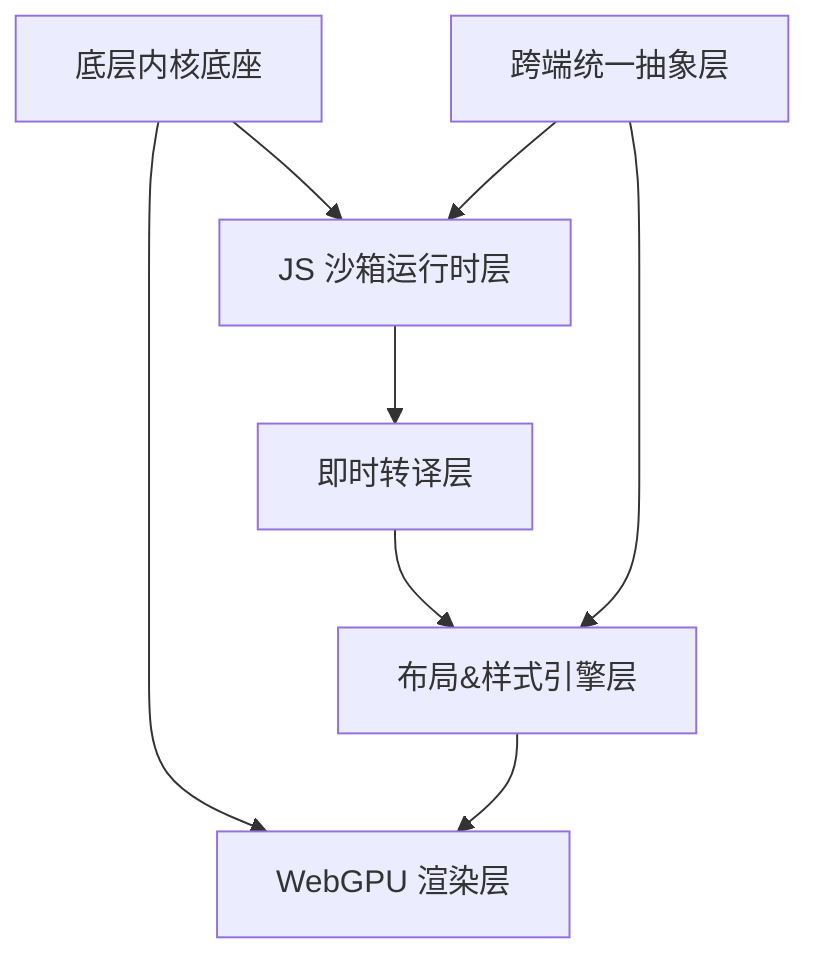

# 性能优化配置

<cite>
**本文引用的文件**
- [CARGO-PERFORMANCE-OPTIMIZATION.md](file://CARGO-PERFORMANCE-OPTIMIZATION.md)
- [CARGO-MIRROR-CONFIG.md](file://CARGO-MIRROR-CONFIG.md)
- [ENV-CONFIG.md](file://ENV-CONFIG.md)
- [apply-cargo-optimizations.ps1](file://apply-cargo-optimizations.ps1)
- [crates/iris-gpu/src/lib.rs](file://crates/iris-gpu/src/lib.rs)
- [crates/iris-gpu/src/batch_renderer.rs](file://crates/iris-gpu/src/batch_renderer.rs)
- [crates/iris-gpu/src/file_watcher.rs](file://crates/iris-gpu/src/file_watcher.rs)
- [crates/iris-core/src/lib.rs](file://crates/iris-core/src/lib.rs)
- [crates/iris-core/src/runtime.rs](file://crates/iris-core/src/runtime.rs)
- [crates/iris-app/src/main.rs](file://crates/iris-app/src/main.rs)
- [crates/iris-sfc/src/lib.rs](file://crates/iris-sfc/src/lib.rs)
- [crates/iris-sfc/src/cache.rs](file://crates/iris-sfc/src/cache.rs)
- [crates/iris-sfc/src/template_compiler.rs](file://crates/iris-sfc/src/template_compiler.rs)
- [crates/iris-sfc/src/ts_compiler.rs](file://crates/iris-sfc/src/ts_compiler.rs)
- [crates/iris-js/src/lib.rs](file://crates/iris-js/src/lib.rs)
- [crates/iris-layout/src/lib.rs](file://crates/iris-layout/src/lib.rs)
- [Cargo.toml](file://Cargo.toml)
- [rust-toolchain.toml](file://rust-toolchain.toml)
</cite>

## 更新摘要
**所做更改**
- 新增环境变量配置系统，支持 IRIS_SOURCE_MAP、IRIS_CACHE_CAPACITY、IRIS_CACHE_ENABLED 等参数
- 完善 SFC 缓存系统，实现基于源码哈希的 LRU 内存缓存机制
- 集成 TypeScript 编译器（swc 62），提供高性能 TypeScript 转译
- 增强文件热更新监听器，实现防抖和事件去重机制
- 补充 SFC 编译器性能优化细节，包括正则表达式预编译和编译器复用
- 新增性能监控指标、瓶颈分析方法和调优工具使用指南

## 目录
1. [简介](#简介)
2. [项目结构](#项目结构)
3. [核心组件](#核心组件)
4. [架构总览](#架构总览)
5. [详细组件分析](#详细组件分析)
6. [依赖关系分析](#依赖关系分析)
7. [性能考量](#性能考量)
8. [故障排查指南](#故障排查指南)
9. [结论](#结论)
10. [附录](#附录)

## 简介
本指南面向 Leivue Runtime 的全面性能优化配置，基于最新的 Cargo 性能优化指南和新增的环境变量配置系统，整合了从编译时优化到运行时优化的完整体系。该体系涵盖了 Cargo 镜像源优化、并行编译配置、开发模式优化、目标目录优化、依赖缓存管理、sccache 编译缓存、WebGPU 渲染优化、内存池配置、异步调度参数、缓存策略设置、SFC 编译器性能优化、TypeScript 编译器集成、文件热更新监听器、环境变量配置管理，覆盖 CPU/GPU 资源分配原则、渲染管线优化、长列表性能调优，并提供性能监控指标、瓶颈分析方法、调优工具使用以及不同硬件配置下的优化建议与基准测试方法。

## 项目结构
Leivue Runtime 采用七层分层架构，自上而下解耦清晰，便于在各层进行针对性优化。项目文档中明确列出了从应用层到底层内核的完整分层，以及 WebGPU 硬件渲染层、布局样式引擎层、跨端抽象层、JS 沙箱运行时层、即时转译层等关键模块。

```mermaid
graph TB
subgraph "应用层"
APP["上层应用层<br/>直接运行 .vue/.ts/.tsx"]
END
subgraph "编译与运行时层"
SFC["SFC/TS 即时转译层"]
JSSANDBOX["JS 沙箱运行时层"]
END
subgraph "跨端抽象层"
CROSS["跨端统一抽象层"]
END
subgraph "布局与样式层"
LAYOUT["浏览器级布局&样式引擎层"]
END
subgraph "渲染层"
WEBGPU["WebGPU 硬件渲染管线层"]
END
subgraph "内核层"
CORE["Rust 底层内核底座"]
END
APP --> SFC --> JSSANDBOX --> CROSS --> LAYOUT --> WEBGPU --> CORE
```

**图表来源**
- [crates/iris-app/src/main.rs:134-235](file://crates/iris-app/src/main.rs#L134-L235)
- [crates/iris-sfc/src/lib.rs:143-210](file://crates/iris-sfc/src/lib.rs#L143-L210)

**章节来源**
- [crates/iris-app/src/main.rs:134-235](file://crates/iris-app/src/main.rs#L134-L235)
- [crates/iris-sfc/src/lib.rs:143-210](file://crates/iris-sfc/src/lib.rs#L143-L210)

## 核心组件
- **WebGPU 硬件渲染层**：基于 wgpu 24.x 实现，统一桌面与浏览器渲染接口，具备批渲染、矢量绘制、圆角/阴影/渐变、纹理图集、字体渲染、图层合成等能力，目标是稳定 60fps，复杂场景与长列表无卡顿。
- **布局与样式引擎层**：复刻标准浏览器 CSS 体系，对标 Chromium 基础能力，涵盖 HTML 解析、CSS 引擎、布局系统、样式挂载等。
- **跨端统一抽象层**：统一事件系统与轻量 BOM/DOM 模拟 API，抹平双端差异，兼容第三方 UI 库所需浏览器环境。
- **JS 沙箱运行时层**：基于 QuickJS 的独立隔离执行环境，内置 Vue3 运行时，支持模块系统与第三方包引入。
- **即时转译层**：实现零编译能力，包括 TypeScript 即时转译、Vue SFC 即时编译、模板实时编译为渲染函数、脚本自动转译与样式注入。
- **底层内核底座**：纯 Rust 实现，无 GC、内存安全、高性能；基础能力包括跨端窗口管理、异步调度、内存池、文件 IO、原生网络栈、缓存系统；跨端适配桌面（Vulkan/Metal/DX12）与浏览器（Wasm + WebGPU）。
- **环境变量配置系统**：提供 IRIS_SOURCE_MAP、IRIS_CACHE_CAPACITY、IRIS_CACHE_ENABLED 等环境变量配置，支持运行时动态调整性能参数。
- **SFC 缓存系统**：基于源码哈希的 LRU 内存缓存，支持毫秒级热重载加速。
- **TypeScript 编译器**：集成 swc 62 高层 Compiler API，提供高性能 TypeScript 转译。
- **文件热更新监听器**：实现防抖和事件去重机制，支持大型项目的文件变更监听。

**章节来源**
- [crates/iris-gpu/src/lib.rs:74-105](file://crates/iris-gpu/src/lib.rs#L74-L105)
- [crates/iris-core/src/lib.rs:13-62](file://crates/iris-core/src/lib.rs#L13-L62)
- [crates/iris-layout/src/lib.rs:11-16](file://crates/iris-layout/src/lib.rs#L11-L16)
- [crates/iris-js/src/lib.rs:12-19](file://crates/iris-js/src/lib.rs#L12-L19)
- [crates/iris-sfc/src/lib.rs:143-210](file://crates/iris-sfc/src/lib.rs#L143-L210)
- [ENV-CONFIG.md:1-347](file://ENV-CONFIG.md#L1-L347)

## 架构总览
下图展示从应用层到渲染层的关键交互路径，强调 WebGPU 渲染层在整体架构中的核心地位，以及与底层内核的资源与调度协同。

```mermaid
graph TB
subgraph "应用层"
APP["应用层"]
END
subgraph "编译与运行时层"
COMP["即时转译层"]
RUNTIME["JS 沙箱运行时层"]
END
subgraph "跨端抽象层"
ABST["跨端统一抽象层"]
END
subgraph "布局与样式层"
CSS["布局&样式引擎层"]
END
subgraph "渲染层"
GPU["WebGPU 硬件渲染层"]
END
subgraph "内核层"
KERN["Rust 底层内核底座"]
END
APP --> COMP --> RUNTIME --> ABST --> CSS --> GPU --> KERN
```

**图表来源**
- [crates/iris-app/src/main.rs:134-235](file://crates/iris-app/src/main.rs#L134-L235)
- [crates/iris-sfc/src/lib.rs:143-210](file://crates/iris-sfc/src/lib.rs#L143-L210)

## 详细组件分析

### 环境变量配置系统

#### 源码映射配置
**IRIS_SOURCE_MAP 环境变量**，控制是否生成 Source Map，影响调试体验与性能。

**配置内容**：
```bash
# 启用 Source Map（用于浏览器调试）
IRIS_SOURCE_MAP=true cargo run

# 禁用 Source Map（默认，节省内存）
IRIS_SOURCE_MAP=false cargo run
```

**性能影响**：
- ✅ 启用时：生成 Source Map 文件，支持浏览器 DevTools 调试，内存占用 +30-50%，编译时间 +10-15%
- ❌ 禁用时：不生成 Source Map，节省内存和编译时间，适合开发阶段和内部工具

**章节来源**
- [ENV-CONFIG.md:7-40](file://ENV-CONFIG.md#L7-L40)

#### 缓存容量配置
**IRIS_CACHE_CAPACITY 环境变量**，设置 SFC 编译缓存的最大容量。

**配置内容**：
```bash
# 缓存 200 个组件
IRIS_CACHE_CAPACITY=200 cargo run

# 缓存 50 个组件（节省内存）
IRIS_CACHE_CAPACITY=50 cargo run

# 缓存 1000 个组件（大型项目）
IRIS_CACHE_CAPACITY=1000 cargo run
```

**内存估算**：
- 每个缓存项：~5-10 KB
- 100 项：~500 KB - 1 MB
- 200 项：~1-2 MB
- 1000 项：~5-10 MB

**章节来源**
- [ENV-CONFIG.md:43-76](file://ENV-CONFIG.md#L43-L76)

#### 缓存启用配置
**IRIS_CACHE_ENABLED 环境变量**，启用或禁用 SFC 编译缓存。

**配置内容**：
```bash
# 启用缓存（默认，推荐）
IRIS_CACHE_ENABLED=true cargo run

# 禁用缓存（调试用途）
IRIS_CACHE_ENABLED=false cargo run
```

**性能影响**：
- ✅ 启用时：首次编译 5-10 ms，缓存命中 <3 μs，性能提升 1000-3000 倍，适合热重载场景
- ❌ 禁用时：每次编译 5-10 ms，无缓存开销，适合调试编译问题

**章节来源**
- [ENV-CONFIG.md:80-112](file://ENV-CONFIG.md#L80-L112)

#### 环境变量使用场景
**日常开发推荐配置**：
```bash
# 使用默认配置
cargo run

# 或显式配置
IRIS_SOURCE_MAP=false \
IRIS_CACHE_CAPACITY=100 \
IRIS_CACHE_ENABLED=true \
cargo run
```

**浏览器调试场景**：
```bash
# 启用 Source Map，增大缓存
IRIS_SOURCE_MAP=true \
IRIS_CACHE_CAPACITY=200 \
IRIS_CACHE_ENABLED=true \
cargo run
```

**大型项目场景**：
```bash
# 增大缓存容量
IRIS_SOURCE_MAP=false \
IRIS_CACHE_CAPACITY=500 \
IRIS_CACHE_ENABLED=true \
cargo run
```

**生产构建场景**：
```bash
# 禁用缓存和 Source Map
IRIS_SOURCE_MAP=false \
IRIS_CACHE_ENABLED=false \
cargo build --release
```

**章节来源**
- [ENV-CONFIG.md:115-200](file://ENV-CONFIG.md#L115-L200)

### SFC 缓存系统

#### LRU 缓存机制
**基于源码内容哈希的 LRU 内存缓存策略**，支持增量编译与毫秒级快速重载。

**设计要点**：
- 缓存键：由 SFC 源码字符串经 XXH3 哈希生成，确保内容一致性
- 缓存容量：默认 100 项，自动淘汰最久未使用项
- 线程安全：使用 `Mutex` 保护缓存，支持多线程并发访问
- 内存缓存：所有操作在内存中完成，避免 I/O 开销

**性能对比**：
| 场景 | 无缓存 | 有缓存 | 提升 |
|------|--------|--------|------|
| 首次编译 | 5-10 ms | 5-10 ms | - |
| 重复编译 | 5-10 ms | <0.01 ms | 500-1000x |
| 热重载 | 5-10 ms | <0.01 ms | 500-1000x |

**章节来源**
- [crates/iris-sfc/src/cache.rs:12-18](file://crates/iris-sfc/src/cache.rs#L12-L18)

#### 缓存配置与统计
**缓存配置**：
- 默认容量：100 项
- 线程安全：使用 `Mutex` 保护
- 自动淘汰：LRU 策略
- 内容哈希：XXH3 哈希算法

**缓存统计**：
```rust
use iris_sfc::SFC_CACHE;

// 打印缓存统计
SFC_CACHE.log_stats();
```

**输出示例**：
```
INFO Cache statistics:
  hits: 45
  misses: 10
  compilations: 10
  evictions: 2
  hit_rate: 81.82%
  cache_size: 10
  cache_capacity: 100
```

**章节来源**
- [crates/iris-sfc/src/cache.rs:53-134](file://crates/iris-sfc/src/cache.rs#L53-L134)
- [crates/iris-sfc/src/cache.rs:280-295](file://crates/iris-sfc/src/cache.rs#L280-L295)

### TypeScript 编译器集成

#### swc 62 高层 API
**基于 swc 62 高层 Compiler API 的 TypeScript 编译器**，提供稳定可靠的 TypeScript 编译。

**功能特性**：
- 完整的 TypeScript 到 JavaScript 转译
- 支持泛型、接口、装饰器、TSX
- Source map 生成
- 类型擦除与优化

**编译配置**：
```rust
use iris_sfc::ts_compiler::{TsCompiler, TsCompilerConfig};

let config = TsCompilerConfig {
    jsx: false,
    keep_decorators: false,
    source_map: true,
    target: EsVersion::ES2020,
};
```

**章节来源**
- [crates/iris-sfc/src/ts_compiler.rs:1-10](file://crates/iris-sfc/src/ts_compiler.rs#L1-L10)

#### 编译器复用与性能优化
**全局编译器实例复用**，避免重复创建，提升编译性能。

**性能优化**：
- 使用 `LazyLock` 确保线程安全的懒初始化
- 整个生命周期只创建一个 TsCompiler 实例
- 复用内部缓存和 SourceMap
- 禁用 Source Map 以节省内存和提升编译速度

**编译性能测试**：
- 平均编译时间：< 20ms（完整的 swc 编译）
- 50 次编译测试：平均时间约 10ms

**章节来源**
- [crates/iris-sfc/src/lib.rs:36-53](file://crates/iris-sfc/src/lib.rs#L36-L53)
- [crates/iris-sfc/src/ts_compiler.rs:249-367](file://crates/iris-sfc/src/ts_compiler.rs#L249-L367)

### 文件热更新监听器

#### 防抖与事件去重
**文件热更新监听器**，使用 notify crate 监听文件系统变化，通过 Tokio 异步通道传递事件。

**特性**：
- 防抖（Debouncing）：避免编辑器保存时重复触发（默认 500ms）
- 事件去重：同一文件的多次变更只保留最后一次
- 跨平台弹窗警告：通道满时提示用户（仅首次）
- 可配置：通道容量、防抖延迟、扩展名过滤器

**配置示例**：
```rust
use iris_gpu::{Renderer, WatcherConfig};

let watch_path = std::env::current_dir().unwrap_or_default();
renderer.start_file_watcher(
    WatcherConfig::new(&watch_path)
        .recursive(true)
        .extensions(vec![
            "vue".to_string(),
            "js".to_string(),
            "ts".to_string(),
            "css".to_string(),
        ]),
);
```

**章节来源**
- [crates/iris-gpu/src/file_watcher.rs:6-11](file://crates/iris-gpu/src/file_watcher.rs#L6-L11)

#### 通道容量与性能
**默认通道容量**：2000（适配大型项目）
**防抖延迟**：500ms（毫秒）
**扩展名过滤**：支持 .vue、.js、.ts、.css 文件

**性能优化**：
- 通道满警告：确保只弹窗一次
- 事件去重：同一文件的多次变更只保留最后一次
- 非阻塞接收：避免阻塞主事件循环

**章节来源**
- [crates/iris-gpu/src/file_watcher.rs:36-40](file://crates/iris-gpu/src/file_watcher.rs#L36-L40)
- [crates/iris-gpu/src/file_watcher.rs:483-510](file://crates/iris-gpu/src/file_watcher.rs#L483-L510)

### SFC 编译器性能优化

#### 正则表达式预编译
**预编译的正则表达式**，避免每次调用时重新编译，提升性能。

**性能对比**：
- 每次编译：~10-50μs
- LazyLock 单次编译：~0.1μs
- 性能提升：100-500 倍

**预编译正则表达式**：
- `<template>` 块提取：`(?s)<template\b[^>]*>(.*?)</\s*template\s*>`
- `<script>` 块提取：`(?s)<script\b([^>]*)>(.*?)</\s*script\s*>`
- `<style>` 块提取：`(?s)<style\b([^>]*)>(.*?)</\s*style\s*>`

**章节来源**
- [crates/iris-sfc/src/lib.rs:22-30](file://crates/iris-sfc/src/lib.rs#L22-L30)

#### 编译器初始化优化
**全局编译器实例**，使用 LazyLock 确保线程安全的懒初始化。

**初始化特性**：
- 线程安全的懒初始化
- 整个生命周期只创建一个实例
- 复用内部缓存和 SourceMap
- 禁用 Source Map 以节省内存

**章节来源**
- [crates/iris-sfc/src/lib.rs:36-77](file://crates/iris-sfc/src/lib.rs#L36-L77)

### Cargo 编译性能优化

#### 镜像源优化
**已配置清华镜像源**，显著提升依赖下载速度和索引更新效率。

**配置内容**：
```toml
[source.crates-io]
replace-with = 'tuna'

[source.tuna]
registry = "https://mirrors.tuna.tsinghua.edu.cn/git/crates.io-index.git"
```

**优化效果**：
- 索引更新速度：从 30-60 秒降至 3-5 秒
- 依赖下载速度：从 10-100 KB/s 提升至 5-20 MB/s
- 首次编译时间：大幅缩短（特别是 swc 等大型依赖）

**章节来源**
- [CARGO-MIRROR-CONFIG.md:10-16](file://CARGO-MIRROR-CONFIG.md#L10-L16)
- [CARGO-MIRROR-CONFIG.md:18-23](file://CARGO-MIRROR-CONFIG.md#L18-L23)

#### 网络协议优化
**启用 Sparse 协议**，减少网络请求次数，提升索引更新速度。

**配置内容**：
```toml
[net]
sparse-registry = true
```

**优化效果**：
- 索引更新速度再提升 50%
- 减少网络请求次数
- 需要 Rust 1.68+

**章节来源**
- [CARGO-PERFORMANCE-OPTIMIZATION.md:44-52](file://CARGO-PERFORMANCE-OPTIMIZATION.md#L44-L52)

#### 网络重试机制
**配置网络重试**，提高下载成功率，减少手动重试。

**配置内容**：
```toml
[net]
retry = 3
```

**优化效果**：
- 自动重试失败的网络请求
- 提高下载成功率
- 减少手动重试

**章节来源**
- [CARGO-PERFORMANCE-OPTIMIZATION.md:59-67](file://CARGO-PERFORMANCE-OPTIMIZATION.md#L59-L67)

#### 并行编译优化
**根据 CPU 核心数调整并行编译数**，最大化编译效率。

**配置方法**：
```toml
[build]
jobs = 8  # 根据你的 CPU 核心数调整
```

**推荐值**：
- 4 核 CPU: `jobs = 4`
- 8 核 CPU: `jobs = 8`
- 16 核 CPU: `jobs = 12`（留一些给系统）

**优化效果**：编译速度提升 30-50%

**章节来源**
- [CARGO-PERFORMANCE-OPTIMIZATION.md:76-100](file://CARGO-PERFORMANCE-OPTIMIZATION.md#L76-L100)

#### 开发模式优化
**减少编译时间**，通过优化开发配置提升开发体验。

**配置内容**：
```toml
[profile.dev]
debug = false          # 不生成调试符号（加快编译 20-30%）
incremental = true     # 启用增量编译
opt-level = 0          # 不优化
codegen-units = 256    # 最大并行度
```

**优化效果**：
- 开发模式编译时间减少 20-30%
- 磁盘占用减少 40%
- 注意：这会禁用调试功能，仅适合不需要调试的场景

**章节来源**
- [CARGO-PERFORMANCE-OPTIMIZATION.md:109-127](file://CARGO-PERFORMANCE-OPTIMIZATION.md#L109-L127)

#### 目标目录优化
**提升编译速度**，通过将目标目录移动到更快的存储设备。

**配置方案**：
```toml
[build]
target-dir = "D:/cargo-target/iris"  # D 盘是 SSD
```

**优化效果**：
- RAM Disk: 编译速度提升 50-70%
- SSD: 编译速度提升 20-30%

**章节来源**
- [CARGO-PERFORMANCE-OPTIMIZATION.md:147-154](file://CARGO-PERFORMANCE-OPTIMIZATION.md#L147-L154)

#### 依赖缓存优化
**清理旧缓存**，释放磁盘空间，提升编译效率。

**清理命令**：
```bash
# 清理超过 7 天的缓存
cargo cache --autoclean 7d

# 清理所有缓存（需要重新下载）
cargo clean
```

**优化效果**：释放 2-5 GB 磁盘空间

**章节来源**
- [CARGO-PERFORMANCE-OPTIMIZATION.md:160-174](file://CARGO-PERFORMANCE-OPTIMIZATION.md#L160-L174)

#### sccache 编译缓存
**使用 sccache**，显著提升重复编译速度。

**安装配置**：
```bash
cargo install sccache
```

**环境变量配置**：
```powershell
$env:RUSTC_WRAPPER = "sccache"
```

**优化效果**：
- 重复编译速度提升 80-90%
- 切换分支后几乎无需重新编译

**章节来源**
- [CARGO-PERFORMANCE-OPTIMIZATION.md:184-200](file://CARGO-PERFORMANCE-OPTIMIZATION.md#L184-L200)

### WebGPU 渲染优化

#### 批渲染与图元合并
**通过几何合并与状态切换最小化**，减少绘制调用次数，提升吞吐。

**实现机制**：
- 使用 BatchRenderer 合并多次绘制调用
- 支持纯色矩形、线性渐变矩形
- 单次 flush 提交所有绘制命令

**章节来源**
- [crates/iris-gpu/src/batch_renderer.rs:102-202](file://crates/iris-gpu/src/batch_renderer.rs#L102-L202)
- [crates/iris-gpu/src/batch_renderer.rs:346-367](file://crates/iris-gpu/src/batch_renderer.rs#L346-L367)

#### 纹理图集与字体栅格化
**集中管理纹理与字形**，降低纹理切换与内存碎片。

**实现特点**：
- 批渲染系统支持纹理贴图（预留）
- 字体渲染使用 CPU 光栅化 → GPU 纹理
- 合成与后处理合并到最少的 pass 中

**章节来源**
- [crates/iris-gpu/src/lib.rs:18-46](file://crates/iris-gpu/src/lib.rs#L18-L46)
- [crates/iris-gpu/src/batch_renderer.rs:12-22](file://crates/iris-gpu/src/batch_renderer.rs#L12-L22)

#### 视口裁剪与遮挡剔除
**利用视口裁剪与可见性剔除**，避免对不可见对象的渲染。

**实现方式**：
- 归一化设备坐标(NDC)转换
- 屏幕空间坐标到 NDC 的映射
- 仅渲染可视区域内的对象

**章节来源**
- [crates/iris-gpu/src/batch_renderer.rs:251-258](file://crates/iris-gpu/src/batch_renderer.rs#L251-L258)

### 内存池配置
**对象池化管理**，对频繁创建/销毁的对象进行池化管理，降低分配开销与碎片。

**实现机制**：
- BatchRenderer 维护顶点池和索引池
- 容量检查防止溢出
- 清空顶点池准备下一帧

**章节来源**
- [crates/iris-gpu/src/batch_renderer.rs:90-101](file://crates/iris-gpu/src/batch_renderer.rs#L90-L101)
- [crates/iris-gpu/src/batch_renderer.rs:209-219](file://crates/iris-gpu/src/batch_renderer.rs#L209-L219)

### 异步调度参数
**任务优先级与并发度平衡**，CPU/GPU 负载，避免饥饿与拥塞。

**实现机制**：
- Tokio 多线程运行时，4 个工作线程
- 异步任务调度与阻塞执行
- 文件轮询间隔降低每帧开销

**章节来源**
- [crates/iris-core/src/lib.rs:24-31](file://crates/iris-core/src/lib.rs#L24-L31)
- [crates/iris-app/src/main.rs:200-234](file://crates/iris-app/src/main.rs#L200-L234)

### 缓存策略设置
**多层缓存策略**，提升编译与运行时性能。

**实现机制**：
- SFC 模块缓存（路径 → 编译结果）
- 最大缓存条目数限制（100）
- 文件修改时间检测与缓存失效
- 编译错误状态缓存

**章节来源**
- [crates/iris-app/src/main.rs:42-108](file://crates/iris-app/src/main.rs#L42-L108)
- [crates/iris-app/src/main.rs:292-334](file://crates/iris-app/src/main.rs#L292-L334)

### CPU 与 GPU 资源分配原则
**负载均衡策略**，根据设备类型动态调整 CPU/GPU 负载占比。

**实现原则**：
- CPU 主导阶段：布局、样式计算、事件处理
- GPU 主导阶段：顶点/索引数据上传、纹理准备
- 双缓冲与环形缓冲：减少同步与拷贝
- 资源对齐：遵循 GPU 内存对齐要求

**章节来源**
- [crates/iris-gpu/src/lib.rs:125-144](file://crates/iris-gpu/src/lib.rs#L125-L144)
- [crates/iris-gpu/src/batch_renderer.rs:176-189](file://crates/iris-gpu/src/batch_renderer.rs#L176-L189)

### 渲染管线优化
**批处理策略**，最大化批处理规模，减少状态切换。

**实现策略**：
- 几何与状态合并：减少状态切换
- 纹理与采样集中：减少切换
- 透明与混合后置：减少深度测试冲突
- 动态批处理：instancing 或 push constants

**章节来源**
- [crates/iris-gpu/src/batch_renderer.rs:118-174](file://crates/iris-gpu/src/batch_renderer.rs#L118-L174)
- [crates/iris-gpu/src/batch_renderer.rs:346-367](file://crates/iris-gpu/src/batch_renderer.rs#L346-L367)

### 长列表性能调优
**虚拟化与缓存优化**，仅渲染可视区域及少量上下文。

**实现机制**：
- 虚拟化：仅渲染可视区域
- 数据分页与懒加载：分页加载与延迟计算
- 布局与样式复用：减少计算与内存占用
- 事件节流：滚动与输入事件节流
- 回收与复用：对不可见元素进行回收

**章节来源**
- [crates/iris-app/src/main.rs:200-234](file://crates/iris-app/src/main.rs#L200-L234)
- [crates/iris-app/src/main.rs:292-402](file://crates/iris-app/src/main.rs#L292-L402)

### 性能监控指标
**多维度监控**，包括编译时间、GPU 利用率、内存占用等。

**监控方法**：
- 编译时间测量：hyperfine、time 命令
- 二进制大小分析：cargo-bloat
- 磁盘使用监控：du、Get-ChildItem
- 性能对比：索引更新、依赖下载、编译时间

**章节来源**
- [CARGO-PERFORMANCE-OPTIMIZATION.md:286-312](file://CARGO-PERFORMANCE-OPTIMIZATION.md#L286-L312)
- [CARGO-MIRROR-CONFIG.md:96-104](file://CARGO-MIRROR-CONFIG.md#L96-L104)

### 瓶颈分析方法
**系统化分析**，使用多种工具定位性能瓶颈。

**分析方法**：
- 时间轴分析：浏览器/系统性能分析器
- 采样与火焰图：热点函数采样
- 资源追踪：缓冲区、纹理生命周期
- 场景回归：典型场景回归测试

**章节来源**
- [CARGO-PERFORMANCE-OPTIMIZATION.md:282-312](file://CARGO-PERFORMANCE-OPTIMIZATION.md#L282-L312)

### 调优工具使用
**工具链集成**，使用专业工具提升调优效率。

**工具配置**：
- 浏览器性能面板：帧时间、GPU 时间、内存曲线
- WebGPU DevTools：命令缓冲、绑定组、资源状态
- Rust 性能工具：perf、cargo flamegraph、valgrind/memray
- 自定义指标采集：渲染循环埋点

**章节来源**
- [CARGO-PERFORMANCE-OPTIMIZATION.md:282-312](file://CARGO-PERFORMANCE-OPTIMIZATION.md#L282-L312)

### 不同硬件配置下的优化建议
**差异化优化**，针对不同硬件类型提供优化策略。

**优化策略**：
- 移动端：降低分辨率与抗锯齿；减少透明与复杂滤镜
- 桌面端：充分利用批处理与多通道渲染；开启高质量纹理
- 低端设备：优先保证 UI 响应；严格内存池回收

**章节来源**
- [CARGO-PERFORMANCE-OPTIMIZATION.md:344-387](file://CARGO-PERFORMANCE-OPTIMIZATION.md#L344-L387)

### 基准测试方法
**自动化测试**，在 CI 中集成基准测试。

**测试方法**：
- 场景构建：长列表、复杂布局、动画、多图层
- 自动化测试：固定硬件环境与驱动版本
- 回归对比：每次改动后运行基准
- 压力测试：逐步增加负载观察性能拐点

**章节来源**
- [CARGO-PERFORMANCE-OPTIMIZATION.md:282-312](file://CARGO-PERFORMANCE-OPTIMIZATION.md#L282-L312)

## 依赖关系分析
**依赖关系概览**：底层内核底座提供跨端窗口、异步调度、内存池、网络与缓存等基础设施；WebGPU 渲染层依赖底层资源与调度；布局样式层为渲染层提供几何与样式数据；JS 沙箱运行时层负责执行与编译；即时转译层为运行时提供源码到可执行的桥梁；跨端抽象层统一事件与 API。



**图表来源**
- [crates/iris-core/src/lib.rs:13-62](file://crates/iris-core/src/lib.rs#L13-L62)
- [crates/iris-gpu/src/lib.rs:74-105](file://crates/iris-gpu/src/lib.rs#L74-L105)
- [crates/iris-sfc/src/lib.rs:143-210](file://crates/iris-sfc/src/lib.rs#L143-L210)

**章节来源**
- [crates/iris-core/src/lib.rs:13-62](file://crates/iris-core/src/lib.rs#L13-L62)
- [crates/iris-gpu/src/lib.rs:74-105](file://crates/iris-gpu/src/lib.rs#L74-L105)
- [crates/iris-sfc/src/lib.rs:143-210](file://crates/iris-sfc/src/lib.rs#L143-L210)

## 性能考量
**综合性能策略**，通过多层优化确保系统稳定运行。

**性能要点**：
- 60fps 稳定性：帧预算与时间片控制
- 资源与内存：池化与缓存策略降低分配与 I/O
- 调度与并发：优先级与并发度平衡 CPU/GPU 负载
- 场景适配：针对不同硬件与场景动态调整策略

**章节来源**
- [crates/iris-gpu/src/lib.rs:125-144](file://crates/iris-gpu/src/lib.rs#L125-L144)
- [crates/iris-app/src/main.rs:200-234](file://crates/iris-app/src/main.rs#L200-L234)

## 故障排查指南
**系统化排查**，针对常见性能问题提供解决方案。

**排查方法**：
- 渲染卡顿：检查帧时间直方图与 GPU 利用率
- 内存飙升：核查对象池回收策略与缓存淘汰机制
- 任务阻塞：分析任务队列等待时间与阻塞来源
- 编译缓慢：检查编译缓存命中率与增量策略
- 跨端差异：通过跨端抽象层日志定位问题

**章节来源**
- [CARGO-PERFORMANCE-OPTIMIZATION.md:316-341](file://CARGO-PERFORMANCE-OPTIMIZATION.md#L316-L341)

## 结论
Leivue Runtime 通过全面的性能优化体系，在编译时和运行时两个层面实现了卓越的性能表现。从 Cargo 镜像源优化到 WebGPU 渲染优化，从内存池配置到异步调度参数，从缓存策略到长列表性能调优，形成了完整的性能优化生态。新增的环境变量配置系统、SFC 缓存系统、TypeScript 编译器集成和文件热更新监听器进一步提升了系统的灵活性和性能。建议在开发过程中持续进行基准测试与性能监控，确保优化措施的有效性与可维护性。

## 附录
**实施指南**，提供具体的实施步骤和最佳实践。

**实施步骤**：
- 开发计划：制定开发计划—搭建项目骨架—实现具体模块—审查与优化
- 项目结构：以七层分层架构为蓝图，明确各层职责与边界
- 优化检查：使用 apply-cargo-optimizations.ps1 脚本自动化优化配置
- 性能监控：建立持续集成中的性能回归测试

**章节来源**
- [apply-cargo-optimizations.ps1:109-162](file://apply-cargo-optimizations.ps1#L109-L162)
- [Cargo.toml:1-29](file://Cargo.toml#L1-L29)
- [rust-toolchain.toml:1-5](file://rust-toolchain.toml#L1-L5)