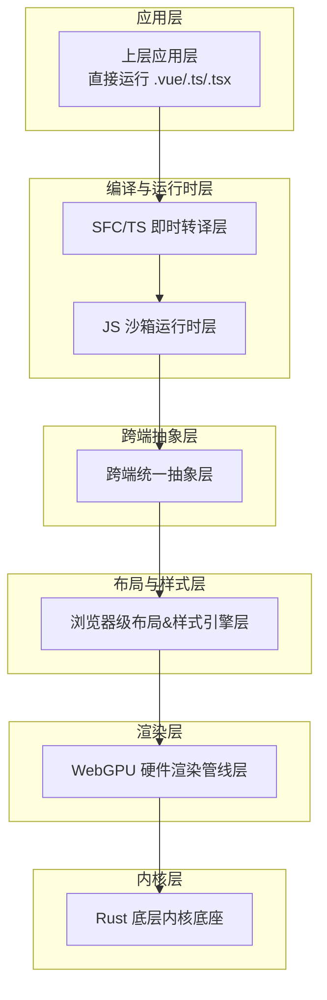
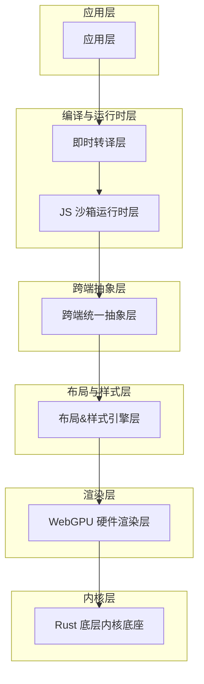
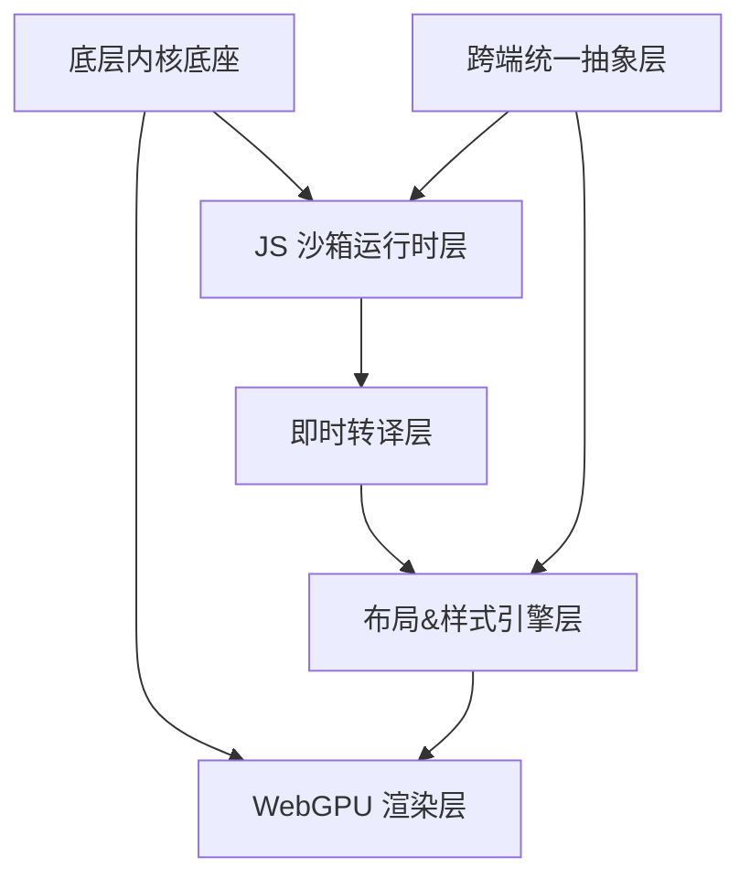

# 性能优化配置

<cite>
**本文引用的文件**
- [doc.txt](file://doc.txt)
- [todo.txt](file://todo.txt)
</cite>

## 目录
1. [简介](#简介)
2. [项目结构](#项目结构)
3. [核心组件](#核心组件)
4. [架构总览](#架构总览)
5. [详细组件分析](#详细组件分析)
6. [依赖关系分析](#依赖关系分析)
7. [性能考量](#性能考量)
8. [故障排查指南](#故障排查指南)
9. [结论](#结论)
10. [附录](#附录)

## 简介
本指南面向 Leivue Runtime 的性能优化配置，聚焦于 WebGPU 渲染优化、内存池配置、异步调度参数与缓存策略设置，覆盖 CPU/GPU 资源分配原则、渲染管线优化、长列表性能调优，并提供性能监控指标、瓶颈分析方法、调优工具使用以及不同硬件配置下的优化建议与基准测试方法。由于当前仓库尚未包含具体源代码，本指南以项目文档为依据，结合通用性能工程实践，形成可落地的配置与调优框架。

## 项目结构
Leivue Runtime 采用七层分层架构，自上而下解耦清晰，便于在各层进行针对性优化。项目文档中明确列出了从应用层到底层内核的完整分层，以及 WebGPU 硬件渲染层、布局样式引擎层、跨端抽象层、JS 沙箱运行时层、即时转译层等关键模块。

图表来源
- [doc.txt:7-22](file://doc.txt#L7-L22)

章节来源
- [doc.txt:7-22](file://doc.txt#L7-L22)

## 核心组件
- WebGPU 硬件渲染层：替代 DOM 渲染，统一桌面与浏览器渲染接口，具备批渲染、矢量绘制、圆角/阴影/渐变、纹理图集、字体渲染、图层合成等能力，目标是稳定 60fps，复杂场景与长列表无卡顿。
- 布局与样式引擎层：复刻标准浏览器 CSS 体系，对标 Chromium 基础能力，涵盖 HTML 解析、CSS 引擎、布局系统、样式挂载等。
- 跨端统一抽象层：统一事件系统与轻量 BOM/DOM 模拟 API，抹平双端差异，兼容第三方 UI 库所需浏览器环境。
- JS 沙箱运行时层：基于 QuickJS 的独立隔离执行环境，内置 Vue3 运行时，支持模块系统与第三方包引入。
- 即时转译层：实现零编译能力，包括 TypeScript 即时转译、Vue SFC 即时编译、模板实时编译为渲染函数、脚本自动转译与样式注入。
- 底层内核底座：纯 Rust 实现，无 GC、内存安全、高性能；基础能力包括跨端窗口管理、异步调度、内存池、文件 IO、原生网络栈、缓存系统；跨端适配桌面（Vulkan/Metal/DX12）与浏览器（Wasm + WebGPU）。

章节来源
- [doc.txt:23-64](file://doc.txt#L23-L64)

## 架构总览
下图展示从应用层到渲染层的关键交互路径，强调 WebGPU 渲染层在整体架构中的核心地位，以及与底层内核的资源与调度协同。

图表来源
- [doc.txt:7-22](file://doc.txt#L7-L22)

## 详细组件分析

### WebGPU 渲染优化
- 批渲染与图元合并：通过几何合并与状态切换最小化，减少绘制调用次数，提升吞吐。
- 纹理图集与字体栅格化：集中管理纹理与字形，降低纹理切换与内存碎片。
- 视口裁剪与遮挡剔除：利用视口裁剪与可见性剔除，避免对不可见对象的渲染。
- 着色器优化：精简着色器逻辑，避免分支过多与昂贵运算；合理使用常量与 uniform 缓冲。
- 合成与后处理：将多图层合成与滤镜效果合并到最少的 pass 中，减少带宽压力。
- 资源生命周期：显式管理缓冲区、纹理与采样器的创建/销毁时机，避免泄漏与频繁重分配。

章节来源
- [doc.txt:30-34](file://doc.txt#L30-L34)

### 内存池配置
- 对象池化：对频繁创建/销毁的对象（如节点、样式块、绘制命令）进行池化管理，降低分配开销与碎片。
- 分配粒度控制：按对象大小分组管理，避免过大的预留造成浪费。
- 生命周期绑定：与渲染帧周期绑定，定期回收未使用的对象，防止长期持有导致内存膨胀。
- 统计与告警：记录池化命中率、分配次数与峰值内存，异常时触发降级策略。

章节来源
- [doc.txt:24-25](file://doc.txt#L24-L25)

### 异步调度参数
- 任务优先级：区分渲染任务、布局任务、IO 任务与网络任务，按优先级排队与抢占。
- 并发度控制：根据 CPU 核数与 GPU 负载动态调整并发 worker 数，避免过度竞争。
- 时间片与让出：为长任务设置时间片，定期让出执行权，保证 UI 响应。
- 调度队列：分离高频短任务（输入事件、微帧更新）与低频长任务（编译、缓存重建），避免相互阻塞。
- 调试与观测：输出每帧任务耗时分布、平均等待时间与阻塞原因，辅助参数调优。

章节来源
- [doc.txt:24-25](file://doc.txt#L24-L25)

### 缓存策略设置
- 样式与布局缓存：对静态样式与布局结果进行缓存，命中则跳过昂贵计算。
- 字体与纹理缓存：字形栅格化与纹理加载结果缓存，避免重复 I/O 与 GPU 上传。
- 编译产物缓存：SFC 与 TS 编译中间结果缓存，配合文件变更检测快速增量。
- 缓存淘汰：LRU 或基于访问频率的淘汰策略，结合内存阈值触发清理。
- 离线与内网：在网络受限环境下启用本地缓存，保障运行稳定性。

章节来源
- [doc.txt:24-25](file://doc.txt#L24-L25)

### CPU 与 GPU 资源分配原则
- CPU 主导阶段：布局、样式计算、事件处理与任务调度，优先保证帧间隔内的空闲时间。
- GPU 主导阶段：顶点/索引数据上传、纹理准备、着色器执行与合成，避免 CPU/GPU 双向等待。
- 双缓冲与环形缓冲：命令缓冲与资源缓冲采用环形结构，减少同步与拷贝。
- 资源对齐与对齐填充：遵循 GPU 内存对齐要求，减少驱动层额外处理。
- 负载均衡：根据设备类型（移动/桌面）动态调整 CPU/GPU 负载占比，确保 60fps 稳定。

章节来源
- [doc.txt:30-34](file://doc.txt#L30-L34)

### 渲染管线优化
- 几何与状态：合并相邻同状态几何，减少状态切换；批量提交绘制调用。
- 纹理与采样：集中纹理与采样器状态，减少切换；使用 mipmap 与合适的过滤策略。
- 透明与混合：尽量将透明对象后置，减少深度测试与混合冲突。
- 批处理策略：按材质、纹理与着色器分组，最大化批处理规模。
- 动态批处理：对少量动态对象采用 instancing 或 push constants，避免频繁切换。

章节来源
- [doc.txt:30-34](file://doc.txt#L30-L34)

### 长列表性能调优
- 虚拟化：仅渲染可视区域及少量上下文，按滚动位置动态更新可见项。
- 数据分页与懒加载：分页加载与延迟计算，避免一次性构建大量节点。
- 布局与样式复用：对相同模板与样式进行复用，减少计算与内存占用。
- 事件节流：滚动与输入事件节流，降低高频更新带来的抖动。
- 回收与复用：对不可见元素进行回收与池化复用，保持稳定的内存占用。

章节来源
- [doc.txt:84-87](file://doc.txt#L84-L87)

### 性能监控指标
- 帧时间（Frame Time）：单帧耗时直方图与 P95/P99，识别异常波动。
- GPU 利用率与带宽：顶点/片段吞吐、带宽占用与纹理/缓冲上传量。
- 内存占用：堆内存、纹理内存、对象池占用与峰值，结合 GC/池化回收统计。
- 任务队列：平均等待时间、最长等待任务、阻塞来源与调度延迟。
- 编译与缓存：编译耗时、缓存命中率、I/O 次数与缓存大小。

章节来源
- [doc.txt:24-25](file://doc.txt#L24-L25)

### 瓶颈分析方法
- 时间轴分析：使用浏览器/系统性能分析器捕获帧时间轴，定位 CPU/GPU 热点。
- 采样与火焰图：对热点函数进行采样，识别最耗时路径。
- 资源追踪：跟踪缓冲区、纹理与命令缓冲的生命周期，发现泄漏与过度分配。
- 场景回归：针对典型场景（长列表、复杂布局、动画密集）建立回归测试，持续验证性能。

章节来源
- [doc.txt:30-34](file://doc.txt#L30-L34)

### 调优工具使用
- 浏览器性能面板：记录帧时间、GPU 时间与内存曲线，定位异常。
- WebGPU DevTools：检查命令缓冲、绑定组与资源状态，识别状态切换与带宽问题。
- Rust 性能工具：perf、cargo flamegraph、valgrind/memray（在桌面端），观察 CPU 热点与内存泄漏。
- 自定义指标采集：在渲染循环中埋点，输出每帧关键指标，形成可视化看板。

章节来源
- [doc.txt:27-29](file://doc.txt#L27-L29)

### 不同硬件配置下的优化建议
- 移动端（低功耗 GPU/CPU）：降低分辨率与抗锯齿；减少透明与复杂滤镜；启用更激进的虚拟化与缓存策略。
- 桌面端（高带宽 GPU）：充分利用批处理与多通道渲染；开启高质量纹理与滤镜；适度提高分辨率与细节。
- 低端设备：优先保证 UI 响应，降低渲染复杂度；启用更严格的内存池回收与缓存淘汰策略。

章节来源
- [doc.txt:27-29](file://doc.txt#L27-L29)

### 基准测试方法
- 场景构建：构建典型 UI 场景（长列表、复杂布局、动画、多图层）作为基准。
- 自动化测试：在 CI 中集成基准测试，固定硬件环境与驱动版本，记录关键指标。
- 回归对比：每次改动后运行基准，比较帧时间、内存与带宽变化，确保不退化。
- 压力测试：逐步增加负载（节点数、动画数量、纹理尺寸），观察性能拐点与稳定性。

章节来源
- [doc.txt:84-87](file://doc.txt#L84-L87)

## 依赖关系分析
- 依赖关系概览：底层内核底座提供跨端窗口、异步调度、内存池、网络与缓存等基础设施；WebGPU 渲染层依赖底层资源与调度；布局样式层为渲染层提供几何与样式数据；JS 沙箱运行时层负责执行与编译；即时转译层为运行时提供源码到可执行的桥梁；跨端抽象层统一事件与 API。
- 关键耦合点：渲染层与内核层的资源与调度耦合；布局层与渲染层的数据耦合；编译层与运行时层的执行耦合。

图表来源
- [doc.txt:23-64](file://doc.txt#L23-L64)

章节来源
- [doc.txt:23-64](file://doc.txt#L23-L64)

## 性能考量
- 60fps 稳定性：通过帧预算与时间片控制，确保 UI 响应与渲染稳定。
- 资源与内存：池化与缓存策略降低分配与 I/O；生命周期管理避免泄漏。
- 调度与并发：优先级与并发度平衡 CPU/GPU 负载，避免饥饿与拥塞。
- 场景适配：针对不同硬件与场景动态调整渲染与缓存策略，保证体验一致性。

章节来源
- [doc.txt:30-34](file://doc.txt#L30-L34)
- [doc.txt:84-87](file://doc.txt#L84-L87)

## 故障排查指南
- 渲染卡顿：检查帧时间直方图与 GPU 利用率，定位是否存在过多状态切换、带宽瓶颈或内存不足。
- 内存飙升：核查对象池回收策略与缓存淘汰机制，确认是否存在泄漏或缓存过大。
- 任务阻塞：分析任务队列等待时间与阻塞来源，调整优先级与并发度。
- 编译缓慢：检查编译缓存命中率与增量策略，必要时禁用或简化某些编译步骤。
- 跨端差异：通过跨端抽象层的日志与回放，定位事件与 API 差异导致的问题。

章节来源
- [doc.txt:24-25](file://doc.txt#L24-L25)

## 结论
Leivue Runtime 以 WebGPU 硬件渲染为核心，结合内存池、异步调度与缓存策略，在七层架构中实现高性能跨端运行。通过本指南提供的配置与调优框架，可在不同硬件与场景下实现稳定 60fps、低内存占用与高响应性的用户体验。建议在开发过程中持续进行基准测试与性能监控，确保优化措施的有效性与可维护性。

## 附录
- 开发计划与模块实现：建议按照“制定开发计划—搭建项目骨架—实现具体模块—审查与优化”的顺序推进，确保性能优化与功能演进同步进行。
- 项目结构参考：以文档中的七层分层架构为蓝图，明确各层职责与边界，便于在层间进行性能优化与问题定位。

章节来源
- [todo.txt:1-5](file://todo.txt#L1-L5)
- [doc.txt:7-22](file://doc.txt#L7-L22)