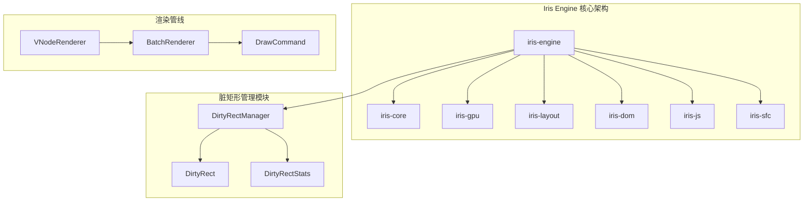
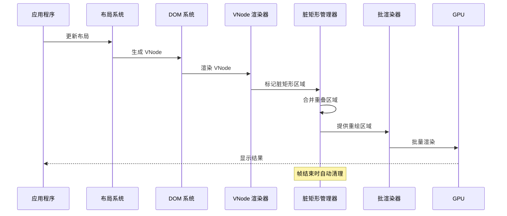
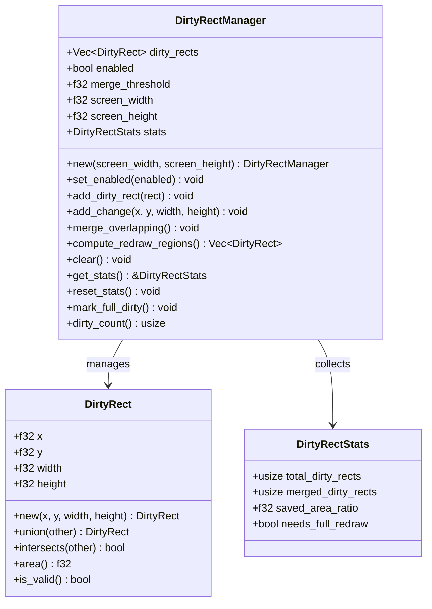
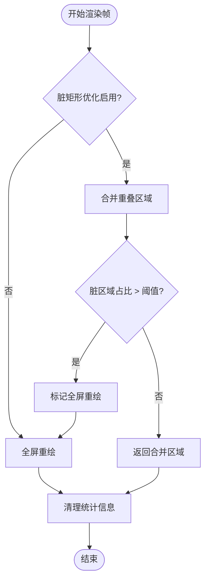
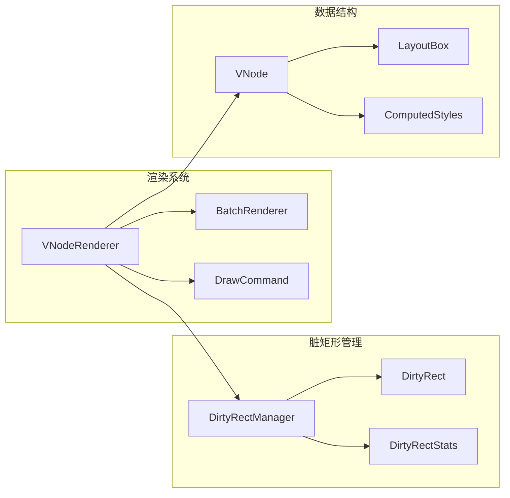

# 脏矩形管理系统

<cite>
**本文档引用的文件**
- [dirty_rect_manager.rs](file://crates/iris-engine/src/dirty_rect_manager.rs)
- [lib.rs](file://crates/iris-engine/src/lib.rs)
- [orchestrator.rs](file://crates/iris-engine/src/orchestrator.rs)
- [vnode_renderer.rs](file://crates/iris-engine/src/vnode_renderer.rs)
- [Cargo.toml](file://Cargo.toml)
- [iris-engine/Cargo.toml](file://crates/iris-engine/Cargo.toml)
- [rendering_e2e_test.rs](file://crates/iris-engine/tests/rendering_e2e_test.rs)
- [performance_benchmarks.rs](file://crates/iris-engine/tests/performance_benchmarks.rs)
</cite>

## 更新摘要
**所做更改**
- 更新了脏矩形管理器的核心组件描述，增加了自动清理机制
- 增强了性能统计功能的说明，包括保存面积比例和全屏重绘需求
- 完善了渲染流程集成部分，增加了帧结束清理的说明
- 更新了故障排除指南，增加了自动清理机制的相关问题排查

## 目录
1. [简介](#简介)
2. [项目结构](#项目结构)
3. [核心组件](#核心组件)
4. [架构概览](#架构概览)
5. [详细组件分析](#详细组件分析)
6. [依赖关系分析](#依赖关系分析)
7. [性能考量](#性能考量)
8. [故障排除指南](#故障排除指南)
9. [结论](#结论)

## 简介

脏矩形管理系统是 Iris Engine 的核心渲染优化组件，专门用于提高图形渲染性能。该系统通过跟踪和合并发生变化的屏幕区域，避免对整个屏幕进行不必要的重绘，从而显著减少 GPU 渲染调用次数和带宽消耗。

Iris Engine 是一个基于 Rust 和 WebGPU 的下一代无构建前端运行时，支持 Vue 3 框架，提供从源码到运行时的完整开发体验。脏矩形管理作为渲染管线的重要组成部分，为整个引擎提供了高效的渲染优化能力。

**更新** 本次更新增强了脏标志管理系统，包括更精确的脏矩形跟踪、自动清理机制和性能统计功能的改进。

## 项目结构

Iris Engine 采用多 Crate 的模块化架构，脏矩形管理系统位于核心引擎模块中：

**图表来源**
- [Cargo.toml:1-32](file://Cargo.toml#L1-L32)
- [iris-engine/Cargo.toml:1-21](file://crates/iris-engine/Cargo.toml#L1-L21)

**章节来源**
- [Cargo.toml:1-32](file://Cargo.toml#L1-L32)
- [iris-engine/Cargo.toml:1-21](file://crates/iris-engine/Cargo.toml#L1-L21)

## 核心组件

脏矩形管理系统由三个核心组件构成：

### 1. DirtyRect 结构体
表示屏幕上的矩形区域，包含位置、尺寸和基本几何操作：
- **位置属性**: x, y 坐标
- **尺寸属性**: width, height 宽高
- **几何操作**: 并集计算、相交检测、面积计算、有效性验证

### 2. DirtyRectManager 管理器
负责脏矩形的生命周期管理和优化策略：
- **状态跟踪**: 当前帧脏矩形列表、启用状态、合并阈值
- **区域管理**: 添加脏矩形、合并重叠区域、计算重绘区域
- **性能统计**: 统计脏矩形数量、节省的渲染面积、全屏重绘需求
- **策略控制**: 启用/禁用优化、全屏标记、统计重置
- **自动清理**: 帧结束时自动清理脏矩形，防止内存泄漏

### 3. DirtyRectStats 统计信息
提供渲染性能分析数据：
- **计数统计**: 总脏矩形数量、合并后数量
- **效率指标**: 节省的渲染面积比例、全屏重绘需求
- **监控支持**: 用于性能分析和调试

**更新** 新增了自动清理机制，确保每帧结束后清理脏矩形，避免内存泄漏和性能退化。

**章节来源**
- [dirty_rect_manager.rs:12-254](file://crates/iris-engine/src/dirty_rect_manager.rs#L12-L254)

## 架构概览

脏矩形管理系统在整个渲染架构中的位置和作用：

**图表来源**
- [vnode_renderer.rs:95-187](file://crates/iris-engine/src/vnode_renderer.rs#L95-L187)
- [dirty_rect_manager.rs:185-221](file://crates/iris-engine/src/dirty_rect_manager.rs#L185-L221)

## 详细组件分析

### 脏矩形数据结构

**图表来源**
- [dirty_rect_manager.rs:12-254](file://crates/iris-engine/src/dirty_rect_manager.rs#L12-L254)

#### 几何算法实现

脏矩形系统实现了高效的几何算法来处理矩形操作：

**并集计算算法**:
- 计算两个矩形的最小包围盒
- 时间复杂度: O(1)
- 空间复杂度: O(1)

**相交检测算法**:
- 使用分离轴定理的简化实现
- 通过边界检查判断重叠
- 时间复杂度: O(1)

**合并策略**:
- 迭代合并算法，直到没有重叠
- 使用布尔标记数组避免重复处理
- 时间复杂度: O(n²) 最坏情况，实际应用中表现良好

### 渲染流程集成

**更新** 新增了自动清理机制，在每帧结束时清理脏矩形，确保系统资源的有效利用。

**图表来源**
- [dirty_rect_manager.rs:185-221](file://crates/iris-engine/src/dirty_rect_manager.rs#L185-L221)

### 性能优化特性

#### 1. 自适应阈值策略
- **默认阈值**: 50% 面积比例
- **动态决策**: 当脏区域超过阈值时直接全屏重绘
- **性能权衡**: 避免过多小区域导致的渲染开销

#### 2. 统计监控
- **实时统计**: 记录每次渲染的性能指标
- **调试支持**: 提供详细的渲染分析数据
- **性能优化**: 帮助识别渲染热点和优化机会

#### 3. 自动清理机制
- **帧结束清理**: 每帧结束后自动清理脏矩形
- **内存保护**: 防止脏矩形累积导致的内存泄漏
- **性能稳定**: 确保渲染性能的长期稳定性

**更新** 新增了自动清理机制，确保系统在长时间运行中保持稳定的性能表现。

**章节来源**
- [dirty_rect_manager.rs:97-254](file://crates/iris-engine/src/dirty_rect_manager.rs#L97-L254)

## 依赖关系分析

脏矩形管理系统与其他组件的依赖关系：

**图表来源**
- [vnode_renderer.rs:6-8](file://crates/iris-engine/src/vnode_renderer.rs#L6-L8)
- [vnode_renderer.rs:115-122](file://crates/iris-engine/src/vnode_renderer.rs#L115-L122)
- [lib.rs:65-67](file://crates/iris-engine/src/lib.rs#L65-L67)

### 关键依赖关系

1. **VNodeRenderer 依赖**: VNode 渲染器负责触发脏矩形标记
2. **BatchRenderer 依赖**: 批渲染器使用合并后的区域进行渲染
3. **VNode 数据结构**: 虚拟 DOM 节点提供布局信息
4. **LayoutBox 结构**: 布局系统提供精确的几何信息

**更新** 通过自动清理机制，确保脏矩形管理器不会成为内存泄漏的源头。

**章节来源**
- [vnode_renderer.rs:115-187](file://crates/iris-engine/src/vnode_renderer.rs#L115-L187)
- [lib.rs:65-67](file://crates/iris-engine/src/lib.rs#L65-L67)

## 性能考量

### 时间复杂度分析

| 操作 | 最好情况 | 平均情况 | 最坏情况 | 说明 |
|------|----------|----------|----------|------|
| 添加脏矩形 | O(1) | O(1) | O(1) | 直接推入向量 |
| 合并重叠区域 | O(n) | O(n²) | O(n²) | 迭代合并算法 |
| 计算重绘区域 | O(n²) | O(n²) | O(n²) | 合并 + 阈值检查 |
| 相交检测 | O(1) | O(1) | O(1) | 分离轴定理 |
| 自动清理 | O(n) | O(n) | O(n) | 清理向量内容 |

### 空间复杂度分析

- **脏矩形存储**: O(n)，n 为脏矩形数量
- **合并过程**: O(n)，使用临时向量和布尔数组
- **统计信息**: O(1)，固定大小结构体
- **自动清理**: O(1)，常数额外空间用于清理操作

### 性能优化建议

1. **阈值调优**: 根据应用场景调整合并阈值
2. **批量处理**: 合理组织脏矩形添加顺序
3. **内存管理**: 利用自动清理机制确保内存及时释放
4. **统计监控**: 利用统计数据指导进一步优化
5. **清理策略**: 确保每帧都进行适当的清理操作

**更新** 新增了自动清理相关的性能优化建议，确保系统长期运行的稳定性。

## 故障排除指南

### 常见问题及解决方案

#### 1. 脏矩形无效问题
**症状**: 脏矩形面积为负或零
**原因**: 坐标计算错误或尺寸参数异常
**解决**: 检查坐标计算逻辑，确保输入参数有效性

#### 2. 合并算法性能问题
**症状**: 大量脏矩形时合并时间过长
**原因**: 算法复杂度过高
**解决**: 考虑使用更高效的几何算法或减少脏矩形数量

#### 3. 统计信息不准确
**症状**: 统计数据与实际渲染不符
**原因**: 统计更新时机错误
**解决**: 确保在正确的生命周期阶段更新统计信息

#### 4. 内存泄漏问题
**症状**: 应用运行时间越长，内存占用越大
**原因**: 脏矩形未及时清理
**解决**: 确保每帧结束后调用 `clear()` 方法进行清理

#### 5. 自动清理失效
**症状**: 脏矩形持续累积
**原因**: 清理机制未正确调用
**解决**: 检查渲染循环中是否正确调用 `clear()` 方法

**更新** 新增了内存泄漏和自动清理失效的相关问题排查指南。

**章节来源**
- [dirty_rect_manager.rs:256-367](file://crates/iris-engine/src/dirty_rect_manager.rs#L256-L367)

### 调试技巧

1. **启用详细日志**: 使用调试模式查看脏矩形处理过程
2. **统计数据分析**: 定期检查性能统计数据
3. **可视化工具**: 可视化脏矩形区域帮助理解渲染模式
4. **基准测试**: 建立性能基准测试评估优化效果
5. **内存监控**: 监控内存使用情况，确保自动清理正常工作

**更新** 新增了内存监控和自动清理效果验证的调试技巧。

## 结论

脏矩形管理系统是 Iris Engine 渲染架构中的关键优化组件，通过智能的区域跟踪和合并策略，显著提高了渲染性能。系统设计具有以下特点：

### 主要优势

1. **高效性**: 通过减少不必要的重绘，大幅降低 GPU 负载
2. **灵活性**: 支持动态启用/禁用和阈值调整
3. **可观测性**: 提供详细的性能统计和分析数据
4. **可扩展性**: 模块化设计便于功能扩展和优化
5. **稳定性**: 通过自动清理机制确保长期运行的稳定性

**更新** 新增了自动清理机制，显著提升了系统的长期稳定性和内存使用效率。

### 应用场景

- **高频更新界面**: 表单、图表、游戏界面等
- **移动设备**: 电池续航和性能优化
- **嵌入式系统**: 资源受限环境下的高效渲染
- **实时应用**: 需要流畅用户体验的应用
- **长时间运行应用**: 需要稳定性能表现的企业应用

### 发展方向

1. **算法优化**: 探索更高效的几何合并算法
2. **硬件加速**: 利用 GPU 进行区域计算
3. **机器学习**: 基于历史数据预测脏区域
4. **多线程**: 并行处理不同的渲染区域
5. **智能清理**: 根据内存压力动态调整清理策略

脏矩形管理系统为 Iris Engine 提供了坚实的渲染优化基础，是实现高性能前端运行时的重要技术支撑。通过本次增强，系统在保持高效性能的同时，进一步提升了稳定性和可维护性。