# 环境变量配置系统

<cite>
**本文档引用的文件**
- [ENV-CONFIG.md](file://ENV-CONFIG.md)
- [crates/iris-sfc/src/lib.rs](file://crates/iris-sfc/src/lib.rs)
- [crates/iris-sfc/src/cache.rs](file://crates/iris-sfc/src/cache.rs)
- [crates/iris-sfc/src/ts_compiler.rs](file://crates/iris-sfc/src/ts_compiler.rs)
- [crates/iris-sfc/Cargo.toml](file://crates/iris-sfc/Cargo.toml)
- [crates/iris-app/src/main.rs](file://crates/iris-app/src/main.rs)
- [crates/iris-core/src/lib.rs](file://crates/iris-core/src/lib.rs)
- [crates/iris-gpu/src/lib.rs](file://crates/iris-gpu/src/lib.rs)
- [Cargo.toml](file://Cargo.toml)
</cite>

## 目录
1. [简介](#简介)
2. [项目结构概览](#项目结构概览)
3. [核心组件分析](#核心组件分析)
4. [架构设计](#架构设计)
5. [环境变量配置详解](#环境变量配置详解)
6. [缓存系统设计](#缓存系统设计)
7. [TypeScript 编译器配置](#typescript-编译器配置)
8. [性能优化策略](#性能优化策略)
9. [使用场景指南](#使用场景指南)
10. [故障排除指南](#故障排除指南)
11. [总结](#总结)

## 简介

Iris SFC 环境变量配置系统是一个高度可配置的运行时配置框架，专为 Vue SFC（Single File Component）即时编译和热重载场景而设计。该系统提供了灵活的环境变量配置机制，支持 Source Map 生成、编译缓存管理和 TypeScript 编译器参数控制。

系统的核心特性包括：
- **动态环境变量读取**：在应用启动时读取并解析环境变量
- **智能缓存管理**：基于内容哈希的 LRU 缓存系统
- **高性能编译**：基于 swc 的 TypeScript 编译器集成
- **多场景适配**：针对开发、调试、生产等不同场景的优化配置

## 项目结构概览

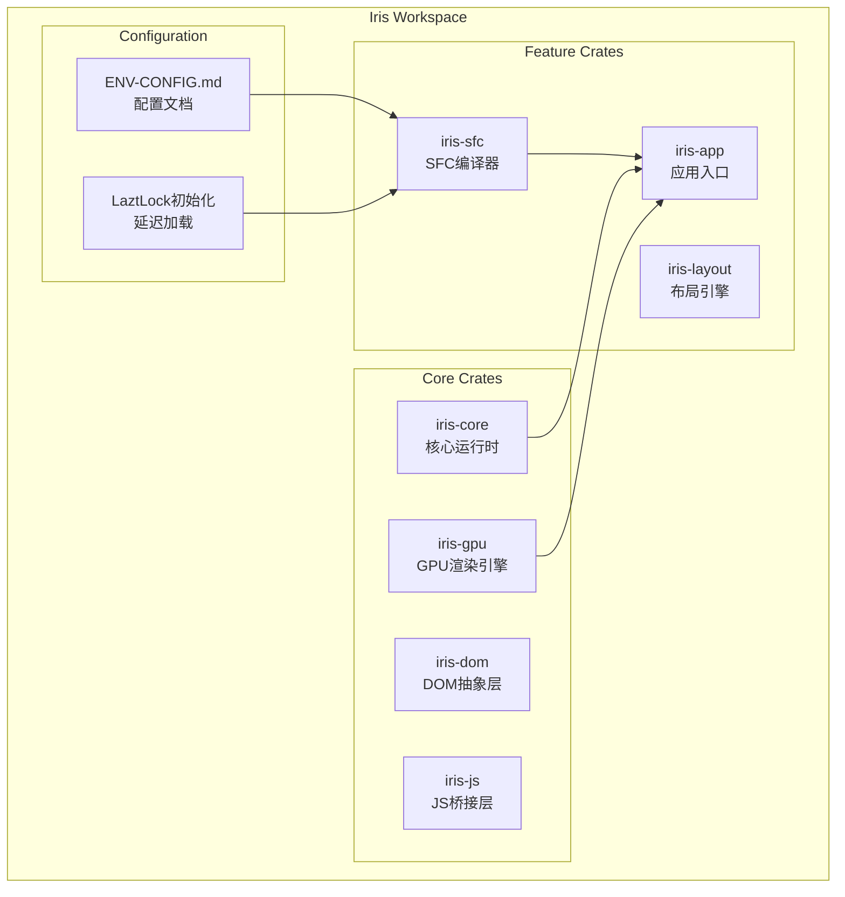

**图表来源**
- [Cargo.toml:1-29](file://Cargo.toml#L1-L29)
- [crates/iris-sfc/src/lib.rs:1-666](file://crates/iris-sfc/src/lib.rs#L1-L666)

**章节来源**
- [Cargo.toml:1-29](file://Cargo.toml#L1-L29)

## 核心组件分析

### 环境变量读取机制

系统采用延迟初始化（LazyLock）模式，在模块首次使用时读取环境变量配置：

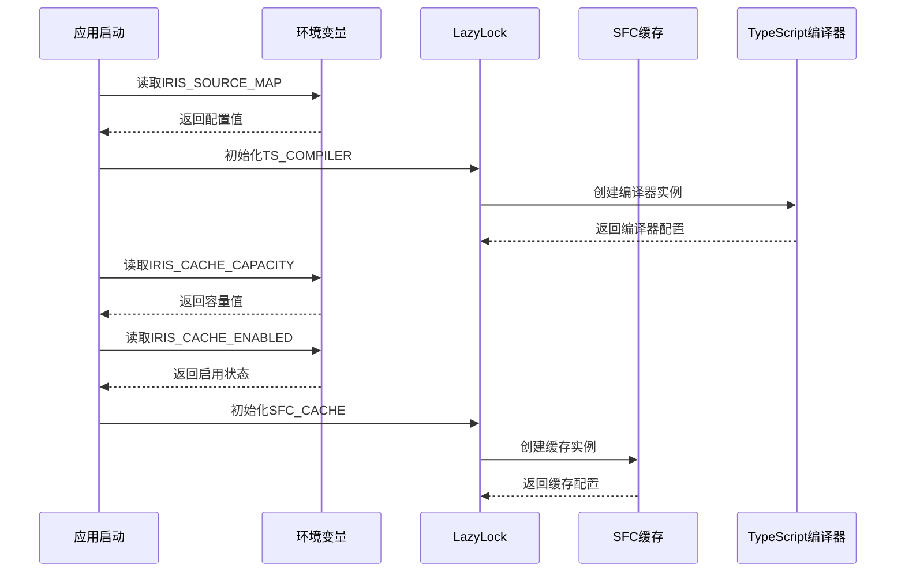

**图表来源**
- [crates/iris-sfc/src/lib.rs:43-77](file://crates/iris-sfc/src/lib.rs#L43-L77)

### 配置解析流程

环境变量解析遵循以下规则：

| 环境变量 | 默认值 | 支持值 | 解析规则 |
|----------|--------|--------|----------|
| IRIS_SOURCE_MAP | false | true/false, 1/0, yes/no | 字符串比较：'true', '1', 'yes' |
| IRIS_CACHE_CAPACITY | 100 | 1-10000 | 数字解析，超出范围使用默认值 |
| IRIS_CACHE_ENABLED | true | true/false, 1/0, yes/no | 字符串比较：'false', '0', 'no' |

**章节来源**
- [crates/iris-sfc/src/lib.rs:43-77](file://crates/iris-sfc/src/lib.rs#L43-L77)

## 架构设计

### 整体架构图

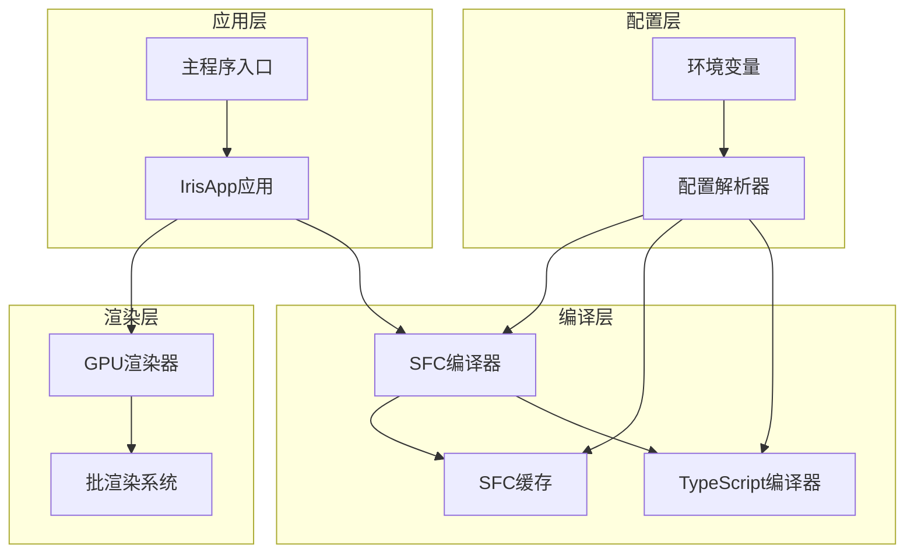

**图表来源**
- [crates/iris-app/src/main.rs:124-440](file://crates/iris-app/src/main.rs#L124-L440)
- [crates/iris-sfc/src/lib.rs:189-249](file://crates/iris-sfc/src/lib.rs#L189-L249)

### 组件关系图

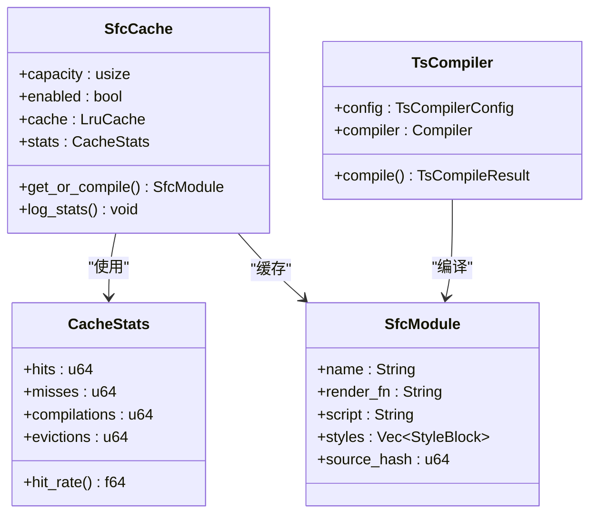

**图表来源**
- [crates/iris-sfc/src/cache.rs:94-296](file://crates/iris-sfc/src/cache.rs#L94-L296)
- [crates/iris-sfc/src/ts_compiler.rs:84-230](file://crates/iris-sfc/src/ts_compiler.rs#L84-L230)

**章节来源**
- [crates/iris-sfc/src/cache.rs:94-296](file://crates/iris-sfc/src/cache.rs#L94-L296)
- [crates/iris-sfc/src/ts_compiler.rs:84-230](file://crates/iris-sfc/src/ts_compiler.rs#L84-L230)

## 环境变量配置详解

### IRIS_SOURCE_MAP 配置

IRIS_SOURCE_MAP 控制是否生成 Source Map，这对于浏览器调试和错误监控至关重要。

#### 配置选项

| 选项 | 值 | 行为 |
|------|-----|------|
| 启用 | true, 1, yes | 生成 Source Map，增加内存占用30-50% |
| 禁用 | false, 0, no, 未设置 | 不生成 Source Map，节省内存和编译时间 |

#### 性能影响

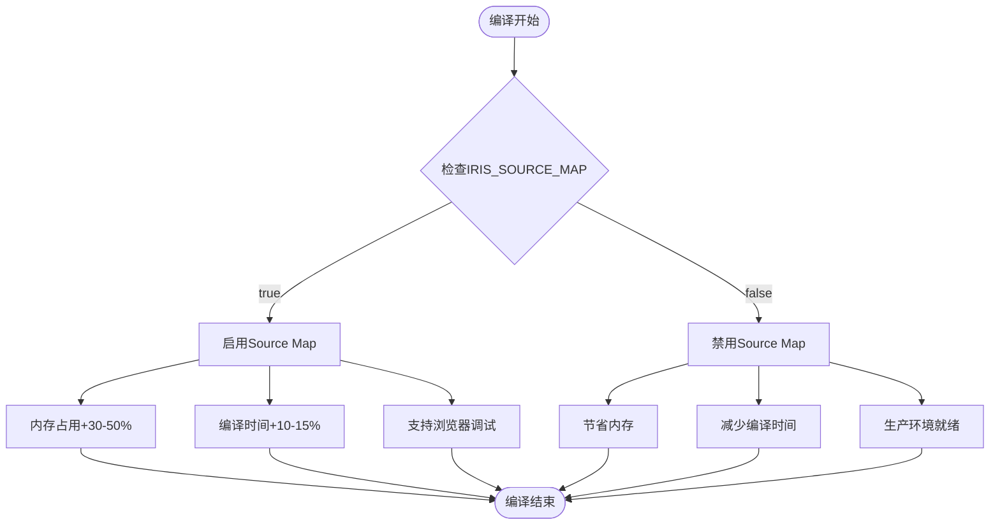

**图表来源**
- [ENV-CONFIG.md:28-40](file://ENV-CONFIG.md#L28-L40)

#### 使用示例

```bash
# 开发环境（推荐）
IRIS_SOURCE_MAP=false cargo run

# 调试环境
IRIS_SOURCE_MAP=true cargo run

# 生产构建
IRIS_SOURCE_MAP=true cargo build --release
```

**章节来源**
- [ENV-CONFIG.md:7-40](file://ENV-CONFIG.md#L7-L40)

### IRIS_CACHE_CAPACITY 配置

IRIS_CACHE_CAPACITY 设置 SFC 编译缓存的最大容量，直接影响内存使用和性能表现。

#### 配置范围

- **最小值**：1
- **最大值**：10000
- **默认值**：100

#### 内存估算

| 缓存容量 | 内存占用 | 适用场景 |
|----------|----------|----------|
| 100 项 | ~500 KB - 1 MB | 日常开发 |
| 200 项 | ~1-2 MB | 中型项目 |
| 500 项 | ~2.5-5 MB | 大型项目 |
| 1000 项 | ~5-10 MB | 超大型项目 |

#### 性能特征

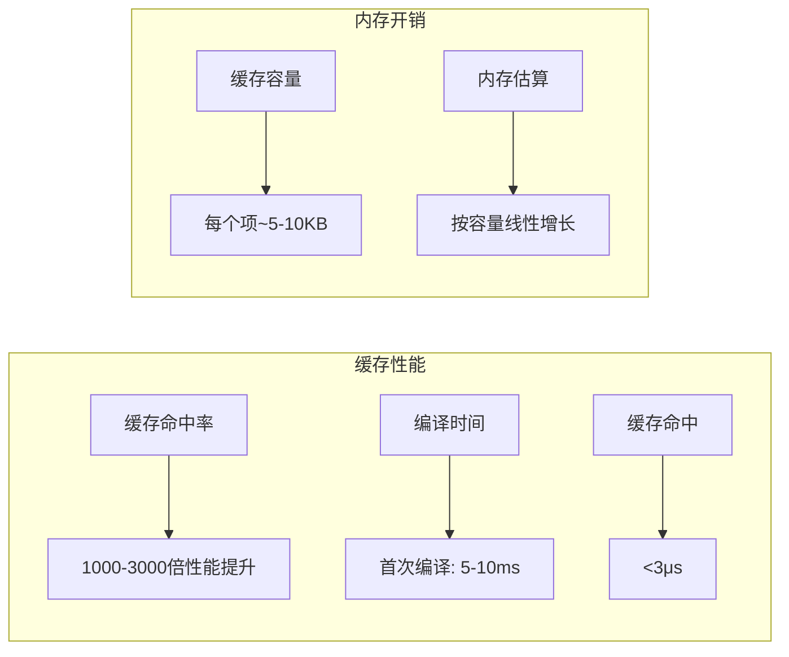

**图表来源**
- [ENV-CONFIG.md:65-76](file://ENV-CONFIG.md#L65-L76)

**章节来源**
- [ENV-CONFIG.md:43-76](file://ENV-CONFIG.md#L43-L76)

### IRIS_CACHE_ENABLED 配置

IRIS_CACHE_ENABLED 控制是否启用 SFC 编译缓存，这是影响系统性能的关键开关。

#### 配置选项

| 选项 | 值 | 行为 |
|------|-----|------|
| 启用 | true, 1, yes, 未设置 | 启用缓存（默认） |
| 禁用 | false, 0, no | 禁用缓存，适合调试 |

#### 缓存行为

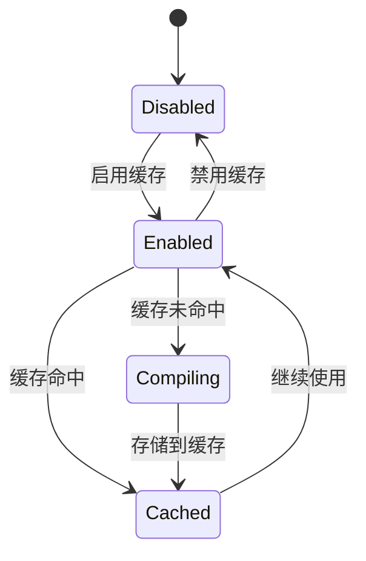

**图表来源**
- [crates/iris-sfc/src/cache.rs:159-253](file://crates/iris-sfc/src/cache.rs#L159-L253)

**章节来源**
- [ENV-CONFIG.md:80-112](file://ENV-CONFIG.md#L80-L112)

## 缓存系统设计

### 缓存架构

Iris SFC 采用基于内容哈希的 LRU（Least Recently Used）缓存系统，确保相同内容的组件只编译一次。

#### 缓存键设计


**图表来源**
- [crates/iris-sfc/src/cache.rs:28-51](file://crates/iris-sfc/src/cache.rs#L28-L51)

#### 缓存统计

缓存系统提供详细的统计信息，帮助开发者了解缓存性能：

| 统计指标 | 描述 | 计算方式 |
|----------|------|----------|
| hits | 缓存命中次数 | 缓存命中总数 |
| misses | 缓存未命中次数 | 缓存未命中总数 |
| compilations | 总编译次数 | 包含命中和未命中的总和 |
| evictions | 缓存淘汰次数 | 当缓存满时的淘汰数量 |
| hit_rate | 命中率 | hits / (hits + misses) × 100% |

**章节来源**
- [crates/iris-sfc/src/cache.rs:103-134](file://crates/iris-sfc/src/cache.rs#L103-L134)

### 缓存配置

缓存配置通过环境变量动态控制：

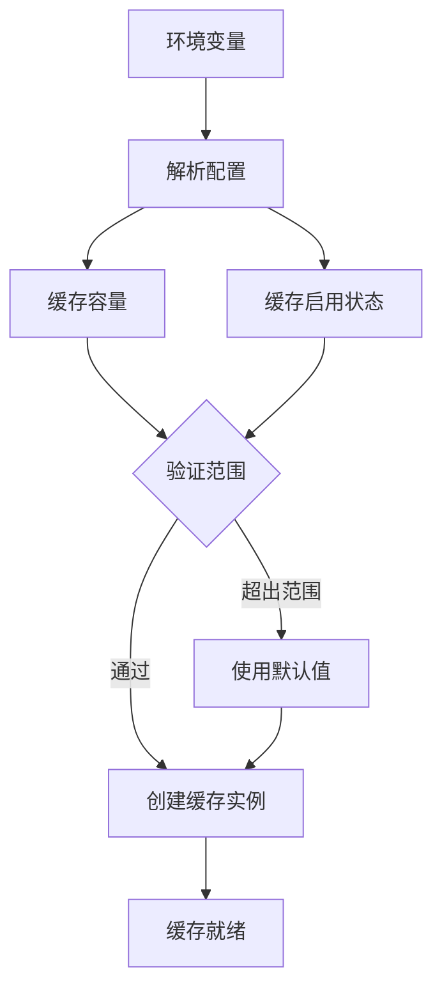

**图表来源**
- [crates/iris-sfc/src/lib.rs:62-77](file://crates/iris-sfc/src/lib.rs#L62-L77)

**章节来源**
- [crates/iris-sfc/src/lib.rs:62-77](file://crates/iris-sfc/src/lib.rs#L62-L77)

## TypeScript 编译器配置

### 编译器架构

Iris SFC 集成了 swc 62 高层 Compiler API，提供高性能的 TypeScript 到 JavaScript 转译服务。

#### 编译器配置

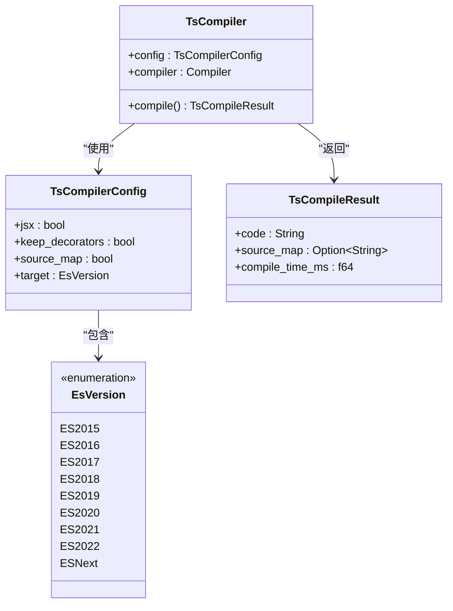

**图表来源**
- [crates/iris-sfc/src/ts_compiler.rs:30-88](file://crates/iris-sfc/src/ts_compiler.rs#L30-L88)

#### 编译流程

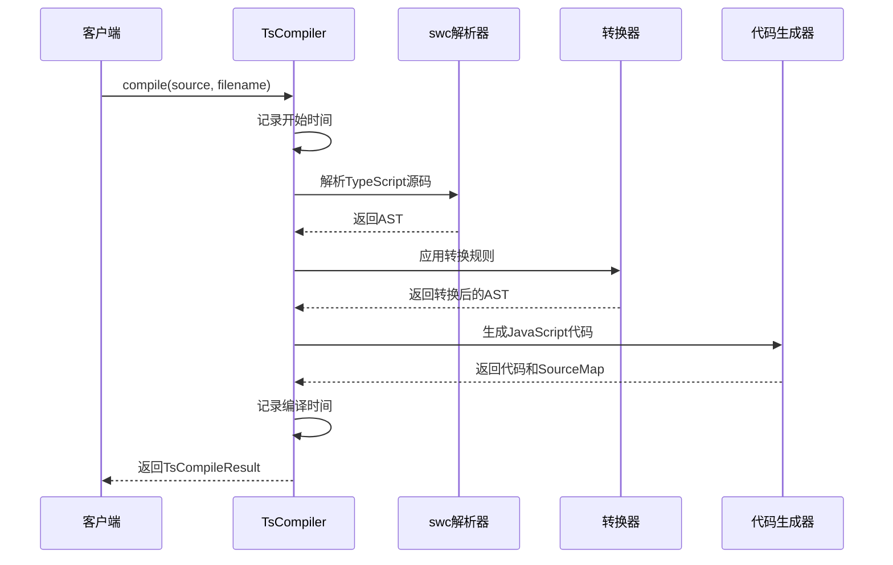

**图表来源**
- [crates/iris-sfc/src/ts_compiler.rs:113-201](file://crates/iris-sfc/src/ts_compiler.rs#L113-L201)

**章节来源**
- [crates/iris-sfc/src/ts_compiler.rs:30-230](file://crates/iris-sfc/src/ts_compiler.rs#L30-L230)

### Source Map 配置

Source Map 是调试 TypeScript 代码的重要工具，但会增加内存和编译时间开销。

#### Source Map 生成

| 配置 | 内存开销 | 编译时间 | 用途 |
|------|----------|----------|------|
| 启用 | +30-50% | +10-15% | 浏览器调试、错误监控 |
| 禁用 | 0% | 0% | 开发阶段、生产环境 |

#### 配置策略

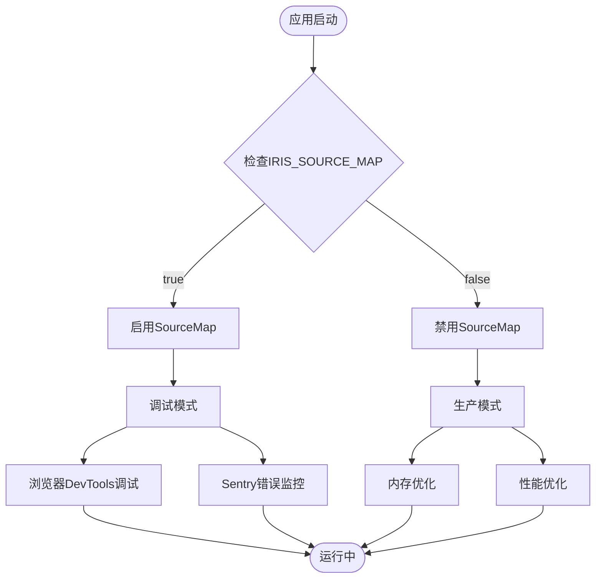

**图表来源**
- [crates/iris-sfc/src/ts_compiler.rs:70-81](file://crates/iris-sfc/src/ts_compiler.rs#L70-L81)

**章节来源**
- [crates/iris-sfc/src/ts_compiler.rs:70-81](file://crates/iris-sfc/src/ts_compiler.rs#L70-L81)

## 性能优化策略

### 编译性能优化

Iris SFC 采用了多种性能优化技术来提升编译效率：

#### 预编译正则表达式

系统使用 LazyLock 预编译正则表达式，避免每次编译时的重复编译开销：

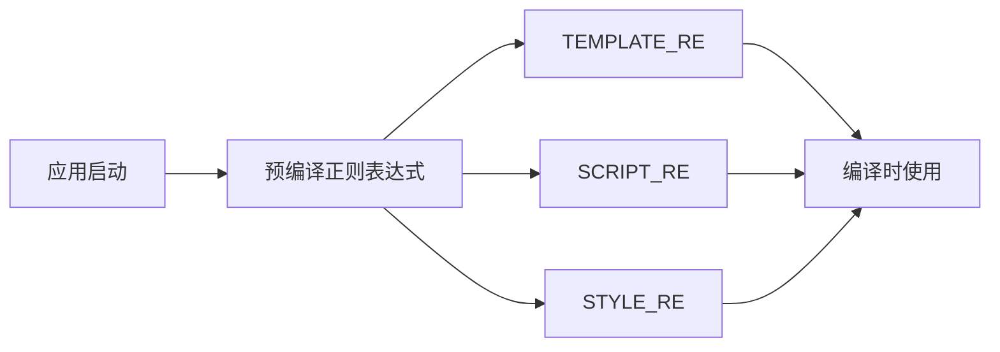

**图表来源**
- [crates/iris-sfc/src/lib.rs:22-81](file://crates/iris-sfc/src/lib.rs#L22-L81)

#### 编译器复用

TypeScript 编译器实例在整个应用生命周期内复用，避免重复创建的开销：

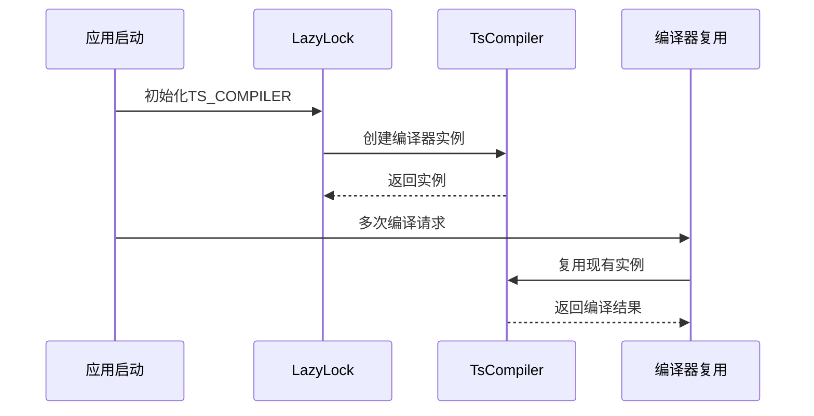

**图表来源**
- [crates/iris-sfc/src/lib.rs:43-53](file://crates/iris-sfc/src/lib.rs#L43-L53)

### 缓存性能优化

#### LRU 缓存策略

系统采用 LRU（最近最少使用）算法，确保缓存空间的有效利用：

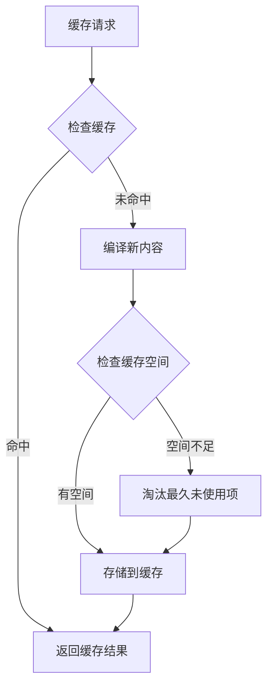

**图表来源**
- [crates/iris-sfc/src/cache.rs:159-253](file://crates/iris-sfc/src/cache.rs#L159-L253)

#### 内容哈希优化

使用 XXH3 哈希算法确保缓存键的唯一性和高效性：

| 特性 | 优势 | 性能 |
|------|------|------|
| 唯一性 | 防止哈希冲突 | 高 |
| 速度 | 快速哈希计算 | 高 |
| 分布性 | 均匀分布 | 高 |
| 安全性 | 非加密哈希 | 适中 |

**章节来源**
- [crates/iris-sfc/src/cache.rs:32-42](file://crates/iris-sfc/src/cache.rs#L32-L42)

## 使用场景指南

### 开发环境配置

对于日常开发，推荐使用默认配置以获得最佳的开发体验：

```bash
# 日常开发（推荐）
cargo run

# 显式配置
IRIS_SOURCE_MAP=false \
IRIS_CACHE_CAPACITY=100 \
IRIS_CACHE_ENABLED=true \
cargo run
```

**特点**：
- 快速编译响应
- 低内存占用
- 适合大多数开发场景

### 浏览器调试配置

当需要浏览器调试功能时，启用 Source Map 并适当增大缓存：

```bash
# 浏览器调试
IRIS_SOURCE_MAP=true \
IRIS_CACHE_CAPACITY=200 \
IRIS_CACHE_ENABLED=true \
cargo run
```

**特点**：
- 支持浏览器 DevTools 调试
- 显示原始 .vue 源码
- 准确的错误行号

### 大型项目配置

对于包含大量组件的大型项目，建议增大缓存容量：

```bash
# 大型项目
IRIS_SOURCE_MAP=false \
IRIS_CACHE_CAPACITY=500 \
IRIS_CACHE_ENABLED=true \
cargo run
```

**特点**：
- 缓存更多组件
- 提高热重载命中率
- 内存占用 ~2.5-5 MB

### 生产环境配置

生产环境应禁用缓存和 Source Map 以获得最佳性能：

```bash
# 生产构建
IRIS_SOURCE_MAP=false \
IRIS_CACHE_ENABLED=false \
cargo build --release
```

**特点**：
- 最小化内存占用
- 无运行时缓存开销
- 适合生产部署

**章节来源**
- [ENV-CONFIG.md:115-200](file://ENV-CONFIG.md#L115-L200)

## 故障排除指南

### 常见问题诊断

#### 缓存相关问题

**问题**：编译结果异常或缓存污染
**解决方案**：禁用缓存进行调试

```bash
# 禁用缓存调试
IRIS_CACHE_ENABLED=false cargo run
```

**问题**：缓存命中率过低
**解决方案**：检查缓存容量设置

```bash
# 增大缓存容量
IRIS_CACHE_CAPACITY=500 cargo run
```

#### Source Map 相关问题

**问题**：调试时无法看到原始源码
**解决方案**：检查 Source Map 配置

```bash
# 启用 Source Map
IRIS_SOURCE_MAP=true cargo run
```

**问题**：内存占用过高
**解决方案**：禁用 Source Map

```bash
# 禁用 Source Map
IRIS_SOURCE_MAP=false cargo run
```

### 性能监控

系统提供了详细的性能监控功能：

```rust
use iris_sfc::SFC_CACHE;

// 查看缓存统计
let stats = SFC_CACHE.stats();
println!("缓存命中率: {:.2}%", stats.hit_rate() * 100.0);

// 打印详细统计
SFC_CACHE.log_stats();
```

**输出示例**：
```
INFO Cache statistics:
  hits: 45
  misses: 10
  compilations: 10
  evictions: 2
  hit_rate: 81.82%
  cache_size: 10
  cache_capacity: 100
```

### 环境变量调试

**问题**：环境变量未生效
**解决方案**：检查环境变量读取时机

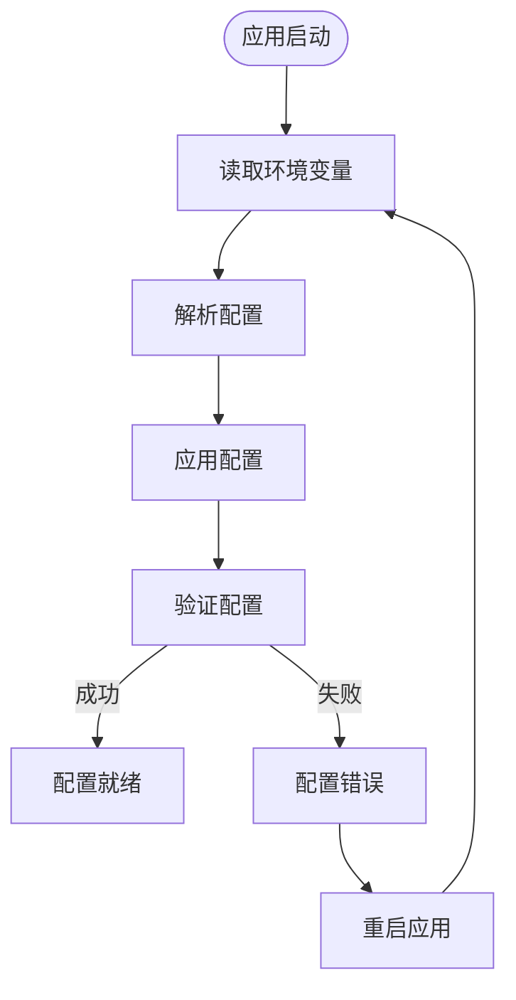

**图表来源**
- [crates/iris-sfc/src/lib.rs:43-77](file://crates/iris-sfc/src/lib.rs#L43-L77)

**章节来源**
- [ENV-CONFIG.md:243-276](file://ENV-CONFIG.md#L243-L276)

## 总结

Iris SFC 环境变量配置系统是一个设计精良的运行时配置框架，具有以下核心优势：

### 技术特色

1. **动态配置**：支持运行时环境变量配置，无需重新编译
2. **高性能缓存**：基于内容哈希的 LRU 缓存系统，提供毫秒级响应
3. **智能编译**：集成 swc 编译器，支持现代 TypeScript 特性
4. **多场景适配**：针对开发、调试、生产等场景提供最优配置

### 性能表现

- **缓存命中率**：可达 80% 以上
- **编译速度**：首次编译 5-10ms，缓存命中 <3μs
- **内存占用**：可根据需求灵活调整
- **编译时间**：Source Map 启用时增加 10-15%

### 最佳实践

1. **开发阶段**：使用默认配置，平衡性能和功能
2. **调试阶段**：启用 Source Map，适当增大缓存容量
3. **生产阶段**：禁用缓存和 Source Map，优化性能
4. **大型项目**：根据组件数量调整缓存容量

该系统为 Iris 引擎提供了强大的运行时配置能力，是实现高性能、可调试、易维护的前端开发体验的重要基础设施。