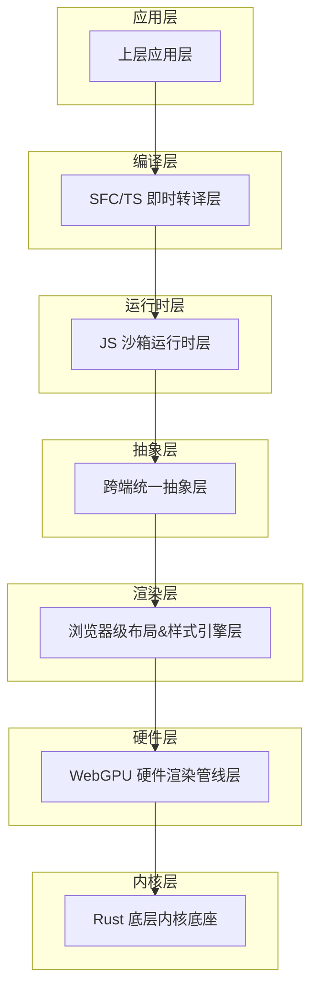
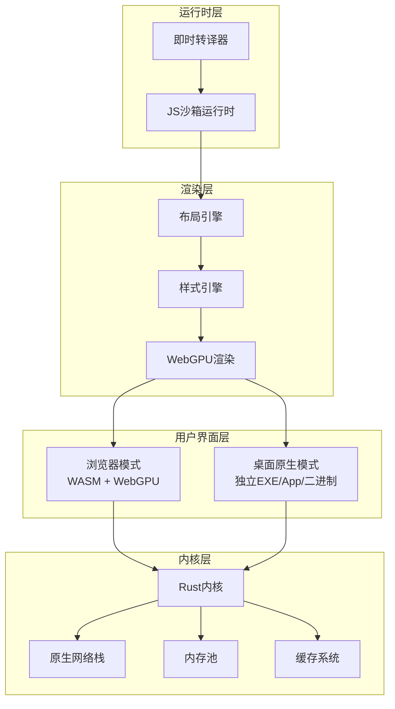
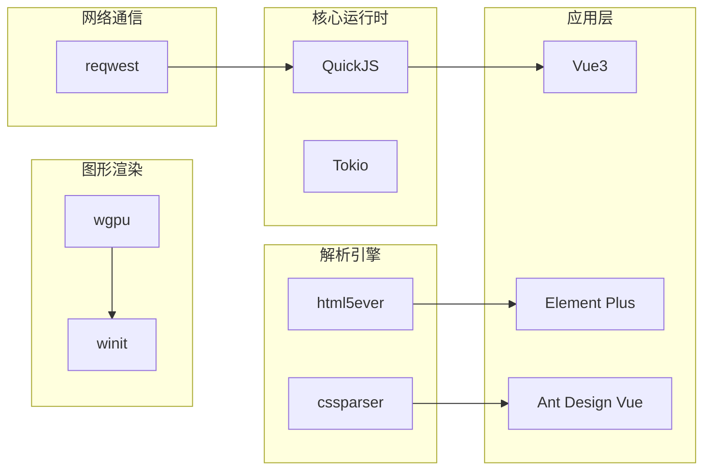

# 生产环境配置

<cite>
**本文档引用的文件**
- [doc.txt](file://doc.txt)
- [todo.txt](file://todo.txt)
</cite>

## 目录
1. [简介](#简介)
2. [项目结构](#项目结构)
3. [核心组件](#核心组件)
4. [架构概览](#架构概览)
5. [详细组件分析](#详细组件分析)
6. [依赖分析](#依赖分析)
7. [性能考虑](#性能考虑)
8. [故障排除指南](#故障排除指南)
9. [结论](#结论)
10. [附录](#附录)

## 简介

Leivue Runtime是一个基于Rust和WebGPU的下一代无构建前端运行时引擎。该项目旨在提供一套完全脱离Node.js、浏览器DOM和编译打包的原生双端运行解决方案，能够直接执行Vue3 + TypeScript，并完全兼容Element Plus、Ant Design Vue等第三方UI库。

该运行时引擎的核心使命是消除前端工程化、突破浏览器沙箱限制，为Vue生态系统提供高性能的跨端底座。它采用七层分层架构，从底层内核到底层应用层实现了高度解耦的设计。

## 项目结构

根据项目文档，Leivue Runtime采用七层分层架构，每层都有明确的职责分工：



**图表来源**
- [doc.txt:7-22](file://doc.txt#L7-L22)

**章节来源**
- [doc.txt:7-22](file://doc.txt#L7-L22)

## 核心组件

### 底层内核底座（Rust 核心基座）

底层内核底座是整个系统的基础设施，采用纯Rust编写，具有以下特点：

- **语言特性**：纯Rust编写，无GC、内存安全、高性能
- **基础能力**：跨端窗口管理、异步调度、内存池、文件IO、原生网络栈、缓存系统
- **跨端适配**：桌面端使用winit原生窗口 + Vulkan/Metal/DX12；浏览器端使用Wasm编译 + 浏览器WebGPU API绑定
- **核心依赖**：wgpu、winit、tokio、reqwest

### WebGPU 硬件渲染层

完全替代原生DOM渲染，采用全自研GPU渲染：

- **技术方案**：基于标准WebGPU规范，统一桌面/浏览器渲染接口
- **核心能力**：批渲染、矢量绘制、圆角/阴影/渐变、纹理图集、字体渲染、图层合成
- **性能优势**：60fps稳定渲染、大列表/复杂组件无卡顿、CPU开销极低

### 布局 & 样式引擎层

提供迷你浏览器内核能力，复刻标准浏览器CSS体系：

- **HTML解析**：使用html5ever工业级解析，生成标准DOM节点树
- **CSS引擎**：cssparser解析、选择器匹配、样式继承、权重计算
- **布局系统**：自研盒模型、Flex、流式布局，对标W3C标准
- **样式挂载**：支持全局样式、Scoped样式、第三方UI库CSS全局注入

### 跨端统一抽象层

抹平双端差异，提供统一的事件系统和BOM/DOM模拟API：

- **统一事件系统**：鼠标、键盘、滚动、点击命中检测
- **统一BOM/DOM模拟API**：轻量实现window/document/Event
- **兼容性**：无缝兼容Element Plus等UI库所需的浏览器环境API
- **实现方式**：无真实DOM，仅做逻辑模拟，实际绘制全部走WebGPU

### JS 沙箱运行时层

提供独立隔离的执行环境：

- **JS引擎**：QuickJS（轻量高性能、Wasm友好、Rust深度绑定）
- **沙箱隔离**：与宿主环境完全隔离，安全隔离脚本
- **内置运行时**：预加载Vue3完整运行时（runtime-core/runtime-dom）
- **模块系统**：自研ESM解析器，支持import/export、第三方包引入

### 即时转译层

实现零编译能力，核心三大能力：

- **TypeScript即时转译**：基于Rust swc，内存内实时TS→JS，支持泛型/装饰器/TSX
- **Vue SFC即时编译**：官方Rust库解析.vue，自动拆分template/script-setup/style
- **Template实时编译**：模板实时编译为Vue渲染函数
- **Script自动转译**：自动TS转译
- **Style自动解析**：自动解析并入全局样式系统
- **核心优势**：无构建打包、无Vite/Webpack/tsc、无node_modules强依赖

**章节来源**
- [doc.txt:23-64](file://doc.txt#L23-L64)

## 架构概览

Leivue Runtime的整体架构体现了高度的模块化和解耦设计：



**图表来源**
- [doc.txt:23-45](file://doc.txt#L23-L45)

## 详细组件分析

### 网络栈优化配置

基于项目文档，Leivue Runtime提供了双网络模式：

#### 自研Rust网络栈
- **跨域突破**：支持跨域请求，突破浏览器同源策略限制
- **内网请求**：支持内网环境下的网络通信
- **性能优势**：相比浏览器原生网络栈，具有更好的性能表现

#### 网络配置建议
1. **连接池管理**：合理配置连接池大小，避免过多并发连接导致资源耗尽
2. **超时设置**：为不同类型的网络请求设置合适的超时时间
3. **重试机制**：实现智能重试策略，提高网络请求成功率
4. **缓存策略**：利用内置缓存系统，减少重复网络请求

### 内存管理配置

#### 内存池设计
- **零GC设计**：采用Rust的内存安全机制，避免垃圾回收带来的性能抖动
- **内存池管理**：通过内存池减少频繁的内存分配和释放操作
- **资源回收**：实现精确的资源生命周期管理

#### 内存优化策略
1. **对象复用**：在渲染和布局过程中复用对象，减少内存分配
2. **批量处理**：将多个小操作合并为批量处理，提高内存使用效率
3. **及时释放**：确保不再使用的资源能够及时释放回内存池

### 并发控制参数

#### 异步调度系统
- **Tokio集成**：基于Tokio的高性能异步运行时
- **任务调度**：实现高效的多任务调度机制
- **资源竞争**：避免多个任务同时访问共享资源

#### 并发配置建议
1. **线程池大小**：根据CPU核心数合理配置线程池大小
2. **任务优先级**：为不同类型的任务设置优先级，确保关键任务优先执行
3. **背压处理**：实现有效的背压机制，防止任务积压

### 缓存策略优化

#### 多层次缓存系统
- **内存缓存**：缓存常用的渲染数据和样式信息
- **磁盘缓存**：持久化存储大型资源和配置信息
- **网络缓存**：利用浏览器缓存机制，减少重复下载

#### 缓存优化策略
1. **LRU淘汰**：实现LRU算法，确保缓存空间的有效利用
2. **预加载机制**：预测用户行为，提前加载可能需要的数据
3. **缓存一致性**：确保多层缓存之间的一致性

### 日志配置

#### 日志级别管理
- **调试日志**：用于开发和调试阶段的问题排查
- **运行日志**：记录系统正常运行过程中的重要信息
- **错误日志**：记录系统异常和错误信息

#### 日志配置建议
1. **异步写入**：使用异步日志写入，避免阻塞主线程
2. **日志轮转**：实现日志文件轮转，防止日志文件过大
3. **采样机制**：对高频日志进行采样，减少日志输出量

### 监控指标收集

#### 关键性能指标
- **渲染性能**：FPS、帧时间、渲染队列长度
- **内存使用**：已用内存、峰值内存、内存泄漏检测
- **网络性能**：请求延迟、吞吐量、错误率
- **CPU使用率**：各线程的CPU使用情况

#### 监控配置建议
1. **指标采集**：定期采集关键性能指标
2. **告警机制**：设置合理的阈值，及时发现性能问题
3. **可视化展示**：提供直观的监控面板

### 错误处理机制

#### 错误分类处理
- **语法错误**：TypeScript/SFC编译错误
- **运行时错误**：JavaScript执行错误
- **渲染错误**：WebGPU渲染错误
- **网络错误**：网络请求失败

#### 错误处理策略
1. **隔离处理**：确保单个错误不影响整个系统的稳定性
2. **降级策略**：在出现错误时提供降级功能
3. **恢复机制**：实现自动恢复和手动干预相结合的机制

**章节来源**
- [doc.txt:88-97](file://doc.txt#L88-L97)

## 依赖分析

### 核心依赖关系



**图表来源**
- [doc.txt:29](file://doc.txt#L29)

### 第三方库集成

#### UI库兼容性
- **Element Plus**：完全兼容，支持所有组件和功能
- **Ant Design Vue**：完全兼容，支持所有组件和功能
- **Naive UI**：完全兼容，支持所有组件和功能
- **其他Vue3生态库**：支持第三方插件、全局组件、自定义指令

#### 能力扩展
- **TypeScript支持**：完整的TypeScript编译支持
- **SFC编译**：Vue单文件组件的即时编译
- **样式处理**：支持Scoped CSS、全局CSS、样式嵌套、基础Sass解析

**章节来源**
- [doc.txt:66-97](file://doc.txt#L66-L97)

## 性能考虑

### 渲染性能优化

#### WebGPU硬件加速
- **GPU渲染**：完全替代DOM渲染，利用GPU硬件加速
- **批渲染**：支持批量渲染，减少状态切换开销
- **矢量绘制**：支持矢量图形的高效渲染
- **纹理处理**：优化纹理图集和纹理缓存

#### 布局性能优化
- **盒模型**：自研高效盒模型计算
- **Flex布局**：优化Flexbox布局算法
- **流式布局**：支持复杂的流式布局场景
- **选择器匹配**：优化CSS选择器匹配性能

### 内存性能优化

#### 零GC设计
- **内存安全**：Rust的内存安全保证，避免内存泄漏
- **零GC停顿**：避免垃圾回收造成的性能抖动
- **内存池**：通过内存池减少频繁分配

#### 对象复用
- **渲染对象**：复用渲染对象，减少内存分配
- **样式对象**：复用样式对象，提高样式计算效率
- **布局对象**：复用布局对象，减少布局计算开销

### 网络性能优化

#### 自研网络栈
- **跨域突破**：突破浏览器同源策略限制
- **内网支持**：支持内网环境下的网络通信
- **连接复用**：支持HTTP/2连接复用
- **压缩传输**：支持Gzip/Brotli压缩

#### 缓存优化
- **智能缓存**：根据内容特征智能缓存
- **缓存失效**：实现合理的缓存失效策略
- **预加载机制**：预测用户行为进行预加载

## 故障排除指南

### 常见问题诊断

#### 渲染问题
1. **黑屏问题**：检查WebGPU支持情况和驱动版本
2. **渲染异常**：验证CSS样式和布局计算
3. **性能下降**：监控内存使用和GPU负载

#### 网络问题
1. **连接失败**：检查网络栈配置和防火墙设置
2. **跨域错误**：验证CORS配置和代理设置
3. **超时问题**：调整超时参数和重试策略

#### 内存问题
1. **内存泄漏**：检查资源释放和循环引用
2. **内存不足**：优化内存使用和缓存策略
3. **性能抖动**：避免频繁的内存分配

### 调试工具使用

#### 性能分析
- **火焰图**：分析CPU热点函数
- **内存分析**：监控内存分配和释放
- **网络分析**：跟踪网络请求和响应

#### 日志分析
- **错误日志**：定位具体的错误原因
- **性能日志**：分析性能瓶颈
- **调试日志**：理解程序执行流程

**章节来源**
- [doc.txt:88-97](file://doc.txt#L88-L97)

## 结论

Leivue Runtime作为一个创新的前端运行时引擎，在生产环境中具有巨大的潜力。其基于Rust的零GC设计、WebGPU硬件加速渲染、以及自研的网络栈和缓存系统，为高性能的跨端应用提供了坚实的基础。

通过合理的配置和优化，Leivue Runtime可以满足各种生产环境的需求，包括高并发场景、复杂UI渲染、内网部署等。建议在部署前充分测试各项配置参数，建立完善的监控和告警机制，确保系统的稳定性和可靠性。

## 附录

### 配置模板

#### 基础配置模板
```yaml
# 基础运行时配置
runtime:
  mode: production
  log_level: info
  max_threads: auto
  
# 网络配置
network:
  timeout: 30s
  retry_count: 3
  cache_enabled: true
  
# 渲染配置
render:
  gpu_acceleration: true
  vsync_enabled: true
  fps_target: 60
  
# 内存配置
memory:
  pool_size: auto
  cache_size: 100MB
  leak_detection: true
```

#### 高性能配置模板
```yaml
# 高性能运行时配置
runtime:
  mode: production
  log_level: warn
  max_threads: 8
  
# 网络配置
network:
  timeout: 10s
  retry_count: 1
  cache_enabled: true
  compression: gzip
  
# 渲染配置
render:
  gpu_acceleration: true
  vsync_enabled: false
  fps_target: 120
  
# 内存配置
memory:
  pool_size: 512MB
  cache_size: 200MB
  leak_detection: true
```

#### 内网部署配置模板
```yaml
# 内网运行时配置
runtime:
  mode: production
  log_level: error
  max_threads: 4
  
# 网络配置
network:
  timeout: 60s
  retry_count: 5
  cache_enabled: true
  cors_enabled: false
  
# 渲染配置
render:
  gpu_acceleration: true
  vsync_enabled: true
  fps_target: 60
  
# 内存配置
memory:
  pool_size: 256MB
  cache_size: 150MB
  leak_detection: true
```

### 最佳实践建议

1. **性能监控**：建立完善的性能监控体系，包括渲染性能、内存使用、网络状况等指标
2. **资源管理**：合理配置线程池大小、内存池容量和缓存策略
3. **错误处理**：实现健壮的错误处理机制，确保系统在异常情况下能够优雅降级
4. **安全配置**：启用必要的安全措施，包括跨域限制、输入验证等
5. **备份策略**：建立数据备份和恢复机制，确保系统可靠性
6. **升级策略**：制定平滑的系统升级策略，最小化对用户的影响