# 跨端打包流程

<cite>
**本文档引用的文件**
- [doc.txt](file://doc.txt)
- [todo.txt](file://todo.txt)
</cite>

## 目录
1. [项目概述](#项目概述)
2. [技术架构概览](#技术架构概览)
3. [跨端打包架构](#跨端打包架构)
4. [Windows 平台打包](#windows-平台打包)
5. [macOS 平台打包](#macos-平台打包)
6. [Linux 平台打包](#linux-平台打包)
7. [浏览器 Wasm 打包](#浏览器-wasm-打包)
8. [构建工具链](#构建工具链)
9. [代码签名配置](#代码签名配置)
10. [版本管理策略](#版本管理策略)
11. [增量更新机制](#增量更新机制)
12. [热修复流程](#热修复流程)
13. [兼容性测试](#兼容性测试)
14. [自动化构建流程](#自动化构建流程)
15. [故障排除指南](#故障排除指南)
16. [总结](#总结)

## 项目概述

Leivue Runtime 是一个基于 Rust 和 WebGPU 的下一代无构建前端运行时引擎。该项目的核心目标是提供一套完全脱离 Node.js、浏览器 DOM 和编译打包的跨端运行解决方案，支持零编译直接执行 Vue3 + TypeScript，并完全兼容 Element Plus、Ant Design Vue 等第三方 UI 库。

### 核心特性

- **零编译运行**：直接运行原生 Vue3 SFC 文件，无需构建过程
- **跨端统一**：浏览器 Wasm 模式 + 独立桌面原生模式
- **高性能渲染**：基于 WebGPU 的硬件加速渲染
- **生态兼容**：完整支持 Vue3 生态系统的组件库
- **安全隔离**：独立的 JS 沙箱运行环境

**章节来源**
- [doc.txt:1-97](file://doc.txt#L1-L97)

## 技术架构概览

项目采用七层分层架构设计，每层都有明确的职责和解耦关系：

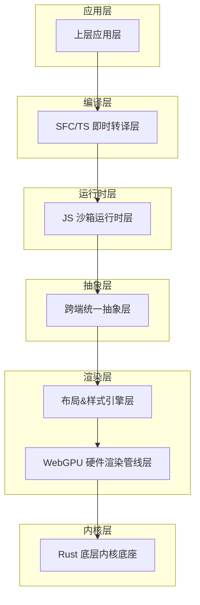

**图表来源**
- [doc.txt:7-22](file://doc.txt#L7-L22)

**章节来源**
- [doc.txt:7-22](file://doc.txt#L7-L22)

## 跨端打包架构

Leivue Runtime 支持多种运行模式和打包方式：

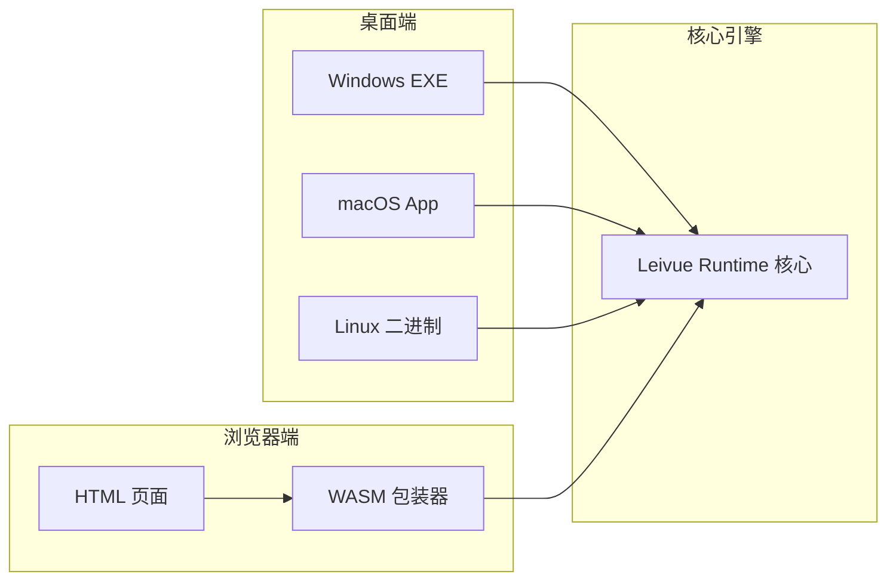

**图表来源**
- [doc.txt:76-82](file://doc.txt#L76-L82)

### 平台适配策略

每个平台都有特定的适配策略：

- **桌面端**：使用 winit 原生窗口 + Vulkan/Metal/DX12 渲染后端
- **浏览器端**：编译为 Wasm + WebGPU API 绑定
- **统一内核**：所有平台共享同一套核心运行时

**章节来源**
- [doc.txt:26-29](file://doc.txt#L26-L29)

## Windows 平台打包

### 构建环境准备

Windows 平台的构建需要以下工具链：

- **Rust 工具链**：稳定版本
- **Visual Studio Build Tools**：用于链接器和编译器
- **WebGPU SDK**：Windows 版本
- **WASM 工具链**：如果需要浏览器模式

### 编译配置

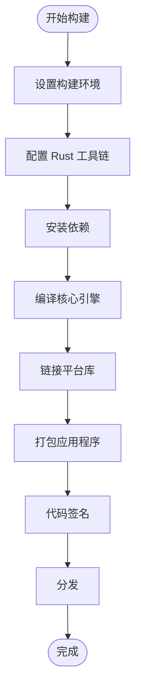

**图表来源**
- [doc.txt:23-29](file://doc.txt#L23-L29)

### 依赖管理

Windows 平台的关键依赖包括：

- **wgpu**：WebGPU 渲染库
- **winit**：窗口管理
- **tokio**：异步运行时
- **reqwest**：HTTP 客户端

### 代码签名流程

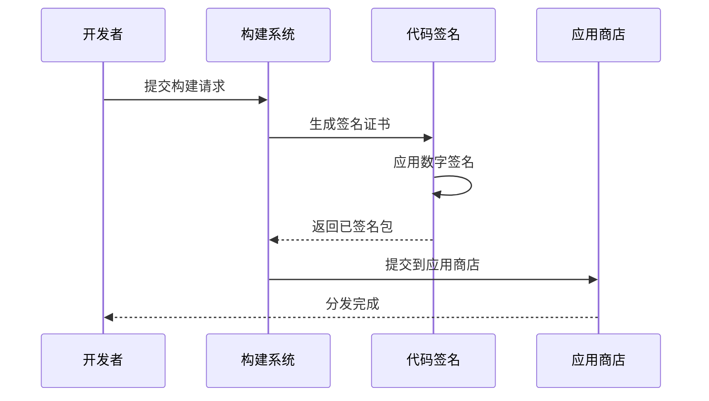

**图表来源**
- [doc.txt:95](file://doc.txt#L95)

**章节来源**
- [doc.txt:23-29](file://doc.txt#L23-L29)

## macOS 平台打包

### 构建环境配置

macOS 平台的特殊要求：

- **Xcode Command Line Tools**：编译工具链
- **Metal SDK**：Apple 平台渲染后端
- **Homebrew**：包管理器
- **macOS SDK**：系统 API

### 平台特定配置

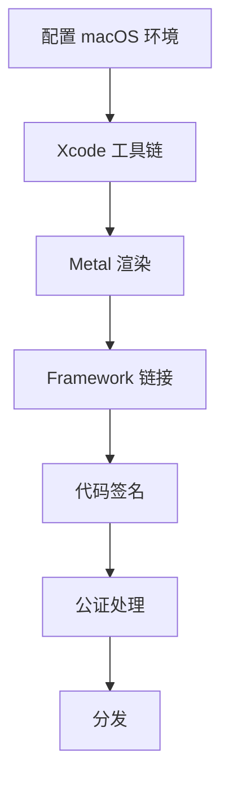

**图表来源**
- [doc.txt:27](file://doc.txt#L27)

### 代码签名和公证

macOS 平台需要额外的公证步骤：

1. **开发者证书**：Apple Developer Program 认证
2. **公证服务**：Apple Notarization Service
3. **沙盒适配**：根据应用功能配置权限

**章节来源**
- [doc.txt:27](file://doc.txt#L27)

## Linux Assistant 平台打包

### 构建环境准备

Linux 平台的构建要求：

- **GCC/Clang**：C/C++ 编译器
- **Vulkan SDK**：图形渲染
- **GTK/Qt**：GUI 框架（可选）
- **AppImage/FDE**：打包格式

### 依赖库管理

Linux 平台的动态库管理：

- **系统库**：通过包管理器安装
- **运行时库**：静态链接或动态加载
- **依赖检测**：运行时依赖检查

### 打包策略

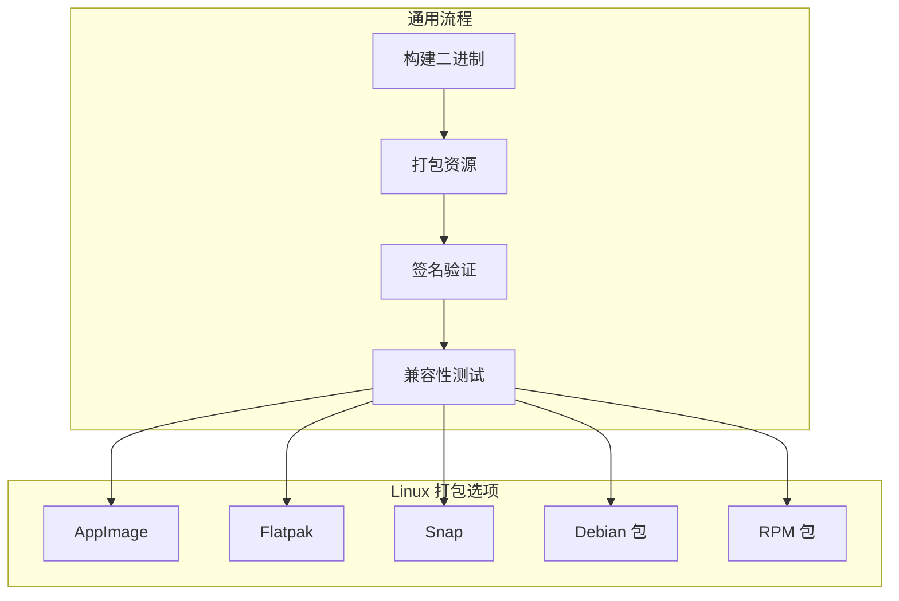

**图表来源**
- [doc.txt:95](file://doc.txt#L95)

**章节来源**
- [doc.txt:95](file://doc.txt#L95)

## 浏览器 Wasm 打包

### WebAssembly 构建流程

浏览器模式的特殊构建要求：

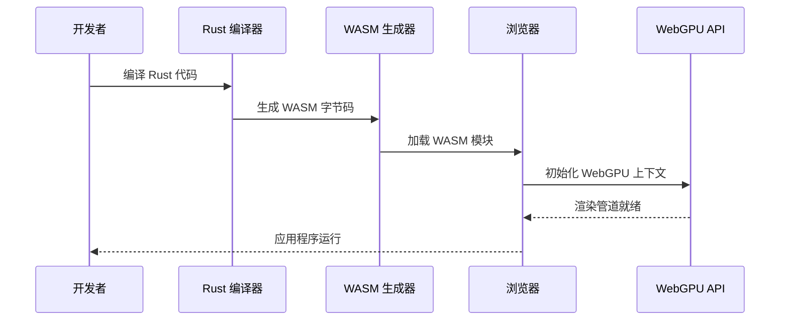

**图表来源**
- [doc.txt:27-28](file://doc.txt#L27-L28)

### Wasm 特定优化

- **内存管理**：手动内存控制
- **类型系统**：严格的类型转换
- **错误处理**：异常传播机制
- **性能优化**：SIMD 和并行计算

### 浏览器兼容性

- **WebGPU 支持**：现代浏览器的 WebGPU API
- **渐进增强**：降级到 WebGL 或 Canvas
- **polyfill 策略**：必要时使用 polyfill

**章节来源**
- [doc.txt:27-28](file://doc.txt#L27-L28)

## 构建工具链

### Rust 工具链配置

项目使用的 Rust 生态工具：

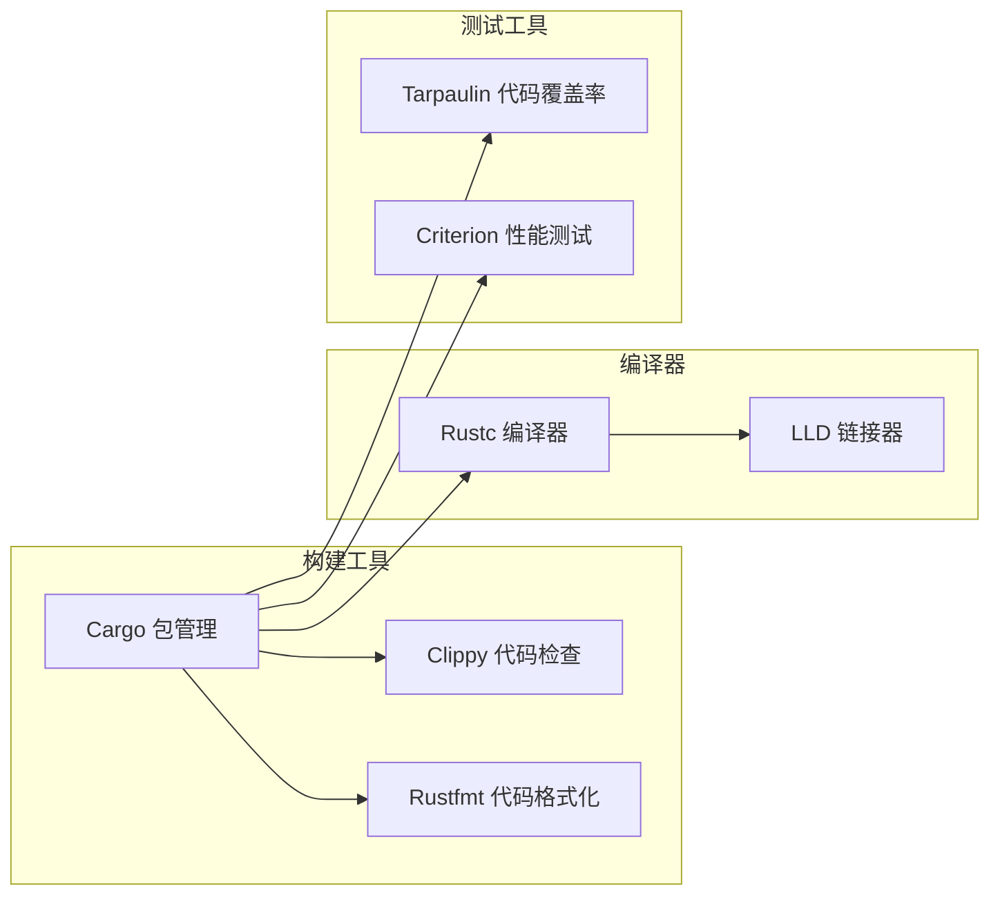

**图表来源**
- [doc.txt:23-29](file://doc.txt#L23-L29)

### 编译器配置

关键编译器参数：

- **优化级别**：Release 模式下的优化
- **目标架构**：多架构支持
- **链接时优化**：LTO 优化
- **调试信息**：符号表保留

**章节来源**
- [doc.txt:23-29](file://doc.txt#L23-L29)

## 代码签名配置

### 数字证书管理

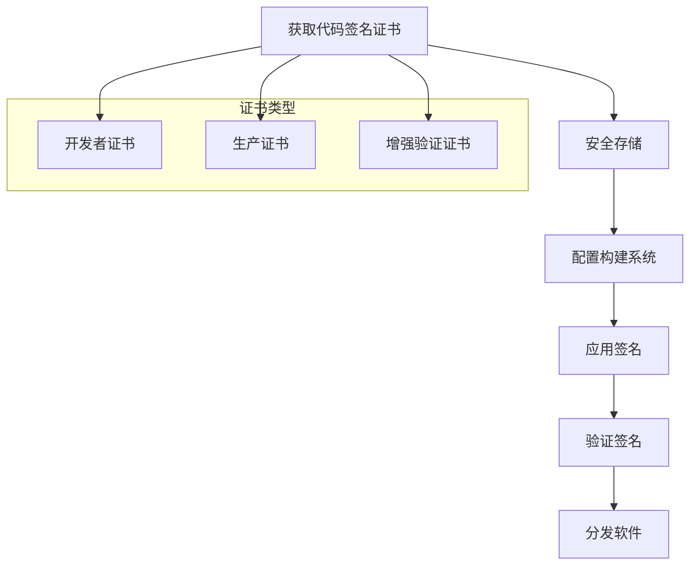

**图表来源**
- [doc.txt:95](file://doc.txt#L95)

### 平台特定签名要求

- **Windows**：Microsoft Authenticode
- **macOS**：Apple Code Signing
- **Linux**：GPG 签名（可选）

### 自动化签名流程

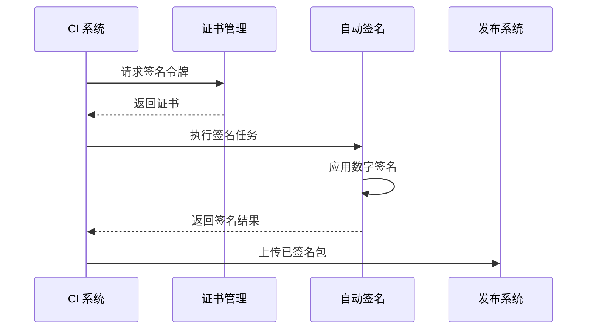

**图表来源**
- [doc.txt:95](file://doc.txt#L95)

**章节来源**
- [doc.txt:95](file://doc.txt#L95)

## 版本管理策略

### 版本号规范

采用语义化版本控制：

```
主版本号.次版本号.修订号
```

- **主版本号**：破坏性变更
- **次版本号**：向后兼容的功能新增
- **修订号**：向后兼容的问题修复

### 分支管理策略

```mermaid
gitgraph
commit id: "初始版本"
branch develop
checkout develop
commit id: "功能开发"
branch feature/new-feature
checkout feature/new-feature
commit id: "新功能完成"
checkout develop
merge feature/new-feature
commit id: "测试通过"
checkout main
merge develop
tag: "v1.0.0"
```

### 发布流程

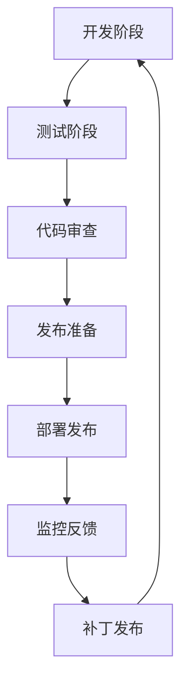

**章节来源**
- [doc.txt:95](file://doc.txt#L95)

## 增量更新机制

### 更新策略设计

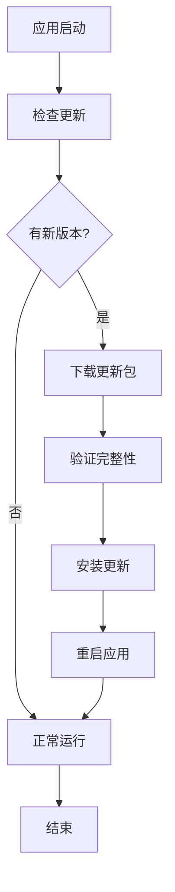

**图表来源**
- [doc.txt:95](file://doc.txt#L95)

### 更新包管理

- **差分更新**：只传输变化的部分
- **完整性校验**：SHA256 校验和
- **回滚机制**：失败时恢复到旧版本
- **增量压缩**：减少带宽使用

### 热更新支持

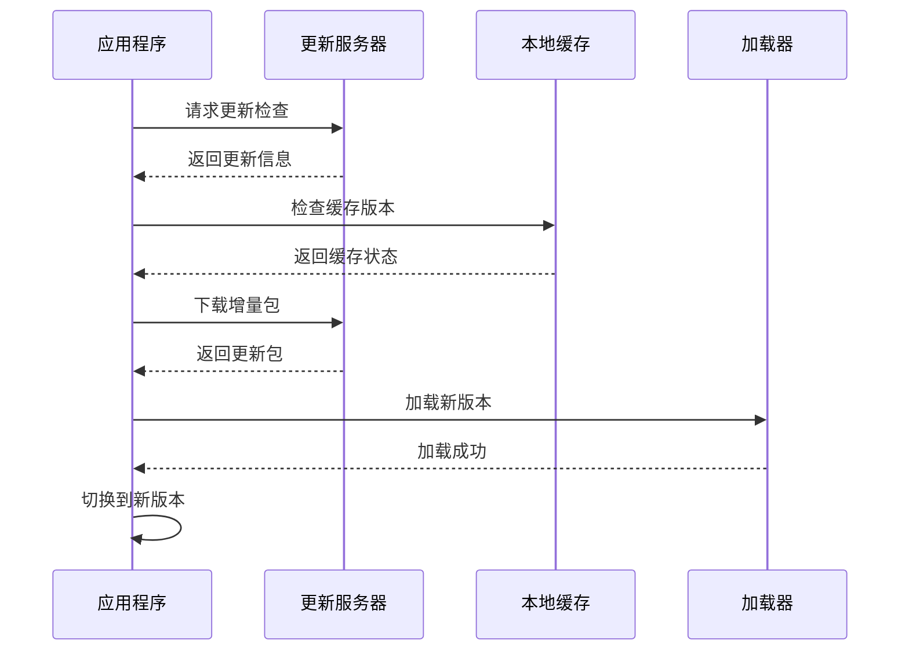

**图表来源**
- [doc.txt:95](file://doc.txt#L95)

**章节来源**
- [doc.txt:95](file://doc.txt#L95)

## 热修复流程

### 紧急修复流程

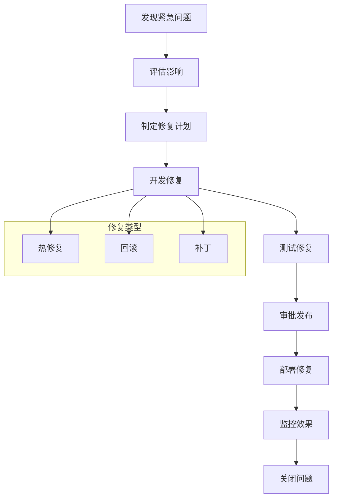

**图表来源**
- [doc.txt:95](file://doc.txt#L95)

### 自动化热修复

- **监控告警**：实时监控应用状态
- **自动检测**：异常行为识别
- **快速响应**：自动触发修复流程
- **灰度发布**：逐步推广修复

### 数据备份策略

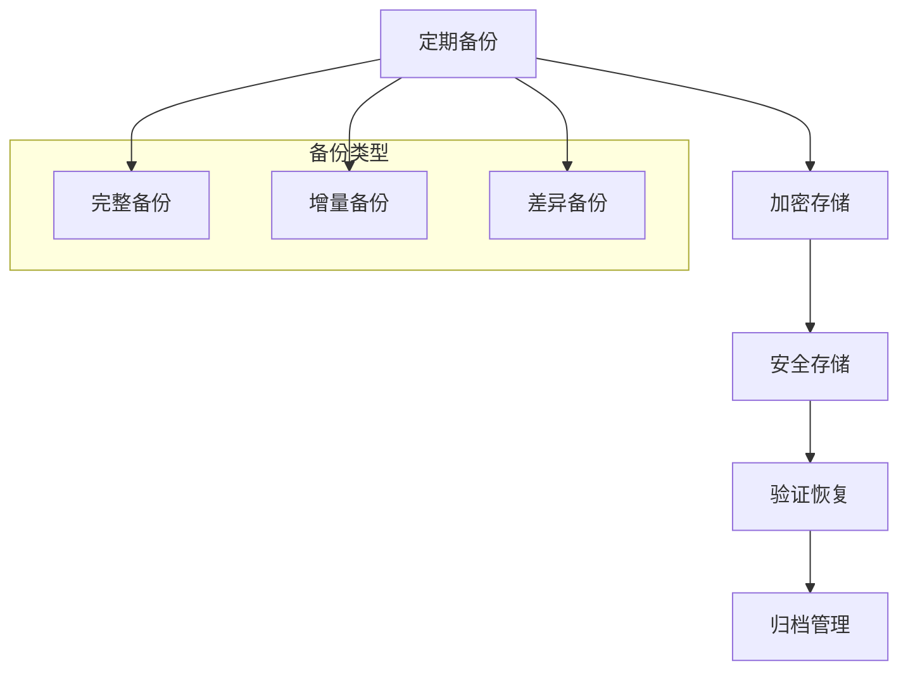

**章节来源**
- [doc.txt:95](file://doc.txt#L95)

## 兼容性测试

### 测试矩阵设计

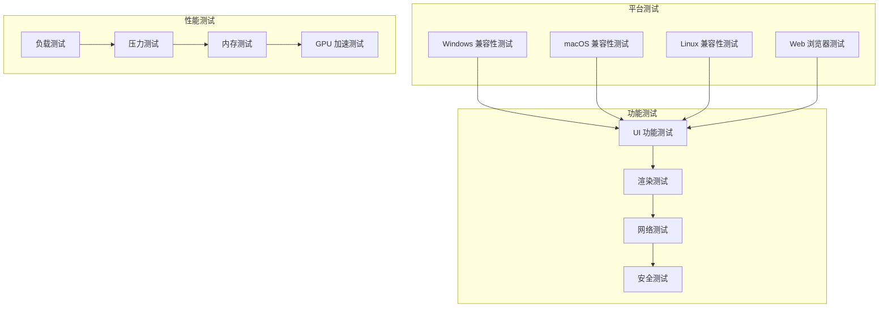

**图表来源**
- [doc.txt:95](file://doc.txt#L95)

### 自动化测试流程

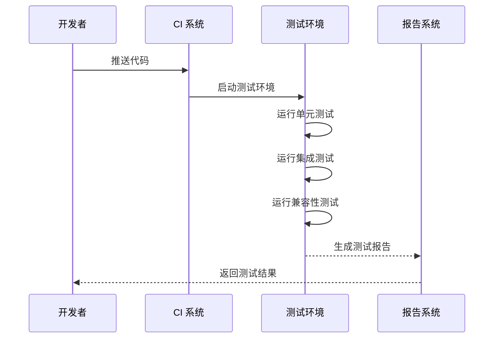

**图表来源**
- [doc.txt:95](file://doc.txt#L95)

### 测试数据管理

- **测试环境隔离**：独立的测试数据库
- **数据清理**：每次测试后清理数据
- **测试数据生成**：自动生成测试数据
- **回归测试**：历史问题的回归验证

**章节来源**
- [doc.txt:95](file://doc.txt#L95)

## 自动化构建流程

### CI/CD 管道设计

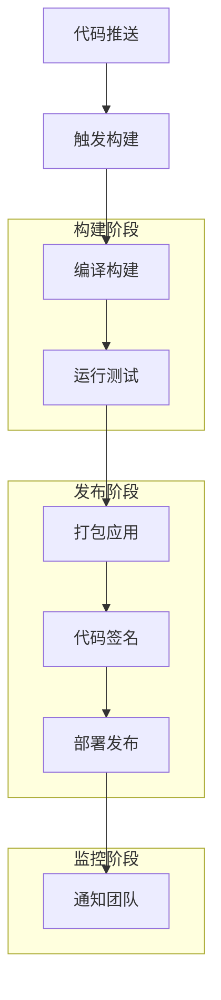

**图表来源**
- [doc.txt:95](file://doc.txt#L95)

### 多平台并行构建

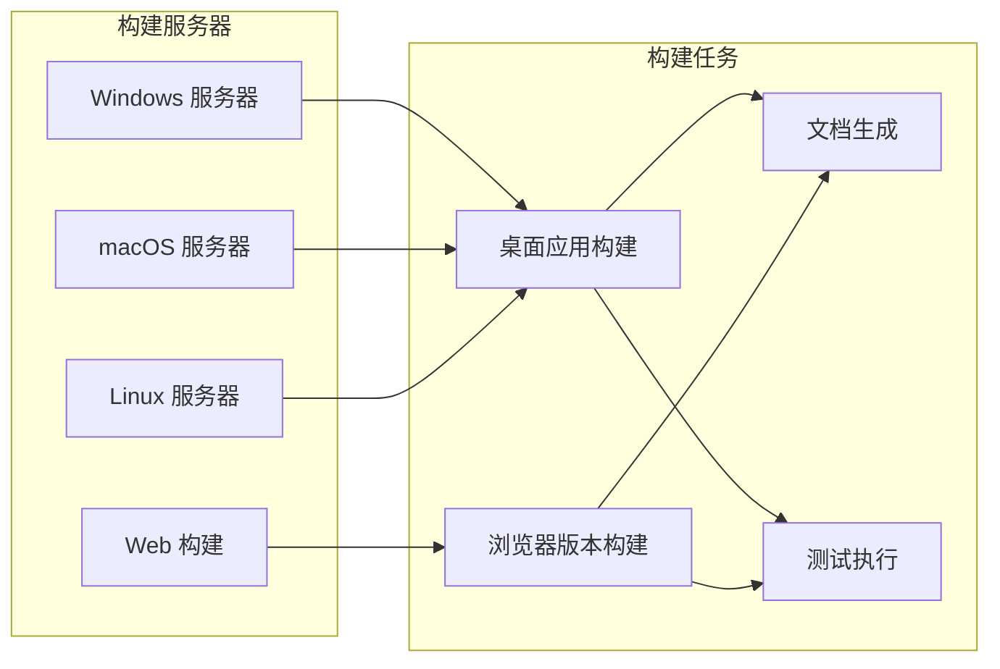

### 构建优化策略

- **缓存机制**：依赖项缓存
- **并行构建**：多任务并行执行
- **增量构建**：只构建变更部分
- **资源复用**：构建资源共享

**章节来源**
- [doc.txt:95](file://doc.txt#L95)

## 故障排除指南

### 常见构建问题

```mermaid
flowchart TD
Error[构建错误] --> Identify[识别问题类型]
Identify --> Solution[查找解决方案]
Solution --> Apply[应用修复]
Apply --> Verify[验证修复]
Verify --> Success{修复成功?}
Success --> |是| Done[完成]
Success --> |否| Debug[深入调试]
Debug --> Error
subgraph "问题类型"
Tool[工具链问题]
Dep[依赖问题]
Platform[平台特定问题]
Config[配置问题]
end
Error --> Tool
Error --> Dep
Error --> Platform
Error --> Config
```

### 调试工具和技巧

- **日志分析**：详细的构建日志
- **依赖图**：构建依赖关系
- **性能分析**：构建时间分析
- **内存监控**：构建过程内存使用

### 错误恢复策略

```mermaid
flowchart TD
Fail[构建失败] --> Log[记录错误]
Log --> Analyze[分析原因]
Analyze --> Fix[制定修复方案]
Fix --> Retry[重试构建]
Retry --> Success{成功?}
Success --> |是| Complete[完成]
Success --> |否| Manual[手动干预]
Manual --> Complete
```

**章节来源**
- [doc.txt:95](file://doc.txt#L95)

## 总结

Leivue Runtime 的跨端打包流程是一个复杂但高度优化的系统，它结合了现代构建技术和传统的跨平台开发最佳实践。通过采用统一的内核架构和多平台适配策略，该系统能够为开发者提供一致的开发体验，同时确保最终产品的性能和可靠性。

### 关键成功因素

1. **架构设计**：清晰的分层架构确保了良好的可维护性
2. **工具链整合**：现代化的构建工具链提高了开发效率
3. **自动化程度**：完善的 CI/CD 流程减少了人工干预
4. **质量保证**：全面的测试策略确保了产品质量
5. **安全性考虑**：代码签名和安全措施保护了用户

### 未来发展方向

- **容器化部署**：支持 Docker 和 Kubernetes
- **云原生支持**：云平台的原生集成
- **AI 辅助开发**：智能代码生成和优化
- **边缘计算**：支持边缘设备部署

通过遵循本文档提供的指导原则和最佳实践，开发团队可以建立一个高效、可靠且易于维护的跨端打包系统，为 Leivue Runtime 项目的长期发展奠定坚实基础。