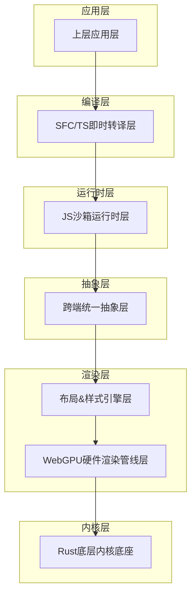
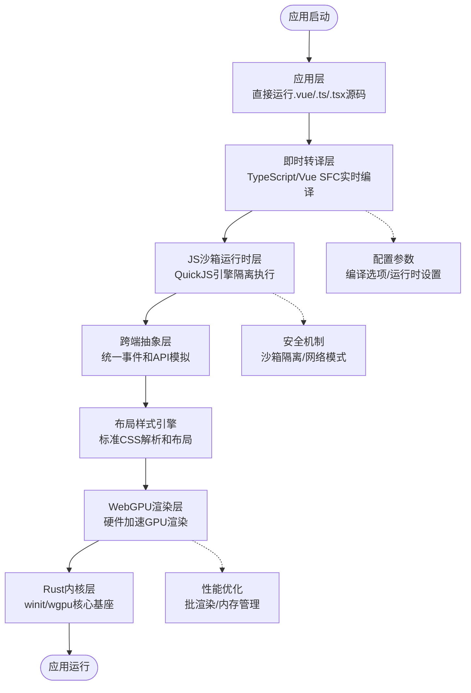
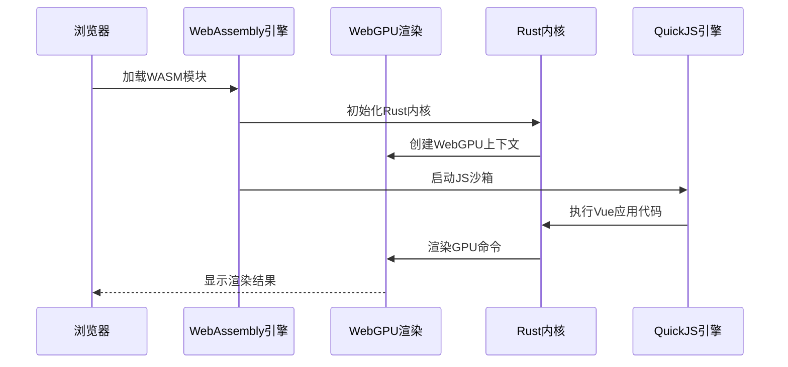
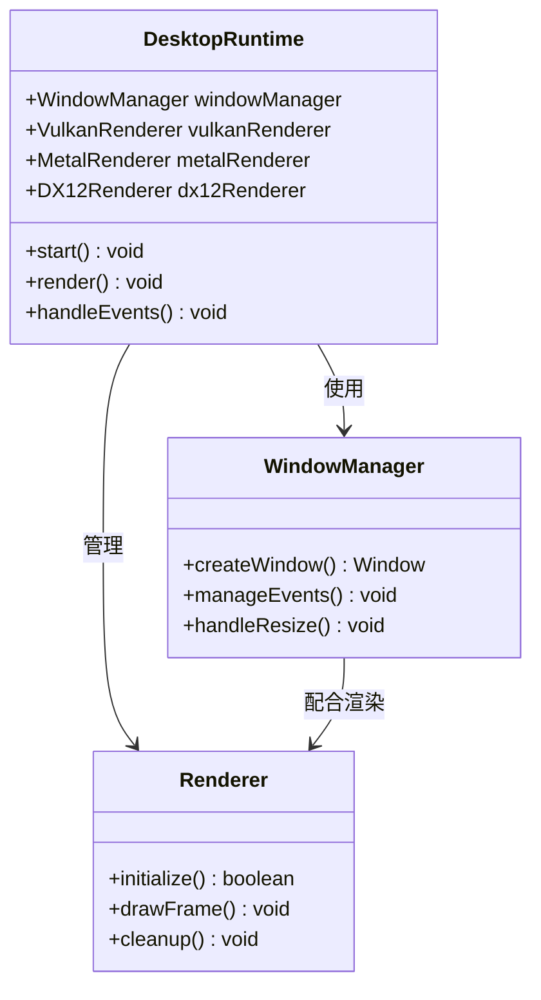

# 运行模式配置

<cite>
**本文档引用的文件**
- [doc.txt](file://doc.txt)
- [todo.txt](file://todo.txt)
</cite>

## 目录
1. [简介](#简介)
2. [项目结构](#项目结构)
3. [核心组件](#核心组件)
4. [架构概览](#架构概览)
5. [详细组件分析](#详细组件分析)
6. [运行模式对比分析](#运行模式对比分析)
7. [配置参数详解](#配置参数详解)
8. [部署要求](#部署要求)
9. [性能优化](#性能优化)
10. [最佳实践](#最佳实践)
11. [故障排除指南](#故障排除指南)
12. [结论](#结论)

## 简介

Leivue Runtime是一个革命性的前端运行时引擎，采用Rust+WebGPU技术栈，实现了完全脱离传统前端工程化的无构建运行模式。该项目的核心目标是为Vue生态系统提供高性能的跨端运行底座，支持浏览器WASM模式和独立桌面原生模式的双端统一内核。

该引擎通过七层分层架构实现了技术解耦，提供了从底层内核到底层应用的完整技术栈，支持零编译直接运行Vue3 + TypeScript，完全兼容Element Plus、Ant Design Vue等第三方UI库。

## 项目结构

基于现有文档信息，项目采用模块化的七层分层架构：

**图表来源**
- [doc.txt:7-22](file://doc.txt#L7-L22)

**章节来源**
- [doc.txt:7-22](file://doc.txt#L7-L22)

## 核心组件

### 底层内核底座（Rust核心基座）
- **语言特性**：纯Rust编写，无GC、内存安全、高性能
- **基础能力**：跨端窗口管理、异步调度、内存池、文件IO、原生网络栈、缓存系统
- **核心依赖**：wgpu、winit、tokio、reqwest

### WebGPU硬件渲染层
- **技术特点**：完全抛弃浏览器DOM渲染流水线，全自研GPU渲染
- **统一接口**：基于标准WebGPU规范，统一桌面/浏览器渲染接口
- **核心能力**：批渲染、矢量绘制、圆角/阴影/渐变、纹理图集、字体渲染、图层合成

### 布局&样式引擎层
- **CSS体系**：复刻标准浏览器CSS体系，对标Chromium基础能力
- **HTML解析**：html5ever工业级解析，生成标准DOM节点树
- **布局系统**：自研盒模型、Flex、流式布局，对标W3C标准

### 跨端统一抽象层
- **事件系统**：统一鼠标、键盘、滚动、点击命中检测
- **BOM/DOM模拟**：轻量实现window/document/Event
- **兼容性**：无缝兼容Element Plus等UI库所需的浏览器环境API

**章节来源**
- [doc.txt:23-45](file://doc.txt#L23-L45)

## 架构概览

Leivue Runtime采用七层分层架构，每层都有明确的职责分工和技术实现：

**图表来源**
- [doc.txt:7-22](file://doc.txt#L7-L22)

**章节来源**
- [doc.txt:7-22](file://doc.txt#L7-L22)

## 详细组件分析

### 浏览器WASM模式实现

浏览器WASM模式是通过将Rust内核编译为WebAssembly，并结合WebGPU API实现的完整运行环境：

**图表来源**
- [doc.txt:27-28](file://doc.txt#L27-L28)

### 桌面原生模式实现

桌面原生模式通过winit原生窗口管理和Vulkan/Metal/DX12图形后端实现：

**图表来源**
- [doc.txt:26-28](file://doc.txt#L26-L28)

**章节来源**
- [doc.txt:26-28](file://doc.txt#L26-L28)

## 运行模式对比分析

### 技术实现差异

| 特性 | 浏览器WASM模式 | 桌面原生模式 |
|------|----------------|--------------|
| **运行环境** | WebAssembly + WebGPU | 原生操作系统 + Vulkan/Metal/DX12 |
| **窗口管理** | Web API窗口 | winit原生窗口 |
| **渲染后端** | WebGPU | Vulkan/Metal/DX12 |
| **网络栈** | 浏览器同源策略 | 原生网络栈 |
| **文件系统** | 浏览器沙箱限制 | 原生文件系统访问 |
| **内存管理** | JavaScript垃圾回收 | Rust所有权模型 |
| **启动速度** | 需要WASM加载时间 | 直接原生启动 |
| **包体积** | MB级WASM包 | MB级原生二进制 |

### 适用场景分析

**浏览器WASM模式适用场景：**
- 在线Web应用部署
- 需要跨浏览器兼容的应用
- 无需本地文件访问的场景
- 云原生应用架构

**桌面原生模式适用场景：**
- 需要本地文件系统访问的应用
- 高性能计算密集型应用
- 需要原生系统权限的应用
- 内网部署和离线运行场景

**章节来源**
- [doc.txt:76-82](file://doc.txt#L76-L82)

## 配置参数详解

### 核心运行时配置

#### 浏览器模式配置参数
- **WebGPU上下文参数**：设备选择、渲染格式、深度测试配置
- **WASM加载参数**：内存初始化大小、堆栈大小、线程数
- **渲染参数**：帧率控制、抗锯齿设置、多采样配置
- **网络参数**：CORS策略、代理设置、超时配置

#### 桌面模式配置参数
- **窗口参数**：初始尺寸、最小/最大尺寸、是否可调整
- **渲染参数**：图形后端选择、垂直同步、多重采样
- **文件系统参数**：工作目录、缓存路径、权限设置
- **网络参数**：本地网络访问、防火墙规则、代理配置

### 性能相关配置

#### 内存管理配置
- **内存池大小**：根据应用复杂度调整
- **垃圾回收策略**：浏览器模式下的内存回收时机
- **缓存策略**：样式、字体、纹理的缓存大小

#### 渲染性能配置
- **批处理大小**：GPU命令批处理数量
- **LOD设置**：细节层次渲染参数
- **视锥剔除**：3D场景的视锥裁剪设置

**章节来源**
- [doc.txt:24-34](file://doc.txt#L24-L34)

## 部署要求

### 环境准备

#### 浏览器模式部署要求
- **浏览器支持**：现代浏览器（Chrome 113+、Firefox 113+、Safari 16.4+）
- **WebGPU支持**：启用WebGPU实验性功能
- **网络要求**：HTTPS环境（WebGPU在HTTP环境下受限）
- **存储要求**：浏览器缓存空间用于资源缓存

#### 桌面模式部署要求
- **操作系统支持**：Windows 10+/macOS 10.15+/Linux
- **图形驱动**：支持Vulkan/Metal/DX12的显卡驱动
- **运行时依赖**：系统级图形库和网络栈
- **权限要求**：文件系统访问权限、网络访问权限

### 依赖安装

#### Rust工具链安装
- **Rust版本**：1.70+（推荐最新稳定版）
- **目标配置**：wasm32-unknown-unknown（浏览器模式）
- **构建工具**：cargo、rustup、clippy
- **调试工具**：lldb/gdb、valgrind

#### 开发工具配置
- **IDE支持**：VS Code + Rust插件
- **调试工具**：WebGPU调试工具、性能分析器
- **测试框架**：集成测试、单元测试框架

**章节来源**
- [doc.txt:29](file://doc.txt#L29)

## 性能优化

### 渲染性能优化

#### WebGPU优化策略
- **命令缓冲区**：合理使用命令缓冲区减少GPU同步开销
- **纹理管理**：纹理图集合并减少状态切换
- **批处理优化**：合并相似绘制调用提高GPU效率
- **内存对齐**：遵循WebGPU内存对齐要求

#### 内存优化策略
- **对象池**：重用渲染对象减少分配开销
- **懒加载**：按需加载资源避免内存峰值
- **压缩算法**：使用高效的纹理和几何数据压缩

### 运行时性能优化

#### JavaScript沙箱优化
- **模块缓存**：缓存已编译的ES模块
- **字节码缓存**：QuickJS字节码缓存机制
- **垃圾回收调优**：根据应用特点调整GC策略

#### 编译性能优化
- **增量编译**：只重新编译变更的模块
- **并行编译**：利用多核CPU进行并行编译
- **缓存机制**：编译结果缓存避免重复编译

## 最佳实践

### 模式切换最佳实践

#### 切换决策因素
- **功能需求**：是否需要本地文件系统访问
- **性能要求**：对渲染性能的具体要求
- **部署环境**：目标用户的使用环境
- **维护成本**：不同模式的维护复杂度

#### 迁移策略
- **渐进式迁移**：先在浏览器模式验证功能
- **配置分离**：使用不同的配置文件管理两套配置
- **测试覆盖**：确保两套模式下的功能一致性
- **监控指标**：建立跨模式的性能监控体系

### 适用场景分析

#### 推荐使用浏览器模式的场景
- 在线教育平台
- 数据可视化应用
- 在线协作工具
- 跨平台Web应用

#### 推荐使用桌面模式的场景
- 桌面办公软件
- 游戏应用
- 图形设计工具
- 数据分析软件

## 故障排除指南

### 常见问题及解决方案

#### WebGPU相关问题
- **设备丢失**：检查图形驱动更新，重启浏览器
- **渲染异常**：验证WebGPU支持情况，检查着色器编译
- **性能问题**：优化批处理大小，减少状态切换

#### 桌面模式问题
- **窗口显示问题**：检查图形驱动兼容性
- **文件访问失败**：验证权限设置和路径配置
- **崩溃问题**：启用调试日志，检查内存泄漏

#### 跨端兼容性问题
- **API差异**：使用跨端抽象层提供的统一API
- **性能差异**：针对不同平台进行性能调优
- **行为差异**：测试不同平台下的用户交互

### 调试技巧

#### 日志记录
- **详细日志**：启用详细的运行时日志
- **性能日志**：记录关键性能指标
- **错误追踪**：完整的错误堆栈信息

#### 性能分析
- **渲染性能**：使用WebGPU调试工具分析GPU使用
- **内存使用**：监控内存分配和释放
- **CPU使用**：分析主线程和工作线程的负载

**章节来源**
- [doc.txt:88-92](file://doc.txt#L88-L92)

## 结论

Leivue Runtime作为一个创新的前端运行时引擎，在技术架构和运行模式方面都展现了巨大的潜力。其双端统一内核的设计理念为前端工程化带来了新的可能性。

### 主要优势
- **技术先进性**：采用Rust+WebGPU的前沿技术组合
- **性能卓越**：硬件加速渲染和零编译运行
- **生态兼容**：完全兼容Vue生态系统
- **部署灵活**：支持多种部署方式和运行环境

### 发展前景
随着WebGPU技术的普及和Rust生态的成熟，Leivue Runtime有望成为下一代前端应用的重要运行时选择。其设计理念和实现方案为整个前端行业的发展提供了新的思路和方向。

对于开发者而言，理解不同运行模式的特点和适用场景，合理选择和配置运行环境，是成功使用该引擎的关键。建议在项目初期就明确运行模式的选择，并建立完善的测试和监控体系。