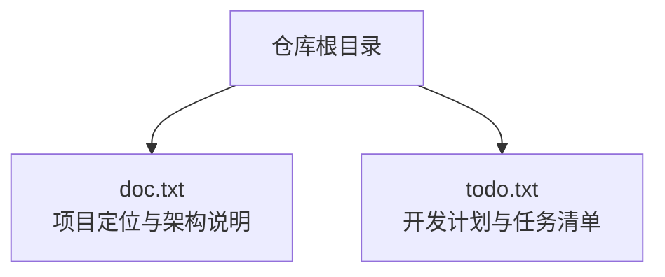
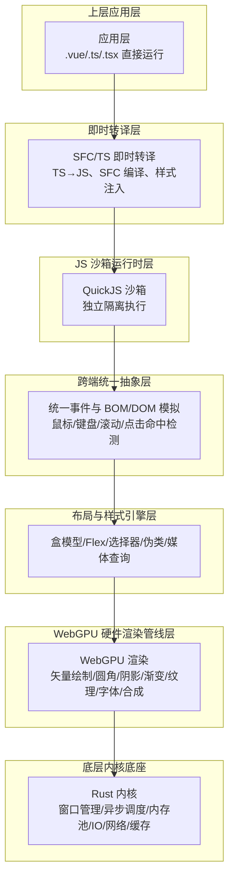
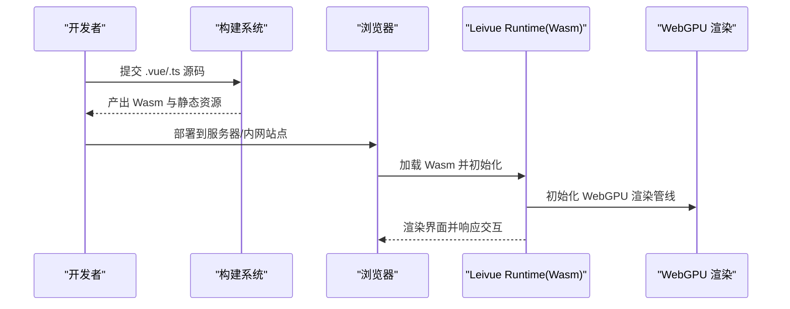
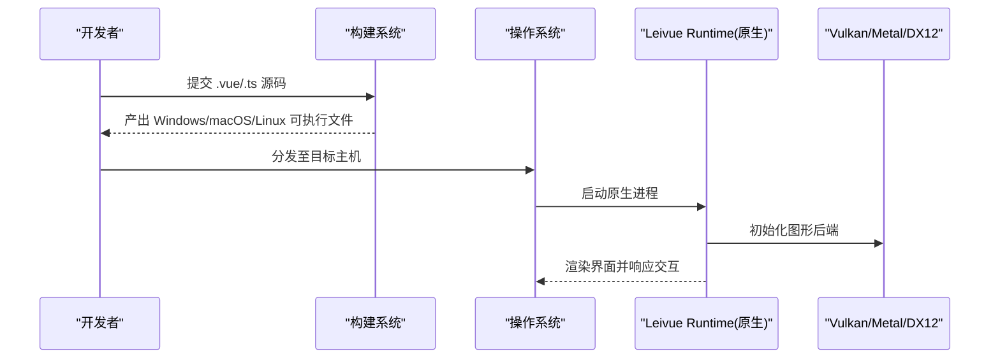
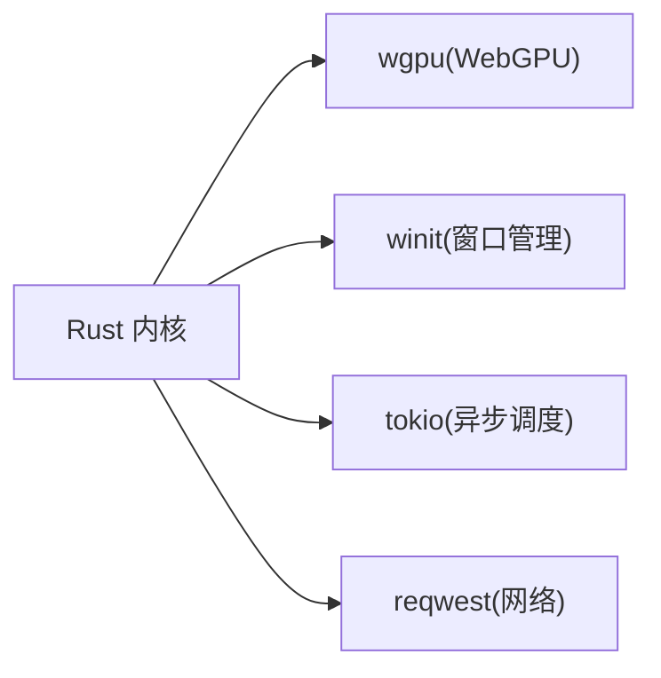

# 部署与配置

<cite>
**本文引用的文件**
- [doc.txt](file://doc.txt)
- [todo.txt](file://todo.txt)
</cite>

## 目录
1. [简介](#简介)
2. [项目结构](#项目结构)
3. [核心组件](#核心组件)
4. [架构总览](#架构总览)
5. [详细组件分析](#详细组件分析)
6. [部署与运行模式](#部署与运行模式)
7. [生产环境配置最佳实践](#生产环境配置最佳实践)
8. [跨端打包与分发](#跨端打包与分发)
9. [依赖关系分析](#依赖关系分析)
10. [性能考量](#性能考量)
11. [故障排查指南](#故障排查指南)
12. [结论](#结论)

## 简介
本指南围绕 Leivue Runtime 的部署与配置展开，目标是帮助用户在不同运行模式（浏览器 Wasm 模式、桌面原生模式）下完成部署，并提供生产环境的性能调优、安全配置与监控建议；同时覆盖跨端打包（Windows/macOS/Linux）的流程与分发策略，并给出常见部署问题的排查思路与解决方案。  
本项目以 Rust 为核心，结合 WebGPU 硬件渲染与 QuickJS 沙箱运行时，实现“零编译、零打包”的 Vue3 + TypeScript 直接运行能力，支持浏览器与桌面原生双端运行。

## 项目结构
当前仓库包含两份文档性质的文本文件，分别用于描述项目定位与技术架构，以及开发计划与任务清单。  
- doc.txt：项目定位、技术架构、核心能力与运行模式说明
- todo.txt：开发计划与阶段性任务

**图表来源**
- [doc.txt:1-97](file://doc.txt#L1-L97)
- [todo.txt:1-5](file://todo.txt#L1-L5)

**章节来源**
- [doc.txt:1-97](file://doc.txt#L1-L97)
- [todo.txt:1-5](file://todo.txt#L1-L5)

## 核心组件
根据文档描述，Leivue Runtime 采用七层分层架构，从底层内核到底层渲染，逐层向上提供运行支撑。核心组件包括：
- 底层内核底座（Rust 核心基座，跨端窗口管理、异步调度、内存池、文件 IO、原生网络栈、缓存系统）
- WebGPU 硬件渲染管线层（替代 DOM 渲染，统一桌面/浏览器渲染接口）
- 布局与样式引擎层（复刻浏览器 CSS 体系，支持 Flex、选择器、伪类、媒体查询等）
- 跨端统一抽象层（统一事件系统与轻量 BOM/DOM 模拟 API）
- JS 沙箱运行时层（QuickJS 引擎，独立隔离执行环境）
- 即时转译层（SFC/TS 即时编译，零编译、零打包）
- 上层应用层（直接运行 .vue/.ts/.tsx，兼容 Element Plus/Ant Design Vue 等）

上述组件共同构成“零编译、零打包、零依赖”的运行底座，支持浏览器与桌面原生双端运行。

**章节来源**
- [doc.txt:23-64](file://doc.txt#L23-L64)

## 架构总览
下图展示 Leivue Runtime 的七层架构与运行模式概览：

**图表来源**
- [doc.txt:10-22](file://doc.txt#L10-L22)
- [doc.txt:23-64](file://doc.txt#L23-L64)

## 详细组件分析
### 底层内核底座（Rust 核心基座）
- 能力范围：跨端窗口管理、异步调度、内存池、文件 IO、原生网络栈、缓存系统
- 跨端适配：桌面端使用 winit + Vulkan/Metal/DX12；浏览器端通过 Wasm + WebGPU 绑定
- 核心依赖：wgpu、winit、tokio、reqwest

该层为整个运行时提供稳定、高性能的基础设施，确保在不同平台上的行为一致与资源可控。

**章节来源**
- [doc.txt:23-29](file://doc.txt#L23-L29)

### WebGPU 硬件渲染管线层
- 设计理念：完全替代 DOM 渲染流水线，统一桌面与浏览器渲染接口
- 能力：批渲染、矢量绘制、圆角/阴影/渐变、纹理图集、字体渲染、图层合成
- 优势：稳定 60fps、大列表/复杂组件无卡顿、CPU 开销极低

该层是性能与体验的关键，适合高密度渲染场景与长列表应用。

**章节来源**
- [doc.txt:30-34](file://doc.txt#L30-L34)

### 布局与样式引擎层
- 能力：复刻浏览器 CSS 体系，支持 HTML 解析、CSS 解析与选择器匹配、盒模型/Flex/流式布局、全局/Scoped 样式注入
- 目标：对标 Chromium 基础能力，满足现代前端样式需求

该层保证与主流 UI 库（Element Plus/Ant Design Vue 等）的样式兼容性。

**章节来源**
- [doc.txt:35-40](file://doc.txt#L35-L40)

### 跨端统一抽象层
- 能力：统一事件系统（鼠标/键盘/滚动/点击命中检测）、轻量 BOM/DOM 模拟 API（window/document/Event）
- 目标：无缝兼容 UI 库所需的浏览器环境 API，且无真实 DOM，实际绘制全部走 WebGPU

该层屏蔽双端差异，降低迁移成本。

**章节来源**
- [doc.txt:41-45](file://doc.txt#L41-L45)

### JS 沙箱运行时层（QuickJS）
- 能力：独立隔离执行环境、内置 Vue3 运行时、自研 ESM 解析器（支持 import/export、第三方包引入）
- 特性：与宿主环境完全隔离，安全隔离脚本

该层保障运行时的安全性与稳定性。

**章节来源**
- [doc.txt:46-51](file://doc.txt#L46-L51)

### 即时转译层（零编译）
- 能力：TypeScript 即时转译、Vue SFC 即时编译（template/script-setup/style）、无构建打包
- 目标：源码直接运行、毫秒级热更新、零配置、零依赖安装

该层是“零工程化”的关键，显著提升开发效率与部署灵活性。

**章节来源**
- [doc.txt:52-64](file://doc.txt#L52-L64)

### 上层应用层
- 能力：直接运行 .vue/.ts/.tsx 原始源码，兼容 Element Plus/Ant Design Vue、第三方插件与指令
- 目标：现有 Vue 项目低成本迁移，几乎无需改业务代码

**章节来源**
- [doc.txt:65-75](file://doc.txt#L65-L75)

## 部署与运行模式
### 浏览器 Wasm 模式
- 运行形态：将内核编译为 Wasm，嵌入任意现代浏览器，基于 WebGPU 运行
- 适用场景：在线应用、内网部署、无需 Electron/Tauri 的轻量运行
- 关键点：确保浏览器支持 WebGPU；在部署时提供 Wasm 产物与必要的静态资源

**图表来源**
- [doc.txt:27-28](file://doc.txt#L27-L28)
- [doc.txt:77-78](file://doc.txt#L77-L78)

### 桌面原生模式
- 运行形态：脱离浏览器，编译为独立 EXE/App/二进制，使用 winit + Vulkan/Metal/DX12
- 适用场景：本地工具、内网管理系统、对性能与资源占用敏感的应用
- 关键点：按平台生成原生可执行文件；确保目标机器具备相应图形驱动与 WebGPU 支持

**图表来源**
- [doc.txt:27-28](file://doc.txt#L27-L28)
- [doc.txt:79-82](file://doc.txt#L79-L82)

## 生产环境配置最佳实践
- 性能调优
  - 使用 WebGPU 渲染管线，优先启用批渲染与图层合成，减少 CPU 开销
  - 对长列表与复杂组件，合理拆分与懒加载，避免一次性渲染大量节点
  - 利用内置缓存系统，将核心 UI 库与运行时资源预置，提升冷启动速度
- 安全配置
  - 保持 JS 沙箱隔离，严格控制外部模块引入与网络访问
  - 在内网/私有化部署中，启用离线运行能力，减少对外部网络的依赖
  - 如需源码保护，可启用源码加密运行，降低泄露风险
- 监控设置
  - 结合底层内核的异步调度与内存池，建立资源使用监控（内存、GPU、帧率）
  - 在浏览器模式下，关注 WebGPU 资源初始化与渲染耗时；在桌面模式下，关注窗口管理与图形后端状态
  - 建议记录运行日志与错误堆栈，便于快速定位问题

**章节来源**
- [doc.txt:88-97](file://doc.txt#L88-L97)

## 跨端打包与分发
- 打包目标：Windows/macOS/Linux 多平台分发
- 打包策略
  - 浏览器模式：输出 Wasm 与静态资源，部署于 Web 服务器或内网站点
  - 桌面原生模式：针对各平台生成独立可执行文件（EXE/App/二进制），并提供安装包或便携版本
- 分发建议
  - 私有化/内网/涉密环境：优先采用离线运行与本地部署，减少对外网依赖
  - 低代码平台/内网管理系统：结合一键跨端打包能力，快速复制到多个目标环境
- 注意事项
  - 确保目标机器具备 WebGPU 支持（浏览器模式）或相应图形驱动（桌面模式）
  - 在分发前进行兼容性测试，覆盖不同分辨率、显卡驱动与浏览器版本

**章节来源**
- [doc.txt:95-97](file://doc.txt#L95-L97)

## 依赖关系分析
- 核心依赖：wgpu、winit、tokio、reqwest
- 依赖角色
  - wgpu：WebGPU 渲染管线
  - winit：跨端窗口管理
  - tokio：异步调度
  - reqwest：原生网络栈

**图表来源**
- [doc.txt:29](file://doc.txt#L29)

**章节来源**
- [doc.txt:29](file://doc.txt#L29)

## 性能考量
- 渲染性能
  - 采用 WebGPU 硬件加速，避免 DOM 渲染瓶颈；在复杂场景下优先使用矢量绘制与纹理图集
  - 控制渲染层级与合成次数，减少不必要的重绘
- 运行时性能
  - 利用内存池与异步调度，降低频繁分配与阻塞
  - 在桌面模式下，选择合适的图形后端（Vulkan/Metal/DX12），以获得更佳性能
- 热更新与开发体验
  - 即时转译与零编译特性，显著缩短热更新时间，提升迭代效率

[本节为通用性能建议，无需特定文件来源]

## 故障排查指南
- 浏览器模式常见问题
  - WebGPU 不可用：确认浏览器版本与驱动支持；检查是否启用了 WebGPU 实验性功能
  - 渲染异常：检查样式与布局引擎是否正确注入全局样式；验证字体与纹理资源加载
  - 网络请求失败：确认跨域策略与内网请求配置；必要时切换到自研网络栈
- 桌面原生模式常见问题
  - 启动崩溃：检查图形驱动与后端选择；确认目标平台的系统兼容性
  - 资源缺失：确保静态资源与缓存已随可执行文件正确打包
  - 权限不足：在需要本地文件/串口等权限时，确认应用权限配置
- 通用排查步骤
  - 查看运行日志与错误堆栈，定位问题发生阶段（即时转译/沙箱/渲染/内核）
  - 在开发模式下开启详细日志，逐步缩小问题范围
  - 对比不同平台/浏览器的行为差异，确认是否为平台特有问题

[本节为通用排查建议，无需特定文件来源]

## 结论
Leivue Runtime 通过七层分层架构与零编译能力，实现了在浏览器与桌面原生双端的高性能运行。结合 WebGPU 硬件渲染、QuickJS 沙箱与自研网络栈，项目在性能、安全与工程化方面具备显著优势。  
部署层面，建议优先采用离线运行与本地部署策略，配合跨端打包能力实现多平台分发；生产环境应重视性能调优、安全配置与监控设置，以获得稳定可靠的运行体验。