# 应用场景与目标用户

<cite>
**本文档中引用的文件**
- [doc.txt](file://doc.txt)
</cite>

## 目录
1. [引言](#引言)
2. [项目概述](#项目概述)
3. [核心优势分析](#核心优势分析)
4. [应用场景深度分析](#应用场景深度分析)
5. [目标用户群体分析](#目标用户群体分析)
6. [技术门槛与迁移成本评估](#技术门槛与迁移成本评估)
7. [与传统解决方案对比](#与传统解决方案对比)
8. [实施建议与最佳实践](#实施建议与最佳实践)
9. [风险评估与应对策略](#风险评估与应对策略)
10. [结论](#结论)

## 引言

Leivue Runtime是一个革命性的前端运行时引擎，采用Rust和WebGPU技术构建，旨在彻底改变前端应用的开发和部署方式。该项目的核心使命是"消灭前端工程化、突破浏览器沙箱限制、给Vue生态提供高性能跨端底座"，通过七层分层架构设计，实现了从底层内核到底层应用的完整技术栈重构。

## 项目概述

### 技术架构概览

Leivue Runtime采用了创新的七层分层架构，每一层都承担着特定的技术职责：

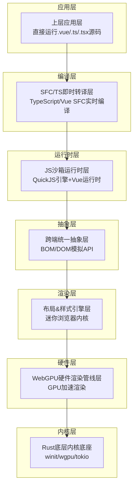

**图表来源**
- [doc.txt:7-22](file://doc.txt#L7-L22)

### 核心定位与使命

项目的核心定位是"一套完全脱离 Node / 浏览器 DOM / 编译打包、原生双端运行、零编译直接执行 Vue3 + TypeScript、全兼容 Element Plus/Ant Design Vue 等第三方 UI 库的硬件级渲染应用引擎"。这一定位体现了项目在技术架构上的根本性创新。

**章节来源**
- [doc.txt:3-6](file://doc.txt#L3-L6)

## 核心优势分析

### 零编译运行能力

Leivue Runtime最核心的技术优势在于其"零编译"能力，这体现在三个关键层面：

1. **TypeScript即时转译**：基于Rust swc实现内存内实时TS→JS转换，支持泛型、装饰器、TSX等高级特性
2. **Vue SFC即时编译**：使用官方Rust库解析.vue文件，自动拆分template/script-setup/style，Template实时编译为Vue渲染函数
3. **Script自动转译**：Script部分自动进行TS转译，Style自动解析并入全局样式系统

### 双端跨平台运行

项目实现了真正的双端统一运行：
- **浏览器模式**：编译为Wasm，嵌入任意现代浏览器，基于WebGPU运行
- **桌面原生模式**：脱离浏览器、脱离Electron/Tauri，编译为独立EXE/App/二进制

这种设计消除了传统前端开发中的"浏览器沙箱限制"，提供了更接近原生应用的运行体验。

**章节来源**
- [doc.txt:66-97](file://doc.txt#L66-L97)

## 应用场景深度分析

### Web应用场景

#### 技术需求分析

Web应用对Leivue Runtime的需求主要体现在以下几个方面：

1. **性能要求**：传统DOM渲染在复杂界面和大数据量场景下会出现卡顿，而WebGPU硬件加速渲染能够保证60fps稳定渲染
2. **开发效率**：零编译特性消除了传统Vite/Webpack构建流程，实现毫秒级热更新
3. **生态兼容**：需要完全兼容Element Plus、Ant Design Vue等主流UI库

#### 项目优势体现

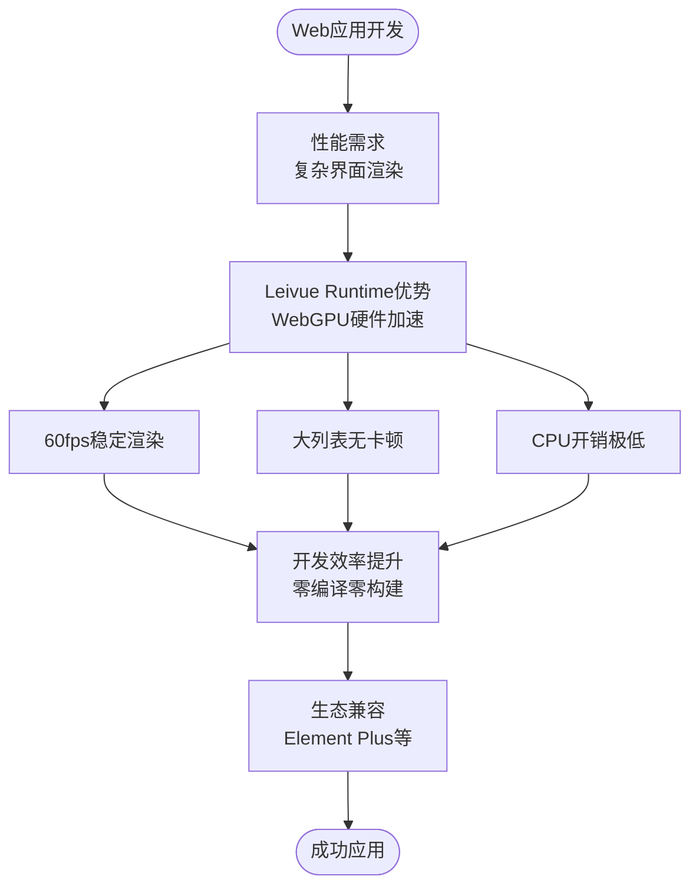

**图表来源**
- [doc.txt:30-41](file://doc.txt#L30-L41)
- [doc.txt:66-75](file://doc.txt#L66-L75)

### 桌面应用场景

#### 技术需求分析

桌面应用开发面临的主要挑战包括：

1. **原生功能访问**：需要访问本地文件系统、串口设备等原生能力
2. **性能优化**：相比Web应用，桌面应用对性能要求更高
3. **部署简化**：希望减少依赖，实现独立可执行文件

#### 项目优势体现

桌面应用场景下，Leivue Runtime的优势更加突出：

- **体积极小**：MB级体积，相比Electron等方案大幅减小
- **内存占用低**：优化的内存管理机制
- **启动极速**：直接运行，无需复杂的初始化过程
- **原生系统权限**：直接访问本地文件、串口等系统资源

**章节来源**
- [doc.txt:76-82](file://doc.txt#L76-L82)

### 内网管理系统场景

#### 技术需求分析

内网管理系统通常具有以下特点：

1. **安全性要求高**：需要严格的访问控制和数据保护
2. **离线运行能力**：在内网环境下可能无法访问外网
3. **定制化程度高**：需要根据具体业务场景进行深度定制

#### 项目优势体现

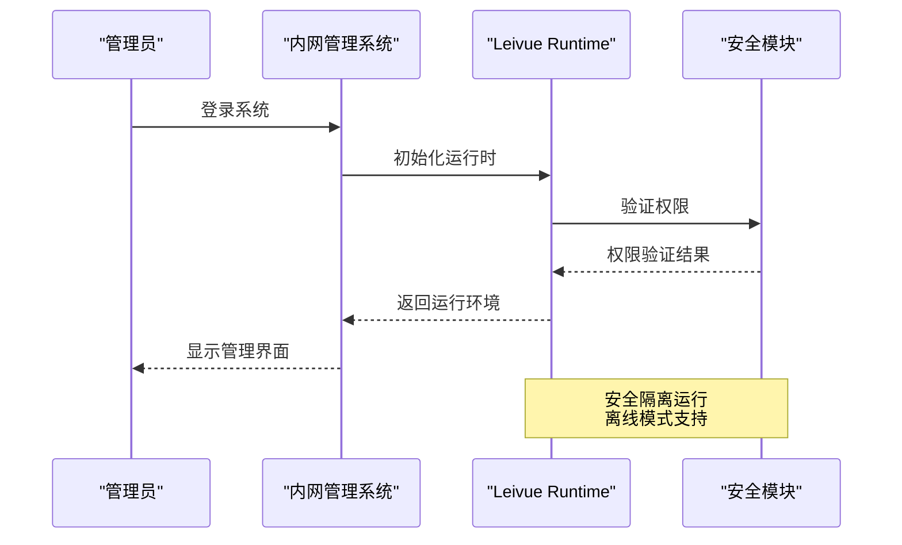

**图表来源**
- [doc.txt:88-92](file://doc.txt#L88-L92)

**章节来源**
- [doc.txt:96-97](file://doc.txt#L96-L97)

### 低代码平台场景

#### 技术需求分析

低代码平台对底层运行时的要求：

1. **快速部署**：需要快速响应用户配置变化
2. **模板化支持**：需要支持各种UI组件的动态组合
3. **扩展性**：需要支持插件机制和自定义组件

#### 项目优势体现

Leivue Runtime为低代码平台提供了理想的底层支撑：

- **零编译运行**：配置变更后立即生效，无需重新构建
- **Vue生态兼容**：可以直接使用现有的Vue组件库
- **双端统一**：一套代码可以同时支持Web和桌面端

**章节来源**
- [doc.txt:96](file://doc.txt#L96)

### 涉密环境应用场景

#### 技术需求分析

涉密环境应用的特殊要求：

1. **源码保护**：需要防止商业代码泄露
2. **内网部署**：完全不需要外网连接
3. **安全隔离**：需要严格的安全边界

#### 项目优势体现

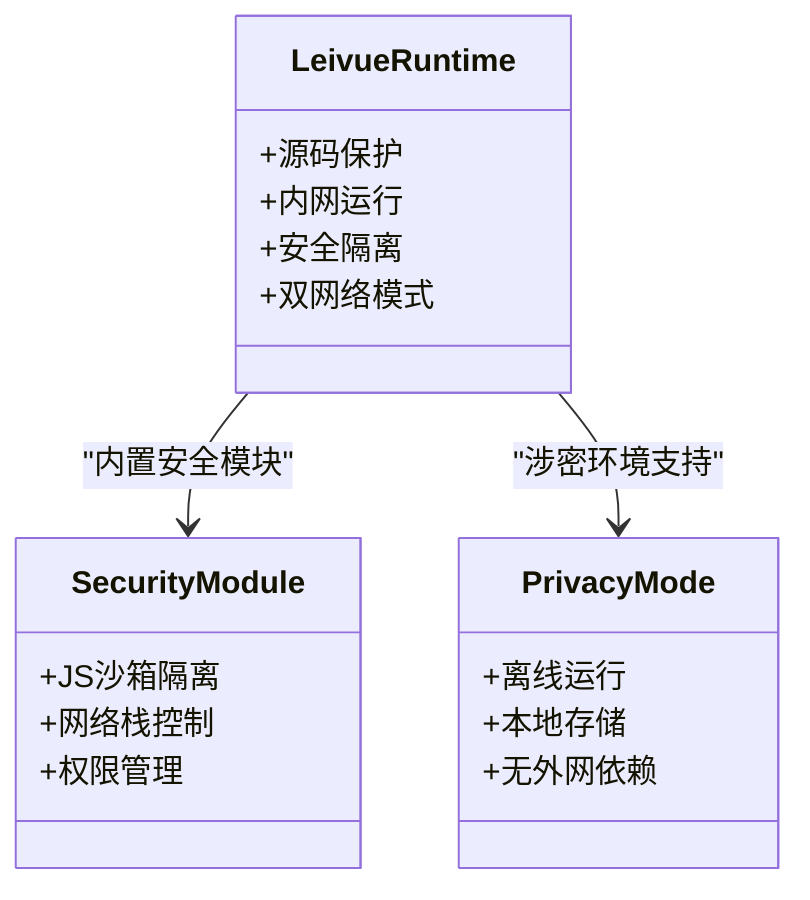

**图表来源**
- [doc.txt:88-92](file://doc.txt#L88-L92)

**章节来源**
- [doc.txt:96](file://doc.txt#L96)

### 移动Web应用场景

#### 技术需求分析

移动Web应用面临的挑战：

1. **性能优化**：移动端设备性能有限
2. **电池续航**：需要降低CPU使用率
3. **网络适应性**：需要适应不同的网络环境

#### 项目优势体现

虽然移动Web应用有其特殊性，但Leivue Runtime的优势同样适用：

- **GPU加速渲染**：有效降低CPU负载
- **WebGPU规范**：更好的移动端GPU支持
- **零编译热更新**：提升开发效率

**章节来源**
- [doc.txt:27-34](file://doc.txt#L27-L34)

## 目标用户群体分析

### 前端开发者

#### 用户画像特征

前端开发者是Leivue Runtime最直接的目标用户群体：

- **技术背景**：熟悉Vue3、TypeScript、现代前端开发流程
- **痛点问题**：厌倦复杂的构建工具链、追求更快的开发迭代速度
- **期望价值**：零配置开发、实时热更新、更好的性能表现

#### 使用场景

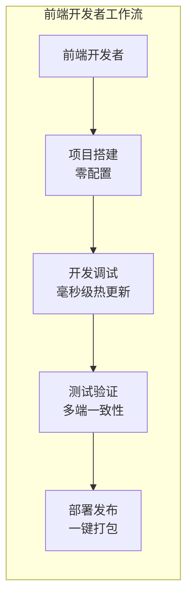

**图表来源**
- [doc.txt:66-71](file://doc.txt#L66-L71)

### 全栈工程师

#### 用户画像特征

全栈工程师的特点：

- **技术广度**：既懂前端也懂后端
- **系统思维**：关注整个应用的架构设计
- **性能敏感**：对应用性能有较高要求

#### 使用场景

全栈工程师可以利用Leivue Runtime构建：

- **前后端一体化应用**：前端和后端代码在同一运行时环境中
- **微服务架构**：每个服务都可以独立运行
- **Serverless应用**：无需服务器配置，直接部署

**章节来源**
- [doc.txt:66-75](file://doc.txt#L66-L75)

### 企业内网应用开发者

#### 用户画像特征

企业内网应用开发者专注于：

- **内部工具开发**：HR系统、财务系统、OA系统等
- **安全合规**：严格遵守企业安全规定
- **稳定性要求**：系统需要长期稳定运行

#### 使用场景

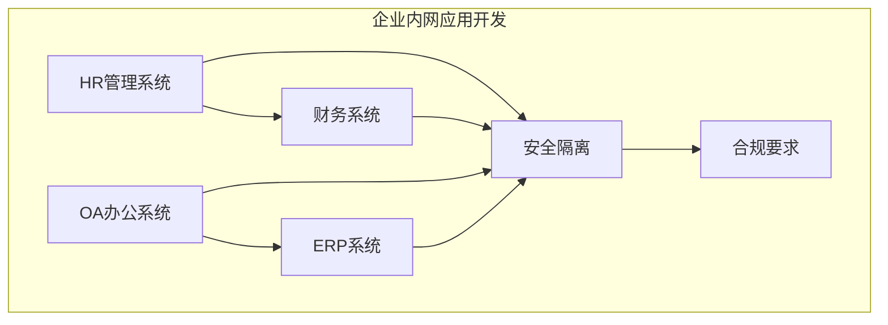

**图表来源**
- [doc.txt:88-92](file://doc.txt#L88-L92)

**章节来源**
- [doc.txt:96](file://doc.txt#L96)

### 低代码平台开发者

#### 用户画像特征

低代码平台开发者关注：

- **可视化配置**：拖拽式界面设计
- **组件生态**：丰富的可复用组件库
- **扩展能力**：支持自定义组件和插件

#### 使用场景

低代码平台可以基于Leivue Runtime实现：

- **组件库集成**：直接使用Element Plus等成熟组件库
- **模板系统**：快速生成各种业务应用模板
- **运行时优化**：确保生成应用的运行性能

**章节来源**
- [doc.txt:96](file://doc.txt#L96)

### 安全敏感行业应用开发者

#### 用户画像特征

安全敏感行业包括：

- **政府机构**：需要满足严格的网络安全要求
- **军工企业**：对信息安全有极高要求
- **金融行业**：需要符合金融监管要求

#### 使用场景

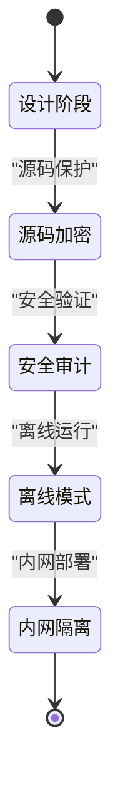

**图表来源**
- [doc.txt:88-92](file://doc.txt#L88-L92)

**章节来源**
- [doc.txt:96](file://doc.txt#L96)

## 技术门槛与迁移成本评估

### 技术门槛分析

#### 学习曲线评估

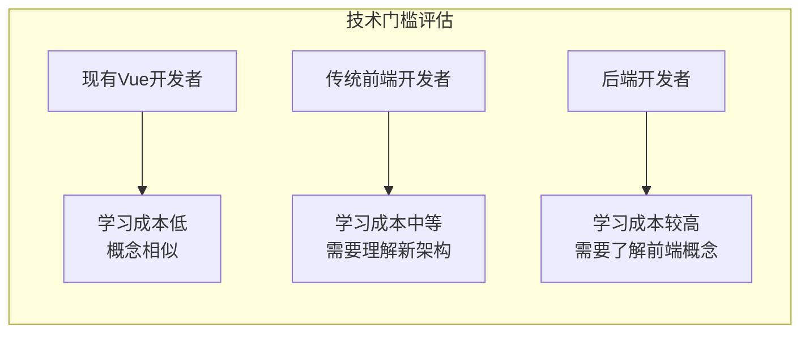

#### 主要技术挑战

1. **架构理解**：需要理解七层分层架构的设计理念
2. **运行时概念**：JS沙箱、WebGPU渲染等新概念
3. **双端开发**：需要考虑浏览器和桌面端的差异

### 迁移成本评估

#### 现有Vue项目迁移

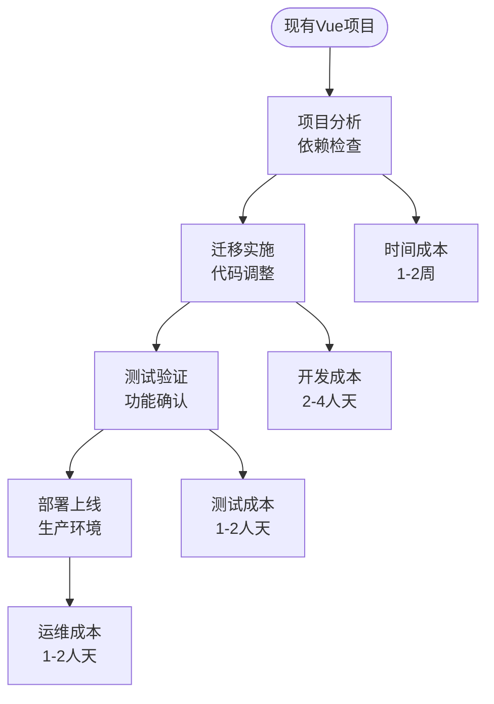

#### 成本构成分析

| 成本类型 | 估算范围 | 说明 |
|---------|---------|------|
| 时间成本 | 1-2周 | 包括学习、迁移、测试 |
| 开发成本 | 2-4人天 | 代码调整和配置修改 |
| 测试成本 | 1-2人天 | 功能验证和性能测试 |
| 运维成本 | 1-2人天 | 生产环境部署和监控 |

**章节来源**
- [doc.txt:94-95](file://doc.txt#L94-L95)

### 与传统方案对比

#### 开发效率对比

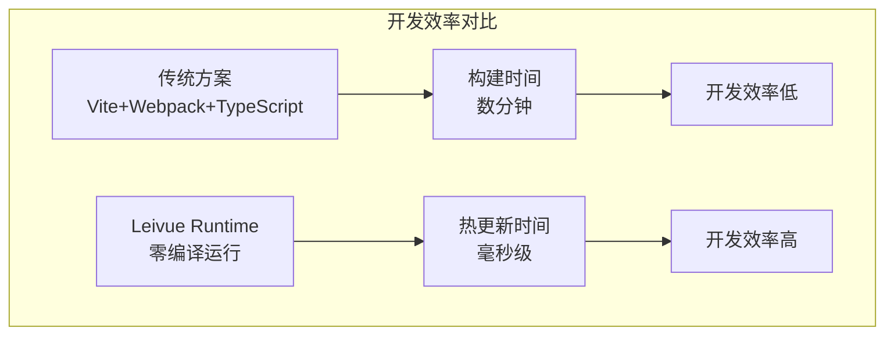

#### 性能表现对比

| 对比维度 | 传统方案 | Leivue Runtime | 优势 |
|---------|---------|---------------|------|
| 构建时间 | 数分钟 | 毫秒级 | 显著提升 |
| 启动速度 | 中等 | 极速 | 明显改善 |
| 运行性能 | 依赖DOM | GPU加速 | 大幅提升 |
| 内存占用 | 较高 | 低 | 改善明显 |

**章节来源**
- [doc.txt:66-87](file://doc.txt#L66-L87)

## 与传统解决方案对比

### 与Vite/webpack对比

#### 架构差异

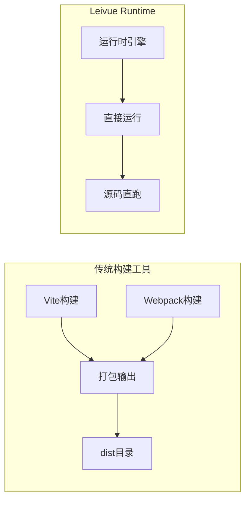

#### 技术优势对比

| 方面 | Vite/webpack | Leivue Runtime | 优势 |
|------|-------------|---------------|------|
| 构建时间 | 需要构建 | 直接运行 | Leivue Runtime |
| 依赖管理 | 复杂的package.json | 简化的依赖 | Leivue Runtime |
| 热更新 | 需要重新构建 | 毫秒级热更新 | Leivue Runtime |
| 性能表现 | 依赖浏览器DOM | GPU硬件加速 | Leivue Runtime |

### 与Electron对比

#### 应用差异

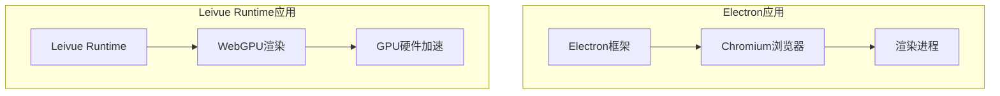

#### 优劣势分析

| 方面 | Electron | Leivue Runtime | 优势 |
|------|---------|---------------|------|
| 应用体积 | 几百MB | MB级 | Leivue Runtime |
| 内存占用 | 高 | 低 | Leivue Runtime |
| 启动速度 | 慢 | 极速 | Leivue Runtime |
| 原生功能 | 丰富 | 基础 | Electron |
| 生态兼容 | 广泛 | Vue生态 | Electron |

**章节来源**
- [doc.txt:76-82](file://doc.txt#L76-L82)

## 实施建议与最佳实践

### 项目迁移策略

#### 分阶段迁移

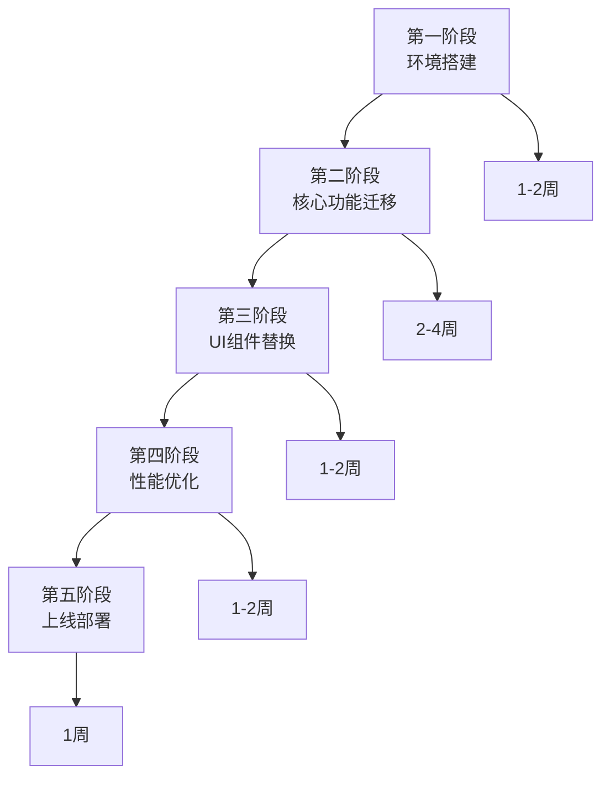

#### 最佳实践建议

1. **渐进式迁移**：不要一次性重写整个项目
2. **功能优先**：先迁移核心功能，再处理UI细节
3. **测试驱动**：建立完善的测试体系
4. **文档记录**：详细记录迁移过程和遇到的问题

### 性能优化建议

#### 渲染性能优化

- 利用WebGPU硬件加速特性
- 合理使用虚拟滚动处理大数据列表
- 优化CSS样式避免过度重绘

#### 内存管理优化

- 利用Rust的内存安全保障
- 及时清理不再使用的组件
- 避免内存泄漏

**章节来源**
- [doc.txt:30-41](file://doc.txt#L30-L41)

## 风险评估与应对策略

### 技术风险

#### 风险识别

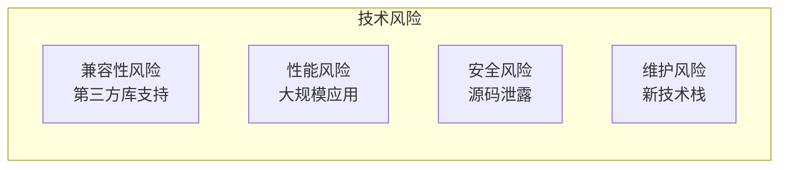

#### 应对策略

| 风险类型 | 风险等级 | 应对策略 |
|---------|---------|---------|
| 兼容性风险 | 中等 | 建立兼容性测试矩阵 |
| 性能风险 | 低 | 进行压力测试和性能基准测试 |
| 安全风险 | 高 | 启用源码保护和安全隔离 |
| 维护风险 | 中等 | 建立知识传承和文档体系 |

### 迁移风险

#### 风险评估

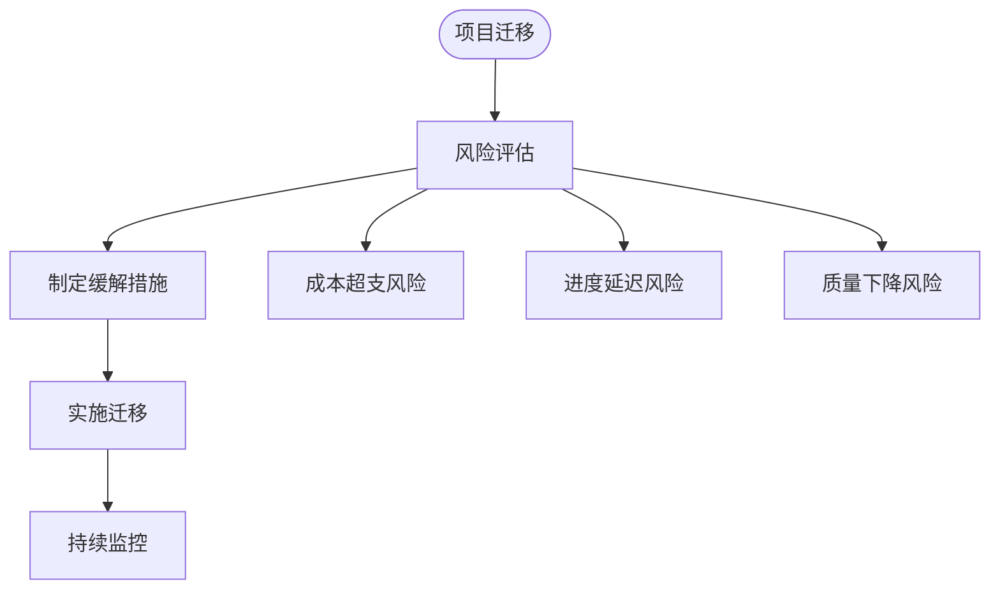

#### 风险缓解措施

1. **成本控制**：制定详细的预算计划和成本监控机制
2. **进度管理**：建立里程碑和阶段性交付
3. **质量保证**：建立多层次的质量检查体系

## 结论

Leivue Runtime作为一个革命性的前端运行时引擎，为现代应用开发提供了全新的技术路径。通过七层分层架构设计，它成功地解决了传统前端开发中的诸多痛点问题。

### 核心价值总结

1. **开发效率提升**：零编译、零配置、毫秒级热更新
2. **性能表现优化**：WebGPU硬件加速、GPU渲染管线
3. **部署简化**：双端统一、独立可执行文件
4. **安全增强**：JS沙箱隔离、源码保护

### 适用场景总结

Leivue Runtime最适合以下场景：
- 需要高性能渲染的Web应用
- 对开发效率有高要求的团队
- 需要跨端部署的企业应用
- 注重安全性和隐私保护的涉密系统

### 发展前景

随着WebGPU技术的不断发展和前端应用复杂度的持续提升，Leivue Runtime代表了前端技术发展的新方向。它不仅解决了当前前端开发的痛点，更为未来的应用开发奠定了坚实的技术基础。

对于正在寻找现代化前端解决方案的团队和个人开发者来说，Leivue Runtime无疑是一个值得深入研究和采用的优秀技术选择。