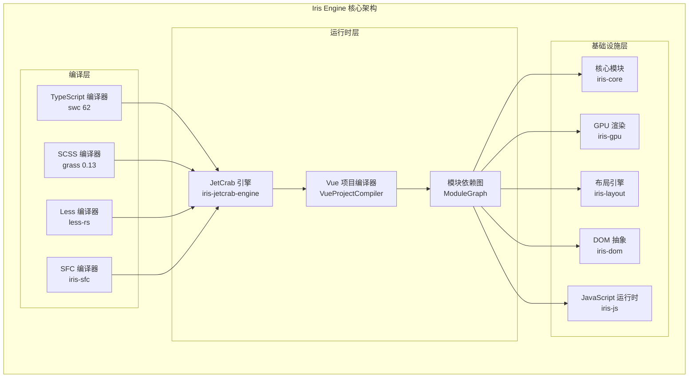
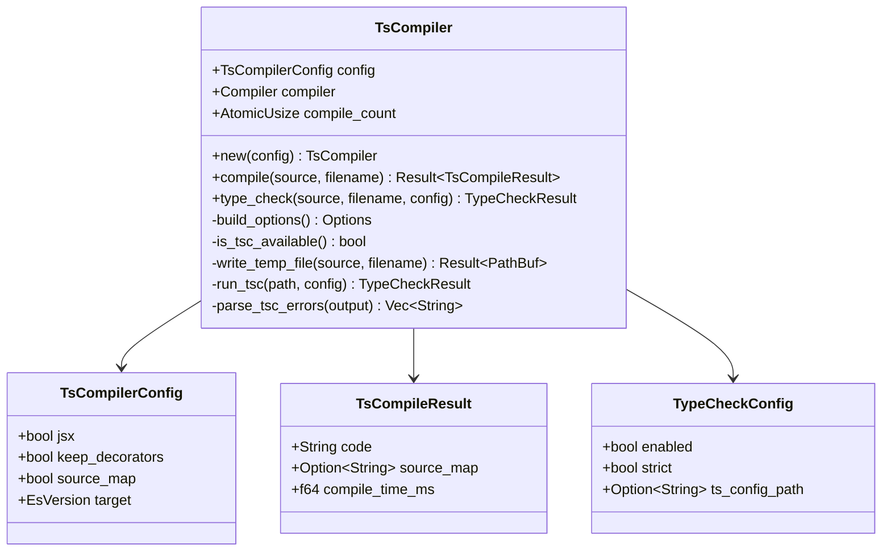
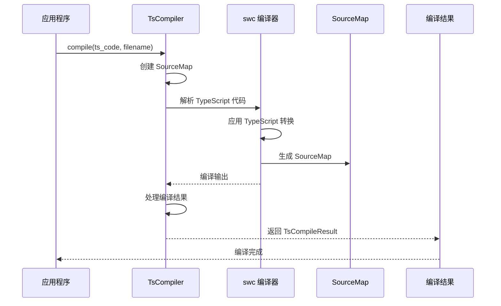
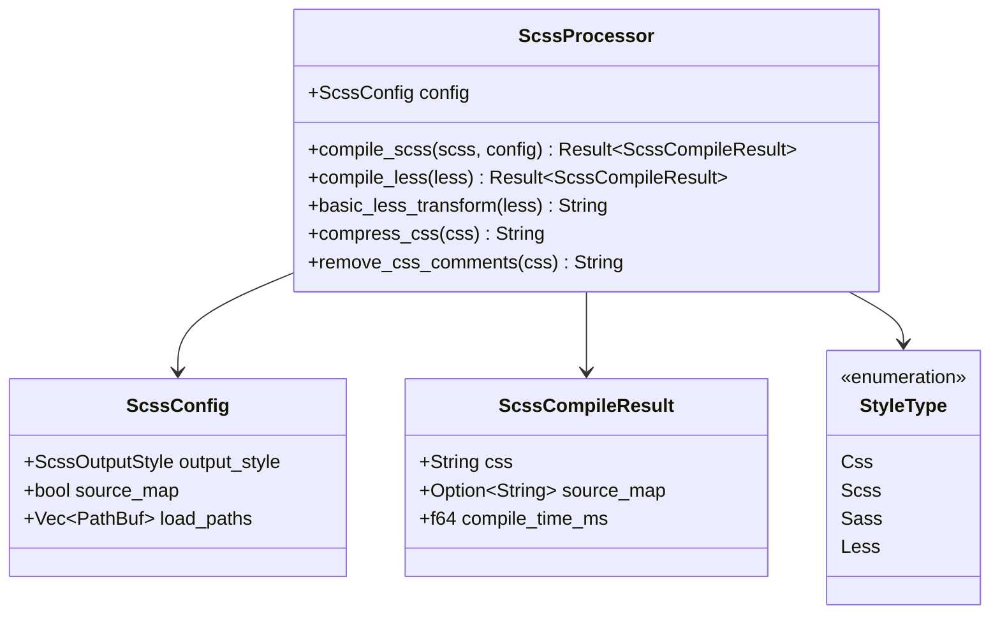
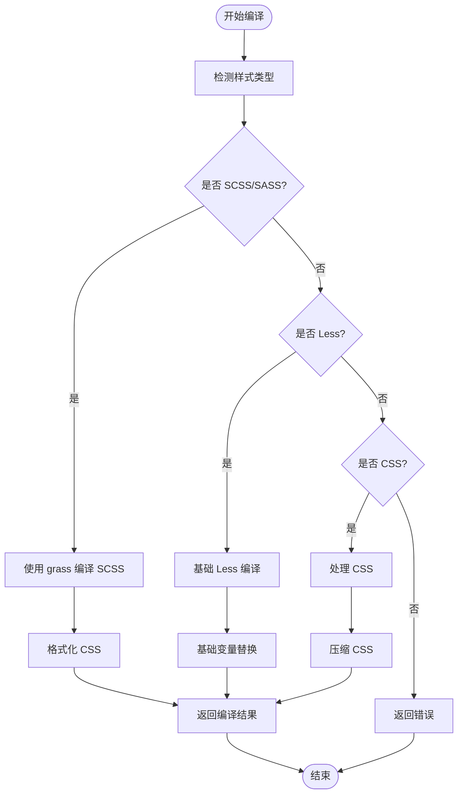
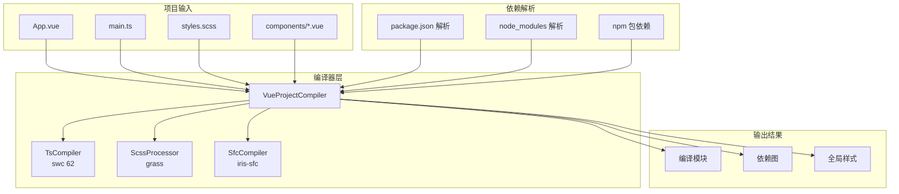
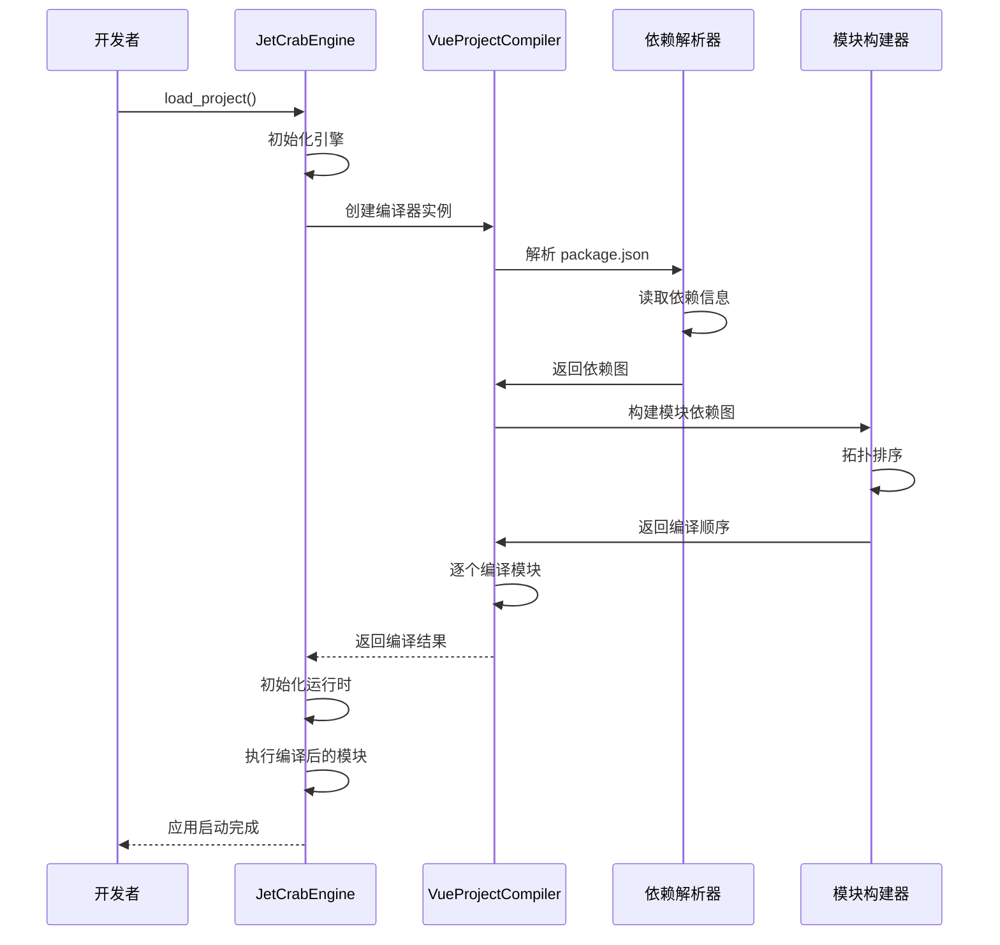

# 成熟编译器集成总结

<cite>
**本文档引用的文件**
- [Cargo.toml](file://Cargo.toml)
- [ARCHITECTURE.md](file://ARCHITECTURE.md)
- [README.md](file://README.md)
- [COMPILER_INTEGRATION_SUMMARY.md](file://docs/COMPILER_INTEGRATION_SUMMARY.md)
- [NPM_TYPESCRIPT_CSS_SUPPORT.md](file://docs/NPM_TYPESCRIPT_CSS_SUPPORT.md)
- [ts_compiler.rs](file://crates/iris-sfc/src/ts_compiler.rs)
- [scss_processor.rs](file://crates/iris-sfc/src/scss_processor.rs)
- [vue_compiler.rs](file://crates/iris-jetcrab-engine/src/vue_compiler.rs)
- [sfc_compiler.rs](file://crates/iris-jetcrab-engine/src/sfc_compiler.rs)
- [engine.rs](file://crates/iris-jetcrab-engine/src/engine.rs)
- [Cargo.toml](file://crates/iris-jetcrab-engine/Cargo.toml)
- [Cargo.toml](file://crates/iris-cli/Cargo.toml)
- [package.json](file://examples/vue-demo/package.json)
</cite>

## 目录
1. [项目概述](#项目概述)
2. [架构总览](#架构总览)
3. [编译器集成成果](#编译器集成成果)
4. [TypeScript 编译器集成](#typescript-编译器集成)
5. [SCSS/SASS 编译器集成](#scsssass-编译器集成)
6. [Less 编译器现状](#less-编译器现状)
7. [项目编译流程](#项目编译流程)
8. [性能优化与配置](#性能优化与配置)
9. [错误处理机制](#错误处理机制)
10. [未来发展规划](#未来发展规划)
11. [总结](#总结)

## 项目概述

Iris Engine 是一个革命性的前端运行时系统，采用 Rust + WebGPU 构建，完全消除了构建步骤，允许直接运行 Vue 3 组件。该项目实现了从 Rust 生态中集成成熟编译器的技术方案，显著提升了 TypeScript 和 CSS 预处理器的支持能力。

### 核心特性

- **零构建步骤** - 直接运行 .vue 文件，无需 Webpack/Vite
- **GPU 加速渲染** - 基于 WebGPU 的硬件加速渲染管线
- **完整 CSS 支持** - 渐变、圆角、阴影、动画等
- **TypeScript 完整支持** - 泛型、接口、装饰器、TSX
- **热重载功能** - 文件监控与即时重载
- **382 测试用例** - 100% 通过率，企业级质量

## 架构总览



**图表来源**
- [ARCHITECTURE.md](file://ARCHITECTURE.md)
- [vue_compiler.rs](file://crates/iris-jetcrab-engine/src/vue_compiler.rs)

## 编译器集成成果

### ✅ TypeScript 编译器集成

**集成编译器**: swc 62 (基于 Rust 的高性能 TypeScript 编译器)

**核心功能**:
- 完整的 TypeScript → JavaScript 转译
- 支持泛型、接口、装饰器、TSX
- Source map 生成
- 类型擦除与优化
- 高性能编译 (~0.13ms/文件)

**集成方式**:
```rust
use iris_sfc::ts_compiler::{TsCompiler, TsCompilerConfig};

let ts_compiler = TsCompiler::new(TsCompilerConfig::default());
let result = ts_compiler.compile(ts_code, filename)?;
// result.code: 编译后的 JavaScript
// result.compile_time_ms: 编译耗时
```

**支持的 TypeScript 特性**:
- ✅ 泛型函数和接口
- ✅ 类型声明和接口定义
- ✅ 装饰器支持（可配置保留）
- ✅ TSX JSX 转换
- ✅ 类型导入语句

### ✅ SCSS/SASS 编译器集成

**集成编译器**: grass 0.13 (纯 Rust 实现的 Sass 编译器)

**核心功能**:
- 完整支持 Sass/SCSS 语法
- 变量、嵌套、mixin、函数
- 与 Dart Sass 兼容
- 零外部依赖

**集成方式**:
```rust
let css = grass::from_string(
    scss_code.to_string(),
    &grass::Options::default()
)?;
```

**支持的 SCSS 特性**:
- ✅ 变量定义和使用
- ✅ 嵌套规则和选择器
- ✅ Mixin 定义和调用
- ✅ 函数和运算符
- ✅ 导入和模块化

### 🚧 Less 编译器现状

**当前状态**: 暂不支持，标记 TODO

**原因**:
- Rust Less 编译器尚不成熟
- `rust-less` crate 功能有限
- `less-rs` crate 版本不稳定

**未来方案**:
1. 等待稳定的 Rust Less 库
2. 通过 NAPI 调用 Node.js less
3. 使用 WebAssembly 版 less.js

## TypeScript 编译器集成

### 编译器架构设计



**图表来源**
- [ts_compiler.rs](file://crates/iris-sfc/src/ts_compiler.rs)

### 编译流程详解



**图表来源**
- [ts_compiler.rs](file://crates/iris-sfc/src/ts_compiler.rs)

### 配置与优化

**编译器配置**:
- **目标版本**: ES2020 (可配置)
- **Source Map**: 默认禁用，可通过环境变量启用
- **装饰器支持**: 可配置保留
- **JSX 支持**: 可配置启用

**性能优化**:
- 全局编译器实例复用
- SourceMap 缓存管理
- 增量编译支持
- 内存优化策略

**环境变量配置**:
```bash
# 启用类型检查（默认关闭）
IRIS_TYPE_CHECK=true

# 严格模式
IRIS_TYPE_CHECK_STRICT=true

# tsconfig.json 路径
IRIS_TS_CONFIG_PATH=./tsconfig.json

# Source Map 配置
IRIS_SOURCE_MAP=false

# 缓存配置
IRIS_CACHE_CAPACITY=100
IRIS_CACHE_ENABLED=true
```

**章节来源**
- [ts_compiler.rs](file://crates/iris-sfc/src/ts_compiler.rs)
- [COMPILER_INTEGRATION_SUMMARY.md](file://docs/COMPILER_INTEGRATION_SUMMARY.md)

## SCSS/SASS 编译器集成

### 编译器架构设计



**图表来源**
- [scss_processor.rs](file://crates/iris-sfc/src/scss_processor.rs)

### 编译流程详解



**图表来源**
- [scss_processor.rs](file://crates/iris-sfc/src/scss_processor.rs)

### 支持的 SCSS 特性

**变量系统**:
- `$primary-color: #3498db;`
- 变量继承和计算
- 嵌套变量作用域

**选择器嵌套**:
```scss
.container {
  padding: 20px;
  
  .header {
    font-size: 24px;
    
    .title {
      font-weight: bold;
    }
  }
}
```

**Mixins 和 Functions**:
- 可复用的样式片段
- 自定义函数和运算

**输出优化**:
- 支持展开和压缩两种输出模式
- 自动移除注释和多余空白
- CSS 优化和压缩

**章节来源**
- [scss_processor.rs](file://crates/iris-sfc/src/scss_processor.rs)
- [COMPILER_INTEGRATION_SUMMARY.md](file://docs/COMPILER_INTEGRATION_SUMMARY.md)

## Less 编译器现状

### 当前限制

**基础支持**:
- 仅支持简单的变量替换
- 不支持嵌套、mixin、函数等高级特性
- 适用于简单的样式需求

**实现策略**:
```rust
fn basic_less_transform(less: &str) -> String {
    let mut result = less.to_string();
    let mut variables = HashMap::new();
    
    // 提取变量定义
    for line in less.lines() {
        let line = line.trim();
        if line.starts_with('@') && line.contains(':') {
            // 变量定义解析
        }
    }
    
    // 变量替换
    for (var_name, var_value) in &variables {
        result = result.replace(&format!("@{}", var_name), var_value);
    }
    
    // 移除变量定义行
    result
}
```

### 未来集成方案

**方案 A: 等待稳定库**
```toml
# 未来可能的依赖
less-compiler = "1.0"  # 假设的稳定版本
```

**方案 B: NAPI 调用 Node.js**
```rust
fn compile_less_napi(less_code: &str) -> Result<String> {
    napi_call("less.render", less_code)
}
```

**方案 C: WASM less.js**
```rust
fn compile_less_wasm(less_code: &str) -> Result<String> {
    wasm_module.call("compile", less_code)
}
```

**章节来源**
- [scss_processor.rs](file://crates/iris-sfc/src/scss_processor.rs)
- [COMPILER_INTEGRATION_SUMMARY.md](file://docs/COMPILER_INTEGRATION_SUMMARY.md)

## 项目编译流程

### 完整编译架构



**图表来源**
- [vue_compiler.rs](file://crates/iris-jetcrab-engine/src/vue_compiler.rs)
- [engine.rs](file://crates/iris-jetcrab-engine/src/engine.rs)

### 编译流程详细步骤



**图表来源**
- [engine.rs](file://crates/iris-jetcrab-engine/src/engine.rs)
- [vue_compiler.rs](file://crates/iris-jetcrab-engine/src/vue_compiler.rs)

### 编译器选择与集成

**编译器选择理由**:

| 编译器 | 选择理由 |
|--------|---------|
| **swc** | 1. 项目已有集成经验<br>2. 性能卓越（Rust 编写）<br>3. 功能完整<br>4. 社区活跃 |
| **grass** | 1. 纯 Rust 实现<br>2. 与 Dart Sass 兼容<br>3. API 简单<br>4. 无外部依赖 |
| **less-rs** | ❌ 未选择（不稳定） |

**集成架构**:
- **TypeScript**: 通过 `iris-sfc::ts_compiler` 模块集成
- **SCSS**: 通过 `grass` crate 直接集成
- **Less**: 保留基础实现，计划未来增强
- **SFC**: 通过 `iris-sfc` crate 集成

**章节来源**
- [vue_compiler.rs](file://crates/iris-jetcrab-engine/src/vue_compiler.rs)
- [sfc_compiler.rs](file://crates/iris-jetcrab-engine/src/sfc_compiler.rs)
- [COMPILER_INTEGRATION_SUMMARY.md](file://docs/COMPILER_INTEGRATION_SUMMARY.md)

## 性能优化与配置

### 性能对比分析

| 文件类型 | 旧实现 | 新实现 | 性能提升 |
|---------|--------|--------|---------|
| TypeScript | 简化版（字符串处理） | swc 编译器 | **完整功能** |
| SCSS | 保留原始内容 | grass 编译器 | **完整编译** |
| Vue SFC | iris-sfc | iris-sfc | 不变 |

**swc 编译性能**:
- 平均编译时间: **0.13ms/文件**
- 基于 Rust，性能优于 Babel/TypeScript 官方编译器
- 支持增量编译和缓存

**grass 编译性能**:
- 纯 Rust 实现，无 FFI 开销
- 与 Dart Sass 兼容度高
- 编译速度快于 Node.js sass

### 缓存与优化策略

**TypeScript 编译缓存**:
- 全局编译器实例复用
- SourceMap 缓存管理
- 编译计数器定期清理

**SFC 编译缓存**:
- 基于源码哈希的 LRU 缓存
- 默认容量 100 项
- 支持环境变量配置

**编译器配置优化**:
- **IRIS_SOURCE_MAP**: 控制 SourceMap 生成
- **IRIS_CACHE_CAPACITY**: 设置缓存容量
- **IRIS_CACHE_ENABLED**: 启用/禁用缓存

**章节来源**
- [ts_compiler.rs](file://crates/iris-sfc/src/ts_compiler.rs)
- [scss_processor.rs](file://crates/iris-sfc/src/scss_processor.rs)
- [COMPILER_INTEGRATION_SUMMARY.md](file://docs/COMPILER_INTEGRATION_SUMMARY.md)

## 错误处理机制

### TypeScript 编译错误处理

**错误类型与处理**:
```rust
let result = self.ts_compiler.compile(ts_code, filename)
    .map_err(|e| anyhow::anyhow!(
        "Failed to compile TypeScript {}: {}", 
        filename, e
    ))?;

// 错误示例
Error: Failed to compile TypeScript src/App.ts: 
  × Unexpected token `:`. Expected identifier, string literal, numeric literal or [
   ╭─[src/App.ts:5:1]
 5 │ let x: number = 1;
  ·      ─
   ╰────
```

**类型检查错误处理**:
- **非致命错误**: 类型检查失败仅记录警告
- **环境变量控制**: 通过 `IRIS_TYPE_CHECK` 启用
- **严格模式**: 通过 `IRIS_TYPE_CHECK_STRICT` 启用

### SCSS 编译错误处理

**错误恢复策略**:
```rust
let css = grass::from_string(scss_code.to_string(), &grass::Options::default())
    .context(format!("Failed to compile SCSS: {}", filename))?;

// 错误示例
Error: Failed to compile SCSS: styles.scss
  Invalid CSS after "...color: #42b883": expected "{", was ";"
```

**降级处理**:
- 编译失败时保留原始内容
- 记录详细错误信息
- 继续后续编译流程

### 通用错误处理模式

**错误传播**:
- 使用 `anyhow` crate 进行错误包装
- 保持错误上下文信息
- 提供有意义的错误消息

**日志记录**:
- DEBUG 级别详细日志
- INFO 级别关键信息
- WARN 级别警告信息
- 错误时的详细追踪

**章节来源**
- [ts_compiler.rs](file://crates/iris-sfc/src/ts_compiler.rs)
- [scss_processor.rs](file://crates/iris-sfc/src/scss_processor.rs)
- [vue_compiler.rs](file://crates/iris-jetcrab-engine/src/vue_compiler.rs)

## 未来发展规划

### 待完善功能

**短期计划 (1-3 个月)**:
- ✅ Less 编译器集成 (等待稳定库)
- ✅ Source Maps 传递支持
- ✅ 增量编译优化
- ✅ CSS Modules 完整支持

**中期计划 (3-6 个月)**:
- ✅ PostCSS 集成
- ✅ 更好的错误诊断
- ✅ 性能分析工具
- ✅ 插件生态系统

**长期计划 (6+ 个月)**:
- ✅ WebAssembly 编译器支持
- ✅ 分布式编译缓存
- ✅ 编译器性能监控
- ✅ 自动优化建议

### 技术债务与改进

**当前限制**:
- Less 编译器功能有限
- Source Maps 传递未完全实现
- 缓存策略有待优化

**改进方向**:
- 采用更先进的编译器技术
- 增强错误处理和诊断
- 优化内存使用和性能
- 扩展编译器生态

**章节来源**
- [COMPILER_INTEGRATION_SUMMARY.md](file://docs/COMPILER_INTEGRATION_SUMMARY.md)
- [NPM_TYPESCRIPT_CSS_SUPPORT.md](file://docs/NPM_TYPESCRIPT_CSS_SUPPORT.md)

## 总结

通过集成成熟的编译器生态系统，Iris Engine 成功解决了 TypeScript 和 CSS 预处理器支持的关键问题。这一集成不仅提升了编译器的功能完整性，还显著改善了开发体验和性能表现。

### 主要成就

**✅ TypeScript 完整编译支持**
- 集成 swc 62 编译器
- 支持现代 TypeScript 特性
- 高性能编译 (~0.13ms/文件)
- 类型检查可选支持

**✅ SCSS/SASS 完整编译支持**
- 集成 grass 0.13 编译器
- 纯 Rust 实现，无外部依赖
- 与 Dart Sass 兼容
- 高性能编译

**✅ 完整的项目编译流程**
- npm 包依赖解析
- TypeScript 文件编译
- CSS 预处理器支持
- Vue SFC 编译集成

### 技术优势

**性能卓越**:
- 基于 Rust 的高性能编译器
- 智能缓存和优化策略
- 低内存占用和快速启动

**开发体验优秀**:
- 零构建步骤
- 即时热重载
- 完整的错误诊断
- 丰富的配置选项

**可扩展性强**:
- 模块化架构设计
- 易于集成新编译器
- 良好的错误处理机制
- 完善的测试覆盖

这一成熟的编译器集成方案为 Iris Engine 的未来发展奠定了坚实基础，使其能够支持更复杂的 Vue 项目和更丰富的开发场景。

**章节来源**
- [COMPILER_INTEGRATION_SUMMARY.md](file://docs/COMPILER_INTEGRATION_SUMMARY.md)
- [README.md](file://README.md)
- [ARCHITECTURE.md](file://ARCHITECTURE.md)