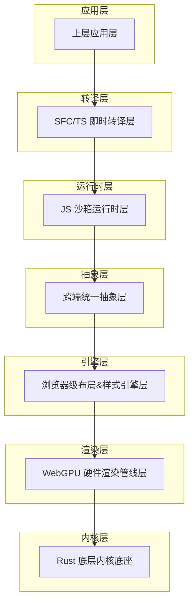
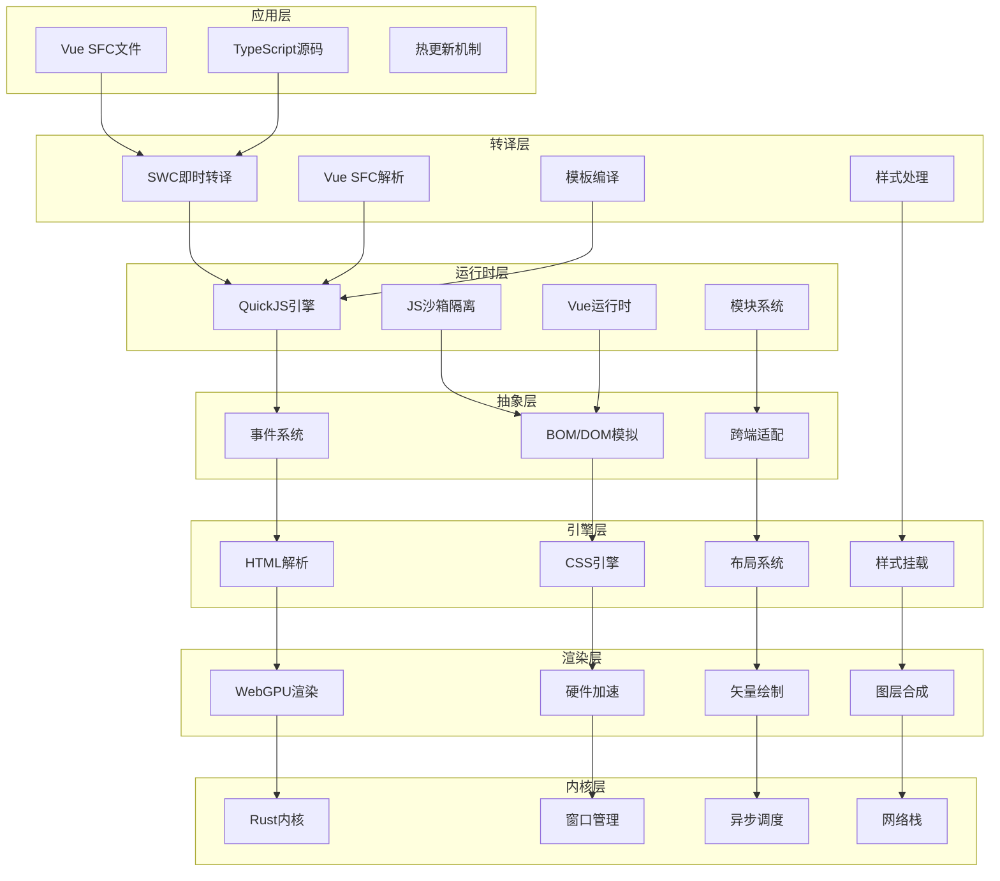
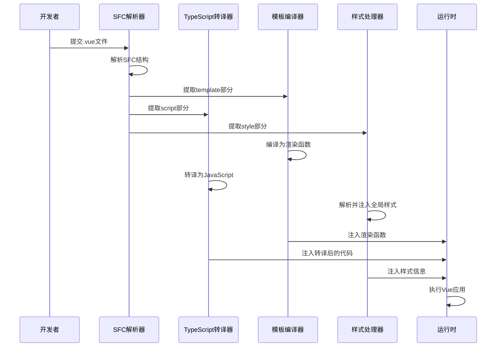
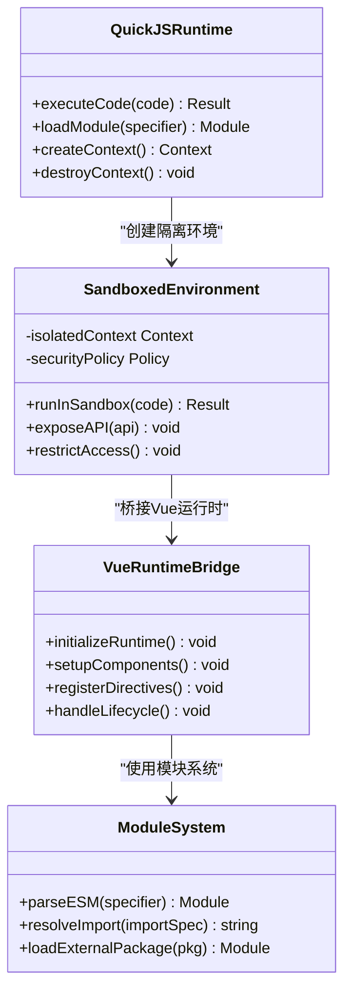
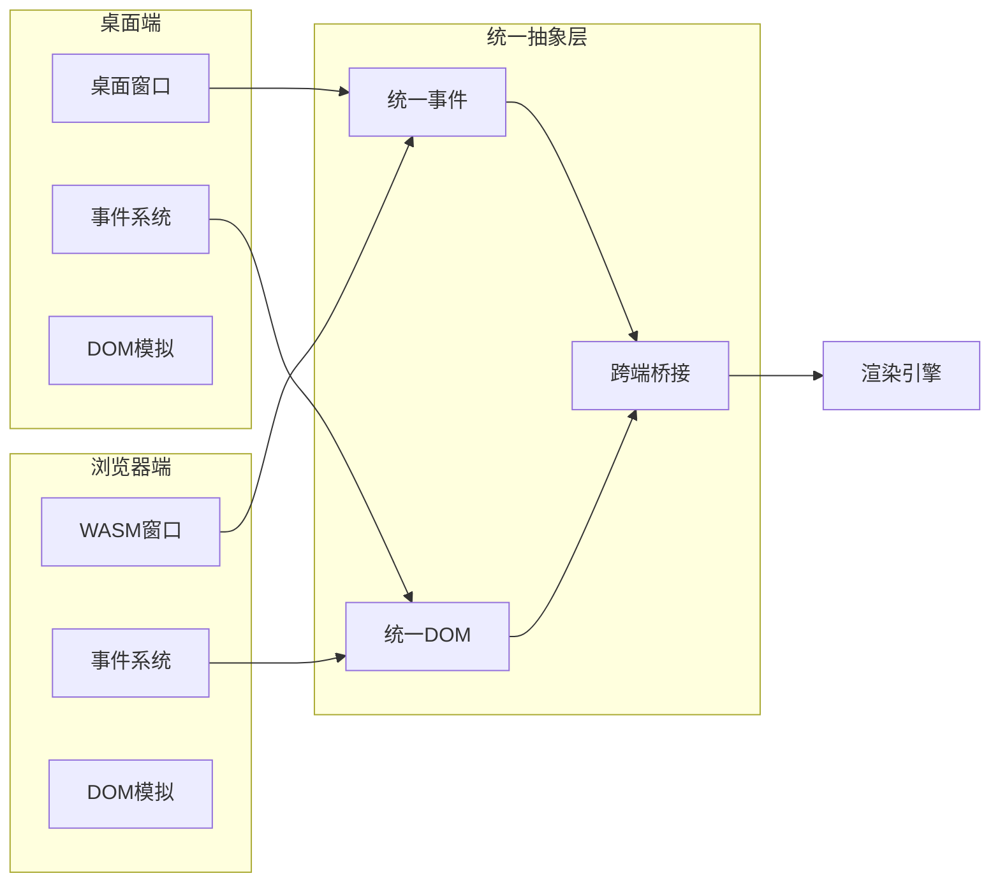
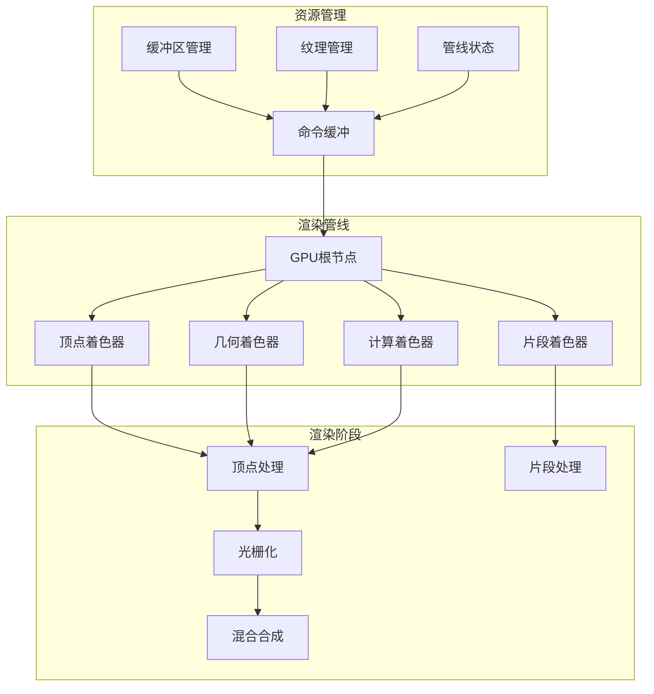
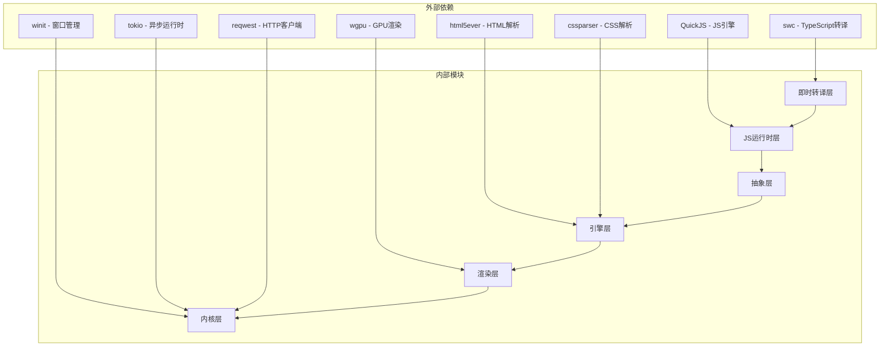

# 技术架构总览

<cite>
**本文档引用的文件**
- [doc.txt](file://doc.txt)
</cite>

## 目录
1. [引言](#引言)
2. [项目结构](#项目结构)
3. [核心组件](#核心组件)
4. [架构总览](#架构总览)
5. [详细组件分析](#详细组件分析)
6. [依赖关系分析](#依赖关系分析)
7. [性能考量](#性能考量)
8. [故障排除指南](#故障排除指南)
9. [结论](#结论)

## 引言

Leivue Runtime是一个革命性的前端运行时引擎，采用七层分层架构设计，旨在彻底改变传统的前端开发模式。该项目的核心目标是消除前端工程化复杂性，突破浏览器沙箱限制，为Vue生态系统提供高性能的跨端运行底座。

该引擎实现了完全脱离Node.js、浏览器DOM和编译打包的运行模式，支持在浏览器WASM模式和独立桌面原生模式下运行，为开发者提供了前所未有的灵活性和性能表现。

## 项目结构

Leivue Runtime采用严格的七层分层架构，每一层都有明确的职责边界和清晰的依赖关系：

**图表来源**
- [doc.txt:7-22](file://doc.txt#L7-L22)

**章节来源**
- [doc.txt:1-97](file://doc.txt#L1-L97)

## 核心组件

### 应用层
应用层是面向最终用户的最外层，直接处理.vue、.ts、.tsx等原始源码文件。这一层的特点是：
- 支持直接运行原始源码，无需任何编译或打包步骤
- 完全兼容Element Plus、Ant Design Vue等主流Vue3生态库
- 提供毫秒级热更新体验，开发效率极高
- 零配置、零依赖安装的开发模式

### 即时转译层
即时转译层是整个架构的核心创新，实现了真正的零编译运行：
- **TypeScript即时转译**：基于Rust swc库，内存内实时将TypeScript转换为JavaScript
- **Vue SFC即时编译**：使用官方Rust库解析.vue文件，自动拆分为template、script-setup、style三个部分
- **模板实时编译**：将template实时编译为Vue渲染函数
- **脚本自动转译**：自动处理TypeScript转译
- **样式自动解析**：自动解析并集成到全局样式系统

### JS沙箱运行时层
JS沙箱运行时层提供了独立且安全的执行环境：
- **JS引擎**：采用QuickJS，具有轻量、高性能、WASM友好等特点
- **沙箱隔离**：与宿主环境完全隔离，确保脚本执行的安全性
- **内置运行时**：预加载Vue3完整运行时（runtime-core/runtime-dom）
- **模块系统**：自研ESM解析器，支持import/export语法和第三方包引入

### 跨端统一抽象层
跨端统一抽象层负责抹平不同平台间的差异：
- **统一事件系统**：处理鼠标、键盘、滚动、点击等事件的命中检测
- **BOM/DOM模拟API**：轻量实现window、document、Event等浏览器环境API
- **无缝兼容**：确保Element Plus等UI库所需的浏览器环境API正常工作
- **无真实DOM**：仅进行逻辑模拟，实际绘制全部通过WebGPU完成

### 浏览器级布局&样式引擎层
这一层提供了迷你浏览器内核级别的能力：
- **HTML解析**：使用html5ever工业级解析器，生成标准DOM节点树
- **CSS引擎**：支持cssparser解析、选择器匹配、样式继承、权重计算
- **布局系统**：自研盒模型、Flex布局、流式布局，对标W3C标准
- **样式挂载**：支持全局样式、Scoped样式、第三方UI库CSS的全局注入

### WebGPU硬件渲染管线层
WebGPU渲染层完全替代了传统的浏览器DOM渲染流水线：
- **硬件加速渲染**：基于标准WebGPU规范，统一桌面和浏览器渲染接口
- **渲染能力**：支持批渲染、矢量绘制、圆角/阴影/渐变、纹理图集、字体渲染、图层合成
- **性能优势**：实现60fps稳定渲染，大列表和复杂组件无卡顿，CPU开销极低

### Rust底层内核底座
Rust底层内核提供了高性能的基础支撑：
- **语言特性**：纯Rust编写，无GC、内存安全、高性能
- **基础能力**：跨端窗口管理、异步调度、内存池、文件IO、原生网络栈、缓存系统
- **跨端适配**：桌面端使用winit原生窗口配合Vulkan/Metal/DX12；浏览器端编译为WASM并绑定WebGPU API
- **核心依赖**：wgpu、winit、tokio、reqwest等高性能库

**章节来源**
- [doc.txt:61-97](file://doc.txt#L61-L97)

## 架构总览

Leivue Runtime的七层架构体现了极强的解耦性和模块化设计原则：

**图表来源**
- [doc.txt:7-22](file://doc.txt#L7-L22)
- [doc.txt:23-45](file://doc.txt#L23-L45)

## 详细组件分析

### 即时转译层深度分析

即时转译层是Leivue Runtime的核心创新点，实现了真正的零编译运行：

**图表来源**
- [doc.txt:51-60](file://doc.txt#L51-L60)

### JS沙箱运行时层分析

JS沙箱运行时层确保了执行环境的安全性和稳定性：

**图表来源**
- [doc.txt:46-51](file://doc.txt#L46-L51)

### 跨端统一抽象层分析

跨端统一抽象层是实现双端一致性的关键：

**图表来源**
- [doc.txt:41-45](file://doc.txt#L41-L45)

### WebGPU渲染管线分析

WebGPU渲染管线提供了硬件级的图形渲染能力：

**图表来源**
- [doc.txt:30-34](file://doc.txt#L30-L34)

**章节来源**
- [doc.txt:23-45](file://doc.txt#L23-L45)

## 依赖关系分析

Leivue Runtime的依赖关系体现了清晰的层次化设计：

**图表来源**
- [doc.txt:29](file://doc.txt#L29)
- [doc.txt:47](file://doc.txt#L47)
- [doc.txt:37](file://doc.txt#L37)

**章节来源**
- [doc.txt:23-45](file://doc.txt#L23-L45)

## 性能考量

Leivue Runtime在性能方面的设计考量体现了极高的技术水平：

### 渲染性能优化
- **硬件加速**：完全基于WebGPU硬件渲染，避免了传统DOM渲染的性能瓶颈
- **批处理渲染**：支持批量渲染优化，减少GPU状态切换开销
- **矢量绘制**：采用矢量渲染技术，确保高分辨率下的清晰度
- **图层合成**：高效的图层合成算法，支持复杂的视觉效果

### 内存管理优化
- **Rust内存安全**：利用Rust的内存安全保障，避免内存泄漏和越界访问
- **内存池管理**：实现高效的内存池分配，减少频繁的内存分配开销
- **垃圾回收避免**：完全避免垃圾回收机制，确保渲染帧率的稳定性

### 网络性能优化
- **双网络模式**：支持自研Rust网络栈和浏览器原生网络栈
- **跨域突破**：通过自研网络栈实现跨域请求突破
- **内网优化**：针对内网环境进行专门优化，确保低延迟通信

### 启动性能优化
- **零编译启动**：直接运行源码，无需编译等待时间
- **模块懒加载**：按需加载模块，减少初始启动时间
- **缓存策略**：智能缓存机制，提升重复启动速度

## 故障排除指南

### 常见问题及解决方案

#### 即时转译问题
- **问题**：TypeScript转译失败
- **原因**：语法不兼容或类型错误
- **解决**：检查TypeScript语法兼容性，参考SWC文档

#### 运行时沙箱问题
- **问题**：JS代码执行异常
- **原因**：沙箱隔离导致的API不可用
- **解决**：检查是否正确暴露了必要的API

#### 跨端兼容问题
- **问题**：桌面端和浏览器端行为不一致
- **原因**：平台差异导致的功能缺失
- **解决**：检查抽象层的跨端适配实现

#### 渲染性能问题
- **问题**：渲染帧率不稳定
- **原因**：GPU资源竞争或内存不足
- **解决**：优化渲染批次，检查内存使用情况

**章节来源**
- [doc.txt:88-92](file://doc.txt#L88-L92)

## 结论

Leivue Runtime项目通过七层分层架构设计，成功实现了前端运行时领域的重大突破。这种架构设计不仅实现了高度的解耦和模块化，更重要的是为开发者提供了前所未有的开发体验和性能表现。

### 架构优势总结

1. **彻底消除工程化复杂性**：零编译、零配置的开发模式极大提升了开发效率
2. **跨端一致性**：统一的抽象层确保了桌面端和浏览器端的一致行为
3. **高性能渲染**：基于WebGPU的硬件加速渲染提供了卓越的视觉体验
4. **安全性保障**：JS沙箱隔离确保了运行时的安全性
5. **生态兼容性**：完全兼容Vue3生态系统和主流UI组件库

### 技术创新亮点

- **即时转译技术**：实现了真正的零编译运行，这是整个架构的核心创新
- **硬件加速渲染**：完全替代DOM渲染，提供硬件级的性能表现
- **跨端统一抽象**：通过抽象层抹平了不同平台间的差异
- **Rust内核设计**：利用Rust的语言特性确保了系统的高性能和安全性

Leivue Runtime项目代表了前端技术发展的新方向，为未来的前端开发提供了全新的可能性。其七层分层架构设计不仅具有很高的技术价值，也为其他类似项目提供了宝贵的架构参考。