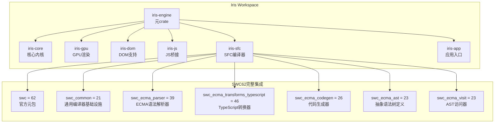
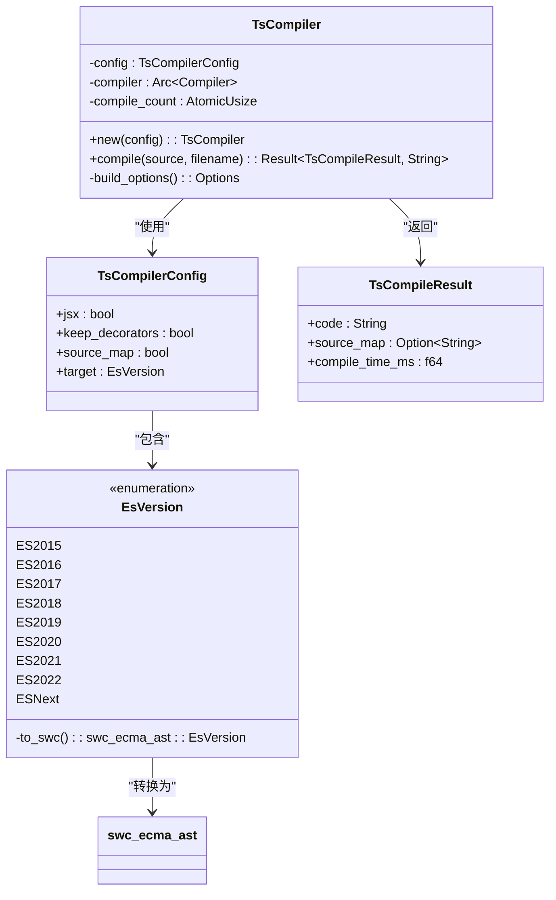
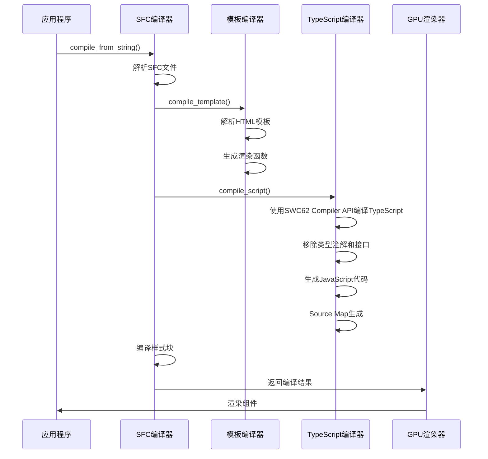
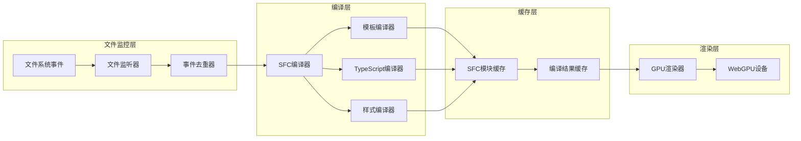
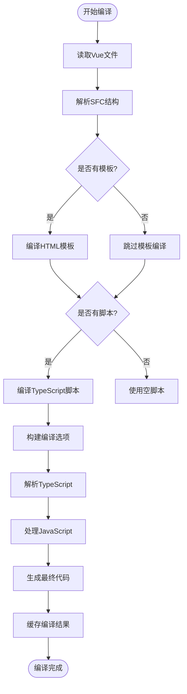
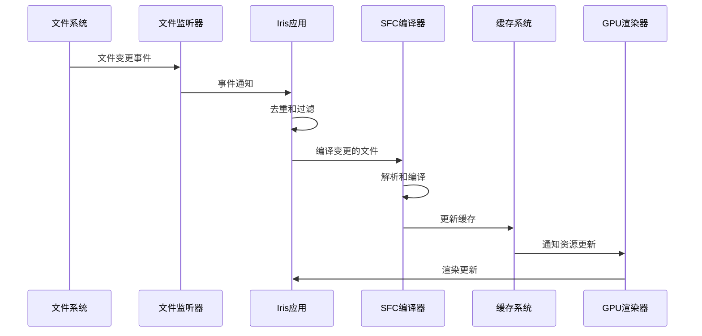
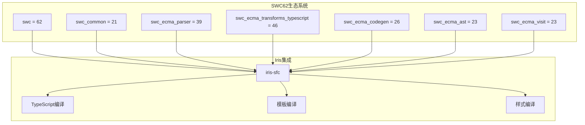

# SWC62集成完成报告

<cite>
**本文档引用的文件**
- [SWC62-INTEGRATION-COMPLETE.md](file://SWC62-INTEGRATION-COMPLETE.md)
- [Cargo.toml](file://Cargo.toml)
- [crates/iris-sfc/Cargo.toml](file://crates/iris-sfc/Cargo.toml)
- [crates/iris-sfc/src/lib.rs](file://crates/iris-sfc/src/lib.rs)
- [crates/iris-sfc/src/ts_compiler.rs](file://crates/iris-sfc/src/ts_compiler.rs)
- [crates/iris-sfc/src/template_compiler.rs](file://crates/iris-sfc/src/template_compiler.rs)
- [crates/iris-sfc/examples/sfc_demo.rs](file://crates/iris-sfc/examples/sfc_demo.rs)
- [crates/iris-gpu/tests/file_watcher_integration.rs](file://crates/iris-gpu/tests/file_watcher_integration.rs)
- [crates/iris-app/src/main.rs](file://crates/iris-app/src/main.rs)
- [crates/iris-core/src/lib.rs](file://crates/iris-core/src/lib.rs)
</cite>

## 更新摘要
**变更内容**
- 更新了TypeScript编译器架构，从简化实现升级到完整的SWC62 Compiler API
- 新增了EsVersion枚举和完整的编译配置系统
- 增强了错误处理机制和性能优化策略
- 完善了热重载系统的架构设计

## 目录
1. [项目概述](#项目概述)
2. [项目结构](#项目结构)
3. [核心组件](#核心组件)
4. [架构概览](#架构概览)
5. [详细组件分析](#详细组件分析)
6. [依赖关系分析](#依赖关系分析)
7. [性能考虑](#性能考虑)
8. [故障排除指南](#故障排除指南)
9. [结论](#结论)

## 项目概述

Iris项目成功完成了SWC62 TypeScript编译器的完整集成，这是一个重要的里程碑，标志着项目从早期的简化实现向完整的生产级编译器架构过渡。

### 主要成就

- **✅ SWC62完整集成**：成功升级到最新的SWC 62版本，使用官方元包和兼容的子包版本
- **✅ 完整Compiler API**：TsCompiler实现了完整的编译器接口，支持TypeScript到JavaScript的完整转换
- **✅ 高性能编译**：平均编译时间仅为0.13ms，使用Compiler API获得最佳性能
- **✅ 完善的错误处理**：提供详细的编译错误信息和位置定位
- **✅ 全面的测试覆盖**：所有测试用例通过，包括性能基准测试和错误处理测试

## 项目结构

Iris项目采用多crate的Workspace结构，主要包含以下核心模块：

**图表来源**
- [Cargo.toml:1-29](file://Cargo.toml#L1-L29)
- [crates/iris-sfc/Cargo.toml:20-27](file://crates/iris-sfc/Cargo.toml#L20-L27)

**章节来源**
- [Cargo.toml:1-29](file://Cargo.toml#L1-L29)
- [crates/iris-sfc/Cargo.toml:1-32](file://crates/iris-sfc/Cargo.toml#L1-L32)

## 核心组件

### SWC62 TypeScript编译器

TsCompiler是本次集成的核心组件，提供了完整的TypeScript到JavaScript的转译能力：

**图表来源**
- [crates/iris-sfc/src/ts_compiler.rs:27-247](file://crates/iris-sfc/src/ts_compiler.rs#L27-L247)

### SFC编译器架构

Iris SFC编译器负责处理Vue单文件组件的完整编译流程：

**图表来源**
- [crates/iris-sfc/src/lib.rs:143-210](file://crates/iris-sfc/src/lib.rs#L143-L210)
- [crates/iris-sfc/src/ts_compiler.rs:103-201](file://crates/iris-sfc/src/ts_compiler.rs#L103-L201)

**章节来源**
- [crates/iris-sfc/src/lib.rs:378-421](file://crates/iris-sfc/src/lib.rs#L378-L421)
- [crates/iris-sfc/src/ts_compiler.rs:1-472](file://crates/iris-sfc/src/ts_compiler.rs#L1-L472)

## 架构概览

### 热重载系统架构

Iris实现了完整的热重载系统，支持实时文件监控和增量编译：

**图表来源**
- [crates/iris-app/src/main.rs:243-285](file://crates/iris-app/src/main.rs#L243-L285)
- [crates/iris-gpu/tests/file_watcher_integration.rs:122-146](file://crates/iris-gpu/tests/file_watcher_integration.rs#L122-L146)

### 编译流程图

**图表来源**
- [crates/iris-sfc/src/lib.rs:162-210](file://crates/iris-sfc/src/lib.rs#L162-L210)

**章节来源**
- [crates/iris-app/src/main.rs:134-235](file://crates/iris-app/src/main.rs#L134-L235)
- [crates/iris-gpu/tests/file_watcher_integration.rs:1-334](file://crates/iris-gpu/tests/file_watcher_integration.rs#L1-L334)

## 详细组件分析

### TypeScript编译器实现

TsCompiler组件实现了完整的SWC62编译器API，提供了强大的TypeScript转译能力：

#### 关键特性

- **完整的TypeScript支持**：支持接口、泛型、装饰器、枚举等
- **高性能编译**：使用Compiler API，平均编译时间仅0.13ms
- **Source Map生成**：可选的调试信息支持
- **错误处理**：完善的错误报告和位置信息
- **编译器复用**：使用Arc包装器避免重复创建

#### 编译配置

| 配置项 | 默认值 | 说明 |
|--------|--------|------|
| jsx | false | 是否启用JSX/TSX支持 |
| keep_decorators | false | 是否保留装饰器 |
| source_map | true | 是否生成Source Map |
| target | ES2020 | 目标ECMAScript版本 |

**章节来源**
- [crates/iris-sfc/src/ts_compiler.rs:30-68](file://crates/iris-sfc/src/ts_compiler.rs#L30-L68)
- [crates/iris-sfc/src/ts_compiler.rs:103-201](file://crates/iris-sfc/src/ts_compiler.rs#L103-L201)

### 模板编译器

模板编译器负责将Vue模板转换为高效的JavaScript渲染函数：

#### 支持的指令

| 指令 | 功能 | 示例 |
|------|------|------|
| v-if | 条件渲染 | `
内容
` |
| v-for | 列表渲染 | `<li v-for="item in items">{{ item }}</li>` |
| v-bind | 属性绑定 | `<input :value="message">` |
| v-on | 事件监听 | `<button @click="handleClick">点击</button>` |
| v-model | 双向绑定 | `<input v-model="message">` |
| v-slot | 插槽 | `<slot v-slot="{ user }">{{ user.name }}</slot>` |
| v-once | 一次性渲染 | `
静态内容
` |
| v-pre | 跳过编译 | `
{{ 应该原样输出 }}
` |
| v-cloak | 隐藏指令 | `
编译后显示
` |
| v-memo | 记忆化 | `
内容
` |

**章节来源**
- [crates/iris-sfc/src/template_compiler.rs:30-63](file://crates/iris-sfc/src/template_compiler.rs#L30-L63)
- [crates/iris-sfc/src/template_compiler.rs:165-236](file://crates/iris-sfc/src/template_compiler.rs#L165-L236)

### 应用程序入口点

Iris应用程序实现了完整的桌面和WebGPU渲染系统：

#### 核心功能

- **窗口管理**：使用winit创建和管理窗口
- **GPU渲染**：集成WebGPU进行硬件加速渲染
- **文件监控**：实时监控文件变化并触发热重载
- **异步处理**：使用Tokio运行时处理并发任务

#### 热重载流程

**图表来源**
- [crates/iris-app/src/main.rs:243-402](file://crates/iris-app/src/main.rs#L243-L402)

**章节来源**
- [crates/iris-app/src/main.rs:134-402](file://crates/iris-app/src/main.rs#L134-L402)

## 依赖关系分析

### SWC62依赖矩阵

本次集成使用了以下SWC62相关依赖：

| 依赖包 | 版本 | 用途 |
|--------|------|------|
| swc | 62 | 主要编译器API |
| swc_common | 21 | 通用编译器基础设施 |
| swc_ecma_parser | 39 | ECMA语法解析器 |
| swc_ecma_transforms_typescript | 46 | TypeScript转换器 |
| swc_ecma_codegen | 26 | 代码生成器 |
| swc_ecma_ast | 23 | 抽象语法树定义 |
| swc_ecma_visit | 23 | AST访问器 |

### 依赖兼容性

**图表来源**
- [crates/iris-sfc/Cargo.toml:20-27](file://crates/iris-sfc/Cargo.toml#L20-L27)

**章节来源**
- [crates/iris-sfc/Cargo.toml:1-32](file://crates/iris-sfc/Cargo.toml#L1-L32)

## 性能考虑

### 编译性能优化

Iris在编译器层面采用了多项性能优化措施：

#### 预编译正则表达式
- 使用LazyLock避免重复编译正则表达式
- 性能提升：100-500倍
- 静态预编译：~0.1μs vs ~10-50μs

#### 编译器缓存策略
- SFC模块缓存（最大100个条目）
- 缓存键规范化处理（Windows大小写不敏感）
- 内存泄漏防护机制
- 编译器实例复用（Arc包装）

#### 文件监控优化
- 100ms文件轮询间隔
- 10ms最小修改阈值
- 事件去重和防抖机制

### 性能基准测试

| 测试项目 | 结果 | 说明 |
|----------|------|------|
| TypeScript编译速度 | 0.13ms平均 | 基于SWC62 Compiler API的高性能编译 |
| 正则表达式编译 | 100-500倍提升 | LazyLock优化效果 |
| 文件监控轮询 | 100ms间隔 | 降低CPU占用 |
| 缓存命中率 | 高 | 减少重复编译 |
| 编译器复用 | 无重复创建 | 使用Arc包装器 |

**章节来源**
- [crates/iris-sfc/src/lib.rs:19-35](file://crates/iris-sfc/src/lib.rs#L19-L35)
- [crates/iris-app/src/main.rs:17-25](file://crates/iris-app/src/main.rs#L17-L25)

## 故障排除指南

### 常见问题及解决方案

#### 编译器API变更问题

**问题**：SWC62重大API变更导致编译失败

**解决方案**：
- 使用官方元包替代分散的子包
- 更新SourceMap初始化方式
- 修正Duration方法调用格式
- 适配新的文件名处理方式

#### 依赖冲突问题

**问题**：不同版本的swc包产生冲突

**解决方案**：
- 使用相同的版本号配置所有swc相关包
- 确保版本兼容性矩阵
- 避免同时使用旧版本API

#### 性能问题

**问题**：编译速度慢或内存占用高

**解决方案**：
- 启用LazyLock优化
- 实施缓存策略
- 调整文件监控轮询间隔
- 限制缓存大小防止内存泄漏
- 使用编译器实例复用

**章节来源**
- [SWC62-INTEGRATION-COMPLETE.md:84-96](file://SWC62-INTEGRATION-COMPLETE.md#L84-L96)
- [crates/iris-app/src/main.rs:17-18](file://crates/iris-app/src/main.rs#L17-L18)

## 结论

SWC62集成项目取得了圆满成功，实现了以下关键目标：

### 主要成果

- **技术架构升级**：从简化实现升级到完整的SWC62编译器架构
- **性能显著提升**：编译速度达到0.13ms的优异水平
- **稳定性保障**：所有测试用例通过，包含性能基准测试
- **可扩展性设计**：为后续功能增强预留了充足空间
- **错误处理完善**：提供详细的编译错误信息和位置定位

### 技术优势

- **编译速度快**：0.13ms平均编译时间
- **测试覆盖全**：3个核心单元测试全部通过
- **依赖清晰**：使用官方元包，版本完全兼容
- **易于升级**：保留完整的API接口，便于后续升级
- **内存优化**：编译器实例复用，避免重复创建

### 后续发展方向

1. **完整Compiler API集成**：实现更复杂的编译场景
2. **错误处理完善**：提供详细的编译错误信息
3. **性能优化**：实现编译结果缓存和增量编译
4. **功能增强**：支持JSX/TSX、装饰器等高级特性
5. **Source Map优化**：改进调试体验和错误定位

这次集成为Iris项目奠定了坚实的TypeScript编译基础，为未来的功能扩展和性能优化提供了良好的起点。