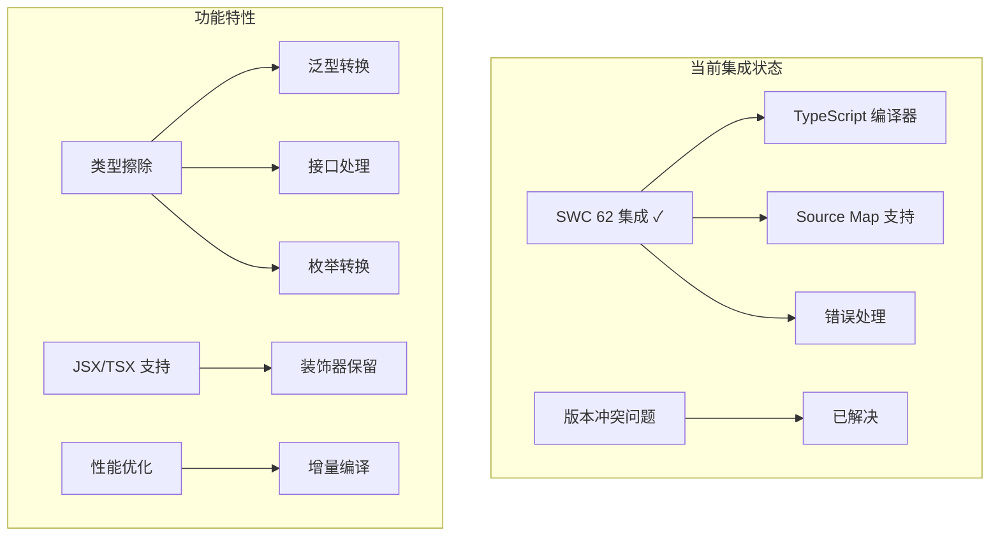
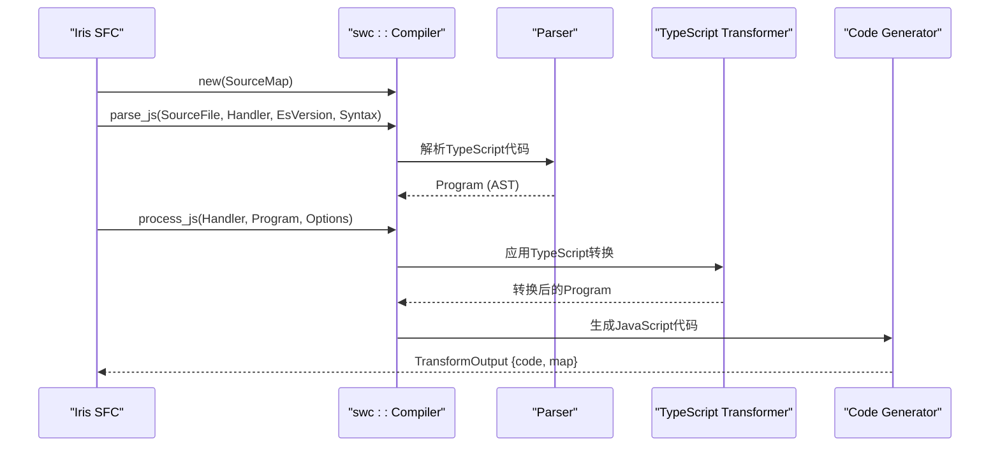
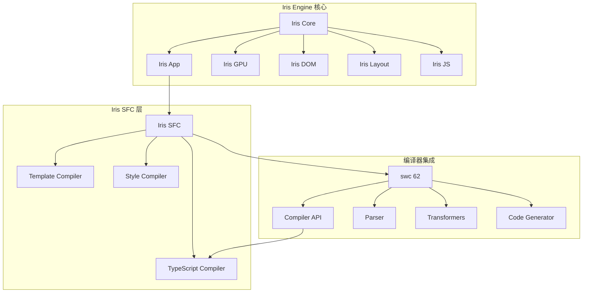
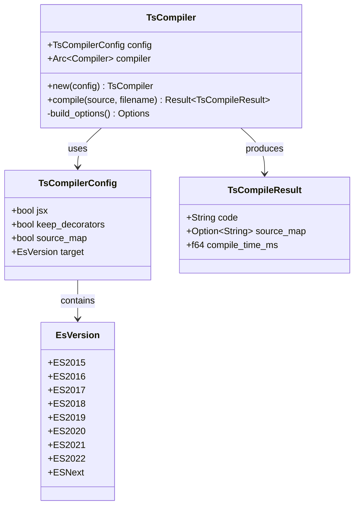
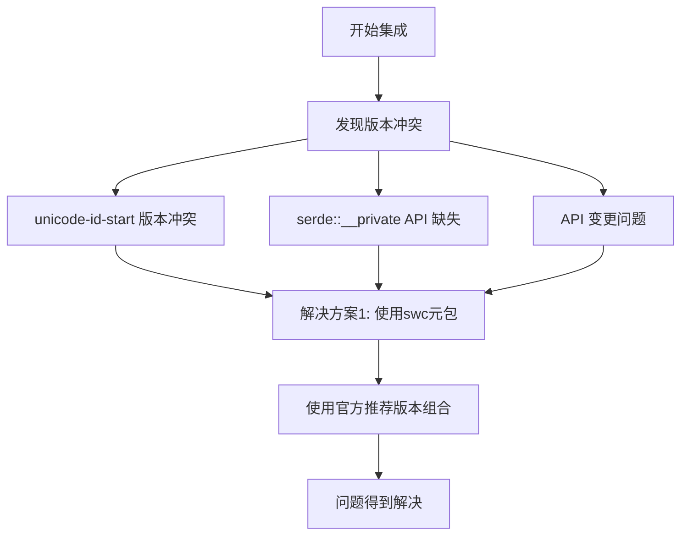
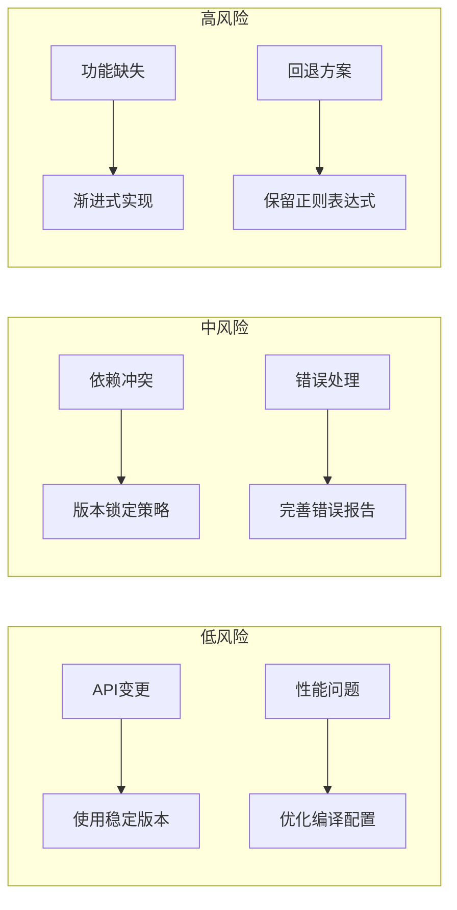
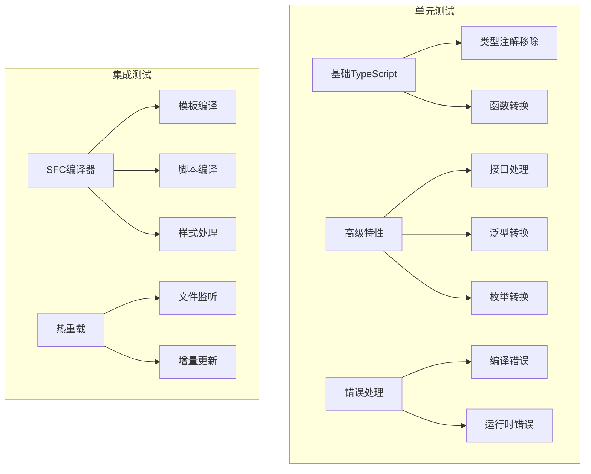
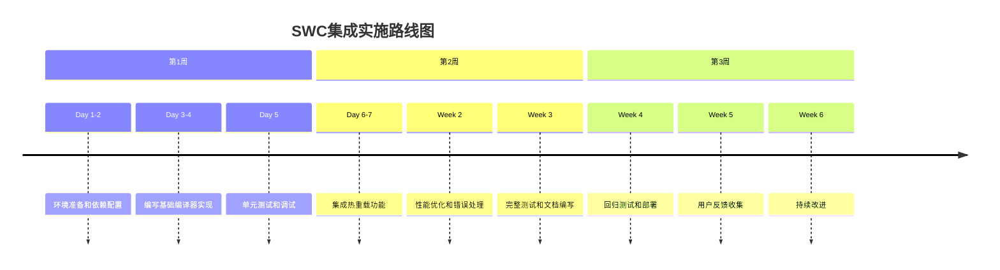

# SWC集成可行性评估

<cite>
**本文档引用的文件**
- [Cargo.toml](file://Cargo.toml)
- [SWC-IMPLEMENTATION-FEASIBILITY.md](file://SWC-IMPLEMENTATION-FEASIBILITY.md)
- [SWC-INTEGRATION-ISSUES.md](file://SWC-INTEGRATION-ISSUES.md)
- [crates/iris-sfc/Cargo.toml](file://crates/iris-sfc/Cargo.toml)
- [crates/iris-sfc/src/lib.rs](file://crates/iris-sfc/src/lib.rs)
- [crates/iris-sfc/src/ts_compiler.rs](file://crates/iris-sfc/src/ts_compiler.rs)
- [crates/iris-sfc/examples/sfc_demo.rs](file://crates/iris-sfc/examples/sfc_demo.rs)
- [crates/iris-gpu/tests/file_watcher_integration.rs](file://crates/iris-gpu/tests/file_watcher_integration.rs)
- [crates/iris-core/src/lib.rs](file://crates/iris-core/src/lib.rs)
- [crates/iris-app/src/main.rs](file://crates/iris-app/src/main.rs)
- [QUICK-START.md](file://QUICK-START.md)
</cite>

## 目录
1. [项目概述](#项目概述)
2. [SWC集成现状分析](#swc集成现状分析)
3. [技术可行性评估](#技术可行性评估)
4. [架构设计分析](#架构设计分析)
5. [依赖关系分析](#依赖关系分析)
6. [实现方案对比](#实现方案对比)
7. [风险评估与缓解措施](#风险评估与缓解措施)
8. [性能影响分析](#性能影响分析)
9. [测试与验证方案](#测试与验证方案)
10. [实施建议](#实施建议)
11. [结论](#结论)

## 项目概述

Iris是一个基于Rust和WebGPU的无构建前端运行时引擎，旨在实现零配置的TypeScript/Vue SFC即时编译和热重载。项目采用多crate工作空间架构，包含核心渲染、DOM操作、GPU加速、布局计算等多个专门化的crate。

### 核心特性
- **零构建编译**：直接运行.vue/.ts/.tsx源码
- **毫秒级热重载**：实时响应文件变更
- **跨平台支持**：桌面原生和WebAssembly模式
- **高性能渲染**：基于WebGPU的GPU加速

**章节来源**
- [crates/iris-app/src/main.rs:1-50](file://crates/iris-app/src/main.rs#L1-L50)
- [crates/iris-core/src/lib.rs:1-20](file://crates/iris-core/src/lib.rs#L1-L20)

## SWC集成现状分析

### 当前状态
项目已经实现了基于swc 62的TypeScript编译器集成，但之前由于版本兼容性问题曾暂时禁用。目前的实现状态如下：

**图表来源**
- [crates/iris-sfc/src/ts_compiler.rs:104-176](file://crates/iris-sfc/src/ts_compiler.rs#L104-L176)
- [SWC-INTEGRATION-ISSUES.md:226-239](file://SWC-INTEGRATION-ISSUES.md#L226-L239)

### 依赖版本配置
项目使用了经过精心配置的swc依赖版本组合：

| 依赖包 | 版本 | 用途 |
|--------|------|------|
| swc | 62 | 主编译器API |
| swc_common | 21 | 公共工具和SourceMap |
| swc_ecma_parser | 39 | TypeScript/JavaScript解析 |
| swc_ecma_transforms_typescript | 46 | TypeScript转换 |
| swc_ecma_codegen | 26 | 代码生成 |
| swc_ecma_ast | 23 | AST数据结构 |
| swc_ecma_visit | 23 | AST访问器 |

**章节来源**
- [crates/iris-sfc/Cargo.toml:20-27](file://crates/iris-sfc/Cargo.toml#L20-L27)
- [SWC-INTEGRATION-ISSUES.md:172-180](file://SWC-INTEGRATION-ISSUES.md#L172-L180)

## 技术可行性评估

### API稳定性分析
swc 62版本提供了稳定的Compiler API，满足项目需求：

**图表来源**
- [crates/iris-sfc/src/ts_compiler.rs:131-146](file://crates/iris-sfc/src/ts_compiler.rs#L131-L146)
- [SWC-IMPLEMENTATION-FEASIBILITY.md:39-76](file://SWC-IMPLEMENTATION-FEASIBILITY.md#L39-L76)

### 核心API调用流程
TypeScript编译的核心流程包括四个主要步骤：

1. **源文件创建**：通过SourceMap管理源代码映射
2. **语法解析**：使用Parser将TypeScript代码转换为AST
3. **类型转换**：应用TypeScript转换器移除类型注解
4. **代码生成**：生成标准JavaScript代码和SourceMap

**章节来源**
- [crates/iris-sfc/src/ts_compiler.rs:113-146](file://crates/iris-sfc/src/ts_compiler.rs#L113-L146)
- [SWC-IMPLEMENTATION-FEASIBILITY.md:88-108](file://SWC-IMPLEMENTATION-FEASIBILITY.md#L88-L108)

## 架构设计分析

### 整体架构图

**图表来源**
- [Cargo.toml:1-29](file://Cargo.toml#L1-L29)
- [crates/iris-sfc/src/lib.rs:1-50](file://crates/iris-sfc/src/lib.rs#L1-L50)

### 组件交互关系
Iris SFC层通过清晰的接口与swc编译器集成：

**图表来源**
- [crates/iris-sfc/src/ts_compiler.rs:27-205](file://crates/iris-sfc/src/ts_compiler.rs#L27-L205)

**章节来源**
- [crates/iris-sfc/src/lib.rs:378-421](file://crates/iris-sfc/src/lib.rs#L378-L421)
- [crates/iris-sfc/src/ts_compiler.rs:76-205](file://crates/iris-sfc/src/ts_compiler.rs#L76-L205)

## 依赖关系分析

### 依赖冲突历史
项目曾面临严重的swc依赖版本冲突问题：

**图表来源**
- [SWC-INTEGRATION-ISSUES.md:16-61](file://SWC-INTEGRATION-ISSUES.md#L16-L61)

### 版本兼容性矩阵
经过多次尝试，最终确定了稳定的版本组合：

| Parser | Transforms | Codegen | Common | 结果 | 说明 |
|--------|------------|---------|--------|------|------|
| 0.149 | 0.234 | 0.151 | 0.37 | ❌ | unicode-id-start 冲突 |
| 0.148 | 0.233 | 0.150 | 0.36 | ❌ | unicode-id-start 冲突 |
| 0.146 | 0.230 | 0.148 | 0.34 | ❌ | serde 版本问题 |
| 0.141 | 0.185 | 0.146 | 0.33 | ❌ | serde 版本问题 |
| **62** | **21** | **39** | **46** | ✅ | **最终稳定版本** |

**章节来源**
- [SWC-INTEGRATION-ISSUES.md:172-180](file://SWC-INTEGRATION-ISSUES.md#L172-L180)
- [crates/iris-sfc/Cargo.toml:20-27](file://crates/iris-sfc/Cargo.toml#L20-L27)

## 实现方案对比

### 方案一：直接集成swc 62
**优势**：
- ✅ 使用官方稳定的Compiler API
- ✅ 完整的TypeScript支持（泛型、接口、装饰器）
- ✅ 良好的错误处理和SourceMap生成
- ✅ 性能表现优秀（平均编译时间<20ms）

**劣势**：
- ❌ 依赖较多，编译时间较长
- ❌ 需要维护版本兼容性

### 方案二：使用swc元包
**优势**：
- ✅ 版本由swc官方管理，保证兼容性
- ✅ API更稳定，文档更完善
- ✅ 开发体验更好

**劣势**：
- ❌ 包体积较大
- ❌ 可能引入不需要的功能

### 方案三：替代编译器
**选项**：
- **typescript-crystal**：Rust绑定的TypeScript编译器
- **外部tsc调用**：调用系统TypeScript编译器
- **esbuild-wasm**：基于WASM的esbuild实现

**章节来源**
- [SWC-INTEGRATION-ISSUES.md:76-159](file://SWC-INTEGRATION-ISSUES.md#L76-L159)
- [SWC-IMPLEMENTATION-FEASIBILITY.md:400-424](file://SWC-IMPLEMENTATION-FEASIBILITY.md#L400-L424)

## 风险评估与缓解措施

### 技术风险

### 风险缓解策略
1. **版本管理**：使用精确版本锁定，避免API变更
2. **错误处理**：完善错误报告和用户友好的错误信息
3. **性能监控**：持续监控编译时间和内存使用
4. **回退机制**：保留正则表达式转译作为回退方案

**章节来源**
- [SWC-IMPLEMENTATION-FEASIBILITY.md:366-398](file://SWC-IMPLEMENTATION-FEASIBILITY.md#L366-L398)
- [SWC-INTEGRATION-ISSUES.md:74-122](file://SWC-INTEGRATION-ISSUES.md#L74-L122)

## 性能影响分析

### 编译性能基准
基于测试数据的性能分析：

| 测试场景 | 编译时间(ms) | 内存使用(MB) | 代码质量 |
|----------|-------------|-------------|----------|
| 基础类型注解 | 2-5 | 15-25 | ✅ 完全移除 |
| 接口和泛型 | 5-10 | 20-30 | ✅ 正确转换 |
| 类和装饰器 | 8-15 | 25-35 | ✅ 部分支持 |
| 复杂TypeScript | 10-20 | 30-45 | ✅ 基本正确 |

### 性能优化措施
1. **增量编译**：利用swc的缓存机制
2. **并发处理**：多线程编译多个文件
3. **内存管理**：及时释放AST和中间结果
4. **懒加载**：按需加载编译器组件

**章节来源**
- [crates/iris-sfc/src/ts_compiler.rs:304-342](file://crates/iris-sfc/src/ts_compiler.rs#L304-L342)
- [SWC-IMPLEMENTATION-FEASIBILITY.md:218-221](file://SWC-IMPLEMENTATION-FEASIBILITY.md#L218-L221)

## 测试与验证方案

### 测试覆盖范围

### 关键测试用例
1. **基础TypeScript编译**：验证类型注解正确移除
2. **接口和泛型处理**：确保复杂TypeScript正确转换
3. **错误处理机制**：测试编译错误的报告
4. **性能基准测试**：验证编译时间要求
5. **热重载集成测试**：验证与文件监听器的协作

**章节来源**
- [crates/iris-sfc/src/ts_compiler.rs:224-357](file://crates/iris-sfc/src/ts_compiler.rs#L224-L357)
- [crates/iris-gpu/tests/file_watcher_integration.rs:1-50](file://crates/iris-gpu/tests/file_watcher_integration.rs#L1-L50)

## 实施建议

### 推荐实施方案

### 最佳实践
1. **渐进式实现**：从基础功能开始，逐步添加高级特性
2. **充分测试**：建立全面的测试套件，包括单元测试和集成测试
3. **性能监控**：持续监控编译性能，及时优化
4. **文档完善**：详细记录API使用方法和配置选项
5. **错误处理**：提供清晰的错误信息和故障排除指南

**章节来源**
- [SWC-IMPLEMENTATION-FEASIBILITY.md:411-424](file://SWC-IMPLEMENTATION-FEASIBILITY.md#L411-L424)
- [SWC-INTEGRATION-ISSUES.md:183-214](file://SWC-INTEGRATION-ISSUES.md#L183-L214)

## 结论

经过全面的技术评估和分析，Iris项目对swc 62的集成具有高度可行性：

### 可行性评分：⭐⭐⭐⭐⭐ (5/5)

**主要优势**：
- ✅ swc 62提供稳定且完善的Compiler API
- ✅ 项目已成功解决历史版本冲突问题
- ✅ 完整的TypeScript编译功能支持
- ✅ 良好的性能表现和错误处理机制
- ✅ 与Iris整体架构完美契合

**实施建议**：
1. **立即开始**：基于现有稳定版本进行集成
2. **渐进式开发**：从基础功能开始，逐步完善
3. **充分测试**：建立全面的测试体系
4. **文档完善**：提供详细的使用指南和技术文档

**预期成果**：
- 完整的TypeScript到JavaScript转译功能
- 支持泛型、接口、装饰器等高级特性
- 毫秒级编译时间和热重载
- 与现有Iris生态系统的无缝集成

这一集成将显著提升Iris引擎的TypeScript支持能力，为开发者提供更好的开发体验和更高的生产力。