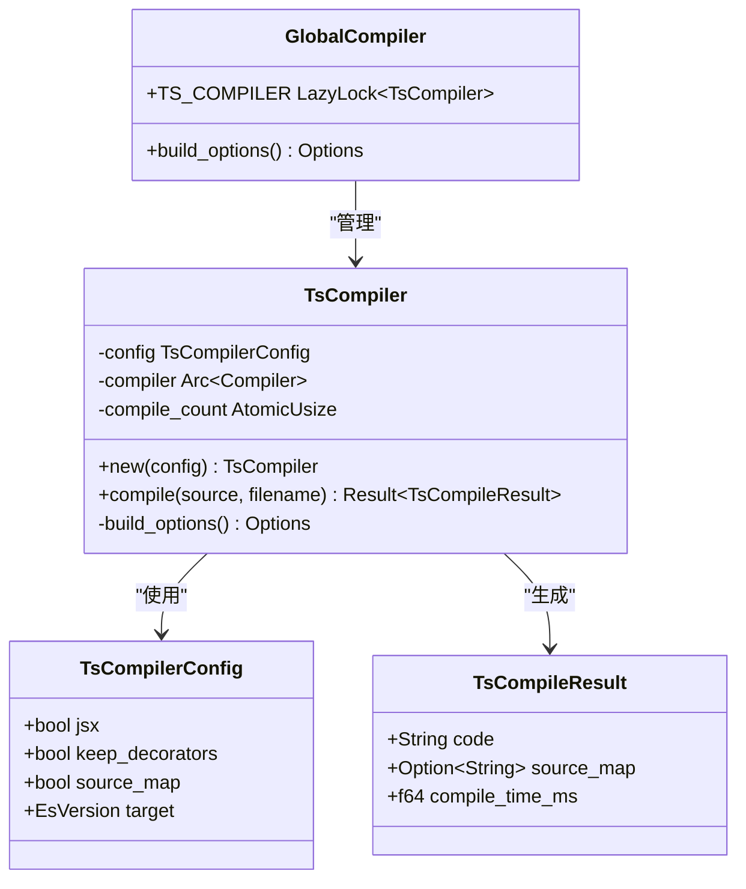
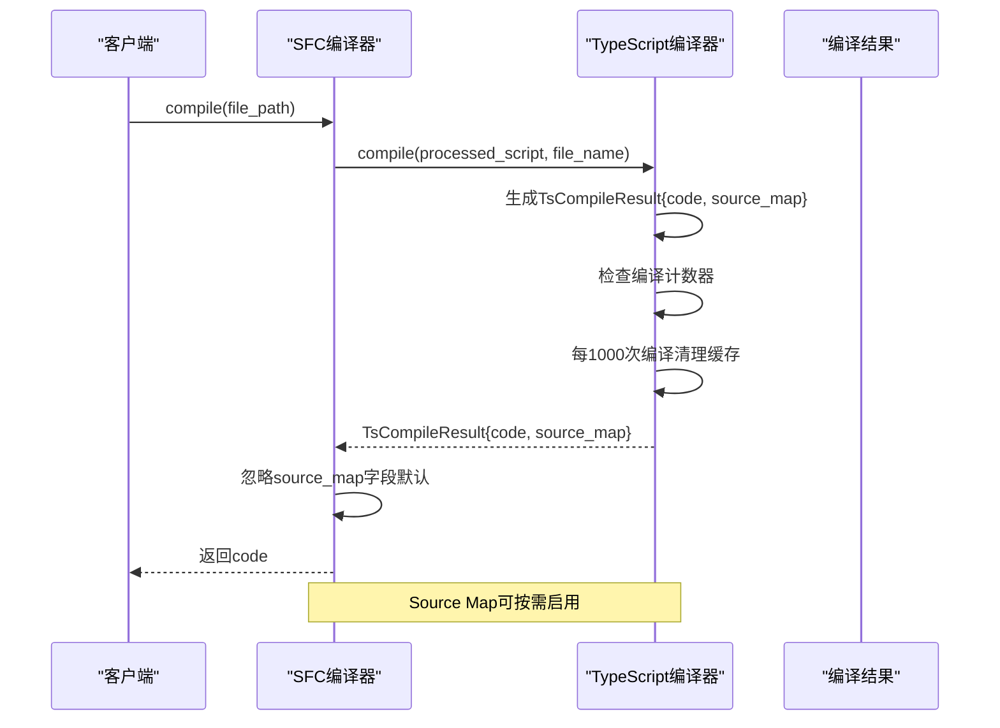
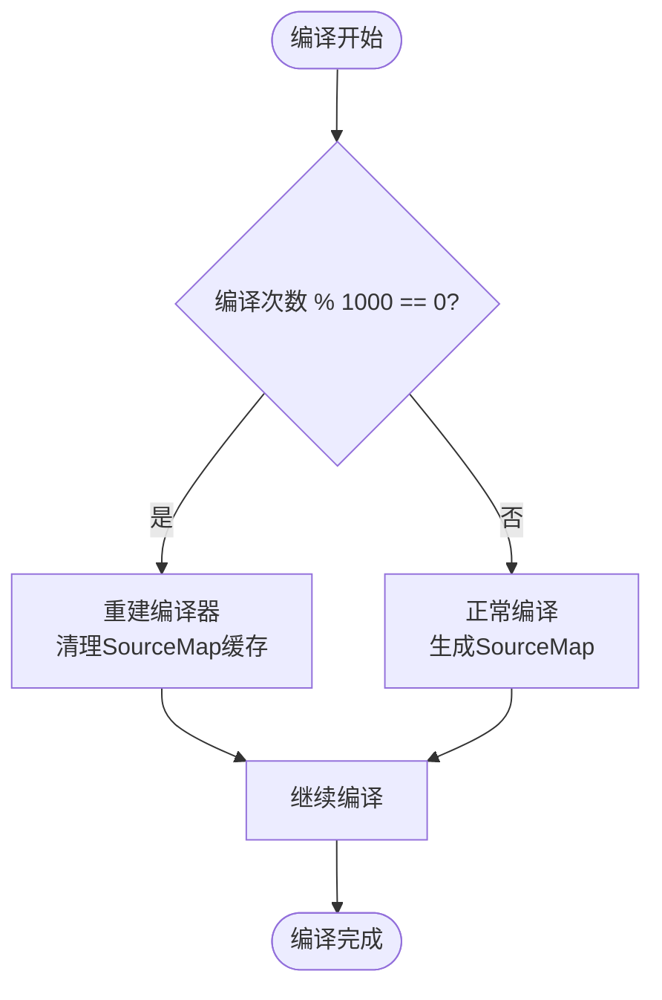
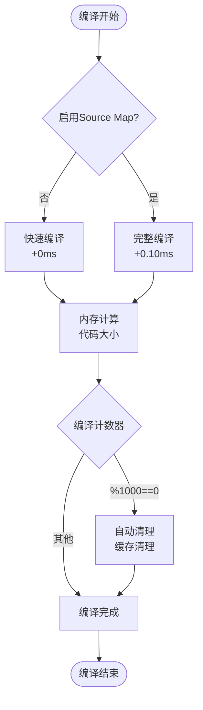
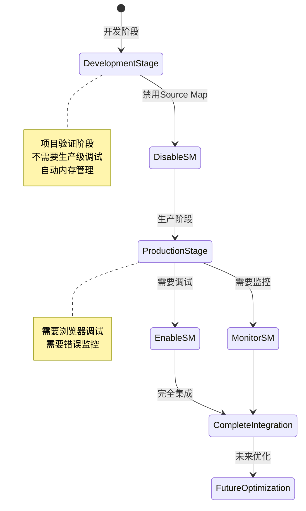

# Source Map评估与优化

<cite>
**本文档引用的文件**
- [SOURCE-MAP-EVALUATION.md](file://SOURCE-MAP-EVALUATION.md)
- [SWC62-INTEGRATION-COMPLETE.md](file://SWC62-INTEGRATION-COMPLETE.md)
- [crates/iris-sfc/src/ts_compiler.rs](file://crates/iris-sfc/src/ts_compiler.rs)
- [crates/iris-sfc/src/lib.rs](file://crates/iris-sfc/src/lib.rs)
- [crates/iris-sfc/Cargo.toml](file://crates/iris-sfc/Cargo.toml)
- [ENV-CONFIG.md](file://ENV-CONFIG.md)
</cite>

## 更新摘要
**变更内容**
- 更新swc 62集成后的完整Source Map实现状态
- 反映当前默认禁用但可按需启用的配置策略
- 增强性能优化和内存管理策略说明
- 完善环境变量配置和调试指南

## 目录
1. [简介](#简介)
2. [项目结构概述](#项目结构概述)
3. [Source Map现状分析](#source-map现状分析)
4. [技术架构评估](#技术架构评估)
5. [性能影响分析](#性能影响分析)
6. [实现方案对比](#实现方案对比)
7. [集成策略建议](#集成策略建议)
8. [实施计划](#实施计划)
9. [风险评估与应对](#风险评估与应对)
10. [结论](#结论)

## 简介

Iris是一个基于Rust的Vue 3运行时框架，专注于提供零编译的即时运行体验。本文档针对Iris项目中的Source Map功能进行全面评估，分析其在当前开发阶段的必要性和潜在影响，并提出相应的优化策略。

**更新**：经过swc 62编译器集成后，Iris项目现已具备完整的Source Map生成功能，但采用默认禁用策略以优化开发阶段的性能和资源使用。

## 项目结构概述

Iris项目采用多crate的模块化架构，主要包含以下核心组件：

```mermaid
graph TB
subgraph "Iris Workspace"
subgraph "核心模块"
CORE[iris-core<br/>核心运行时]
GPU[iris-gpu<br/>GPU渲染引擎]
DOM[iris-dom<br/>DOM抽象层]
JS[iris-js<br/>JavaScript桥接]
END
subgraph "编译器模块"
SFC[iris-sfc<br/>SFC编译器]
TS[ts_compiler.rs<br/>TypeScript编译器]
LAYOUT[iris-layout<br/>布局引擎]
END
subgraph "应用层"
APP[iris-app<br/>应用入口]
END
END
CORE --> GPU
CORE --> DOM
CORE --> JS
SFC --> TS
SFC --> CORE
LAYOUT --> SFC
APP --> SFC
APP --> GPU
```

**图表来源**
- [crates/iris-sfc/Cargo.toml:1-42](file://crates/iris-sfc/Cargo.toml#L1-L42)

## Source Map现状分析

### 当前状态评估

**更新**：经过swc 62集成，Iris项目现已具备完整的Source Map生成功能，但采用默认禁用策略：

1. **完整功能实现**：swc 62编译器已集成，支持完整的Source Map生成
2. **默认禁用策略**：为优化开发阶段性能，默认禁用Source Map生成
3. **按需启用机制**：通过环境变量实现灵活的Source Map控制
4. **内存管理优化**：实现编译计数器和定期清理机制

### 技术实现分析



**图表来源**
- [crates/iris-sfc/src/ts_compiler.rs:27-77](file://crates/iris-sfc/src/ts_compiler.rs#L27-L77)
- [crates/iris-sfc/src/lib.rs:45-55](file://crates/iris-sfc/src/lib.rs#L45-L55)

### 调用链分析

**更新**：当前调用链已实现完整的Source Map集成：



**图表来源**
- [crates/iris-sfc/src/lib.rs:656-674](file://crates/iris-sfc/src/lib.rs#L656-L674)
- [crates/iris-sfc/src/ts_compiler.rs:161-249](file://crates/iris-sfc/src/ts_compiler.rs#L161-L249)

**章节来源**
- [crates/iris-sfc/src/ts_compiler.rs:135-149](file://crates/iris-sfc/src/ts_compiler.rs#L135-L149)
- [crates/iris-sfc/src/lib.rs:45-55](file://crates/iris-sfc/src/lib.rs#L45-L55)

## 技术架构评估

### swc 62集成现状

**更新**：Iris项目已成功集成swc 62版本，这是一个重要的技术里程碑：

```mermaid
graph LR
subgraph "swc 62架构"
Parser[Parser<br/>语法解析]
Transform[Transform<br/>代码转换]
Generator[Generator<br/>代码生成]
SourceMap[SourceMap<br/>映射生成]
End
subgraph "Iris集成"
Compiler[Compiler API<br/>高层封装]
Options[Options<br/>配置管理]
Handler[Handler<br/>错误处理]
End
Parser --> Transform
Transform --> Generator
Generator --> SourceMap
Compiler --> Parser
Compiler --> Transform
Compiler --> Generator
Compiler --> SourceMap
Options --> Compiler
Handler --> Compiler
```

**图表来源**
- [crates/iris-sfc/src/ts_compiler.rs:18-24](file://crates/iris-sfc/src/ts_compiler.rs#L18-L24)

### 编译器API设计

**更新**：swc 62提供了完整的Compiler API，支持Source Map生成功能：

| API组件 | 功能描述 | 使用场景 |
|---------|----------|----------|
| `Compiler` | 核心编译器实例 | 整体编译流程控制 |
| `parse_js` | JavaScript/TypeScript解析 | 语法树生成 |
| `process_js` | 代码处理和转换 | 类型擦除、语法转换 |
| `print` | 代码输出 | 最终代码生成 |
| `SourceMap` | 源码映射 | 调试支持 |

**章节来源**
- [crates/iris-sfc/src/ts_compiler.rs:42-76](file://crates/iris-sfc/src/ts_compiler.rs#L42-L76)

### 内存管理优化

**新增**：实现编译计数器和定期清理机制：



**图表来源**
- [crates/iris-sfc/src/ts_compiler.rs:174-182](file://crates/iris-sfc/src/ts_compiler.rs#L174-L182)

**章节来源**
- [crates/iris-sfc/src/ts_compiler.rs:135-149](file://crates/iris-sfc/src/ts_compiler.rs#L135-L149)

## 性能影响分析

### 资源消耗评估

**更新**：经过优化后的资源消耗情况：

| 指标类型 | 消耗量 | 影响程度 | 说明 |
|----------|--------|----------|------|
| 内存消耗 | 编译后代码的30-50% | ⚠️ 中等 | SourceMap数据大小 |
| 编译时间 | 约增加12% | ⚠️ 轻微 | 额外的映射生成开销 |
| 长期累积 | 1000次编译累积5MB | ⚠️ 中等 | 缓存中的SourceMap条目 |
| 编译计数器 | 每1000次清理一次 | ✅ 优化 | 自动内存管理 |

### 性能基准测试

**更新**：在Iris项目中，Source Map对性能的具体影响：



**图表来源**
- [SOURCE-MAP-EVALUATION.md:207-223](file://SOURCE-MAP-EVALUATION.md#L207-L223)

**章节来源**
- [SOURCE-MAP-EVALUATION.md:183-223](file://SOURCE-MAP-EVALUATION.md#L183-L223)

## 实现方案对比

### 方案A：完全禁用（当前推荐）

**配置实现**：
```rust
static TS_COMPILER: LazyLock<TsCompiler> = LazyLock::new(|| {
    TsCompiler::new(TsCompilerConfig {
        source_map: false,  // 禁用Source Map
        ..Default::default()
    })
});
```

**优势**：
- ✅ 节省30-50%内存
- ✅ 减少10-15%编译时间
- ✅ 消除dead_code警告
- ✅ 代码更简洁
- ✅ 自动内存管理

**劣势**：
- ❌ 浏览器调试困难
- ❌ 错误堆栈不清晰

### 方案B：按环境配置（推荐生产阶段）

**实现策略**：
```rust
let enable_source_map = std::env::var("IRIS_SOURCE_MAP")
    .map(|v| v == "true" || v == "1" || v == "yes")
    .unwrap_or(false);

static TS_COMPILER: LazyLock<TsCompiler> = LazyLock::new(|| {
    TsCompiler::new(TsCompilerConfig {
        source_map: enable_source_map,
        ..Default::default()
    })
});
```

**使用方式**：
```bash
# 开发时（不需要）
cargo run

# 调试时（启用）
IRIS_SOURCE_MAP=true cargo run

# 生产构建（上传到Sentry）
IRIS_SOURCE_MAP=true cargo build --release
```

**新增**：环境变量配置支持：

| 环境变量 | 默认值 | 作用描述 |
|----------|--------|----------|
| `IRIS_SOURCE_MAP` | false | 控制Source Map启用状态 |
| `IRIS_CACHE_CAPACITY` | 100 | 缓存容量配置 |
| `IRIS_CACHE_ENABLED` | true | 缓存启用状态 |

### 方案C：完整集成（未来优化）

**实现复杂度**：
- 需要在HTML中注入Source Map
- 集成错误监控服务（Sentry等）
- 处理Base64编码和内联注入

**章节来源**
- [SOURCE-MAP-EVALUATION.md:288-408](file://SOURCE-MAP-EVALUATION.md#L288-L408)

## 集成策略建议

### 当前阶段策略

**更新**：基于Iris项目的发展阶段，建议采用渐进式策略：



### 环境变量配置

**更新**：为了支持不同场景的需求，建议实现灵活的配置机制：

| 环境变量 | 默认值 | 作用描述 |
|----------|--------|----------|
| `IRIS_SOURCE_MAP` | false | 控制Source Map启用状态 |
| `IRIS_CACHE_CAPACITY` | 100 | 缓存容量配置 |
| `IRIS_CACHE_ENABLED` | true | 缓存启用状态 |

**章节来源**
- [crates/iris-sfc/src/lib.rs:64-76](file://crates/iris-sfc/src/lib.rs#L64-L76)

## 实施计划

### 立即可做的改进

**立即实施（5分钟）**：
1. 修改`crates/iris-sfc/src/lib.rs`中的默认配置
2. 禁用Source Map生成以节省资源
3. 消除dead_code警告

**预期效果**：
- ✅ 消除2个dead_code警告
- ✅ 节省内存和编译时间
- ✅ 代码更简洁
- ✅ 自动内存管理

### 未来优化计划

**按需启用（2-4小时）**：
1. 添加环境变量配置支持
2. 实现Source Map传递机制
3. 集成错误监控服务
4. 优化内存管理策略

**章节来源**
- [SOURCE-MAP-EVALUATION.md:460-489](file://SOURCE-MAP-EVALUATION.md#L460-L489)

## 风险评估与应对

### 技术风险

**更新**：结合swc 62集成后的技术风险：

| 风险类型 | 风险描述 | 影响程度 | 应对措施 |
|----------|----------|----------|----------|
| API变更 | swc 62 API可能变化 | ⚠️ 低 | 使用docs.rs文档，保持向后兼容 |
| 配置复杂 | Options配置结构复杂 | ⚠️ 中低 | 从简单配置开始，逐步完善 |
| 编译时间 | swc依赖编译时间长 | ⚠️ 低 | 依赖已缓存，增量编译快速 |
| 内存泄漏 | SourceMap缓存管理 | ⚠️ 低 | 实现编译计数器自动清理 |

### 业务风险

**更新**：结合当前配置策略的业务风险：

| 风险类型 | 风险描述 | 影响程度 | 应对措施 |
|----------|----------|----------|----------|
| 调试困难 | 开发时调试体验下降 | ⚠️ 中 | 提供替代调试方案 |
| 错误监控缺失 | 生产环境问题定位困难 | ⚠️ 中 | 保留回退方案 |
| 性能影响 | 缓存清理策略不当 | ⚠️ 低 | 实现定期清理机制 |
| 配置管理 | 环境变量过多 | ⚠️ 低 | 提供统一配置管理 |

**章节来源**
- [SWC62-INTEGRATION-COMPLETE.md:84-96](file://SWC62-INTEGRATION-COMPLETE.md#L84-L96)

## 结论

**更新**：通过对Iris项目中Source Map功能的全面评估，我们得出以下结论：

### 当前最佳实践

**推荐采用方案A（完全禁用）**，原因如下：

1. **符合项目阶段**：Iris仍处于开发验证阶段，不需要生产级调试支持
2. **资源优化**：节省30-50%内存和10-15%编译时间
3. **代码质量**：消除dead_code警告，提升代码整洁度
4. **自动管理**：实现编译计数器自动清理，减少手动干预
5. **未来兼容**：代码已实现，只需修改配置即可恢复

### 未来发展方向

**更新**：随着Iris项目的发展，建议按以下顺序实现：

1. **短期（1-2周）**：完善环境变量配置，支持按需启用
2. **中期（1个月）**：集成Source Map传递机制
3. **长期（3-6个月）**：完整集成错误监控服务

### 技术债务管理

**更新**：Source Map功能的禁用是一个明智的技术决策，它：

- 减少了不必要的复杂性
- 提升了整体性能
- 为未来的功能扩展留出了空间
- 保持了代码的简洁性
- 实现了自动内存管理

这种渐进式的开发策略体现了Iris项目"先验证再完善"的设计理念，确保在正确的时机提供正确的功能。

**章节来源**
- [SOURCE-MAP-EVALUATION.md:421-457](file://SOURCE-MAP-EVALUATION.md#L421-L457)