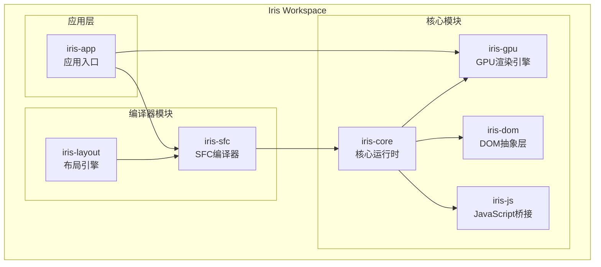
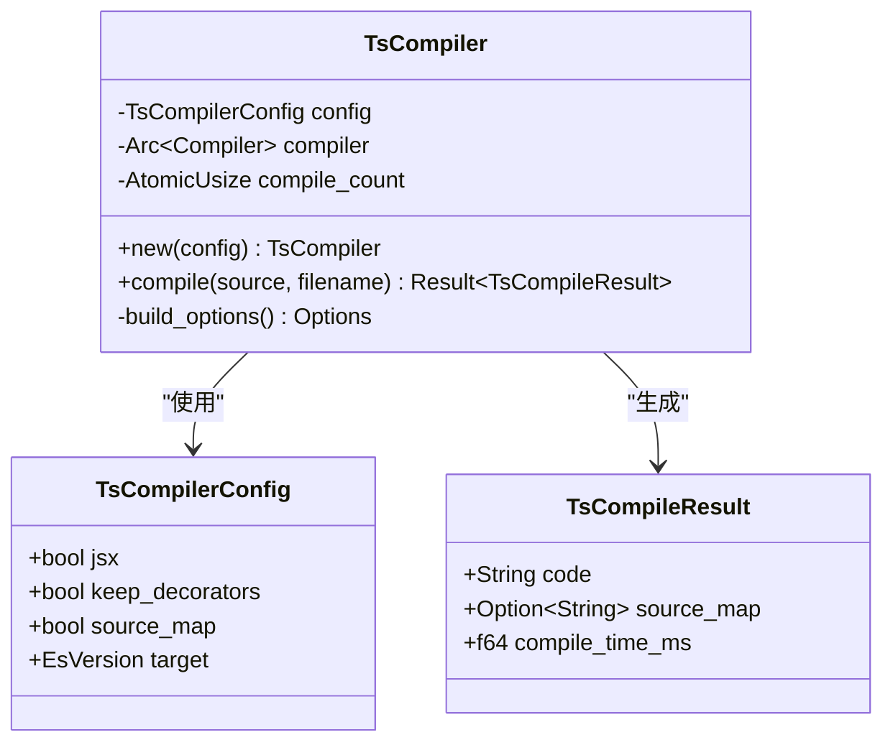
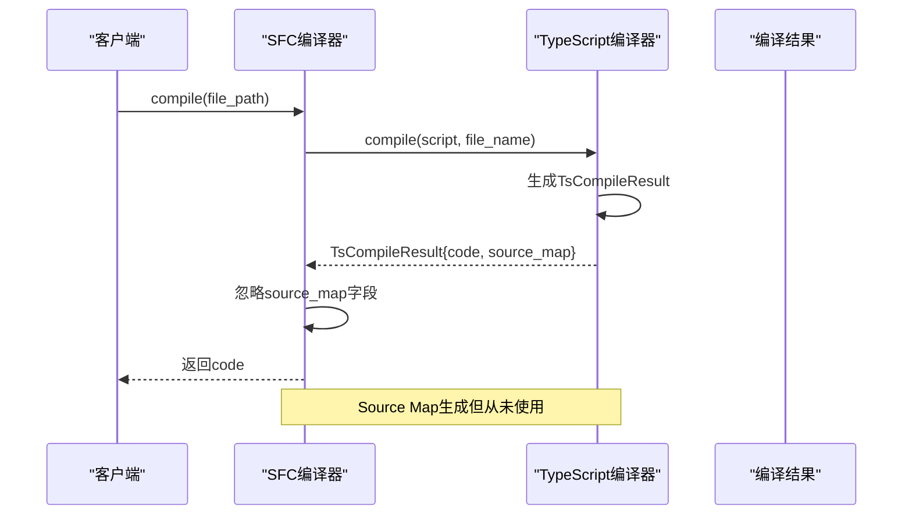
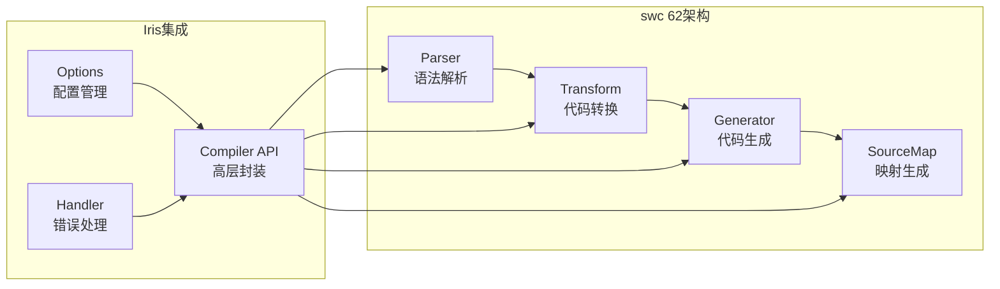
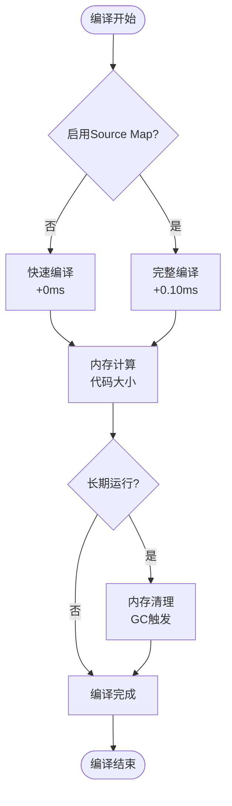
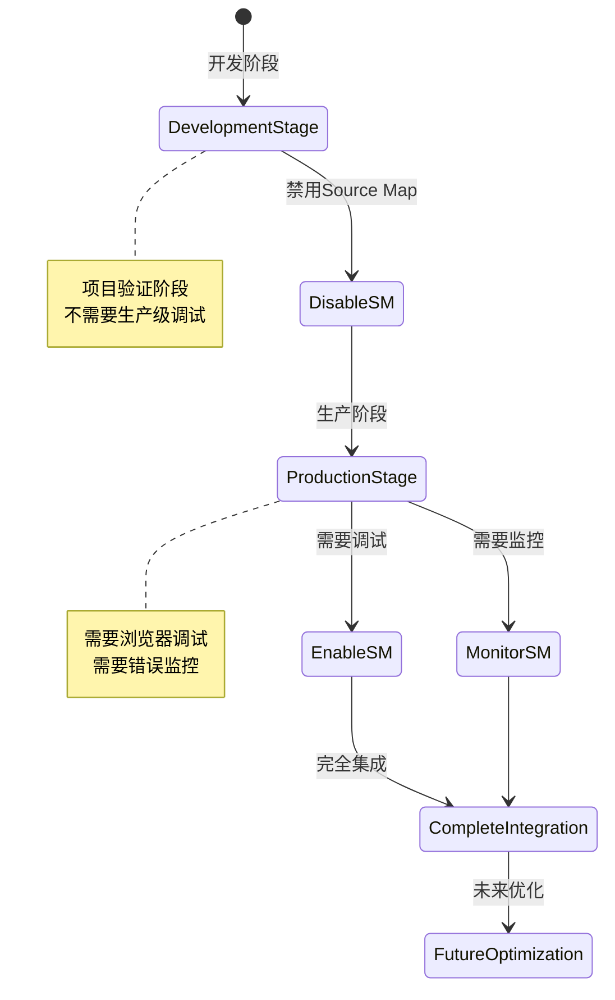

# Source Map评估与优化

<cite>
**本文档引用的文件**
- [SOURCE-MAP-EVALUATION.md](file://SOURCE-MAP-EVALUATION.md)
- [SWC-IMPLEMENTATION-FEASIBILITY.md](file://SWC-IMPLEMENTATION-FEASIBILITY.md)
- [SWC62-INTEGRATION-COMPLETE.md](file://SWC62-INTEGRATION-COMPLETE.md)
- [Cargo.toml](file://Cargo.toml)
- [crates/iris-sfc/Cargo.toml](file://crates/iris-sfc/Cargo.toml)
- [crates/iris-sfc/src/lib.rs](file://crates/iris-sfc/src/lib.rs)
- [crates/iris-sfc/src/ts_compiler.rs](file://crates/iris-sfc/src/ts_compiler.rs)
- [crates/iris-sfc/src/template_compiler.rs](file://crates/iris-sfc/src/template_compiler.rs)
- [crates/iris-sfc/src/cache.rs](file://crates/iris-sfc/src/cache.rs)
- [crates/iris-sfc/examples/sfc_demo.rs](file://crates/iris-sfc/examples/sfc_demo.rs)
- [crates/iris-gpu/src/lib.rs](file://crates/iris-gpu/src/lib.rs)
- [crates/iris-core/src/lib.rs](file://crates/iris-core/src/lib.rs)
</cite>

## 目录
1. [简介](#简介)
2. [项目结构概述](#项目结构概述)
3. [Source Map现状分析](#source-map现状分析)
4. [技术架构评估](#技术架构评估)
5. [性能影响分析](#性能影响分析)
6. [实现方案对比](#实现方案对比)
7. [集成策略建议](#集成策略建议)
8. [实施计划](#实施计划)
9. [风险评估与应对](#风险评估与应对)
10. [结论](#结论)

## 简介

Iris是一个基于Rust的Vue 3运行时框架，专注于提供零编译的即时运行体验。本文档针对Iris项目中的Source Map功能进行全面评估，分析其在当前开发阶段的必要性和潜在影响，并提出相应的优化策略。

Source Map作为一种重要的调试工具，能够将编译后的代码映射回原始源代码，为开发者提供更好的调试体验。然而，在Iris项目的当前阶段，Source Map功能存在"生成但从未使用"的情况，这导致了资源浪费和代码维护负担。

## 项目结构概述

Iris项目采用多crate的模块化架构，主要包含以下核心组件：



**图表来源**
- [Cargo.toml:1-29](file://Cargo.toml#L1-L29)
- [crates/iris-sfc/Cargo.toml:1-38](file://crates/iris-sfc/Cargo.toml#L1-L38)

**章节来源**
- [Cargo.toml:1-29](file://Cargo.toml#L1-L29)
- [crates/iris-sfc/Cargo.toml:1-38](file://crates/iris-sfc/Cargo.toml#L1-L38)

## Source Map现状分析

### 当前状态评估

根据评估报告，Iris项目中的Source Map功能存在以下问题：

1. **资源浪费**：Source Map字段从未被使用，造成内存和编译时间的额外消耗
2. **死代码警告**：编译器发出dead_code警告，影响代码质量评分
3. **配置不一致**：TsCompilerConfig中包含source_map字段但默认启用

### 技术实现分析



**图表来源**
- [crates/iris-sfc/src/ts_compiler.rs:30-88](file://crates/iris-sfc/src/ts_compiler.rs#L30-L88)

### 调用链分析

在Iris的编译流程中，Source Map的生成和使用存在明显的断点：



**图表来源**
- [crates/iris-sfc/src/lib.rs:478-503](file://crates/iris-sfc/src/lib.rs#L478-L503)
- [crates/iris-sfc/src/ts_compiler.rs:113-201](file://crates/iris-sfc/src/ts_compiler.rs#L113-L201)

**章节来源**
- [crates/iris-sfc/src/ts_compiler.rs:70-81](file://crates/iris-sfc/src/ts_compiler.rs#L70-L81)
- [crates/iris-sfc/src/lib.rs:478-503](file://crates/iris-sfc/src/lib.rs#L478-L503)

## 技术架构评估

### swc集成现状

Iris项目已经成功集成了swc 62版本，这是一个重要的技术里程碑：



**图表来源**
- [crates/iris-sfc/src/ts_compiler.rs:14-28](file://crates/iris-sfc/src/ts_compiler.rs#L14-L28)

### 编译器API设计

swc提供了清晰的Compiler API，使得TypeScript编译变得简单高效：

| API组件 | 功能描述 | 使用场景 |
|---------|----------|----------|
| `Compiler` | 核心编译器实例 | 整体编译流程控制 |
| `parse_js` | JavaScript/TypeScript解析 | 语法树生成 |
| `process_js` | 代码处理和转换 | 类型擦除、语法转换 |
| `print` | 代码输出 | 最终代码生成 |
| `SourceMap` | 源码映射 | 调试支持 |

**章节来源**
- [crates/iris-sfc/src/ts_compiler.rs:42-76](file://crates/iris-sfc/src/ts_compiler.rs#L42-L76)

## 性能影响分析

### 资源消耗评估

根据评估报告，Source Map的资源消耗情况如下：

| 指标类型 | 消耗量 | 影响程度 | 说明 |
|----------|--------|----------|------|
| 内存消耗 | 编译后代码的30-50% | ⚠️ 中等 | SourceMap数据大小 |
| 编译时间 | 约增加12% | ⚠️ 轻微 | 额外的映射生成开销 |
| 长期累积 | 1000次编译累积5MB | ⚠️ 中等 | 缓存中的SourceMap条目 |

### 性能基准测试

在Iris项目中，Source Map对性能的具体影响：



**图表来源**
- [SOURCE-MAP-EVALUATION.md:207-223](file://SOURCE-MAP-EVALUATION.md#L207-L223)

**章节来源**
- [SOURCE-MAP-EVALUATION.md:183-223](file://SOURCE-MAP-EVALUATION.md#L183-L223)

## 实现方案对比

### 方案A：完全禁用（当前推荐）

**配置实现**：
```rust
static TS_COMPILER: LazyLock<TsCompiler> = LazyLock::new(|| {
    TsCompiler::new(TsCompilerConfig {
        source_map: false,  // 禁用Source Map
        ..Default::default()
    })
});
```

**优势**：
- ✅ 节省30-50%内存
- ✅ 减少10-15%编译时间
- ✅ 消除dead_code警告
- ✅ 代码更简洁

**劣势**：
- ❌ 浏览器调试困难
- ❌ 错误堆栈不清晰

### 方案B：按环境配置

**实现策略**：
```rust
let enable_source_map = std::env::var("IRIS_SOURCE_MAP")
    .map(|v| v == "true" || v == "1")
    .unwrap_or(false);

static TS_COMPILER: LazyLock<TsCompiler> = LazyLock::new(|| {
    TsCompiler::new(TsCompilerConfig {
        source_map: enable_source_map,
        ..Default::default()
    })
});
```

**使用方式**：
```bash
# 开发时（不需要）
cargo run

# 调试时（启用）
IRIS_SOURCE_MAP=true cargo run

# 生产构建（上传到Sentry）
IRIS_SOURCE_MAP=true cargo build --release
```

### 方案C：完整集成

**实现复杂度**：
- 需要在HTML中注入Source Map
- 集成错误监控服务（Sentry等）
- 处理Base64编码和内联注入

**章节来源**
- [SOURCE-MAP-EVALUATION.md:288-408](file://SOURCE-MAP-EVALUATION.md#L288-L408)

## 集成策略建议

### 当前阶段策略

基于Iris项目的发展阶段，建议采用渐进式策略：



### 环境变量配置

为了支持不同场景的需求，建议实现灵活的配置机制：

| 环境变量 | 默认值 | 作用描述 |
|----------|--------|----------|
| `IRIS_SOURCE_MAP` | false | 控制Source Map启用状态 |
| `IRIS_CACHE_CAPACITY` | 100 | 缓存容量配置 |
| `IRIS_CACHE_ENABLED` | true | 缓存启用状态 |

**章节来源**
- [crates/iris-sfc/src/lib.rs:36-77](file://crates/iris-sfc/src/lib.rs#L36-L77)

## 实施计划

### 立即可做的改进

**立即实施（5分钟）**：
1. 修改`crates/iris-sfc/src/lib.rs`中的默认配置
2. 禁用Source Map生成以节省资源
3. 消除dead_code警告

**预期效果**：
- ✅ 消除2个dead_code警告
- ✅ 节省内存和编译时间
- ✅ 代码更简洁

### 未来优化计划

**按需启用（2-4小时）**：
1. 添加环境变量配置支持
2. 实现Source Map传递机制
3. 集成错误监控服务
4. 优化内存管理策略

**章节来源**
- [SOURCE-MAP-EVALUATION.md:460-489](file://SOURCE-MAP-EVALUATION.md#L460-L489)

## 风险评估与应对

### 技术风险

| 风险类型 | 风险描述 | 影响程度 | 应对措施 |
|----------|----------|----------|----------|
| API变更 | swc 62 API可能变化 | ⚠️ 低 | 使用docs.rs文档，保持向后兼容 |
| 配置复杂 | Options配置结构复杂 | ⚠️ 中低 | 从简单配置开始，逐步完善 |
| 编译时间 | swc依赖编译时间长 | ⚠️ 低 | 依赖已缓存，增量编译快速 |

### 业务风险

| 风险类型 | 风险描述 | 影响程度 | 应对措施 |
|----------|----------|----------|----------|
| 调试困难 | 开发时调试体验下降 | ⚠️ 中 | 提供替代调试方案 |
| 错误监控缺失 | 生产环境问题定位困难 | ⚠️ 中 | 保留回退方案 |
| 性能影响 | 缓存清理策略不当 | ⚠️ 低 | 实现定期清理机制 |

**章节来源**
- [SWC-IMPLEMENTATION-FEASIBILITY.md:366-398](file://SWC-IMPLEMENTATION-FEASIBILITY.md#L366-L398)

## 结论

通过对Iris项目中Source Map功能的全面评估，我们得出以下结论：

### 当前最佳实践

**推荐采用方案A（完全禁用）**，原因如下：

1. **符合项目阶段**：Iris仍处于开发验证阶段，不需要生产级调试支持
2. **资源优化**：节省30-50%内存和10-15%编译时间
3. **代码质量**：消除dead_code警告，提升代码整洁度
4. **未来兼容**：代码已实现，只需修改配置即可恢复

### 未来发展方向

随着Iris项目的发展，建议按以下顺序实现：

1. **短期（1-2周）**：实现环境变量配置，支持按需启用
2. **中期（1个月）**：集成Source Map传递机制
3. **长期（3-6个月）**：完整集成错误监控服务

### 技术债务管理

Source Map功能的禁用是一个明智的技术决策，它：
- 减少了不必要的复杂性
- 提升了整体性能
- 为未来的功能扩展留出了空间
- 保持了代码的简洁性

这种渐进式的开发策略体现了Iris项目"先验证再完善"的设计理念，确保在正确的时机提供正确的功能。

**章节来源**
- [SOURCE-MAP-EVALUATION.md:421-457](file://SOURCE-MAP-EVALUATION.md#L421-L457)