# 双工具架构设计

<cite>
**本文档引用的文件**
- [ARCHITECTURE.md](file://ARCHITECTURE.md)
- [DUAL_TOOL_ARCHITECTURE.md](file://docs/DUAL_TOOL_ARCHITECTURE.md)
- [Cargo.toml](file://Cargo.toml)
- [crates/iris-jetcrab-engine/Cargo.toml](file://crates/iris-jetcrab-engine/Cargo.toml)
- [crates/iris-jetcrab-engine/src/lib.rs](file://crates/iris-jetcrab-engine/src/lib.rs)
- [crates/iris-jetcrab-engine/src/engine.rs](file://crates/iris-jetcrab-engine/src/engine.rs)
- [crates/iris-jetcrab-engine/src/project_scanner.rs](file://crates/iris-jetcrab-engine/src/project_scanner.rs)
- [crates/iris-jetcrab-engine/src/vue_compiler.rs](file://crates/iris-jetcrab-engine/src/vue_compiler.rs)
- [crates/iris-jetcrab-engine/src/wasm_api.rs](file://crates/iris-jetcrab-engine/src/wasm_api.rs)
- [crates/iris-jetcrab-cli/Cargo.toml](file://crates/iris-jetcrab-cli/Cargo.toml)
- [crates/iris-jetcrab-cli/src/main.rs](file://crates/iris-jetcrab-cli/src/main.rs)
- [crates/iris-jetcrab-cli/src/server/mod.rs](file://crates/iris-jetcrab-cli/src/server/mod.rs)
- [crates/iris-jetcrab-cli/src/server/http_server.rs](file://crates/iris-jetcrab-cli/src/server/http_server.rs)
- [crates/iris-jetcrab-cli/src/server/compiler_cache.rs](file://crates/iris-jetcrab-cli/src/server/compiler_cache.rs)
- [crates/iris-runtime/package.json](file://crates/iris-runtime/package.json)
- [crates/iris-runtime/README.md](file://crates/iris-runtime/README.md)
- [crates/iris-cli/src/utils.rs](file://crates/iris-cli/src/utils.rs)
</cite>

## 更新摘要
**所做更改**
- 更新了架构概述以反映 iris-jetcrab-cli 从独立 CLI 工具转变为 HTTP 服务器包装器的新设计
- 新增了 HTTP 服务器包装器架构分析
- 更新了双工具前端设计章节以体现 CLI 专注 HTTP 服务而引擎提供核心 Vue 项目处理能力
- 增强了编译器缓存机制的详细说明
- 更新了依赖关系分析以反映新的架构模式

## 目录
1. [简介](#简介)
2. [项目结构](#项目结构)
3. [核心组件](#核心组件)
4. [架构总览](#架构总览)
5. [详细组件分析](#详细组件分析)
6. [依赖关系分析](#依赖关系分析)
7. [性能考虑](#性能考虑)
8. [故障排除指南](#故障排除指南)
9. [结论](#结论)

## 简介

Iris JetCrab 采用**双工具架构**，提供两种不同运行环境下的 Vue 项目开发体验。该架构的核心思想是将共享功能集中在一个强大的核心引擎中，同时为不同的运行环境提供专门的工具前端。

**重要更新**：架构重构后，iris-jetcrab-cli 已从独立的 CLI 工具转变为 HTTP 服务器包装器，核心功能已完全迁移到 iris-jetcrab-engine。这种设计解决了传统开发工具面临的两大挑战：
- **环境隔离**：Rust 开发者和 Node.js 开发者有不同的技术栈需求
- **代码重复**：避免在多个工具中重复实现相同的功能逻辑

通过双工具架构，Iris JetCrab 实现了真正的跨平台开发体验，用户可以根据自己的技术背景选择最适合的工具，同时享受一致的功能体验。

## 项目结构

### 整体架构层次

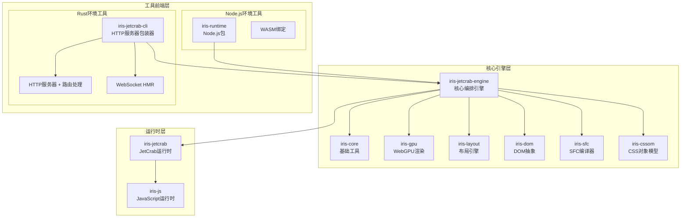

**图表来源**
- [DUAL_TOOL_ARCHITECTURE.md:1-382](file://docs/DUAL_TOOL_ARCHITECTURE.md#L1-L382)
- [Cargo.toml:1-50](file://Cargo.toml#L1-L50)

### 模块职责分工

| 模块 | 职责 | 依赖关系 | 关键特性 |
|------|------|----------|----------|
| **iris-jetcrab-engine** | 核心编排引擎 | iris-core, iris-gpu, iris-layout, iris-dom, iris-sfc, iris-cssom, iris-jetcrab | Vue项目检测、SFC编译、模块依赖解析、热更新管理 |
| **iris-jetcrab-cli** | HTTP服务器包装器 | iris-jetcrab-engine, iris-core, iris-sfc, axum, tokio | 开发服务器、按需编译、项目信息查询、HMR WebSocket |
| **iris-runtime** | Node.js开发服务器 | iris-jetcrab-engine(WASM) | 浏览器渲染、热更新、文件监听 |
| **iris-jetcrab** | JavaScript运行时 | iris-core, iris-dom, iris-js | JetCrab引擎集成、模块系统 |

**章节来源**
- [DUAL_TOOL_ARCHITECTURE.md:18-123](file://docs/DUAL_TOOL_ARCHITECTURE.md#L18-L123)
- [Cargo.toml:27-41](file://Cargo.toml#L27-L41)

## 核心组件

### 核心引擎架构

Iris JetCrab 的核心引擎是整个架构的中枢，负责协调各个子系统的协同工作。其设计遵循单一职责原则，将复杂的功能分解为可管理的模块。

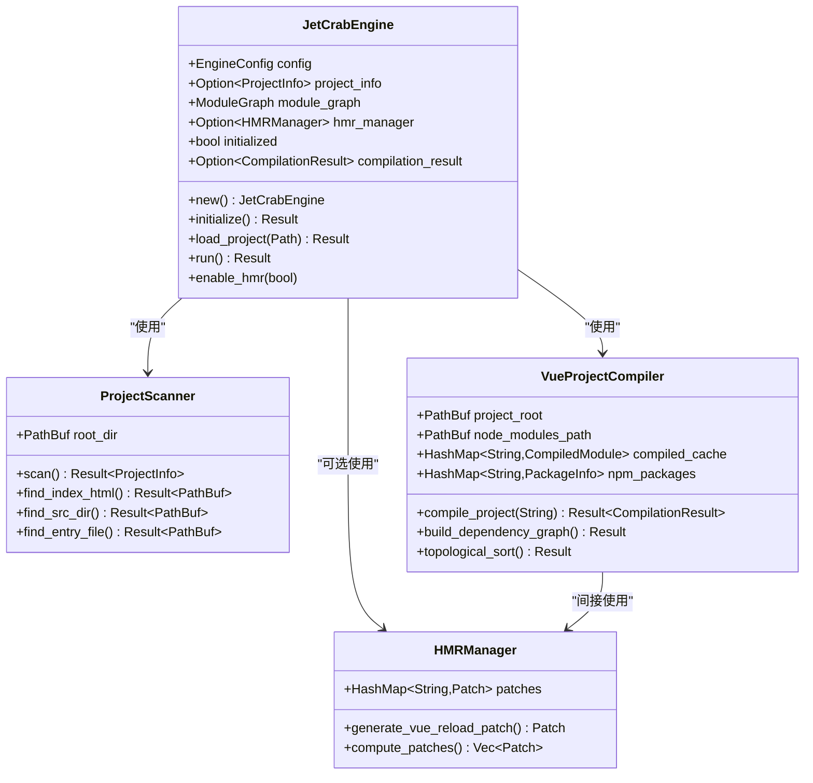

**图表来源**
- [crates/iris-jetcrab-engine/src/engine.rs:45-396](file://crates/iris-jetcrab-engine/src/engine.rs#L45-L396)
- [crates/iris-jetcrab-engine/src/project_scanner.rs:41-267](file://crates/iris-jetcrab-engine/src/project_scanner.rs#L41-L267)
- [crates/iris-jetcrab-engine/src/vue_compiler.rs:51-644](file://crates/iris-jetcrab-engine/src/vue_compiler.rs#L51-L644)

### HTTP服务器包装器架构

**重要更新**：iris-jetcrab-cli 现在是一个专门的 HTTP 服务器包装器，负责启动 Web 服务器、处理 HTTP 请求并调用 iris-jetcrab-engine 进行编译。

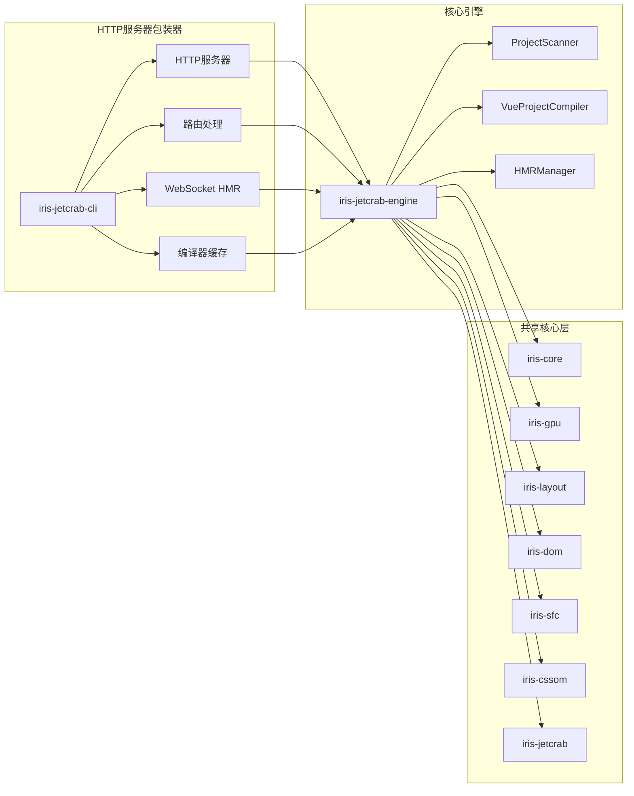

**图表来源**
- [crates/iris-jetcrab-cli/src/main.rs:1-71](file://crates/iris-jetcrab-cli/src/main.rs#L1-L71)
- [crates/iris-jetcrab-cli/src/server/http_server.rs:1-91](file://crates/iris-jetcrab-cli/src/server/http_server.rs#L1-L91)
- [crates/iris-jetcrab-cli/src/server/compiler_cache.rs:1-67](file://crates/iris-jetcrab-cli/src/server/compiler_cache.rs#L1-L67)

**章节来源**
- [DUAL_TOOL_ARCHITECTURE.md:55-123](file://docs/DUAL_TOOL_ARCHITECTURE.md#L55-L123)
- [crates/iris-jetcrab-cli/src/main.rs:12-71](file://crates/iris-jetcrab-cli/src/main.rs#L12-L71)

## 架构总览

### 数据流架构

**重要更新**：Iris JetCrab 的双工具架构现在实现了两条平行的数据流，分别服务于不同的运行环境，其中 CLI 专注于 HTTP 服务器而引擎提供核心编译能力：

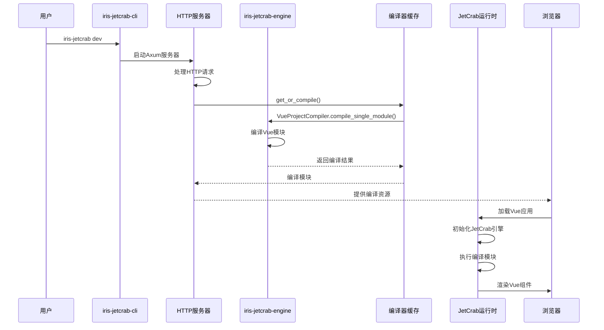

**图表来源**
- [DUAL_TOOL_ARCHITECTURE.md:205-271](file://docs/DUAL_TOOL_ARCHITECTURE.md#L205-L271)
- [crates/iris-jetcrab-engine/src/engine.rs:126-370](file://crates/iris-jetcrab-engine/src/engine.rs#L126-L370)
- [crates/iris-jetcrab-cli/src/server/compiler_cache.rs:30-50](file://crates/iris-jetcrab-cli/src/server/compiler_cache.rs#L30-L50)

### WASM集成架构

Node.js 环境下的 iris-runtime 通过 WebAssembly 与核心引擎进行交互：

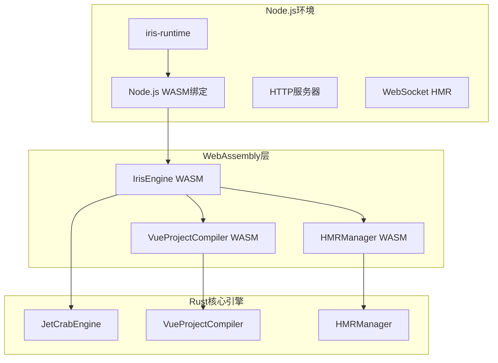

**图表来源**
- [crates/iris-jetcrab-engine/src/wasm_api.rs:13-192](file://crates/iris-jetcrab-engine/src/wasm_api.rs#L13-L192)
- [crates/iris-runtime/README.md:92-105](file://crates/iris-runtime/README.md#L92-L105)

**章节来源**
- [DUAL_TOOL_ARCHITECTURE.md:275-291](file://docs/DUAL_TOOL_ARCHITECTURE.md#L275-L291)
- [crates/iris-runtime/README.md:74-90](file://crates/iris-runtime/README.md#L74-L90)

## 详细组件分析

### 核心引擎组件

#### JetCrabEngine 主控制器

JetCrabEngine 是整个架构的核心控制器，负责协调项目扫描、编译和运行的完整流程。

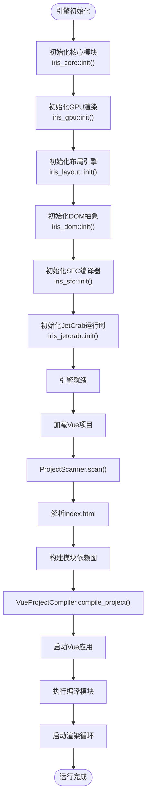

**图表来源**
- [crates/iris-jetcrab-engine/src/engine.rs:88-124](file://crates/iris-jetcrab-engine/src/engine.rs#L88-L124)
- [crates/iris-jetcrab-engine/src/engine.rs:126-370](file://crates/iris-jetcrab-engine/src/engine.rs#L126-L370)

#### 项目扫描器 ProjectScanner

ProjectScanner 负责扫描和解析 Vue 项目的结构，提取关键信息用于后续编译。

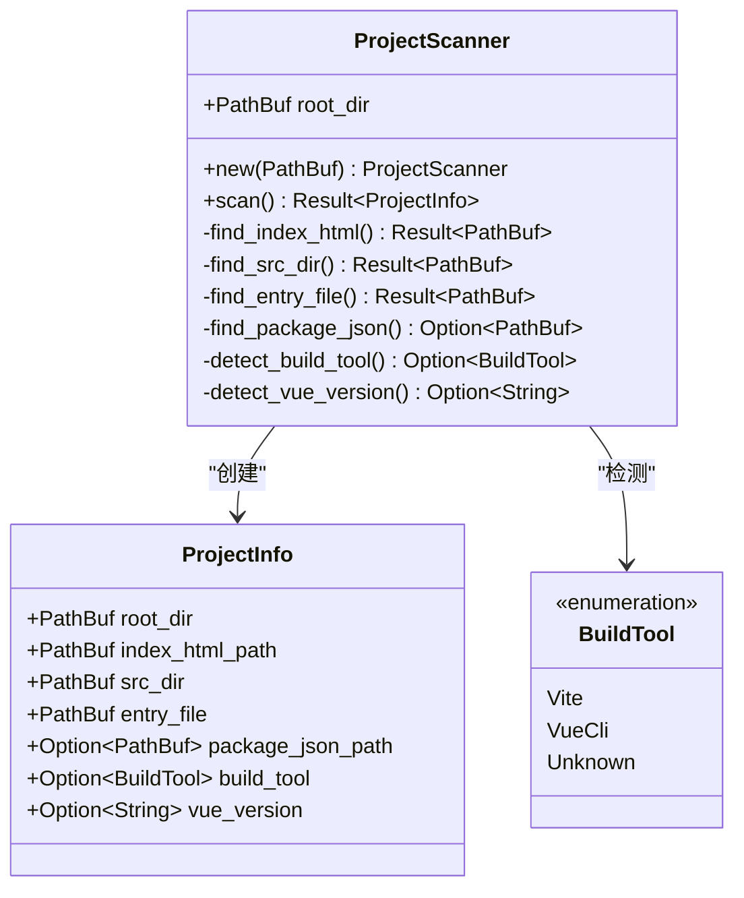

**图表来源**
- [crates/iris-jetcrab-engine/src/project_scanner.rs:11-267](file://crates/iris-jetcrab-engine/src/project_scanner.rs#L11-L267)

**章节来源**
- [crates/iris-jetcrab-engine/src/engine.rs:126-153](file://crates/iris-jetcrab-engine/src/engine.rs#L126-L153)
- [crates/iris-jetcrab-engine/src/project_scanner.rs:53-93](file://crates/iris-jetcrab-engine/src/project_scanner.rs#L53-L93)

#### Vue项目编译器 VueProjectCompiler

VueProjectCompiler 是编译系统的核心，负责从入口文件开始反向解析依赖并按拓扑顺序编译所有模块。

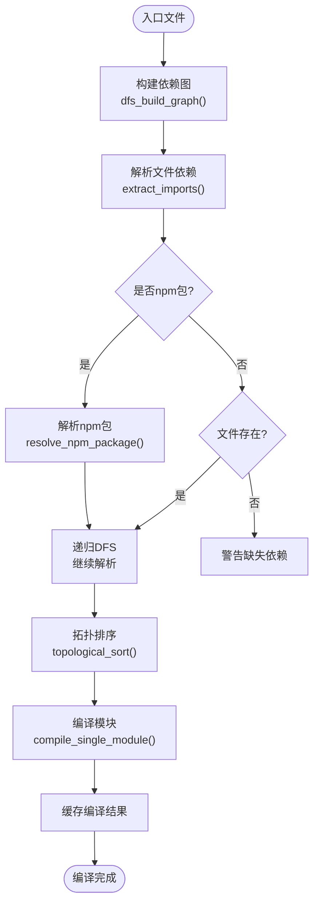

**图表来源**
- [crates/iris-jetcrab-engine/src/vue_compiler.rs:128-165](file://crates/iris-jetcrab-engine/src/vue_compiler.rs#L128-L165)
- [crates/iris-jetcrab-engine/src/vue_compiler.rs:167-233](file://crates/iris-jetcrab-engine/src/vue_compiler.rs#L167-L233)

**章节来源**
- [crates/iris-jetcrab-engine/src/vue_compiler.rs:128-165](file://crates/iris-jetcrab-engine/src/vue_compiler.rs#L128-L165)
- [crates/iris-jetcrab-engine/src/vue_compiler.rs:480-533](file://crates/iris-jetcrab-engine/src/vue_compiler.rs#L480-L533)

### 工具前端组件

#### HTTP服务器包装器

**重要更新**：iris-jetcrab-cli 现在是一个专门的 HTTP 服务器包装器，提供开发服务器功能而非独立的 CLI 工具。

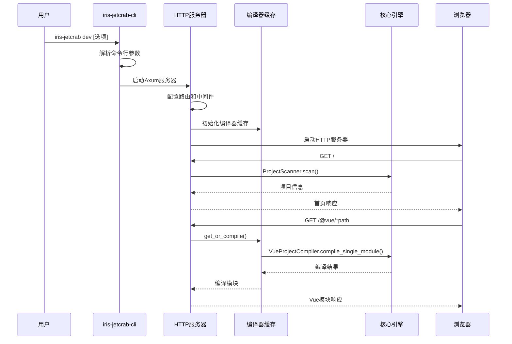

**图表来源**
- [crates/iris-jetcrab-cli/src/main.rs:58-71](file://crates/iris-jetcrab-cli/src/main.rs#L58-L71)
- [crates/iris-jetcrab-cli/src/server/http_server.rs:18-91](file://crates/iris-jetcrab-cli/src/server/http_server.rs#L18-L91)
- [crates/iris-jetcrab-cli/src/server/compiler_cache.rs:30-50](file://crates/iris-jetcrab-cli/src/server/compiler_cache.rs#L30-L50)

**章节来源**
- [crates/iris-jetcrab-cli/src/main.rs:12-71](file://crates/iris-jetcrab-cli/src/main.rs#L12-L71)
- [crates/iris-jetcrab-cli/src/server/http_server.rs:18-91](file://crates/iris-jetcrab-cli/src/server/http_server.rs#L18-L91)

#### Node.js Runtime 工具前端

iris-runtime 通过 WebAssembly 提供 Node.js 环境下的开发服务器功能。

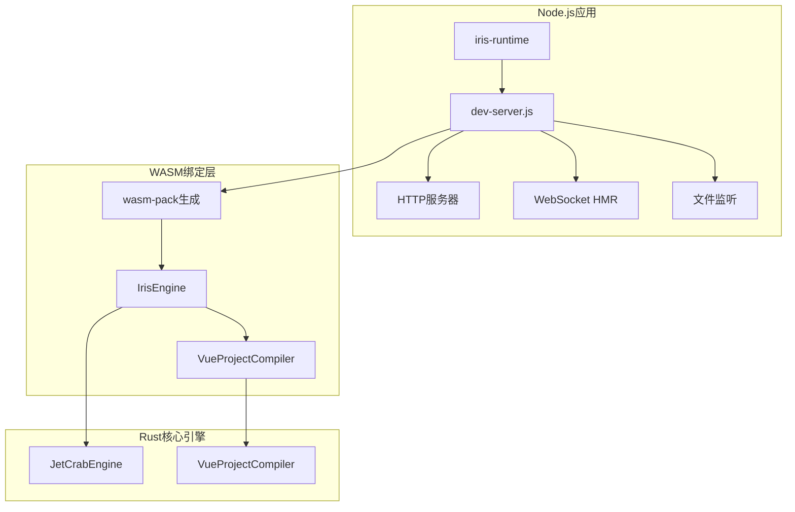

**图表来源**
- [crates/iris-runtime/package.json:1-52](file://crates/iris-runtime/package.json#L1-L52)
- [crates/iris-runtime/README.md:92-105](file://crates/iris-runtime/README.md#L92-L105)

**章节来源**
- [crates/iris-runtime/README.md:17-32](file://crates/iris-runtime/README.md#L17-L32)
- [crates/iris-runtime/package.json:16-21](file://crates/iris-runtime/package.json#L16-L21)

### 编译器缓存机制

**重要更新**：新增的编译器缓存机制是 HTTP 服务器包装器的核心组件，负责按需编译 Vue 模块并缓存结果。

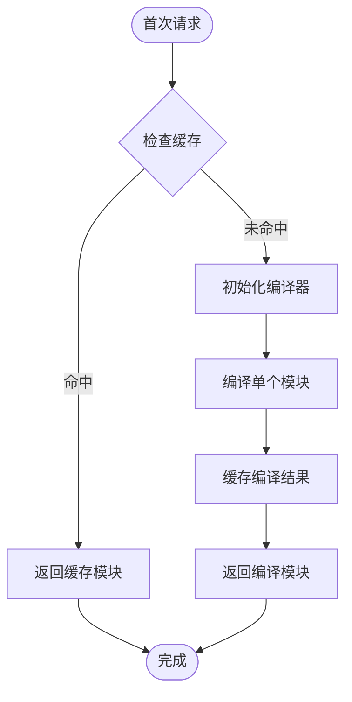

**图表来源**
- [crates/iris-jetcrab-cli/src/server/compiler_cache.rs:30-50](file://crates/iris-jetcrab-cli/src/server/compiler_cache.rs#L30-L50)

**章节来源**
- [crates/iris-jetcrab-cli/src/server/compiler_cache.rs:1-67](file://crates/iris-jetcrab-cli/src/server/compiler_cache.rs#L1-L67)

## 依赖关系分析

### 模块依赖图

Iris JetCrab 的模块依赖关系遵循严格的单向依赖原则，确保了良好的模块解耦：

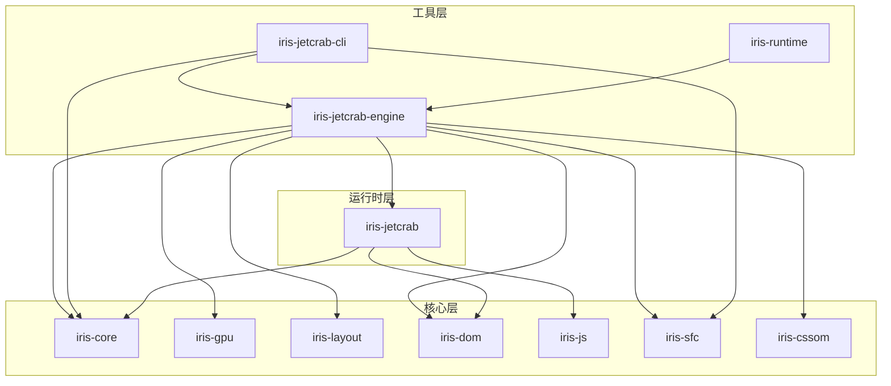

**图表来源**
- [ARCHITECTURE.md:3-44](file://ARCHITECTURE.md#L3-L44)
- [Cargo.toml:27-41](file://Cargo.toml#L27-L41)

### 双工具依赖关系

**重要更新**：双工具架构中的依赖关系现在体现了"HTTP服务器包装器 + 核心引擎"的设计理念：

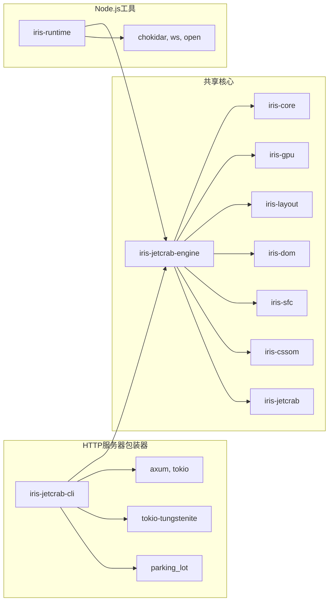

**图表来源**
- [crates/iris-jetcrab-engine/Cargo.toml:13-58](file://crates/iris-jetcrab-engine/Cargo.toml#L13-L58)
- [crates/iris-jetcrab-cli/Cargo.toml:17-57](file://crates/iris-jetcrab-cli/Cargo.toml#L17-L57)

**章节来源**
- [ARCHITECTURE.md:36-43](file://ARCHITECTURE.md#L36-L43)
- [crates/iris-jetcrab-engine/Cargo.toml:13-58](file://crates/iris-jetcrab-engine/Cargo.toml#L13-L58)

## 性能考虑

### 编译性能优化

Iris JetCrab 在编译性能方面采用了多项优化策略：

1. **模块缓存机制**：VueProjectCompiler 使用 HashMap 缓存已编译的模块，避免重复编译
2. **增量编译**：HMRManager 支持热更新补丁生成，只重新编译受影响的模块
3. **并行编译**：利用 Rust 的并发特性进行模块并行编译
4. **内存优化**：使用智能指针和零-copy 技术减少内存分配

### HTTP服务器性能特性

**重要更新**：HTTP 服务器包装器采用了多项性能优化策略：

1. **按需编译**：编译器缓存只在需要时编译模块，减少不必要的编译开销
2. **异步处理**：使用 Tokio 异步运行时处理并发请求
3. **连接池**：Axum 服务器自动管理连接池和请求处理
4. **缓存策略**：编译结果缓存在内存中，支持快速响应重复请求

### WASM性能特性

Node.js 环境下的 WASM 集成提供了以下性能优势：

- **快速启动**：WASM 模块体积小（约5MB），启动速度快
- **内存效率**：相比原生二进制，WASM 在内存使用上更加高效
- **跨平台兼容**：单个 WASM 二进制可在不同平台上运行

### 并发处理

双工具架构充分利用了各自运行环境的并发特性：

- **Rust CLI**：使用 Tokio 异步运行时处理并发请求
- **Node.js Runtime**：利用 Node.js 事件循环处理高并发场景

## 故障排除指南

### 常见问题诊断

#### 项目检测失败

当项目检测失败时，通常由以下原因导致：

1. **缺少 package.json**：检查项目根目录是否存在 package.json
2. **Vue依赖缺失**：确认 package.json 中包含 Vue 相关依赖
3. **入口文件不存在**：验证 src 目录下是否存在 main.js 或 main.ts

#### 编译错误排查

编译过程中可能遇到的问题及解决方案：

1. **SFC编译失败**：检查 .vue 文件语法是否正确
2. **TypeScript编译错误**：验证 TypeScript 配置和语法
3. **依赖解析失败**：确认 node_modules 中的依赖完整性

#### HTTP服务器问题

**重要更新**：HTTP 服务器包装器特有的问题及解决方案：

1. **端口占用**：检查端口 3000 是否被其他程序占用
2. **编译器缓存异常**：使用 `clear()` 方法清除缓存
3. **HMR连接失败**：检查 WebSocket 连接状态
4. **路由处理错误**：验证 `/@vue/*path` 路由配置

#### WASM 集成问题

Node.js 环境下可能出现的 WASM 相关问题：

1. **WASM模块加载失败**：检查 wasm-pack 是否正确构建
2. **内存不足**：增加 Node.js 内存限制
3. **版本不兼容**：确保 wasm-pack 版本与引擎兼容

**章节来源**
- [crates/iris-jetcrab-cli/src/server/http_server.rs:32-41](file://crates/iris-jetcrab-cli/src/server/http_server.rs#L32-L41)
- [crates/iris-jetcrab-cli/src/server/compiler_cache.rs:52-60](file://crates/iris-jetcrab-cli/src/server/compiler_cache.rs#L52-L60)

## 结论

Iris JetCrab 的双工具架构设计成功地解决了现代前端开发工具面临的核心挑战。通过将共享功能集中在强大的核心引擎中，同时为不同运行环境提供专门的工具前端，该架构实现了真正的跨平台开发体验。

**重要更新**：经过架构重构，iris-jetcrab-cli 现在专注于 HTTP 服务器包装器角色，而核心功能已完全迁移到 iris-jetcrab-engine。这种设计带来了以下优势：

### 架构优势总结

1. **代码复用最大化**：核心逻辑只实现一次，避免重复开发
2. **环境灵活性**：支持 Rust 和 Node.js 两种不同的开发环境
3. **可维护性强**：功能集中在 engine 中，便于维护和升级
4. **可扩展性好**：轻松添加新的工具前端或运行时支持
5. **性能优异**：Rust 实现的核心引擎提供高性能的编译和运行能力
6. **按需编译**：HTTP 服务器包装器支持高效的按需编译机制

### 未来发展展望

Iris JetCrab 的双工具架构为未来的功能扩展奠定了坚实基础：

- **增强的热更新系统**：统一两个工具的 HMR 协议
- **更多预处理器支持**：扩展对 Less、Stylus 等 CSS 预处理器的支持
- **插件生态系统**：构建开放的插件系统
- **云端开发支持**：提供云端开发和协作功能
- **性能监控**：添加编译器缓存统计和性能监控

这种架构设计不仅满足了当前的开发需求，更为未来的功能演进和技术发展预留了充足的空间。通过持续的优化和完善，Iris JetCrab 有望成为下一代跨平台前端开发工具的标杆解决方案。