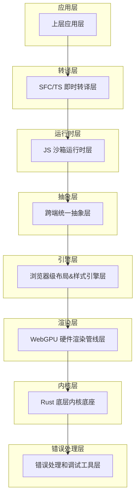
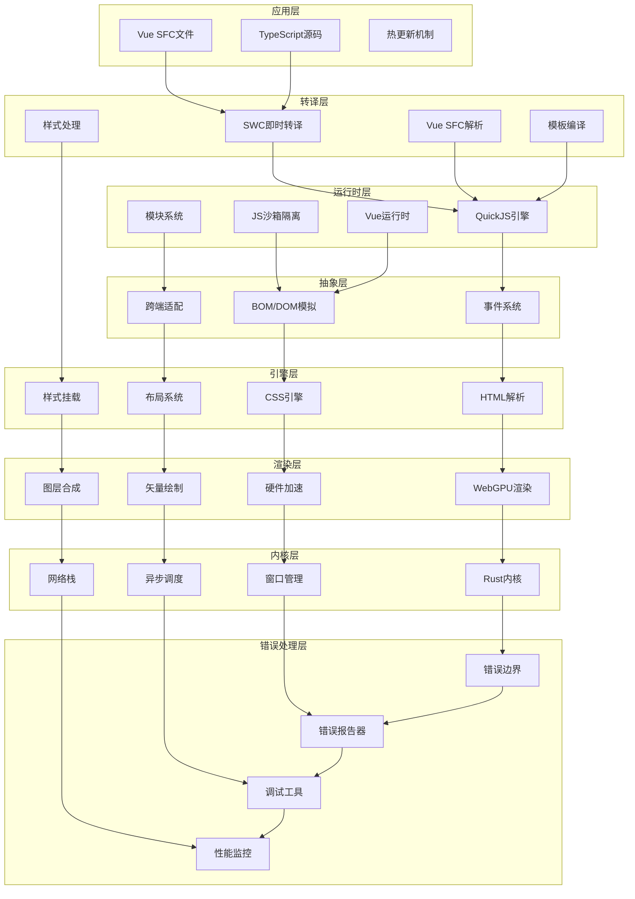
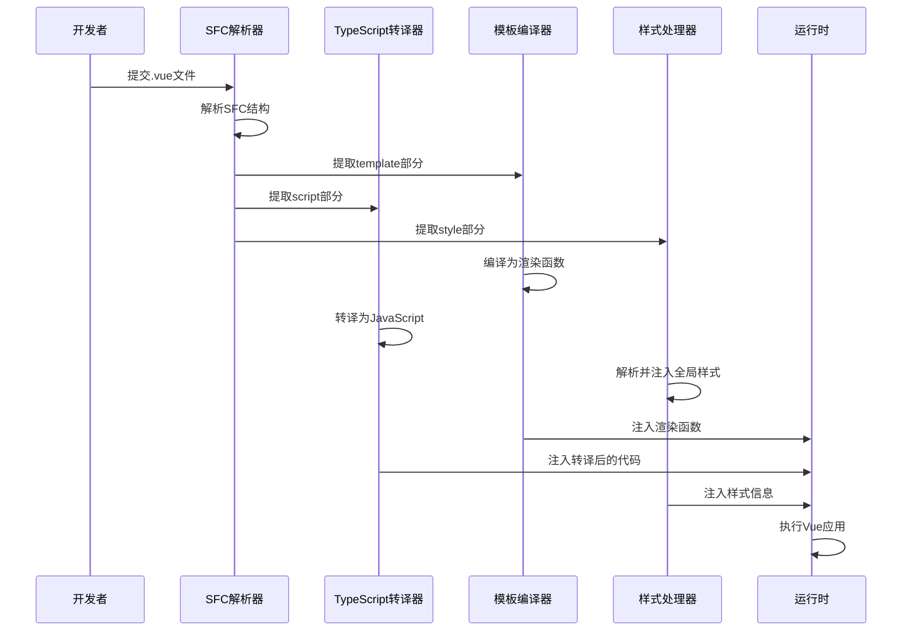
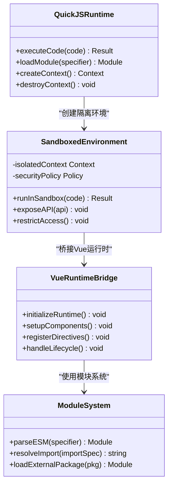
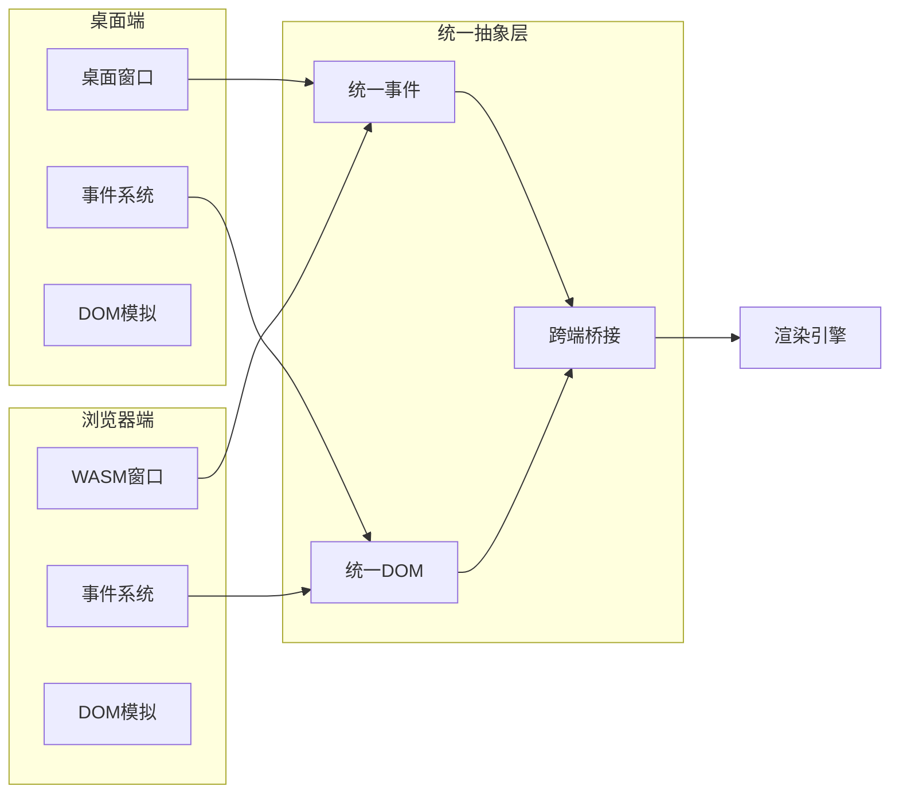
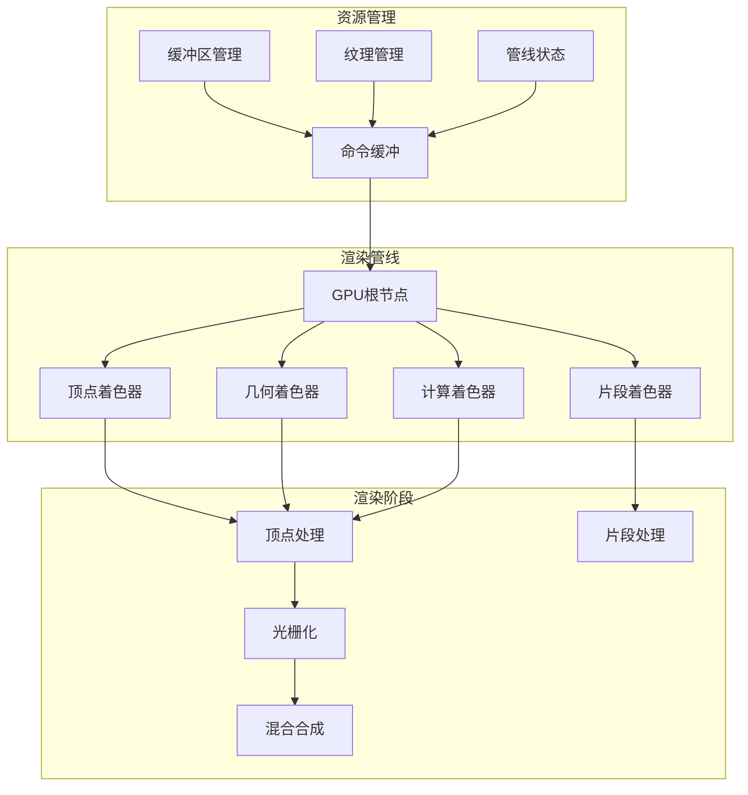
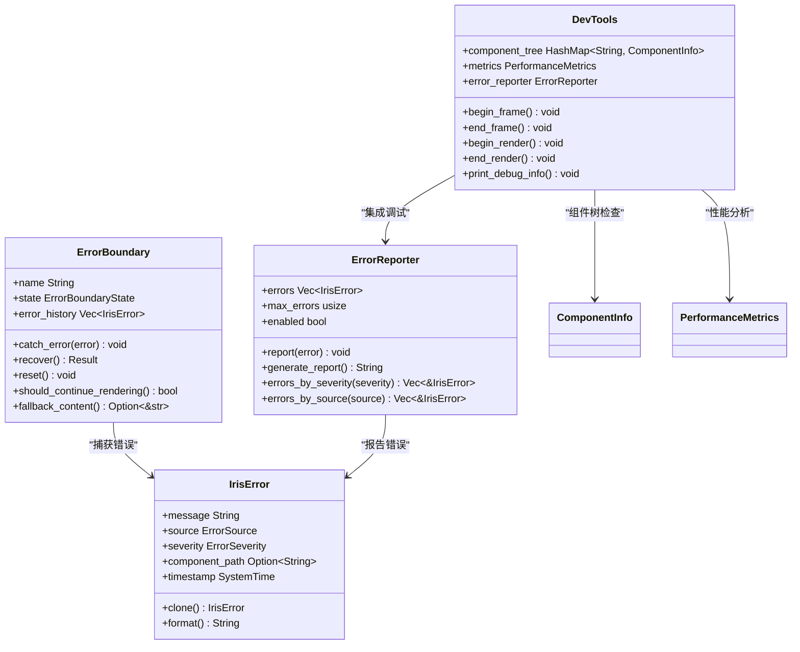
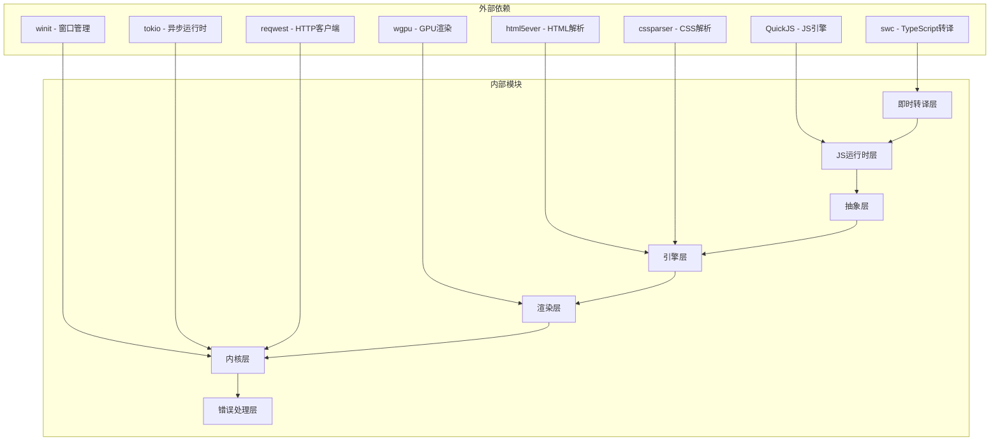

# 技术架构总览

<cite>
**本文档引用的文件**
- [error_handling.rs](file://crates/iris-engine/src/error_handling.rs)
- [dev_tools.rs](file://crates/iris-engine/src/dev_tools.rs)
- [lib.rs](file://crates/iris-engine/src/lib.rs)
- [ROADMAP_AND_PROGRESS.md](file://ROADMAP_AND_PROGRESS.md)
- [ARCHITECTURE.md](file://ARCHITECTURE.md)
</cite>

## 更新摘要
**变更内容**
- 更新错误处理系统章节以反映 IrisError 类型的克隆支持增强
- 更新错误边界状态管理描述，反映 ErrorBoundaryState 的 Eq 派生移除
- 更新错误处理架构图以体现新的错误处理能力
- 更新故障排除指南中的错误处理相关问题解答

## 目录
1. [引言](#引言)
2. [项目结构](#项目结构)
3. [核心组件](#核心组件)
4. [架构总览](#架构总览)
5. [详细组件分析](#详细组件分析)
6. [依赖关系分析](#依赖关系分析)
7. [性能考量](#性能考量)
8. [错误处理和调试工具系统](#错误处理和调试工具系统)
9. [故障排除指南](#故障排除指南)
10. [结论](#结论)

## 引言

Leivue Runtime是一个革命性的前端运行时引擎，采用七层分层架构设计，旨在彻底改变传统的前端开发模式。该项目的核心目标是消除前端工程化复杂性，突破浏览器沙箱限制，为Vue生态系统提供高性能的跨端运行底座。

该引擎实现了完全脱离Node.js、浏览器DOM和编译打包的运行模式，支持在浏览器WASM模式和独立桌面原生模式下运行，为开发者提供了前所未有的灵活性和性能表现。

**更新** 新增了专业级的错误处理和调试工具系统，为整个运行时提供了完整的错误管理和开发者体验支持。最新版本增强了错误处理系统的克隆能力和错误边界的状态管理。

## 项目结构

Leivue Runtime采用严格的七层分层架构，每一层都有明确的职责边界和清晰的依赖关系：

**图表来源**
- [lib.rs:100-109](file://crates/iris-engine/src/lib.rs#L100-L109)

**章节来源**
- [lib.rs:1-109](file://crates/iris-engine/src/lib.rs#L1-L109)

## 核心组件

### 应用层
应用层是面向最终用户的最外层，直接处理.vue、.ts、.tsx等原始源码文件。这一层的特点是：
- 支持直接运行原始源码，无需任何编译或打包步骤
- 完全兼容Element Plus、Ant Design Vue等主流Vue3生态库
- 提供毫秒级热更新体验，开发效率极高
- 零配置、零依赖安装的开发模式

### 即时转译层
即时转译层是整个架构的核心创新，实现了真正的零编译运行：
- **TypeScript即时转译**：基于Rust swc库，内存内实时将TypeScript转换为JavaScript
- **Vue SFC即时编译**：使用官方Rust库解析.vue文件，自动拆分为template、script-setup、style三个部分
- **模板实时编译**：将template实时编译为Vue渲染函数
- **脚本自动转译**：自动处理TypeScript转译
- **样式自动解析**：自动解析并集成到全局样式系统

### JS沙箱运行时层
JS沙箱运行时层提供了独立且安全的执行环境：
- **JS引擎**：采用QuickJS，具有轻量、高性能、WASM友好等特点
- **沙箱隔离**：与宿主环境完全隔离，确保脚本执行的安全性
- **内置运行时**：预加载Vue3完整运行时（runtime-core/runtime-dom）
- **模块系统**：自研ESM解析器，支持import/export语法和第三方包引入

### 跨端统一抽象层
跨端统一抽象层负责抹平不同平台间的差异：
- **统一事件系统**：处理鼠标、键盘、滚动、点击等事件的命中检测
- **BOM/DOM模拟API**：轻量实现window、document、Event等浏览器环境API
- **无缝兼容**：确保Element Plus等UI库所需的浏览器环境API正常工作
- **无真实DOM**：仅进行逻辑模拟，实际绘制全部通过WebGPU完成

### 浏览器级布局&样式引擎层
这一层提供了迷你浏览器内核级别的能力：
- **HTML解析**：使用html5ever工业级解析器，生成标准DOM节点树
- **CSS引擎**：支持cssparser解析、选择器匹配、样式继承、权重计算
- **布局系统**：自研盒模型、Flex布局、流式布局，对标W3C标准
- **样式挂载**：支持全局样式、Scoped样式、第三方UI库CSS的全局注入

### WebGPU硬件渲染管线层
WebGPU渲染层完全替代了传统的浏览器DOM渲染流水线：
- **硬件加速渲染**：基于标准WebGPU规范，统一桌面和浏览器渲染接口
- **渲染能力**：支持批渲染、矢量绘制、圆角/阴影/渐变、纹理图集、字体渲染、图层合成
- **性能优势**：实现60fps稳定渲染，大列表和复杂组件无卡顿，CPU开销极低

### Rust底层内核底座
Rust底层内核提供了高性能的基础支撑：
- **语言特性**：纯Rust编写，无GC、内存安全、高性能
- **基础能力**：跨端窗口管理、异步调度、内存池、文件IO、原生网络栈、缓存系统
- **跨端适配**：桌面端使用winit原生窗口配合Vulkan/Metal/DX12；浏览器端编译为WASM并绑定WebGPU API
- **核心依赖**：wgpu、winit、tokio、reqwest等高性能库

### 错误处理和调试工具层（新增）
**更新** 错误处理和调试工具层是Phase 7.3的核心功能，为整个运行时提供了专业级的错误管理和开发者体验支持：

- **错误边界系统**：提供组件级别的错误隔离，防止错误传播到整个应用
- **错误报告器**：收集和报告统一格式的错误信息，支持按严重级别和来源过滤
- **调试工具系统**：提供组件树检查、性能分析、状态检查和渲染调试能力
- **LRU错误历史**：限制错误历史长度，支持错误恢复策略
- **备用内容显示**：在组件错误时显示预设的降级内容
- **性能监控**：实时计算FPS、帧时间、渲染时间和布局时间
- **集成调试**：与错误报告器无缝集成，提供完整的调试信息
- **增强的克隆支持**：IrisError 类型现在支持克隆操作，解决了动态trait对象无法克隆的问题

**章节来源**
- [lib.rs:77-92](file://crates/iris-engine/src/lib.rs#L77-L92)
- [error_handling.rs:1-520](file://crates/iris-engine/src/error_handling.rs#L1-L520)
- [dev_tools.rs:1-472](file://crates/iris-engine/src/dev_tools.rs#L1-L472)

## 架构总览

Leivue Runtime的七层架构体现了极强的解耦性和模块化设计原则：

**图表来源**
- [lib.rs:100-109](file://crates/iris-engine/src/lib.rs#L100-L109)
- [ROADMAP_AND_PROGRESS.md:398-417](file://ROADMAP_AND_PROGRESS.md#L398-L417)

## 详细组件分析

### 即时转译层深度分析

即时转译层是Leivue Runtime的核心创新点，实现了真正的零编译运行：

**图表来源**
- [lib.rs:17-41](file://crates/iris-engine/src/lib.rs#L17-L41)

### JS沙箱运行时层分析

JS沙箱运行时层确保了执行环境的安全性和稳定性：

**图表来源**
- [lib.rs:25-41](file://crates/iris-engine/src/lib.rs#L25-L41)

### 跨端统一抽象层分析

跨端统一抽象层是实现双端一致性的关键：

**图表来源**
- [lib.rs:10-13](file://crates/iris-engine/src/lib.rs#L10-L13)

### WebGPU渲染管线分析

WebGPU渲染管线提供了硬件级的图形渲染能力：

**图表来源**
- [lib.rs:8-12](file://crates/iris-engine/src/lib.rs#L8-L12)

### 错误处理和调试工具系统分析（新增）

**更新** 错误处理和调试工具系统为整个运行时提供了专业级的错误管理和开发者体验支持。最新版本增强了错误处理系统的克隆能力和错误边界的状态管理：

**图表来源**
- [error_handling.rs:144-273](file://crates/iris-engine/src/error_handling.rs#L144-L273)
- [dev_tools.rs:106-375](file://crates/iris-engine/src/dev_tools.rs#L106-L375)

**章节来源**
- [lib.rs:77-92](file://crates/iris-engine/src/lib.rs#L77-L92)
- [error_handling.rs:1-520](file://crates/iris-engine/src/error_handling.rs#L1-L520)
- [dev_tools.rs:1-472](file://crates/iris-engine/src/dev_tools.rs#L1-L472)

## 依赖关系分析

Leivue Runtime的依赖关系体现了清晰的层次化设计：

**图表来源**
- [lib.rs:45-50](file://crates/iris-engine/src/lib.rs#L45-L50)
- [lib.rs:100-109](file://crates/iris-engine/src/lib.rs#L100-L109)

**章节来源**
- [lib.rs:45-50](file://crates/iris-engine/src/lib.rs#L45-L50)
- [lib.rs:100-109](file://crates/iris-engine/src/lib.rs#L100-L109)

## 性能考量

Leivue Runtime在性能方面的设计考量体现了极高的技术水平：

### 渲染性能优化
- **硬件加速**：完全基于WebGPU硬件渲染，避免了传统DOM渲染的性能瓶颈
- **批处理渲染**：支持批量渲染优化，减少GPU状态切换开销
- **矢量绘制**：采用矢量渲染技术，确保高分辨率下的清晰度
- **图层合成**：高效的图层合成算法，支持复杂的视觉效果

### 内存管理优化
- **Rust内存安全**：利用Rust的内存安全保障，避免内存泄漏和越界访问
- **内存池管理**：实现高效的内存池分配，减少频繁的内存分配开销
- **垃圾回收避免**：完全避免垃圾回收机制，确保渲染帧率的稳定性

### 网络性能优化
- **双网络模式**：支持自研Rust网络栈和浏览器原生网络栈
- **跨域突破**：通过自研网络栈实现跨域请求突破
- **内网优化**：针对内网环境进行专门优化，确保低延迟通信

### 启动性能优化
- **零编译启动**：直接运行源码，无需编译等待时间
- **模块懒加载**：按需加载模块，减少初始启动时间
- **缓存策略**：智能缓存机制，提升重复启动速度

### 错误处理性能优化（新增）
**更新** 错误处理和调试工具系统在设计时充分考虑了性能影响：

- **LRU缓存策略**：错误历史采用LRU淘汰，限制内存占用
- **按需启用**：调试工具默认禁用，仅在开发模式下启用
- **性能计时器**：性能分析器可选择性启用，避免生产环境性能开销
- **异步错误报告**：错误报告采用异步处理，不影响主线程性能
- **增强的克隆支持**：IrisError 类型现在支持克隆操作，解决了动态trait对象无法克隆的问题，提高了错误处理的性能和可靠性

## 错误处理和调试工具系统

**更新** 错误处理和调试工具系统是Leivue Runtime Phase 7.3的核心功能，为整个运行时提供了专业级的错误管理和开发者体验支持。

### 错误边界系统

错误边界系统提供了组件级别的错误隔离机制：

- **组件级隔离**：每个组件都可以设置自己的错误边界，防止错误传播
- **错误恢复策略**：根据错误严重级别决定是否继续渲染
  - Warning：可恢复，继续渲染
  - Error：不可恢复，停止渲染
  - Fatal：不可恢复，应用崩溃
- **LRU错误历史**：限制错误历史长度，避免内存泄漏
- **备用内容显示**：在组件错误时显示预设的降级内容
- **增强的状态管理**：ErrorBoundaryState 现在支持克隆操作，移除了 Eq 派生以提高灵活性

### 错误报告器

错误报告器提供了统一的错误收集和报告机制：

- **统一错误类型**：IrisError结构体封装所有错误信息
- **错误来源分类**：Render/Layout/Style/Script/Network五种来源
- **严重级别**：Warning/Error/Fatal三级严重程度
- **错误过滤**：支持按级别和来源过滤错误
- **错误报告生成**：自动生成详细的错误报告
- **增强的克隆支持**：IrisError 类型现在支持克隆操作，解决了动态trait对象无法克隆的问题

### 调试工具系统

调试工具系统提供了完整的开发时调试能力：

- **组件树检查**：实时查看组件树结构和状态
- **性能分析**：FPS计算、帧时间、渲染时间和布局时间监控
- **状态检查**：查看组件状态和属性
- **渲染调试**：调试渲染过程和性能瓶颈
- **错误报告集成**：与错误报告器无缝集成
- **调试信息打印**：提供完整的调试信息输出

### 架构集成

错误处理和调试工具系统与现有架构的集成：

- **错误边界集成**：与渲染引擎深度集成，在渲染过程中捕获错误
- **调试工具集成**：与性能监控系统集成，提供实时性能数据
- **错误报告集成**：与日志系统集成，提供统一的错误报告
- **开发模式支持**：仅在开发模式下启用，不影响生产环境性能

**章节来源**
- [error_handling.rs:1-520](file://crates/iris-engine/src/error_handling.rs#L1-L520)
- [dev_tools.rs:1-472](file://crates/iris-engine/src/dev_tools.rs#L1-L472)
- [ROADMAP_AND_PROGRESS.md:398-417](file://ROADMAP_AND_PROGRESS.md#L398-L417)

## 故障排除指南

### 常见问题及解决方案

#### 即时转译问题
- **问题**：TypeScript转译失败
- **原因**：语法不兼容或类型错误
- **解决**：检查TypeScript语法兼容性，参考SWC文档

#### 运行时沙箱问题
- **问题**：JS代码执行异常
- **原因**：沙箱隔离导致的API不可用
- **解决**：检查是否正确暴露了必要的API

#### 跨端兼容问题
- **问题**：桌面端和浏览器端行为不一致
- **原因**：平台差异导致的功能缺失
- **解决**：检查抽象层的跨端适配实现

#### 渲染性能问题
- **问题**：渲染帧率不稳定
- **原因**：GPU资源竞争或内存不足
- **解决**：优化渲染批次，检查内存使用情况

#### 错误处理问题（新增）
**更新** 新增的错误处理和调试工具系统相关问题：

- **问题**：错误边界不起作用
- **原因**：错误边界未正确配置或启用
- **解决**：检查错误边界的配置，确认错误边界已启用

- **问题**：调试工具不显示性能数据
- **原因**：性能分析器未启用或调试工具禁用
- **解决**：启用性能分析器和调试工具，检查性能计时器

- **问题**：错误报告不完整
- **原因**：错误报告器被禁用或错误历史过长
- **解决**：检查错误报告器状态，清理过期错误历史

- **问题**：组件树检查为空
- **原因**：组件未正确注册或调试工具禁用
- **解决**：确认组件已注册，启用调试工具

- **问题**：IrisError 克隆失败
- **原因**：动态trait对象无法克隆
- **解决**：使用增强的克隆支持，IrisError 现在支持克隆操作

- **问题**：错误边界状态比较失败
- **原因**：ErrorBoundaryState 移除了 Eq 派生
- **解决**：使用适当的比较方法，如 matches! 宏或模式匹配

**章节来源**
- [error_handling.rs:382-509](file://crates/iris-engine/src/error_handling.rs#L382-L509)
- [dev_tools.rs:377-471](file://crates/iris-engine/src/dev_tools.rs#L377-L471)

## 结论

Leivue Runtime项目通过七层分层架构设计，成功实现了前端运行时领域的重大突破。这种架构设计不仅实现了高度的解耦和模块化，更重要的是为开发者提供了前所未有的开发体验和性能表现。

### 架构优势总结

1. **彻底消除工程化复杂性**：零编译、零配置的开发模式极大提升了开发效率
2. **跨端一致性**：统一的抽象层确保了桌面端和浏览器端的一致行为
3. **高性能渲染**：基于WebGPU的硬件加速渲染提供了卓越的视觉体验
4. **安全性保障**：JS沙箱隔离确保了运行时的安全性
5. **生态兼容性**：完全兼容Vue3生态系统和主流UI组件库
6. **专业级错误管理**：新增的错误处理和调试工具系统提供了完整的错误管理和开发者体验支持

### 技术创新亮点

- **即时转译技术**：实现了真正的零编译运行，这是整个架构的核心创新
- **硬件加速渲染**：完全替代DOM渲染，提供硬件级的性能表现
- **跨端统一抽象**：通过抽象层抹平了不同平台间的差异
- **Rust内核设计**：利用Rust的语言特性确保了系统的高性能和安全性
- **专业级错误处理**：Phase 7.3新增的错误边界、错误报告器和调试工具系统，为整个运行时提供了专业级的错误管理和开发者体验支持
- **增强的克隆支持**：最新的错误处理系统增强了 IrisError 类型的克隆能力，解决了动态trait对象无法克隆的问题

Leivue Runtime项目代表了前端技术发展的新方向，为未来的前端开发提供了全新的可能性。其七层分层架构设计不仅具有很高的技术价值，也为其他类似项目提供了宝贵的架构参考。

**更新** 新增的错误处理和调试工具系统进一步完善了Leivue Runtime的技术架构，使其具备了专业级前端运行时应有的完整功能，为开发者提供了从开发到部署的全流程支持。最新的克隆支持增强使得错误处理系统更加健壮和高效，为生产环境的稳定运行提供了更好的保障。