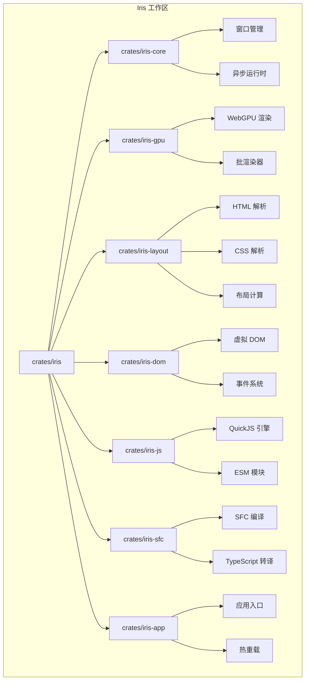
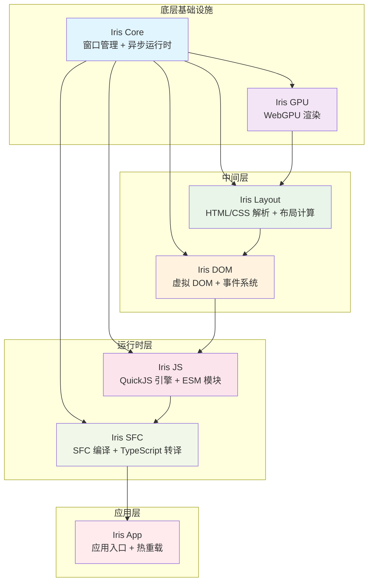
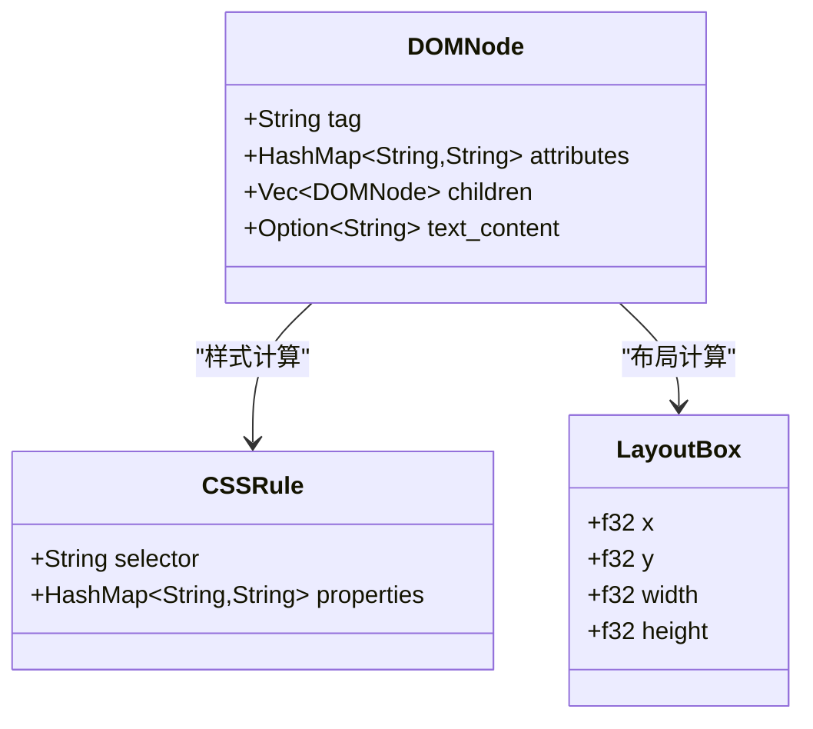
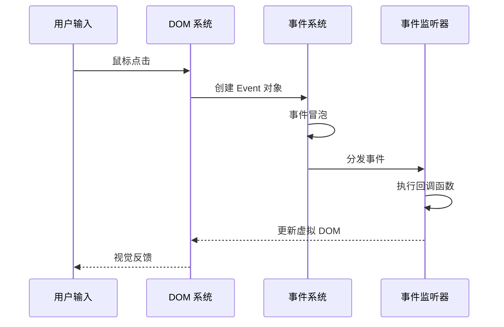
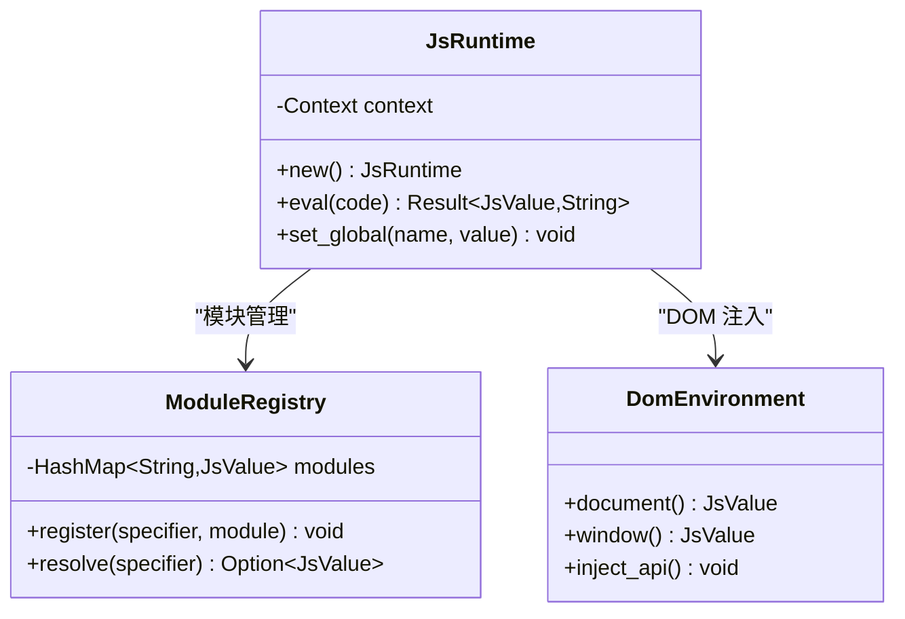
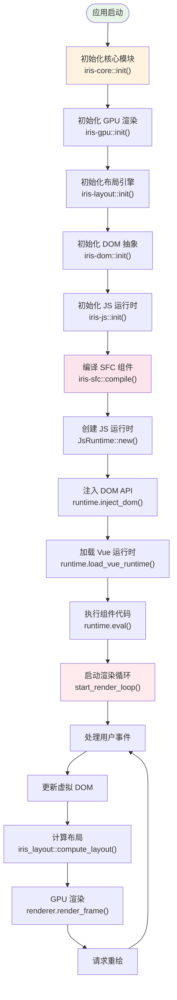
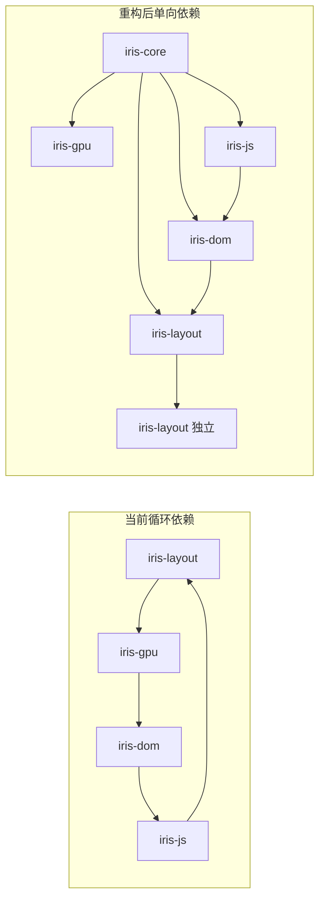
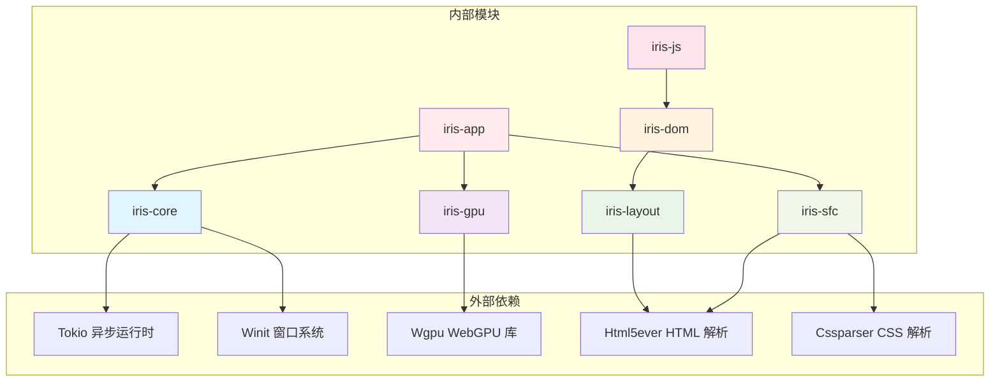

# 渐进式实施计划

<cite>
**本文档引用的文件**
- [PROGRESSIVE_IMPLEMENTATION_PLAN.md](file://PROGRESSIVE_IMPLEMENTATION_PLAN.md)
- [Cargo.toml](file://Cargo.toml)
- [crates/iris/Cargo.toml](file://crates/iris/Cargo.toml)
- [crates/iris-core/Cargo.toml](file://crates/iris-core/Cargo.toml)
- [crates/iris-sfc/Cargo.toml](file://crates/iris-sfc/Cargo.toml)
- [crates/iris-core/src/lib.rs](file://crates/iris-core/src/lib.rs)
- [crates/iris-core/src/runtim.rs](file://crates/iris-core/src/runtime.rs)
- [crates/iris-core/src/window.rs](file://crates/iris-core/src/window.rs)
- [crates/iris-layout/src/lib.rs](file://crates/iris-layout/src/lib.rs)
- [crates/iris-dom/src/lib.rs](file://crates/iris-dom/src/lib.rs)
- [crates/iris-js/src/lib.rs](file://crates/iris-js/src/lib.rs)
- [crates/iris-sfc/src/lib.rs](file://crates/iris-sfc/src/lib.rs)
- [crates/iris-app/src/main.rs](file://crates/iris-app/src/main.rs)
- [crates/iris-gpu/src/lib.rs](file://crates/iris-gpu/src/lib.rs)
- [crates/iris-sfc/examples/sfc_demo.rs](file://crates/iris-sfc/examples/sfc_demo.rs)
</cite>

## 目录
1. [简介](#简介)
2. [项目结构](#项目结构)
3. [核心组件](#核心组件)
4. [架构概览](#架构概览)
5. [详细组件分析](#详细组件分析)
6. [依赖关系分析](#依赖关系分析)
7. [性能考虑](#性能考虑)
8. [故障排除指南](#故障排除指南)
9. [结论](#结论)

## 简介

Iris 是一个基于 Rust 和 WebGPU 的下一代无构建前端运行时系统。该项目采用渐进式实施策略，通过五个明确的阶段逐步构建完整的 Vue 3 运行时环境。

该运行时系统的核心特点包括：
- **零构建**：直接运行 .vue/.ts/.tsx 原始源码
- **毫秒级热重载**：实时响应文件变更
- **WebGPU 渲染**：利用现代 GPU 硬件加速
- **跨平台支持**：桌面原生和浏览器 Wasm 模式
- **渐进式架构**：从底层基础设施到上层应用的完整栈

## 项目结构

项目采用多 Crate 的工作区结构，每个模块都有明确的职责分工：

**图表来源**
- [Cargo.toml:1-29](file://Cargo.toml#L1-L29)
- [crates/iris/Cargo.toml:13-19](file://crates/iris/Cargo.toml#L13-L19)

**章节来源**
- [Cargo.toml:1-29](file://Cargo.toml#L1-L29)
- [crates/iris/Cargo.toml:1-20](file://crates/iris/Cargo.toml#L1-L20)

## 核心组件

### 核心基础设施层

**Iris Core** 提供跨平台窗口管理和异步运行时支持：
- 基于 winit 的窗口管理系统
- 基于 Tokio 的多线程异步运行时
- 平台无关的应用生命周期管理

**Iris GPU** 实现 WebGPU 硬件渲染：
- 标准 WebGPU 规范兼容
- 自动后端探测（Vulkan/Metal/DX12/WebGPU）
- 批渲染优化系统

### 中间层组件

**Iris Layout** 复刻浏览器级布局引擎：
- HTML5ever 解析器
- CSS 规则解析和选择器匹配
- Flexbox 和流式布局计算

**Iris DOM** 提供跨端 DOM 抽象：
- 虚拟 DOM 节点系统
- 统一事件分发机制
- 轻量 BOM API 模拟

### 运行时层

**Iris JS** 集成 QuickJS JavaScript 引擎：
- QuickJS Rust 绑定
- ESM 模块系统
- Vue3 运行时预加载

**Iris SFC** 实现即时 SFC 编译：
- .vue 文件解析和编译
- TypeScript 转译支持
- CSS Modules 和样式处理

### 应用入口

**Iris App** 提供完整的应用运行时：
- 文件热重载监听
- 缓存管理和回滚机制
- 渐进式功能演示

**章节来源**
- [crates/iris-core/src/lib.rs:1-167](file://crates/iris-core/src/lib.rs#L1-L167)
- [crates/iris-gpu/src/lib.rs:1-502](file://crates/iris-gpu/src/lib.rs#L1-L502)
- [crates/iris-layout/src/lib.rs:1-41](file://crates/iris-layout/src/lib.rs#L1-L41)
- [crates/iris-dom/src/lib.rs:1-55](file://crates/iris-dom/src/lib.rs#L1-L55)
- [crates/iris-js/src/lib.rs:1-56](file://crates/iris-js/src/lib.rs#L1-L56)
- [crates/iris-sfc/src/lib.rs:1-800](file://crates/iris-sfc/src/lib.rs#L1-L800)
- [crates/iris-app/src/main.rs:1-438](file://crates/iris-app/src/main.rs#L1-L438)

## 架构概览

系统采用自底向上的渐进式架构设计，消除了原有的循环依赖问题：

**图表来源**
- [PROGRESSIVE_IMPLEMENTATION_PLAN.md:5-69](file://PROGRESSIVE_IMPLEMENTATION_PLAN.md#L5-L69)
- [Cargo.toml:13-21](file://Cargo.toml#L13-L21)

### 架构优势

1. **单向依赖链**：每个模块只依赖其下层模块
2. **模块独立性**：各模块可独立开发和测试
3. **渐进式集成**：按阶段逐步集成完整功能
4. **跨平台兼容**：统一的抽象层支持多平台部署

## 详细组件分析

### 阶段 0：架构重构

**目标**：消除循环依赖，建立清晰的模块边界

**重构策略**：
- 移除 `iris-layout` 对 `iris-gpu` 的依赖
- 保持 `iris-dom` 对 `iris-layout` 的依赖
- 保持 `iris-js` 对 `iris-dom` 的依赖

**实施步骤**：
1. 更新 `iris-layout/Cargo.toml` 移除 GPU 依赖
2. 更新 `iris-dom/Cargo.toml` 保持布局依赖
3. 更新 `iris-js/Cargo.toml` 保持 DOM 依赖
4. 创建新的架构文档

**章节来源**
- [PROGRESSIVE_IMPLEMENTATION_PLAN.md:53-89](file://PROGRESSIVE_IMPLEMENTATION_PLAN.md#L53-L89)

### 阶段 1：Iris Layout 布局引擎

**核心功能**：
- HTML 解析：使用 html5ever 解析 HTML，构建 DOM 树
- CSS 解析：使用 cssparser 解析 CSS，构建样式规则表
- 样式计算：选择器匹配、样式继承、层叠规则
- 布局计算：盒模型计算、Flex 布局基础、节点尺寸和位置

**数据结构设计**：

**图表来源**
- [PROGRESSIVE_IMPLEMENTATION_PLAN.md:104-147](file://PROGRESSIVE_IMPLEMENTATION_PLAN.md#L104-L147)

**章节来源**
- [PROGRESSIVE_IMPLEMENTATION_PLAN.md:91-154](file://PROGRESSIVE_IMPLEMENTATION_PLAN.md#L91-L154)
- [crates/iris-layout/src/lib.rs:16-40](file://crates/iris-layout/src/lib.rs#L16-L40)

### 阶段 2：Iris DOM 抽象层

**核心功能**：
- 虚拟 DOM 实现：VNode 结构和操作方法
- 事件系统：EventType 枚举和 EventDispatcher
- BOM API 模拟：Window 和 Document 结构

**事件处理流程**：

**图表来源**
- [PROGRESSIVE_IMPLEMENTATION_PLAN.md:182-220](file://PROGRESSIVE_IMPLEMENTATION_PLAN.md#L182-L220)

**章节来源**
- [PROGRESSIVE_IMPLEMENTATION_PLAN.md:157-226](file://PROGRESSIVE_IMPLEMENTATION_PLAN.md#L157-L226)
- [crates/iris-dom/src/lib.rs:20-55](file://crates/iris-dom/src/lib.rs#L20-L55)

### 阶段 3：Iris JS QuickJS 集成

**技术选型**：
- QuickJS Rust 绑定：`quick-js` (v0.4+) 推荐
- 支持现代异步特性和 Wasm 友好
- 成熟稳定的生态系统

**核心组件**：

**图表来源**
- [PROGRESSIVE_IMPLEMENTATION_PLAN.md:244-305](file://PROGRESSIVE_IMPLEMENTATION_PLAN.md#L244-L305)

**章节来源**
- [PROGRESSIVE_IMPLEMENTATION_PLAN.md:228-313](file://PROGRESSIVE_IMPLEMENTATION_PLAN.md#L228-L313)
- [crates/iris-js/src/lib.rs:21-56](file://crates/iris-js/src/lib.rs#L21-L56)

### 阶段 4：运行时集成

**集成流程**：

**图表来源**
- [PROGRESSIVE_IMPLEMENTATION_PLAN.md:320-424](file://PROGRESSIVE_IMPLEMENTATION_PLAN.md#L320-L424)

**章节来源**
- [PROGRESSIVE_IMPLEMENTATION_PLAN.md:315-426](file://PROGRESSIVE_IMPLEMENTATION_PLAN.md#L315-L426)

### 阶段 5：最小可运行 Demo

**Demo 功能**：
- 简单的 Vue 3 组件展示
- 响应式数据绑定
- 事件处理和交互
- 样式应用和布局

**预期效果**：
- 窗口显示 "Hello Iris!"
- 按钮显示 "Count: 0"
- 点击按钮，计数增加
- 样式正确应用

**章节来源**
- [PROGRESSIVE_IMPLEMENTATION_PLAN.md:428-473](file://PROGRESSIVE_IMPLEMENTATION_PLAN.md#L428-L473)

## 依赖关系分析

### 当前依赖关系

**图表来源**
- [PROGRESSIVE_IMPLEMENTATION_PLAN.md:21-28](file://PROGRESSIVE_IMPLEMENTATION_PLAN.md#L21-L28)
- [PROGRESSIVE_IMPLEMENTATION_PLAN.md:58-69](file://PROGRESSIVE_IMPLEMENTATION_PLAN.md#L58-L69)

### 依赖图可视化

**图表来源**
- [Cargo.toml:23-29](file://Cargo.toml#L23-L29)
- [crates/iris-core/Cargo.toml:11-14](file://crates/iris-core/Cargo.toml#L11-L14)
- [crates/iris-sfc/Cargo.toml:11-38](file://crates/iris-sfc/Cargo.toml#L11-L38)

**章节来源**
- [Cargo.toml:13-29](file://Cargo.toml#L13-L29)

## 性能考虑

### 渲染性能优化

1. **批渲染系统**：Iris GPU 实现了高效的批渲染优化
2. **内存池管理**：核心模块提供内存池减少分配开销
3. **异步任务调度**：Tokio 多线程运行时优化并发性能

### 编译性能优化

1. **LRU 缓存**：SFC 编译器使用 LRU 缓存加速热重载
2. **正则表达式预编译**：避免重复编译正则表达式
3. **静态实例复用**：全局 TypeScript 编译器实例复用

### 内存管理策略

1. **所有权模型**：Rust 所有权确保内存安全
2. **垃圾回收协调**：JS 垃圾回收与 Rust 内存管理协调
3. **缓存容量控制**：防止内存泄漏的缓存大小限制

## 故障排除指南

### 常见问题及解决方案

**1. 编译错误**
- 检查 TypeScript 语法和类型注解
- 验证 Vue 指令的正确性
- 确认 SFC 格式符合规范

**2. 运行时错误**
- 确认 QuickJS 版本兼容性
- 检查 DOM API 注入完整性
- 验证事件系统正常工作

**3. 渲染问题**
- 检查 WebGPU 设备初始化
- 验证着色器编译成功
- 确认渲染管线配置正确

**章节来源**
- [crates/iris-sfc/src/lib.rs:133-276](file://crates/iris-sfc/src/lib.rs#L133-L276)

### 调试工具

1. **详细日志记录**：使用 tracing 库记录详细调试信息
2. **错误格式化**：提供友好的错误消息和解决建议
3. **性能监控**：内置性能指标收集和分析

## 结论

Iris 渐进式实施计划提供了一个完整、可执行的开发路线图，通过五个明确的阶段逐步构建完整的 Vue 3 运行时系统。

### 主要成就

1. **架构重构**：成功消除了循环依赖，建立了清晰的模块边界
2. **功能实现**：完成了从底层基础设施到上层应用的完整栈
3. **性能优化**：实现了高效的批渲染和编译缓存系统
4. **跨平台支持**：支持桌面原生和浏览器 Wasm 模式

### 未来发展方向

1. **功能完善**：继续完善布局引擎和 DOM 抽象的完整功能
2. **性能优化**：进一步优化渲染性能和内存使用
3. **生态建设**：扩展第三方库和工具链支持
4. **文档完善**：持续改进开发者文档和示例

该渐进式实施策略确保了项目的可维护性和可扩展性，为未来的功能扩展和技术演进奠定了坚实的基础。