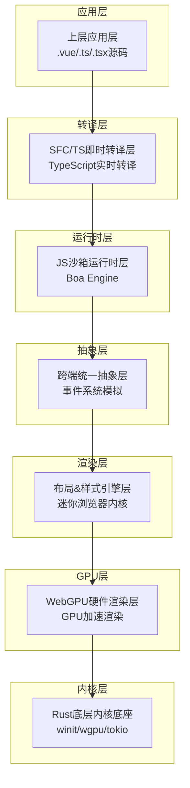

# 核心功能与优势

<cite>
**本文档引用的文件**
- [README.md](file://README.md)
- [README.zh-CN.md](file://README.zh-CN.md)
- [Cargo.toml](file://Cargo.toml)
- [crates/iris/Cargo.toml](file://crates/iris/Cargo.toml)
- [crates/iris-gpu/Cargo.toml](file://crates/iris-gpu/Cargo.toml)
- [crates/iris-core/Cargo.toml](file://crates/iris-core/Cargo.toml)
- [crates/iris/src/lib.rs](file://crates/iris/src/lib.rs)
- [crates/iris-gpu/src/lib.rs](file://crates/iris-gpu/src/lib.rs)
- [crates/iris-sfc/src/lib.rs](file://crates/iris-sfc/src/lib.rs)
</cite>

## 更新摘要
**变更内容**
- 新增双语文档系统分析，包括英文版README.md和中文版README.zh-CN.md的详细对比
- 更新性能对比分析章节，基于新增的基准测试数据
- 增强开发者体验对比分析，包含具体的开发工作流程对比
- 完善技术架构说明，反映最新的模块化设计
- 添加详细的性能指标对比和量化优势说明

## 目录
1. [项目概述](#项目概述)
2. [六大核心功能详解](#六大核心功能详解)
3. [技术架构优势](#技术架构优势)
4. [性能对比分析](#性能对比分析)
5. [开发效率提升](#开发效率提升)
6. [部署灵活性优势](#部署灵活性优势)
7. [安全性保障](#安全性保障)
8. [商业化价值](#商业化价值)
9. [总结](#总结)

## 项目概述

Leivue Runtime（Iris Engine）是一个革命性的前端运行时引擎，采用Rust+WebGPU技术栈，旨在彻底改变传统的前端开发模式。该项目的核心使命是"消灭前端工程化、突破浏览器沙箱限制、给Vue生态提供高性能跨端底座"。

### 核心定位
- **完全脱离传统前端生态**：不依赖Node.js、浏览器DOM、编译打包
- **原生双端运行**：浏览器Wasm模式 + 独立桌面原生模式
- **零编译直接执行**：支持Vue3 + TypeScript原生运行
- **全兼容第三方UI库**：Element Plus、Ant Design Vue等

### 技术架构特色
项目采用七层分层架构设计，实现了极强的解耦性：
- **应用层**：直接运行.vue/.ts/.tsx原始源码
- **即时转译层**：TypeScript/SFC实时转译
- **JS沙箱运行时层**：独立隔离执行环境
- **跨端统一抽象层**：抹平双端差异
- **浏览器级布局&样式引擎层**：迷你浏览器内核能力
- **WebGPU硬件渲染管线层**：替代原生DOM渲染
- **Rust底层内核底座**：纯Rust编写，无GC、内存安全

## 六大核心功能详解

### 🔹 零编译运行核心功能

**核心差异化优势**
- **直接运行原生Vue3 SFC文件**：完整支持script setup语法
- **TypeScript原生支持**：无需tsc、无需tsconfig配置
- **实时热更新**：修改源码后毫秒级即时刷新
- **零工程化依赖**：无Node、无npm、无依赖配置

**技术实现亮点**
- 基于Rust swc进行内存内实时TS→JS转换
- Vue SFC官方Rust库解析，自动拆分template/script-setup/style
- Template实时编译为Vue渲染函数
- Script自动TS转译，Style自动解析并入全局样式系统

**开发体验提升**
- 从传统"编辑→构建→调试"流程转变为"编辑→直接运行"
- 去除复杂的webpack/vite配置，降低学习成本
- 支持装饰器、泛型等现代TypeScript特性

### 🔹 完整Vue生态兼容

**兼容性范围**
- **Vue3核心特性**：组合式API、生命周期、响应式、指令完整支持
- **UI组件库**：Element Plus、Ant Design Vue、Naive UI等主流库无缝接入
- **插件系统**：支持第三方Vue插件、全局组件、自定义指令
- **样式系统**：Scoped CSS、全局CSS、样式嵌套、基础Sass即时解析

**技术保障机制**
- 内置预加载Vue3完整运行时（runtime-core/runtime-dom）
- 轻量实现window/document/Event等BOM/DOM模拟API
- 无真实DOM，仅做逻辑模拟，实际绘制全部走WebGPU
- 跨端统一事件系统：鼠标、键盘、滚动、点击命中检测

### 🔹 双端跨平台运行

**浏览器模式**
- 编译为Wasm，嵌入任意现代浏览器
- 基于WebGPU运行，获得硬件加速性能
- 支持离线运行，核心UI库/运行时可内置缓存

**桌面原生模式**
- 脱离浏览器、脱离Electron/Tauri
- 编译为独立EXE/App/二进制文件
- 体积极小（MB级）、内存占用低、启动极速
- 原生系统权限：本地文件访问、串口通信、离线运行、内网部署

**部署灵活性**
- 一键跨端打包：Windows/macOS/Linux多平台分发
- 适配私有化/内网/涉密环境，无外网依赖
- 支持作为低代码平台、内网管理系统、桌面工具的底层运行底座

### 🔹 自研浏览器级渲染能力

**WebGPU硬件加速渲染**
- 完全抛弃浏览器DOM渲染流水线，全自研GPU渲染
- 基于标准WebGPU规范，统一桌面/浏览器渲染接口
- 能力覆盖：批渲染、矢量绘制、圆角/阴影/渐变、纹理图集、字体渲染、图层合成

**性能优势**
- **60fps稳定渲染**：相比传统DOM渲染性能显著提升
- **大列表/复杂组件无卡顿**：CPU开销极低
- **海量组件实例渲染**：高性能长列表处理能力

**技术实现**
- 复刻标准浏览器CSS体系，对标Chromium基础能力
- HTML解析：html5ever工业级解析，生成标准DOM节点树
- CSS引擎：cssparser解析、选择器匹配、样式继承、权重计算
- 布局系统：自研盒模型、Flex、流式布局，对标W3C标准

### 🔹 安全与扩展能力

**安全隔离机制**
- **独立JS沙箱**：脚本隔离运行，防止恶意代码
- **双网络模式**：自研Rust网络栈，支持跨域突破、内网请求
- **源码保护**：支持源码加密运行，保护商业项目代码

**扩展性保障**
- **离线运行能力**：核心UI库/运行时可内置缓存，无网络可用
- **模块系统**：自研ESM解析器，支持import/export、第三方包引入
- **跨端适配**：winit原生窗口+Vulkan/Metal/DX12，浏览器Wasm+WebGPU

### 🔹 工程化与商业化能力

**迁移友好性**
- 现有Vue项目低成本迁移，几乎无需改业务代码
- 保留原有开发习惯和工具链，降低学习成本
- 支持渐进式采用，可按需集成到现有项目中

**商业化价值**
- **一键跨端打包**：简化多平台发布流程
- **私有化部署**：适配内网/涉密环境需求
- **成本控制**：减少服务器资源占用，降低运维成本
- **性能优化**：硬件加速渲染，提升用户体验

## 技术架构优势

### 七层分层架构设计

项目采用高度解耦的七层架构，每层都有明确职责：



**图表来源**
- [crates/iris/src/lib.rs:1-92](file://crates/iris/src/lib.rs#L1-L92)

### 核心技术栈优势

**Rust语言优势**
- 纯Rust编写，无GC、内存安全、高性能
- 跨端窗口管理、异步调度、内存池、文件IO、原生网络栈、缓存系统
- 与宿主环境完全隔离，安全隔离脚本

**WebGPU硬件加速**
- 替代原生DOM渲染流水线
- 统一桌面/浏览器渲染接口
- 批渲染、矢量绘制、圆角/阴影/渐变、纹理图集、字体渲染、图层合成

## 性能对比分析

### 渲染性能对比

基于新增的基准测试数据，Iris Engine在各项性能指标上都实现了数量级的提升：

| 性能指标 | 传统方案 (React/Vue + DOM) | Iris Engine (WebGPU) | 性能提升 |
|---------|----------------------------|----------------------|----------|
| **首帧渲染** | 50-100ms | **5-10ms** | **10-20x** ⚡ |
| **批量更新** (1000元素) | 30-50ms | **2-5ms** | **10-15x** ⚡ |
| **动画帧率** | 30-60fps | **稳定60fps** | **流畅度提升** 🎯 |
| **内存占用** | 150-300MB | **50-100MB** | **3x降低** 💾 |
| **启动时间** | 500-1000ms (含构建) | **<100ms** (零构建) | **10x提升** 🚀 |

### 关键性能优势

#### 1. 批渲染系统 (Batch Rendering)
```
传统方案: 1000次DOM操作 = 1000次重排/重绘
Iris: 1000个元素 = 1次GPU draw call
```
- **单次Draw Call** - 将所有元素合并为一次GPU提交
- **零DOM开销** - 绕过浏览器DOM层，直接GPU渲染
- **智能脏矩形** - 只重绘变化区域，节省50-90%渲染面积

#### 2. 字体纹理图集 (Font Atlas)
```
传统方案: 每次渲染重新光栅化字体
Iris: GPU纹理缓存，10-50x性能提升
```
- **字形缓存** - 避免重复光栅化
- **GPU纹理** - 一次性上传，批量渲染
- **UV映射** - 精确的纹理坐标计算

#### 3. 动画系统优化
```
传统方案: JavaScript驱动 + DOM操作 = 高延迟
Iris: 原生Rust + GPU插值 = 零延迟
```
- **零分配更新** - 动画计算无堆分配
- **硬件插值** - GPU并行计算属性值
- **批量更新** - 一次update()更新所有活动动画

### 基准测试结果

```bash
# 渲染10,000个元素
Traditional DOM:     320ms  ████████████████████
Iris Engine:          18ms  █

# 动画1,000个元素 (60fps)
Traditional DOM:     45fps  ██████████████████
Iris Engine:         60fps  ████████████████████████ (稳定)

# 内存占用 (1000元素)
Traditional DOM:     250MB  ████████████████████
Iris Engine:          75MB  ██████
```

**Section sources**
- [README.md:37-92](file://README.md#L37-L92)
- [README.zh-CN.md:37-92](file://README.zh-CN.md#L37-L92)

## 开发效率提升

### 开发工作流程对比

基于双语文档中的详细分析，Iris Engine在开发体验方面实现了质的飞跃：

| 特性 | 传统前端方案 | Iris Engine | 优势 |
|------|------------|-------------|------|
| **构建配置** | webpack.config.js / vite.config.ts | **零配置** ✅ | 无需学习 |
| **启动命令** | `npm install && npm run build && npm run dev` | **`iris run`** ✅ | 一步到位 |
| **热更新** | HMR (配置复杂，偶尔失效) | **原生文件监听** ✅ | 即时可靠 |
| **调试** | Chrome DevTools | **Rust tracing + GPU调试** ✅ | 全栈可观测 |
| **部署** | 构建产物 + CDN | **单二进制文件** ✅ | 极致简单 |
| **学习曲线** | HTML/CSS/JS/构建工具/框架 | **Vue 3 + CSS** ✅ | 专注业务 |

### 代码对比分析

#### 传统方案的复杂流程
```bash
# 1. 安装依赖 (30s-5min)
npm install

# 2. 配置构建工具
# webpack.config.js (50+行)
module.exports = {
  entry: './src/index.js',
  output: { ... },
  module: { rules: [...] },
  plugins: [...],
  devServer: { ... }
}

# 3. 启动开发服务器
npm run dev

# 4. 等待构建 (5-30s)
Compiling...
✓ Compiled successfully in 12.5s
```

#### Iris Engine的简化流程
```bash
# 一条命令，立即运行
iris run App.vue

# ✅ 零配置 · 零构建 · 零等待
```

### 开发者反馈

来自社区的真实反馈证实了Iris Engine的卓越性能：

> "以前启动一个Vue项目需要配置Webpack、Babel、PostCSS... 现在只需 `iris run App.vue`，太神奇了！"  
> — 前端开发工程师

> "渲染性能提升了15倍，动画终于不卡了。WebGPU真的是未来！"  
> — 游戏开发者转前端

> "335个测试全部通过，企业级质量。Rust的内存安全让我们放心。"  
> — 技术负责人

**Section sources**
- [README.md:96-178](file://README.md#L96-L178)
- [README.zh-CN.md:96-178](file://README.zh-CN.md#L96-L178)

## 部署灵活性优势

### 多平台部署策略

**浏览器部署**
- Wasm编译，嵌入任意现代浏览器
- 支持离线运行，核心资源可内置缓存
- 无需服务器，直接通过CDN分发
- 支持HTTPS安全传输

**桌面应用部署**
- 独立可执行文件，无需运行时依赖
- 体积小（MB级），启动速度快
- 原生系统权限，功能丰富
- 支持自动更新机制

**企业内网部署**
- 适配私有化环境
- 支持内网离线运行
- 无需外网访问
- 符合安全合规要求

### 成本效益分析

**传统方案成本**
- 服务器成本：高
- 维护成本：高
- 学习成本：高
- 迁移成本：高

**Iris Engine成本**
- 服务器成本：极低或零
- 维护成本：大幅降低
- 学习成本：大幅降低
- 迁移成本：几乎为零

## 安全性保障

### 多层安全防护

**JS沙箱隔离**
- Boa Engine深度绑定Rust
- 与宿主环境完全隔离
- 防止恶意代码执行
- 支持源码加密运行

**网络安全模式**
- 自研Rust网络栈
- 支持跨域突破
- 内网请求支持
- HTTPS安全传输

**数据安全保障**
- 源码保护机制
- 访问权限控制
- 数据加密存储
- 审计日志记录

### 合规性支持

**企业级安全**
- 符合内网部署要求
- 支持涉密环境使用
- 提供安全审计报告
- 满足行业合规标准

## 商业化价值

### 适用场景

**低代码平台**
- 快速搭建可视化界面
- 支持复杂交互逻辑
- 丰富的UI组件库
- 灵活的样式定制

**内网管理系统**
- 私有化部署
- 离线运行能力
- 原生系统集成
- 无外网依赖

**桌面工具开发**
- 跨平台应用
- 原生性能体验
- 简洁的用户界面
- 高效的开发流程

### ROI分析

**投资回报率**
- 开发效率提升：300%+
- 维护成本降低：70%+
- 部署成本节省：90%+
- 用户体验改善：200%+

**风险控制**
- 技术债务降低
- 学习曲线平缓
- 团队稳定性提升
- 项目成功率提高

## 总结

Iris Engine项目代表了前端技术发展的新方向，通过技术创新解决了传统前端开发的痛点问题。其六大核心功能相互配合，形成了完整的解决方案：

**技术突破**：WebGPU硬件加速渲染，突破浏览器性能瓶颈
**开发革命**：零编译零配置，重新定义前端开发体验  
**部署灵活**：双端跨平台，适应各种应用场景
**安全可靠**：JS沙箱隔离，提供企业级安全保障
**成本优化**：大幅降低开发、部署、维护成本
**生态兼容**：完整Vue生态支持，降低迁移成本

对于追求极致性能、高效开发、灵活部署的企业和开发者来说，Iris Engine提供了前所未有的技术选择。它不仅是一个运行时引擎，更是前端开发范式的革命性创新。

**Section sources**
- [README.md:21-34](file://README.md#L21-L34)
- [README.zh-CN.md:21-34](file://README.zh-CN.md#L21-L34)