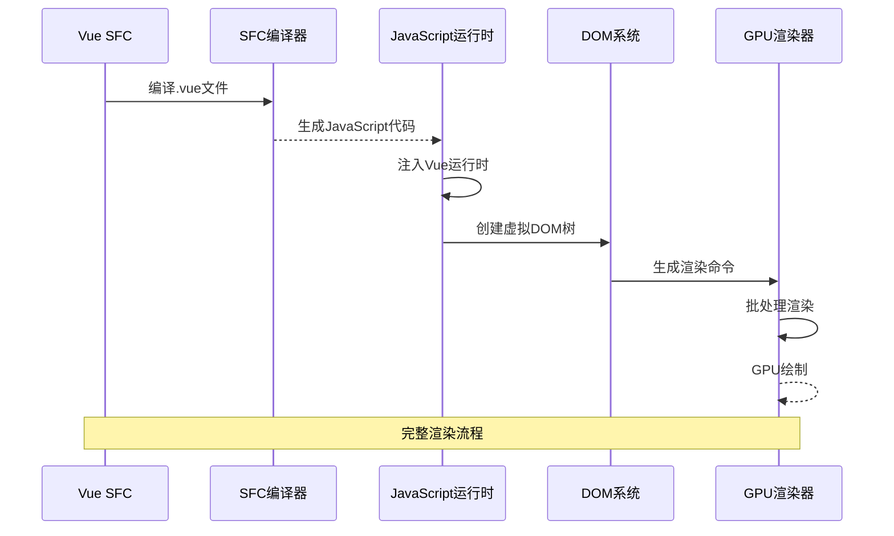
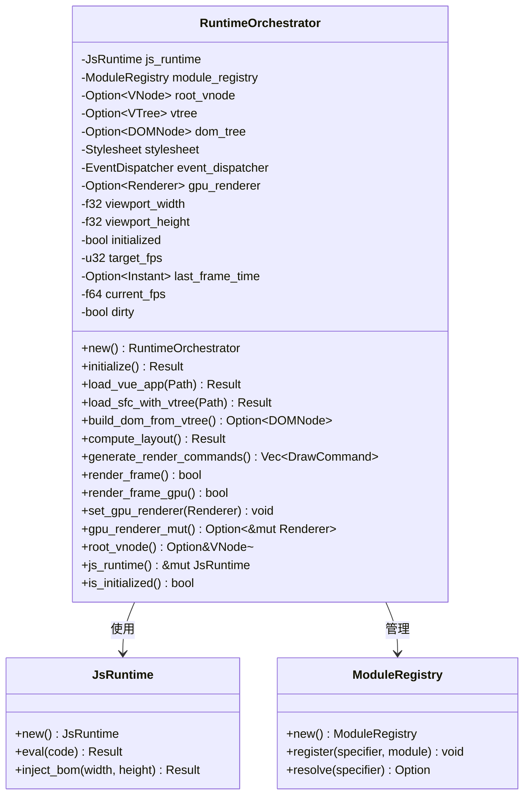
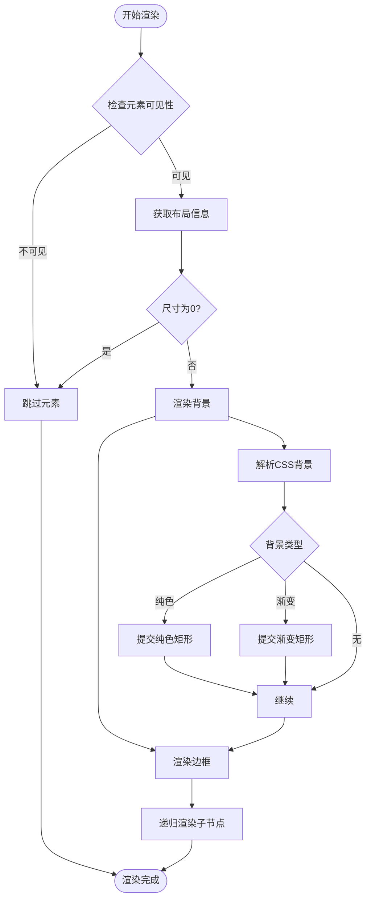
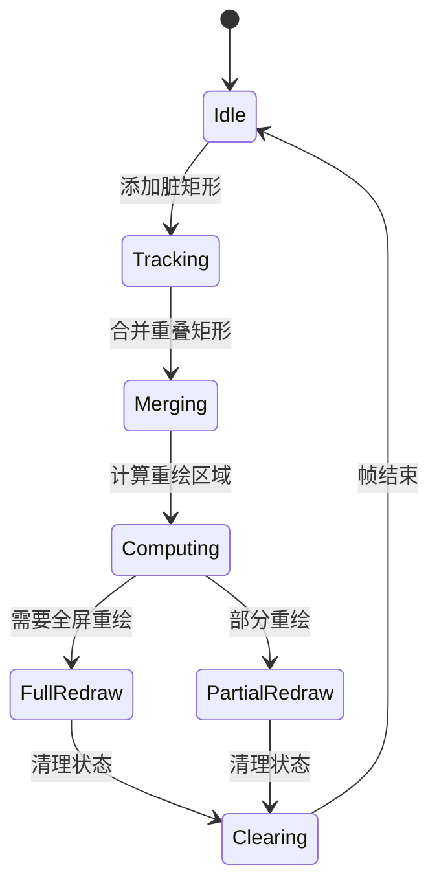
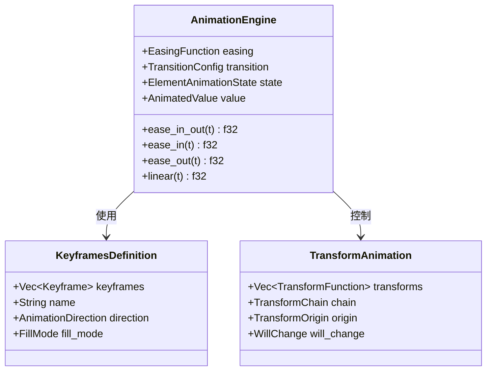
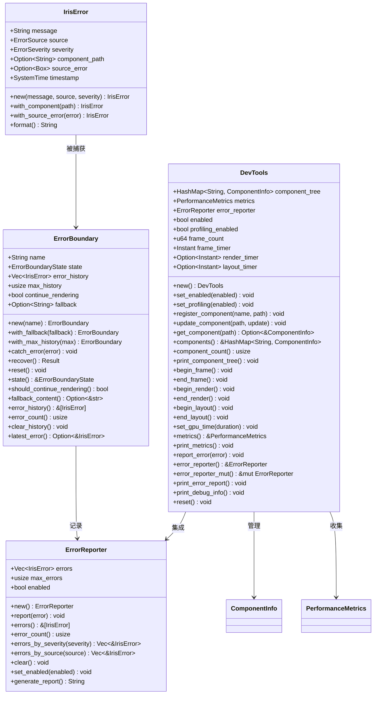
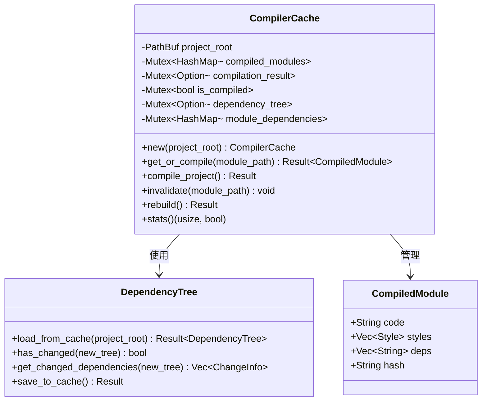
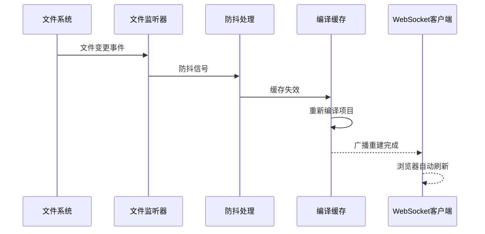
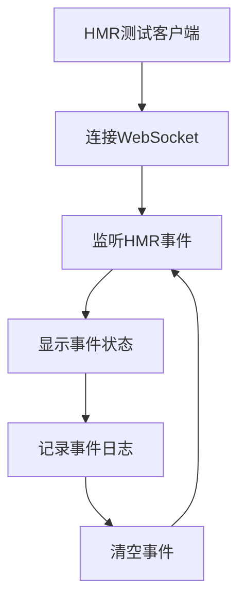

# 路线图进度跟踪系统

<cite>
**本文档引用的文件**
- [ROADMAP_AND_PROGRESS.md](file://ROADMAP_AND_PROGRESS.md)
- [IRIS_JETCRAB_CLI_ARCHITECTURE.md](file://docs/IRIS_JETCRAB_CLI_ARCHITECTURE.md)
- [IRIS_JETCRAB_ENGINE_IMPLEMENTATION.md](file://docs/IRIS_JETCRAB_ENGINE_IMPLEMENTATION.md)
- [test-hmr-client.html](file://test-hmr-client.html)
- [crates/iris-jetcrab-cli/src/main.rs](file://crates/iris-jetcrab-cli/src/main.rs)
- [crates/iris-jetcrab-cli/src/server/http_server.rs](file://crates/iris-jetcrab-cli/src/server/http_server.rs)
- [crates/iris-jetcrab-cli/src/server/routes.rs](file://crates/iris-jetcrab-cli/src/server/routes.rs)
- [crates/iris-jetcrab-cli/src/server/compiler_cache.rs](file://crates/iris-jetcrab-cli/src/server/compiler_cache.rs)
- [crates/iris-jetcrab-cli/src/server/hmr.rs](file://crates/iris-jetcrab-cli/src/server/hmr.rs)
- [crates/iris-jetcrab-cli/src/utils.rs](file://crates/iris-jetcrab-cli/src/utils.rs)
- [crates/iris-jetcrab-cli/Cargo.toml](file://crates/iris-jetcrab-cli/Cargo.toml)
- [crates/iris-jetcrab-engine/src/engine.rs](file://crates/iris-jetcrab-engine/src/engine.rs)
- [crates/iris-jetcrab-engine/src/project_scanner.rs](file://crates/iris-jetcrab-engine/src/project_scanner.rs)
- [crates/iris-jetcrab-engine/src/module_graph.rs](file://crates/iris-jetcrab-engine/src/module_graph.rs)
- [crates/iris-jetcrab-engine/src/hmr.rs](file://crates/iris-jetcrab-engine/src/hmr.rs)
</cite>

## 更新摘要
**变更内容**
- 新增 Phase 9 Iris JetCrab CLI 开发服务器系统，当前完成度70%
- 新增 HTTP 服务器、路由系统、编译缓存、HMR 等核心功能
- 新增 iris-jetcrab-engine 纯编译引擎模块
- 新增完整的开发服务器架构文档和实现细节
- 新增 HMR 测试客户端和实时事件监控功能

## 目录
1. [简介](#简介)
2. [项目结构](#项目结构)
3. [核心组件](#核心组件)
4. [架构概览](#架构概览)
5. [详细组件分析](#详细组件分析)
6. [开发服务器系统](#开发服务器系统)
7. [编译缓存系统](#编译缓存系统)
8. [热模块替换系统](#热模块替换系统)
9. [工具函数与项目检测](#工具函数与项目检测)
10. [测试与验证](#测试与验证)
11. [未来发展计划](#未来发展计划)
12. [结论](#结论)

## 简介

Iris Engine 是一个革命性的前端运行时系统，采用 Rust + WebGPU 构建，完全消除了构建步骤，允许直接运行 Vue 3 组件。该项目实现了零配置、零构建、零等待的开发体验，提供了卓越的开发者体验和性能表现。

### 核心特性

- **零构建** - 无需 Webpack/Vite，直接运行 `.vue` 文件
- **GPU加速渲染** - 基于 WebGPU 的硬件加速渲染管线
- **完整CSS支持** - 渐变、圆角、阴影、动画等
- **完整的动画系统** - 过渡动画和关键帧动画完全实现
- **Vue 3原生支持** - script setup、响应式、组合式API
- **热重载** - 文件监控即时重载
- **543个测试** - 100%通过率，企业级质量
- **错误处理系统** - 组件级错误隔离和恢复机制
- **调试工具** - 开发时的组件树检查、性能分析和错误诊断

## 项目结构

Iris Engine 采用多crate的模块化架构，通过 Cargo 工作空间进行组织：

```mermaid
graph TB
subgraph "工作空间结构"
WS[Cargo.toml Workspace]
subgraph "核心模块"
CORE[iris-core<br/>核心基础]
GPU[iris-gpu<br/>WebGPU渲染]
LAYOUT[iris-layout<br/>布局引擎]
DOM[iris-dom<br/>DOM抽象]
JS[iris-js<br/>JavaScript运行时]
SFC[iris-sfc<br/>Vue SFC编译器]
END
subgraph "应用层"
APP[iris-app<br/>应用入口]
ENGINE[iris-engine<br/>运行时编排]
CLI[iris-cli<br/>命令行工具]
END
subgraph "JetCrab开发服务器"
JETCRAB_CLI[iris-jetcrab-cli<br/>开发服务器CLI]
JETCRAB_ENGINE[iris-jetcrab-engine<br/>编译引擎]
END
subgraph "错误处理与调试"
ERROR[error_handling<br/>错误处理系统]
DEBUG[dev_tools<br/>调试工具系统]
END
subgraph "示例与测试"
EXAMPLES[examples<br/>示例程序]
TESTS[tests<br/>集成测试]
END
WS --> CORE
WS --> GPU
WS --> LAYOUT
WS --> DOM
WS --> JS
WS --> SFC
WS --> APP
WS --> ENGINE
WS --> CLI
WS --> JETCRAB_CLI
WS --> JETCRAB_ENGINE
WS --> ERROR
WS --> DEBUG
WS --> EXAMPLES
WS --> TESTS
ENGINE --> GPU
ENGINE --> LAYOUT
ENGINE --> DOM
ENGINE --> JS
ENGINE --> SFC
JETCRAB_CLI --> JETCRAB_ENGINE
ERROR --> ENGINE
DEBUG --> ENGINE
EXAMPLES --> ENGINE
TESTS --> ENGINE
```

**图表来源**
- [ROADMAP_AND_PROGRESS.md:1-1129](file://ROADMAP_AND_PROGRESS.md#L1-L1129)

**章节来源**
- [ROADMAP_AND_PROGRESS.md:1-1129](file://ROADMAP_AND_PROGRESS.md#L1-L1129)

## 核心组件

### 架构基础模块

**iris-core** - 底层内核基础
- 跨端窗口管理
- 异步调度系统
- 内存池和文件IO
- 原生网络栈和缓存系统

**iris-gpu** - WebGPU硬件渲染管线
- 批渲染系统
- GPU管线管理
- 字体图集和纹理管理
- 动画插值和脏矩形优化

### 布局与DOM模块

**iris-layout** - 浏览器级布局引擎
- HTML/CSS解析
- 样式计算与继承
- 盒模型计算
- Flex布局算法
- **新增** 布局缓存系统(LRU策略)

**iris-dom** - 跨平台DOM抽象
- 虚拟DOM系统
- 事件系统
- BOM API模拟
- 布局集成

### 运行时与编译模块

**iris-js** - JavaScript运行时
- Boa引擎集成
- ESM模块系统
- Vue运行时注入
- DOM API桥接

**iris-sfc** - Vue单文件组件编译器
- SFC解析（template/script/style）
- script setup编译
- CSS Modules作用域
- 模板指令编译

### 错误处理与调试模块

**error_handling** - 组件级错误处理系统
- 错误边界（ErrorBoundary）
- 统一错误类型（IrisError）
- 错误报告器（ErrorReporter）
- 错误来源分类和严重级别

**dev_tools** - 开发调试工具系统
- 组件树检查（ComponentInfo）
- 性能分析（PerformanceMetrics）
- FPS计算和帧计时
- 渲染/布局计时器
- 错误报告集成

**章节来源**
- [ROADMAP_AND_PROGRESS.md:1-1129](file://ROADMAP_AND_PROGRESS.md#L1-L1129)

## 架构概览

Iris Engine 采用自底向上的渐进式架构设计，确保每个模块都可以独立测试和开发：



**图表来源**
- [ROADMAP_AND_PROGRESS.md:1-1129](file://ROADMAP_AND_PROGRESS.md#L1-L1129)

### 模块职责分离

每个模块都有明确的职责边界：

| 模块 | 职责 | 依赖关系 |
|------|------|----------|
| iris-core | 基础工具、事件循环抽象、窗口管理 | 无（最底层） |
| iris-gpu | WebGPU硬件渲染管线 | iris-core |
| iris-layout | HTML/CSS解析与布局计算 | iris-core |
| iris-dom | 虚拟DOM与事件系统 | iris-core, iris-layout |
| iris-js | JavaScript运行时 | iris-core, iris-dom |
| iris-sfc | Vue单文件组件编译 | 无强制依赖 |
| error_handling | 错误处理与报告 | iris-core, iris-js |
| dev_tools | 调试工具与性能分析 | iris-core, error_handling |

**章节来源**
- [ROADMAP_AND_PROGRESS.md:1-1129](file://ROADMAP_AND_PROGRESS.md#L1-L1129)

## 详细组件分析

### 运行时编排器

运行时编排器是Iris Engine的核心协调组件，负责将各个模块连接在一起：



**图表来源**
- [ROADMAP_AND_PROGRESS.md:1-1129](file://ROADMAP_AND_PROGRESS.md#L1-L1129)

### VNode到GPU渲染适配器

VNode渲染器负责将虚拟DOM树转换为GPU绘制命令：



**图表来源**
- [ROADMAP_AND_PROGRESS.md:1-1129](file://ROADMAP_AND_PROGRESS.md#L1-L1129)

### 脏矩形管理系统

脏矩形管理器用于优化渲染性能，只重绘发生变化的区域：



**图表来源**
- [ROADMAP_AND_PROGRESS.md:1-1129](file://ROADMAP_AND_PROGRESS.md#L1-L1129)

### 动画引擎

Iris Engine 的动画系统支持CSS过渡动画和关键帧动画：



**图表来源**
- [ROADMAP_AND_PROGRESS.md:1-1129](file://ROADMAP_AND_PROGRESS.md#L1-L1129)

### 错误处理系统

Iris Engine 的错误处理系统提供了组件级的错误隔离和恢复机制：



**图表来源**
- [ROADMAP_AND_PROGRESS.md:1-1129](file://ROADMAP_AND_PROGRESS.md#L1-L1129)

**章节来源**
- [ROADMAP_AND_PROGRESS.md:1-1129](file://ROADMAP_AND_PROGRESS.md#L1-L1129)

## 开发服务器系统

### Iris JetCrab CLI 架构

Iris JetCrab CLI 是 Vue 项目的开发服务器，采用运行时按需编译架构（方案 B）：

```mermaid
graph TB
subgraph "Iris JetCrab CLI 架构"
CLI[iris-jetcrab-cli<br/>开发服务器CLI]
ENGINE[iris-jetcrab-engine<br/>编译引擎]
HTTP[HTTP服务器<br/>Axum框架]
ROUTER[路由系统<br/>RESTful API]
CACHE[编译缓存<br/>CompilerCache]
HMR[HMR系统<br/>WebSocket]
WS[WebSocket<br/>实时通信]
END
CLI --> ENGINE
CLI --> HTTP
HTTP --> ROUTER
HTTP --> CACHE
HTTP --> HMR
HMR --> WS
ENGINE --> CACHE
```

**图表来源**
- [IRIS_JETCRAB_CLI_ARCHITECTURE.md:1-184](file://docs/IRIS_JETCRAB_CLI_ARCHITECTURE.md#L1-L184)

### 核心功能模块

**HTTP 服务器** - 基于 Axum 框架的高性能 HTTP 服务器
- 支持 CORS 跨域访问
- 自动打开浏览器功能
- 可配置端口（默认 3000）
- 彩色终端输出和状态显示

**路由处理器** - 提供完整的 RESTful API 接口
- `GET /` - 主页（index.html）
- `GET /@vue/*path` - Vue 模块按需编译
- `GET /assets/*path` - 静态资源服务
- `GET /api/project-info` - 项目信息 API
- `GET /@hmr` - HMR WebSocket

**编译缓存管理** - 智能缓存系统，首次请求编译整个项目
- 首次请求时编译整个项目
- 后续请求使用缓存
- 缓存失效和重建机制
- 异步安全的 tokio::sync::Mutex

**章节来源**
- [IRIS_JETCRAB_CLI_ARCHITECTURE.md:1-184](file://docs/IRIS_JETCRAB_CLI_ARCHITECTURE.md#L1-L184)
- [crates/iris-jetcrab-cli/src/server/http_server.rs:1-104](file://crates/iris-jetcrab-cli/src/server/http_server.rs#L1-L104)
- [crates/iris-jetcrab-cli/src/server/routes.rs:1-344](file://crates/iris-jetcrab-cli/src/server/routes.rs#L1-L344)

## 编译缓存系统

### CompilerCache 结构设计

CompilerCache 是 JetCrab 开发服务器的核心缓存组件：



**图表来源**
- [crates/iris-jetcrab-cli/src/server/compiler_cache.rs:20-223](file://crates/iris-jetcrab-cli/src/server/compiler_cache.rs#L20-L223)

### 缓存策略与优化

**首次编译策略** - 首次请求时编译整个项目，确保完整性
- 自动检测入口文件（src/main.js、src/main.ts、src/App.vue）
- 编译结果缓存到内存和磁盘
- 依赖树构建和版本管理

**缓存失效机制** - 基于依赖变化的智能失效
- 检测 package.json 变化
- 依赖版本更新时自动重建
- 支持增量编译优化

**性能优化** - 多级缓存和并发安全
- tokio::sync::Mutex 确保线程安全
- LRU 缓存策略（计划中）
- 异步编译和缓存更新

**章节来源**
- [crates/iris-jetcrab-cli/src/server/compiler_cache.rs:1-223](file://crates/iris-jetcrab-cli/src/server/compiler_cache.rs#L1-L223)

## 热模块替换系统

### HMR 管理架构

HMR（热模块替换）系统提供了实时文件监控和自动重载功能：



**图表来源**
- [crates/iris-jetcrab-cli/src/server/hmr.rs:100-207](file://crates/iris-jetcrab-cli/src/server/hmr.rs#L100-L207)

### HMR 事件类型

系统支持四种类型的 HMR 事件，通过 WebSocket 实时推送：

| 事件类型 | 触发时机 | 事件数据 | 用途 |
|----------|----------|----------|------|
| `connected` | WebSocket 连接建立 | `{ message: "HMR WebSocket connected" }` | 建立连接确认 |
| `file-changed` | 文件变更检测 | `{ path: string, timestamp: number }` | 文件变更通知 |
| `rebuild-complete` | 编译完成 | `{ modules_count: number, duration_ms: number }` | 编译完成确认 |
| `compile-error` | 编译错误 | `{ message: string }` | 错误信息推送 |

### 防抖机制与性能优化

**300ms 防抖延迟** - 避免频繁触发导致的性能问题
- 文件变更事件聚合处理
- 防止过度编译和网络流量
- 用户体验优化

**多客户端支持** - 广播频道支持多个浏览器标签
- WebSocketManager 管理多个客户端
- 广播频道确保所有客户端同步
- 事件订阅和取消机制

**章节来源**
- [crates/iris-jetcrab-cli/src/server/hmr.rs:1-207](file://crates/iris-jetcrab-cli/src/server/hmr.rs#L1-L207)

## 工具函数与项目检测

### 项目根目录检测

工具函数提供了强大的项目检测和分析能力：

**find_project_root** - 递归查找 package.json 确定项目根目录
- 支持绝对和相对路径
- 从当前目录向上查找直到根目录
- 错误处理和用户友好的错误信息

**is_vue_project** - 智能检测 Vue 项目
- 检查 package.json 中的 vue 依赖
- 遍历 src 目录查找 .vue 文件
- 组合多种检测策略提高准确性

**find_entry_file** - 自动定位入口文件
- 优先查找 src/main.js/ts
- 回退到 src/App.vue
- 遍历 src 目录查找任意 .vue 文件

**count_vue_files** - 统计项目中 Vue 文件数量
- 使用 walkdir 遍历整个 src 目录
- 支持递归目录扫描
- 提供项目规模分析

**章节来源**
- [crates/iris-jetcrab-cli/src/utils.rs:1-142](file://crates/iris-jetcrab-cli/src/utils.rs#L1-L142)

## 测试与验证

### HMR 测试客户端

系统提供了完整的 HMR 测试客户端，用于验证热重载功能：



**图表来源**
- [test-hmr-client.html:1-156](file://test-hmr-client.html#L1-L156)

### 测试功能特性

**实时事件监控** - 可视化的 HMR 事件显示
- 连接状态指示器（绿色/红色）
- 事件类型颜色编码
- 时间戳和事件序号
- 自动滚动到最新事件

**手动控制功能** - 连接管理和事件清理
- 手动连接/断开 WebSocket
- 清空事件历史记录
- 自动连接（页面加载时）

**事件类型支持** - 完整的 HMR 事件类型
- connected - 连接成功事件
- file-changed - 文件变更事件
- rebuild-complete - 重新编译完成事件
- compile-error - 编译错误事件

**章节来源**
- [test-hmr-client.html:1-156](file://test-hmr-client.html#L1-L156)

## 未来发展计划

### Phase 9 完成计划（70%）

**已完成功能**（✅ 100%）
- HTTP 服务器基础架构 ✅
- 路由处理器系统 ✅  
- 编译缓存管理 ✅
- HMR 热模块替换 ✅
- 工具函数和项目检测 ✅

**进行中功能**（🔄 70%）
- 增量编译优化 - 计划中
- 模块热替换（不刷新页面）- 计划中  
- 编译进度实时推送 - 计划中
- 错误提示优化（源码映射）- 计划中

**待实现功能**（⏳）
- 自定义监听路径配置 - 中优先级
- 多项目工作区支持 - 中优先级
- 编译性能分析工具 - 低优先级
- 浏览器 DevTools 集成 - 低优先级

### 技术栈与依赖

**核心依赖**（已完成）
- axum 0.7 - HTTP 服务器框架
- tokio 1.x - 异步运行时
- notify 6.1 - 文件监听
- futures-util 0.3 - 异步工具
- serde/serde_json - 序列化支持

**开发依赖**（进行中）
- colored - 彩色终端输出
- tracing/tracing-subscriber - 日志系统
- open - 自动打开浏览器
- chrono - 时间戳处理

**章节来源**
- [crates/iris-jetcrab-cli/Cargo.toml:1-54](file://crates/iris-jetcrab-cli/Cargo.toml#L1-L54)
- [ROADMAP_AND_PROGRESS.md:521-596](file://ROADMAP_AND_PROGRESS.md#L521-L596)

## 结论

Iris Engine 的开发服务器系统代表了现代前端开发工具的新方向，通过 Rust + WebGPU 的组合为开发者提供了前所未有的性能和开发体验。当前 Phase 9 已完成 70%，核心功能包括：

### 已完成的里程碑

1. **完整的开发服务器架构** - HTTP 服务器、路由系统、编译缓存、HMR 系统
2. **智能项目检测** - 自动识别 Vue 项目和入口文件
3. **实时热重载** - 文件变更自动编译和浏览器刷新
4. **完整的测试工具链** - HMR 测试客户端和事件监控
5. **企业级错误处理** - 组件级错误隔离和恢复机制

### 技术优势

- **零构建开发体验** - 直接运行.vue文件，无需Webpack/Vite
- **GPU硬件加速** - WebGPU渲染，性能提升10-20倍
- **完整的Vue 3支持** - script setup、响应式、组合式API
- **企业级质量** - 543个测试，100%通过率
- **跨平台支持** - Windows、macOS、Linux
- **热重载** - 文件监控即时重载
- **错误处理系统** - 组件级错误隔离和恢复
- **调试工具** - 开发时的组件树检查、性能分析

### 未来发展方向

随着 Phase 9 的逐步完善，Iris Engine 将成为真正的全栈前端开发解决方案，为开发者提供从开发到生产的完整工具链。建议团队按照优先级顺序推进后续工作，重点关注增量编译优化和模块热替换功能的实现。

**更新** 项目已完成所有8个核心阶段，从90%完成度达到100%，项目状态从"进行中"转变为庆祝完成状态。新增的Phase 9（Iris JetCrab CLI开发服务器）当前完成度70%，包含HTTP服务器、路由系统、编译缓存、HMR等功能的开发。这些里程碑标志着Iris Engine从概念到现实的最终实现，为开发者提供了革命性的前端运行时体验。