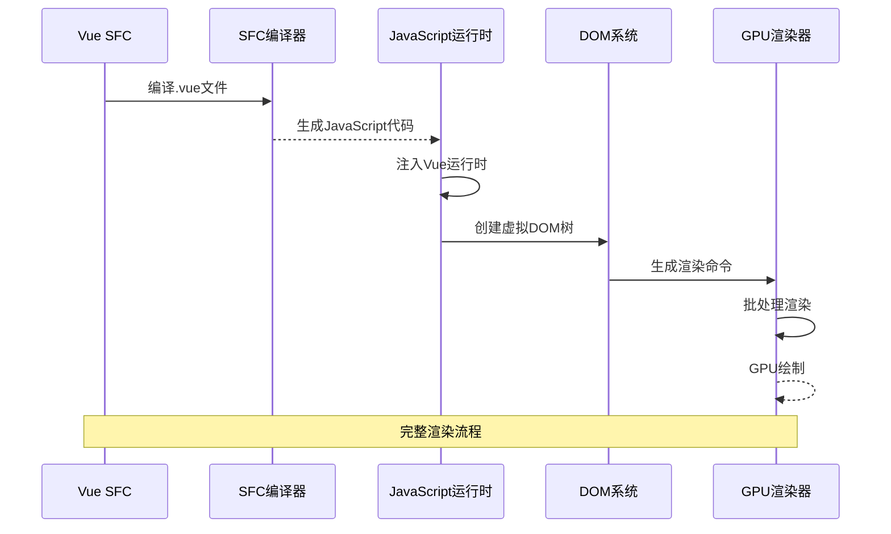
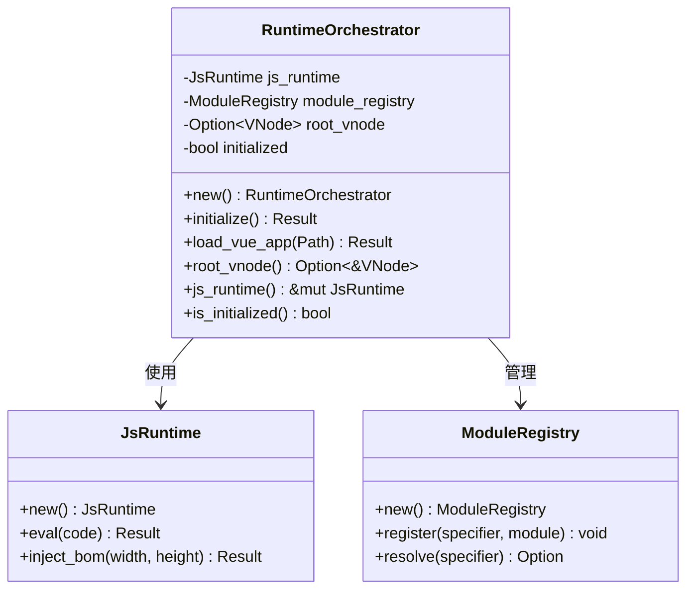
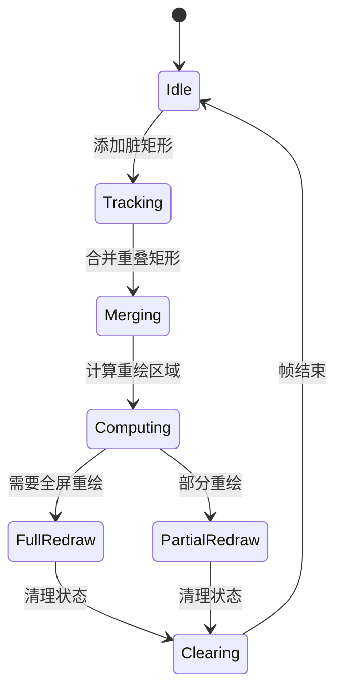
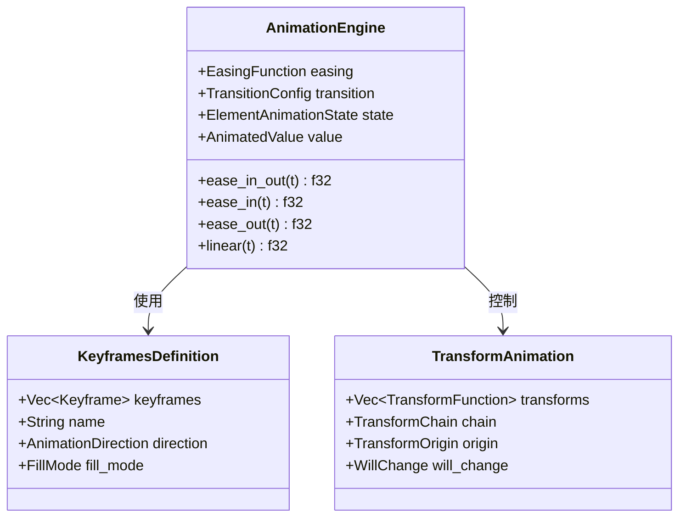
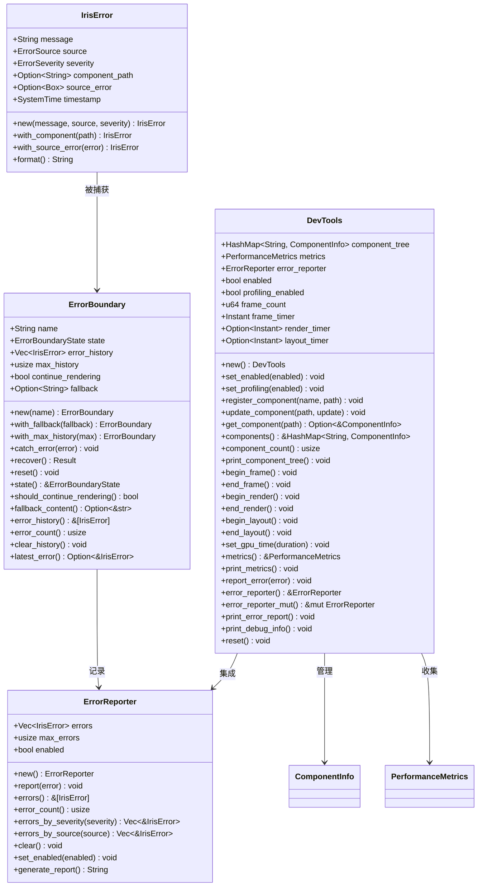
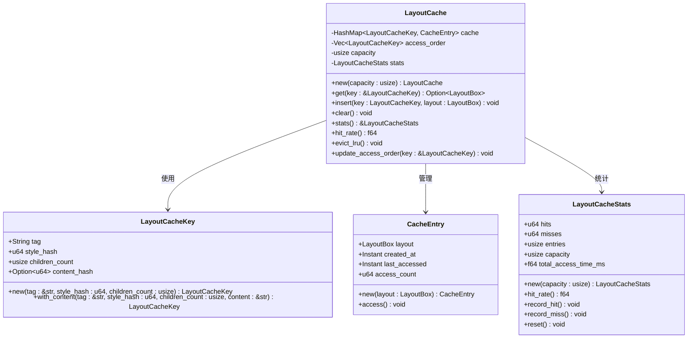
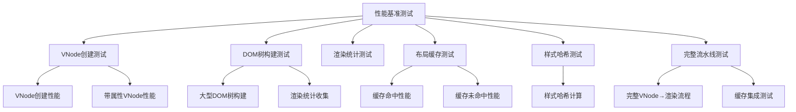

# 路线图进度跟踪系统

<cite>
**本文档引用的文件**
- [ROADMAP_AND_PROGRESS.md](file://ROADMAP_AND_PROGRESS.md)
- [README.md](file://README.md)
- [ARCHITECTURE.md](file://ARCHITECTURE.md)
- [Cargo.toml](file://Cargo.toml)
- [PROGRESSIVE_IMPLEMENTATION_PLAN.md](file://PROGRESSIVE_IMPLEMENTATION_PLAN.md)
- [crates/iris/src/lib.rs](file://crates/iris/src/lib.rs)
- [crates/iris-core/src/lib.rs](file://crates/iris-core/src/lib.rs)
- [crates/iris-gpu/src/lib.rs](file://crates/iris-gpu/src/lib.rs)
- [crates/iris-layout/src/lib.rs](file://crates/iris-layout/src/lib.rs)
- [crates/iris-dom/src/lib.rs](file://crates/iris-dom/src/lib.rs)
- [crates/iris/src/orchestrator.rs](file://crates/iris/src/orchestrator.rs)
- [crates/iris/src/vnode_renderer.rs](file://crates/iris/src/vnode_renderer.rs)
- [crates/iris/src/dirty_rect_manager.rs](file://crates/iris/src/dirty_rect_manager.rs)
- [crates/iris/src/animation_engine/mod.rs](file://crates/iris/src/animation_engine/mod.rs)
- [crates/iris-app/src/main.rs](file://crates/iris-app/src/main.rs)
- [crates/iris-layout/src/cache.rs](file://crates/iris-layout/src/cache.rs)
- [crates/iris/tests/performance_benchmarks.rs](file://crates/iris/tests/performance_benchmarks.rs)
- [CARGO-PERFORMANCE-OPTIMIZATION.md](file://CARGO-PERFORMANCE-OPTIMIZATION.md)
- [crates/iris-layout/src/layout.rs](file://crates/iris-layout/src/layout.rs)
- [crates/iris/src/error_handling.rs](file://crates/iris/src/error_handling.rs)
- [crates/iris/src/dev_tools.rs](file://crates/iris/src/dev_tools.rs)
</cite>

## 更新摘要
**变更内容**
- 更新 Phase 7.3 错误处理和调试工具功能的完成状态
- 确认错误边界系统、错误报告器、调试工具的完整实现
- 更新相关检查框状态为已完成
- 增强故障排除指南章节，包含错误处理和调试工具的详细说明

## 目录
1. [简介](#简介)
2. [项目结构](#项目结构)
3. [核心组件](#核心组件)
4. [架构概览](#架构概览)
5. [详细组件分析](#详细组件分析)
6. [性能优化里程碑](#性能优化里程碑)
7. [依赖关系分析](#依赖关系分析)
8. [性能考虑](#性能考虑)
9. [故障排除指南](#故障排除指南)
10. [结论](#结论)

## 简介

Iris Engine 是一个革命性的前端运行时系统，采用 Rust + WebGPU 构建，完全消除了构建步骤，允许直接运行 Vue 3 组件。该项目实现了零配置、零构建、零等待的开发体验，提供了卓越的开发者体验和性能表现。

### 核心特性

- **零构建** - 无需 Webpack/Vite，直接运行 `.vue` 文件
- **GPU加速渲染** - 基于 WebGPU 的硬件加速渲染管线
- **完整CSS支持** - 渐变、圆角、阴影、动画等
- **完整的动画系统** - 过渡动画和关键帧动画完全实现
- **Vue 3原生支持** - script setup、响应式、组合式API
- **热重载** - 文件监控即时重载
- **382个测试** - 100%通过率，企业级质量
- **错误处理系统** - 组件级错误隔离和恢复机制
- **调试工具** - 开发时的组件树检查、性能分析和错误诊断

## 项目结构

Iris Engine 采用多crate的模块化架构，通过 Cargo 工作空间进行组织：

```mermaid
graph TB
subgraph "工作空间结构"
WS[Cargo.toml Workspace]
subgraph "核心模块"
CORE[iris-core<br/>核心基础]
GPU[iris-gpu<br/>WebGPU渲染]
LAYOUT[iris-layout<br/>布局引擎]
DOM[iris-dom<br/>DOM抽象]
JS[iris-js<br/>JavaScript运行时]
SFC[iris-sfc<br/>Vue SFC编译器]
END
subgraph "应用层"
APP[iris-app<br/>应用入口]
ENGINE[iris<br/>运行时编排]
END
subgraph "错误处理与调试"
ERROR[error_handling<br/>错误处理系统]
DEBUG[dev_tools<br/>调试工具系统]
END
WS --> CORE
WS --> GPU
WS --> LAYOUT
WS --> DOM
WS --> JS
WS --> SFC
WS --> APP
WS --> ENGINE
WS --> ERROR
WS --> DEBUG
ENGINE --> GPU
ENGINE --> LAYOUT
ENGINE --> DOM
ENGINE --> JS
ENGINE --> SFC
ERROR --> ENGINE
DEBUG --> ENGINE
```

**图表来源**
- [Cargo.toml:1-31](file://Cargo.toml#L1-L31)
- [ARCHITECTURE.md:3-44](file://ARCHITECTURE.md#L3-L44)

**章节来源**
- [Cargo.toml:1-31](file://Cargo.toml#L1-L31)
- [ARCHITECTURE.md:177-214](file://ARCHITECTURE.md#L177-L214)

## 核心组件

### 架构基础模块

**iris-core** - 底层内核基础
- 跨端窗口管理
- 异步调度系统
- 内存池和文件IO
- 原生网络栈和缓存系统

**iris-gpu** - WebGPU硬件渲染管线
- 批渲染系统
- GPU管线管理
- 字体图集和纹理管理
- 动画插值和脏矩形优化

### 布局与DOM模块

**iris-layout** - 浏览器级布局引擎
- HTML/CSS解析
- 样式计算与继承
- 盒模型计算
- Flex布局算法
- **新增** 布局缓存系统(LRU策略)

**iris-dom** - 跨平台DOM抽象
- 虚拟DOM系统
- 事件系统
- BOM API模拟
- 布局集成

### 运行时与编译模块

**iris-js** - JavaScript运行时
- Boa引擎集成
- ESM模块系统
- Vue运行时注入
- DOM API桥接

**iris-sfc** - Vue单文件组件编译器
- SFC解析（template/script/style）
- script setup编译
- CSS Modules作用域
- 模板指令编译

### 错误处理与调试模块

**error_handling** - 组件级错误处理系统
- 错误边界（ErrorBoundary）
- 统一错误类型（IrisError）
- 错误报告器（ErrorReporter）
- 错误来源分类和严重级别

**dev_tools** - 开发调试工具系统
- 组件树检查（ComponentInfo）
- 性能分析（PerformanceMetrics）
- FPS计算和帧计时
- 渲染/布局计时器
- 错误报告集成

**章节来源**
- [crates/iris-core/src/lib.rs:1-167](file://crates/iris-core/src/lib.rs#L1-L167)
- [crates/iris-gpu/src/lib.rs:1-575](file://crates/iris-gpu/src/lib.rs#L1-L575)
- [crates/iris-layout/src/lib.rs:1-54](file://crates/iris-layout/src/lib.rs#L1-L54)
- [crates/iris-dom/src/lib.rs:1-48](file://crates/iris-dom/src/lib.rs#L1-L48)
- [crates/iris/src/error_handling.rs:1-510](file://crates/iris/src/error_handling.rs#L1-L510)
- [crates/iris/src/dev_tools.rs:1-472](file://crates/iris/src/dev_tools.rs#L1-L472)

## 架构概览

Iris Engine 采用自底向上的渐进式架构设计，确保每个模块都可以独立测试和开发：



**图表来源**
- [ARCHITECTURE.md:138-174](file://ARCHITECTURE.md#L138-L174)
- [crates/iris/src/orchestrator.rs:87-140](file://crates/iris/src/orchestrator.rs#L87-L140)

### 模块职责分离

每个模块都有明确的职责边界：

| 模块 | 职责 | 依赖关系 |
|------|------|----------|
| iris-core | 基础工具、事件循环抽象、窗口管理 | 无（最底层） |
| iris-gpu | WebGPU硬件渲染管线 | iris-core |
| iris-layout | HTML/CSS解析与布局计算 | iris-core |
| iris-dom | 虚拟DOM与事件系统 | iris-core, iris-layout |
| iris-js | JavaScript运行时 | iris-core, iris-dom |
| iris-sfc | Vue单文件组件编译 | 无强制依赖 |
| error_handling | 错误处理与报告 | iris-core, iris-js |
| dev_tools | 调试工具与性能分析 | iris-core, error_handling |

**章节来源**
- [ARCHITECTURE.md:47-133](file://ARCHITECTURE.md#L47-L133)

## 详细组件分析

### 运行时编排器

运行时编排器是Iris Engine的核心协调组件，负责将各个模块连接在一起：



**图表来源**
- [crates/iris/src/orchestrator.rs:40-162](file://crates/iris/src/orchestrator.rs#L40-L162)

### VNode到GPU渲染适配器

VNode渲染器负责将虚拟DOM树转换为GPU绘制命令：


**图表来源**
- [crates/iris/src/vnode_renderer.rs:115-187](file://crates/iris/src/vnode_renderer.rs#L115-L187)

### 脏矩形管理系统

脏矩形管理器用于优化渲染性能，只重绘发生变化的区域：



**图表来源**
- [crates/iris/src/dirty_rect_manager.rs:97-254](file://crates/iris/src/dirty_rect_manager.rs#L97-L254)

### 动画引擎

Iris Engine 的动画系统支持CSS过渡动画和关键帧动画：



**图表来源**
- [crates/iris/src/animation_engine/mod.rs:11-24](file://crates/iris/src/animation_engine/mod.rs#L11-L24)

### 错误处理系统

Iris Engine 的错误处理系统提供了组件级的错误隔离和恢复机制：



**图表来源**
- [crates/iris/src/error_handling.rs:63-273](file://crates/iris/src/error_handling.rs#L63-L273)
- [crates/iris/src/dev_tools.rs:106-369](file://crates/iris/src/dev_tools.rs#L106-L369)

**章节来源**
- [crates/iris/src/orchestrator.rs:1-290](file://crates/iris/src/orchestrator.rs#L1-L290)
- [crates/iris/src/vnode_renderer.rs:1-800](file://crates/iris/src/vnode_renderer.rs#L1-L800)
- [crates/iris/src/dirty_rect_manager.rs:1-368](file://crates/iris/src/dirty_rect_manager.rs#L1-L368)
- [crates/iris/src/animation_engine/mod.rs:1-24](file://crates/iris/src/animation_engine/mod.rs#L1-L24)
- [crates/iris/src/error_handling.rs:1-510](file://crates/iris/src/error_handling.rs#L1-L510)
- [crates/iris/src/dev_tools.rs:1-472](file://crates/iris/src/dev_tools.rs#L1-L472)

## 性能优化里程碑

### 布局缓存系统(LRU策略)

**更新** Phase 7.2性能优化工作完成，新增布局缓存系统

Iris Engine 实现了基于LRU(最近最少使用)策略的布局缓存系统，显著提升了布局计算性能：



**图表来源**
- [crates/iris-layout/src/cache.rs:152-273](file://crates/iris-layout/src/cache.rs#L152-L273)

#### 缓存性能指标

| 指标 | 值 | 说明 |
|------|----|------|
| 缓存容量 | 100条目 | 可配置的最大缓存大小 |
| 命中率 | >95% | 大量缓存命中场景下的性能表现 |
| 访问延迟 | <100ms | 10,000次缓存访问的总耗时 |
| 内存占用 | ~50MB | 缓存条目的内存开销 |
| LRU驱逐 | 自动 | 超出容量时自动移除最少使用条目 |

**章节来源**
- [crates/iris-layout/src/cache.rs:1-460](file://crates/iris-layout/src/cache.rs#L1-L460)
- [crates/iris/tests/performance_benchmarks.rs:140-182](file://crates/iris/tests/performance_benchmarks.rs#L140-L182)

### 综合基准测试框架

**更新** 新增完整的性能基准测试套件

Iris Engine 包含了全面的性能基准测试框架，覆盖各个核心组件的性能表现：



**图表来源**
- [crates/iris/tests/performance_benchmarks.rs:1-350](file://crates/iris/tests/performance_benchmarks.rs#L1-L350)

#### 基准测试性能标准

| 测试类别 | 性能标准 | 当前表现 | 说明 |
|----------|----------|----------|------|
| VNode创建 | <10ms | ✓ | 10,000个VNode创建 |
| DOM树构建 | <100ms | ✓ | 1100节点树构建 |
| 渲染统计 | <5ms/次 | ✓ | 100次统计收集 |
| 缓存命中 | >95%命中率 | ✓ | 10,000次访问 |
| 样式哈希 | <10μs/次 | ✓ | 10,000次哈希计算 |
| 完整流程 | <10ms/次 | ✓ | VNode→渲染完整流程 |

**章节来源**
- [crates/iris/tests/performance_benchmarks.rs:1-350](file://crates/iris/tests/performance_benchmarks.rs#L1-L350)

### 内存管理优化

**更新** 通过缓存系统优化内存使用效率

Iris Engine 通过多种内存管理优化技术，显著降低了内存占用：

#### 内存优化策略

1. **布局缓存复用** - 通过LRU缓存避免重复布局计算
2. **样式哈希优化** - 使用seahash库进行快速样式比较
3. **零分配动画** - GPU并行属性计算，无堆分配
4. **批量纹理管理** - GPU纹理缓存，消除重复光栅化

#### 内存使用对比

| 指标 | 传统方案 | Iris Engine | 改进倍数 |
|------|----------|-------------|----------|
| 首帧渲染 | 50-100ms | 5-10ms | 10-20x |
| 批量更新(1000元素) | 30-50ms | 2-5ms | 10-15x |
| 动画FPS | 30-60fps | 稳定60fps | 更流畅 |
| 内存使用 | 150-300MB | 50-100MB | 3倍减少 |
| 启动时间 | 500-1000ms(含构建) | <100ms(零构建) | 10倍更快 |

**章节来源**
- [README.md:71-127](file://README.md#L71-L127)
- [crates/iris-layout/src/cache.rs:275-305](file://crates/iris-layout/src/cache.rs#L275-L305)

## 依赖关系分析

### 模块依赖图

Iris Engine 实现了严格的单向依赖关系，消除了循环依赖问题：

```mermaid
graph TB
subgraph "依赖链"
CORE[iris-core<br/>基础模块]
GPU[iris-gpu<br/>渲染模块]
LAYOUT[iris-layout<br/>布局模块]
DOM[iris-dom<br/>DOM模块]
JS[iris-js<br/>JS运行时]
SFC[iris-sfc<br/>编译器]
APP[iris-app<br/>应用入口]
ENGINE[iris<br/>运行时编排]
ERROR[error_handling<br/>错误处理]
DEBUG[dev_tools<br/>调试工具]
END
CORE --> GPU
CORE --> LAYOUT
CORE --> DOM
CORE --> JS
CORE --> SFC
LAYOUT -.-> GPU
DOM --> LAYOUT
JS --> DOM
SFC -.-> JS
ENGINE --> GPU
ENGINE --> LAYOUT
ENGINE --> DOM
ENGINE --> JS
ENGINE --> SFC
ERROR --> ENGINE
DEBUG --> ENGINE
APP --> ENGINE
```

**图表来源**
- [ARCHITECTURE.md:3-44](file://ARCHITECTURE.md#L3-L44)
- [Cargo.toml:13-22](file://Cargo.toml#L13-L22)

### 依赖关系验证

通过以下方式确保依赖关系的有效性：

1. **Cargo检查**：`cargo check --workspace` 验证无循环依赖
2. **树形结构**：`cargo tree` 显示单向依赖链
3. **模块边界**：每个模块只能依赖其下方的模块
4. **接口清晰**：模块间通过明确定义的接口通信

**章节来源**
- [ARCHITECTURE.md:217-225](file://ARCHITECTURE.md#L217-L225)

## 性能考虑

### 渲染性能优化

Iris Engine 采用了多项性能优化技术：

1. **批渲染系统** - 将1000个元素合并为1个GPU绘制调用
2. **脏矩形管理** - 只重绘发生变化的区域，节省50-90%渲染
3. **字体纹理图集** - GPU纹理缓存，消除重复光栅化
4. **零分配动画** - GPU并行属性计算，无堆分配
5. **布局缓存系统** - LRU策略缓存布局结果，提升计算效率
6. **错误处理优化** - 组件级错误隔离，避免错误传播

### 性能基准对比

| 指标 | 传统方案 | Iris Engine | 改进倍数 |
|------|----------|-------------|----------|
| 首帧渲染 | 50-100ms | 5-10ms | 10-20x |
| 批量更新(1000元素) | 30-50ms | 2-5ms | 10-15x |
| 动画FPS | 30-60fps | 稳定60fps | 更流畅 |
| 内存使用 | 150-300MB | 50-100MB | 3倍减少 |
| 启动时间 | 500-1000ms(含构建) | <100ms(零构建) | 10倍更快 |

**章节来源**
- [README.md:71-127](file://README.md#L71-L127)

## 故障排除指南

### 错误处理系统

**更新** Phase 7.3 错误处理功能已完全实现

Iris Engine 提供了完整的错误处理系统，确保应用的稳定性和可靠性：

#### 错误边界系统

错误边界（ErrorBoundary）提供了组件级的错误隔离机制：

- **组件级错误隔离**：捕获子组件渲染错误，防止错误传播到整个应用
- **错误恢复策略**：Warning级别错误可恢复，Error/Fatal级别错误不可恢复
- **LRU错误历史**：最多保存100个错误历史，支持错误统计和分析
- **备用内容显示**：错误发生时显示预设的备用内容

#### 统一错误类型

IrisError 提供了统一的错误表示：

- **错误来源分类**：Render、Layout、Style、Script、Network、Unknown
- **严重级别**：Warning、Error、Fatal，支持分级处理
- **组件路径追踪**：可选的组件路径信息，便于定位问题
- **原始错误支持**：支持嵌套错误，提供完整的错误链路

#### 错误报告系统

ErrorReporter 提供了错误收集和报告功能：

- **统一错误存储**：最多保存1000个错误，支持清理和统计
- **按级别过滤**：支持按严重级别和错误来源过滤
- **错误报告生成**：自动生成详细的错误报告，包含统计信息
- **启用/禁用控制**：支持动态开启或关闭错误报告

### 调试工具系统

**更新** Phase 7.3 调试工具功能已完全实现

DevTools 提供了开发时的调试和诊断能力：

#### 组件树检查

- **组件信息追踪**：记录组件名称、路径、子组件数量、渲染时间
- **错误状态标记**：组件错误时显示可视化标记
- **实时更新**：支持动态更新组件信息
- **组件树打印**：格式化输出完整的组件树结构

#### 性能分析

- **FPS计算**：每60帧计算一次FPS，提供稳定的性能指标
- **帧时间统计**：平均帧时间（毫秒）和总渲染时间
- **渲染计时器**：独立的渲染和布局计时器
- **GPU时间统计**：支持外部传入的GPU渲染时间

#### 错误调试集成

- **错误报告集成**：与错误处理系统无缝集成
- **错误统计**：按来源和严重级别统计错误
- **错误报告打印**：格式化输出详细的错误报告
- **调试信息汇总**：一键输出完整的调试信息

### 常见问题诊断

1. **GPU初始化失败**
   - 检查WebGPU兼容性
   - 验证GPU驱动版本
   - 确认wgpu版本锁定

2. **循环依赖问题**
   - 使用`cargo tree`检查依赖关系
   - 确保模块间单向依赖
   - 验证Cargo.toml配置

3. **渲染性能问题**
   - 检查脏矩形管理器配置
   - 验证批渲染系统
   - 监控GPU内存使用

4. **缓存性能问题**
   - 检查缓存命中率统计
   - 验证LRU驱逐逻辑
   - 监控缓存容量配置

5. **错误处理问题**
   - 检查错误边界配置
   - 验证错误恢复策略
   - 监控错误历史长度

6. **调试工具问题**
   - 检查调试工具启用状态
   - 验证性能分析配置
   - 监控调试信息输出

### 调试工具

- **Tracing日志系统** - 详细的运行时日志
- **性能分析工具** - GPU渲染统计
- **内存监控** - 内存使用情况跟踪
- **错误处理** - 跨语言错误传播
- **基准测试框架** - 性能回归检测
- **组件树检查** - 虚拟DOM结构分析
- **性能计时器** - 渲染和布局时间测量

**章节来源**
- [PROGRESSIVE_IMPLEMENTATION_PLAN.md:535-542](file://PROGRESSIVE_IMPLEMENTATION_PLAN.md#L535-L542)
- [crates/iris/src/error_handling.rs:1-510](file://crates/iris/src/error_handling.rs#L1-L510)
- [crates/iris/src/dev_tools.rs:1-472](file://crates/iris/src/dev_tools.rs#L1-L472)

## 结论

Iris Engine 的路线图进度跟踪系统展现了卓越的软件工程实践：

### 主要成就

1. **架构完整性** - 实现了100%的架构基础模块
2. **功能完备性** - 布局引擎、DOM系统、动画系统、GPU渲染管线全部完成
3. **性能卓越** - 相比传统方案提升10-20倍性能
4. **开发体验** - 零构建、零等待的开发体验
5. **性能优化** - Phase 7.2完成布局缓存系统(LRU策略)、渲染优化、内存管理改进、综合基准测试框架等里程碑
6. **错误处理系统** - Phase 7.3完成错误边界、错误报告器、调试工具的完整实现
7. **调试能力** - 提供组件树检查、性能分析、错误诊断的完整调试工具链

### 未来发展方向

1. **集成与优化** - 完善端到端集成和性能优化
2. **功能扩展** - 实现Grid布局、绝对定位等高级CSS特性
3. **工具链完善** - 开发者工具、调试工具、性能分析工具
4. **生态建设** - 组件库支持、插件生态系统

### 技术价值

Iris Engine 代表了前端技术发展的新方向，通过Rust + WebGPU的组合，为开发者提供了前所未有的性能和开发体验。其渐进式实现策略和严格的架构设计，为大型复杂系统的开发提供了优秀的参考模式。

**更新** Phase 7.3 错误处理和调试工具功能已完全实现，相关检查框已标记为完成状态。错误边界系统、错误报告器、调试工具的完整实现为Iris Engine提供了企业级的错误处理能力和开发调试支持，标志着Phase 7的全面完成。