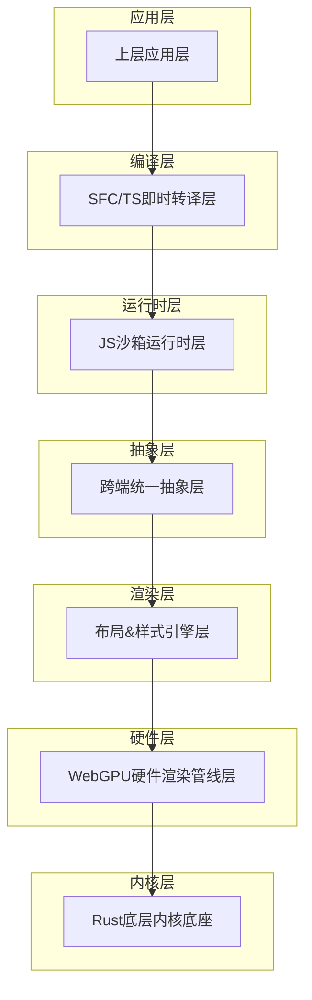
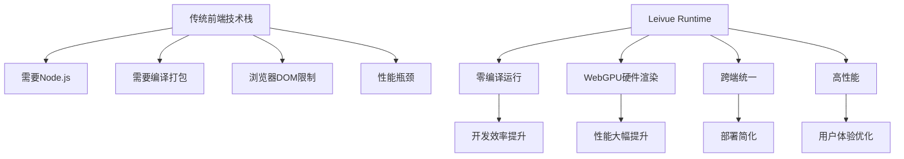

# 项目定位与愿景

<cite>
**本文档引用的文件**
- [doc.txt](file://doc.txt)
</cite>

## 目录
1. [项目概述](#项目概述)
2. [核心定位](#核心定位)
3. [技术愿景](#技术愿景)
4. [市场定位](#市场定位)
5. [目标用户群体](#目标用户群体)
6. [差异化优势](#差异化优势)
7. [架构设计](#架构设计)
8. [核心使命](#核心使命)
9. [未来展望](#未来展望)

## 项目概述

Leivue Runtime是一个革命性的前端运行时引擎，旨在彻底改变传统的前端开发和部署方式。该项目采用Rust+WebGPU技术栈，实现了完全脱离Node.js、浏览器DOM和传统编译打包流程的前端运行时解决方案。

### 项目全称
- **Rust+WebGPU 下一代无构建前端运行时引擎**

### 核心理念
项目致力于为Vue生态系统提供一个高性能、跨平台、零工程化的运行底座，让开发者能够直接运行Vue3 + TypeScript源码，无需任何编译或打包步骤。

**章节来源**
- [doc.txt:1-6](file://doc.txt#L1-L6)

## 核心定位

### 技术定位
Leivue Runtime的核心定位是一套完全脱离传统前端工程化限制的运行时引擎：

- **完全零编译**：直接执行Vue3 + TypeScript源码
- **跨端统一**：浏览器Wasm模式 + 独立桌面原生模式
- **硬件级渲染**：基于WebGPU的GPU加速渲染
- **生态兼容**：完整支持Element Plus、Ant Design Vue等主流UI库

### 运行形态
项目提供两种运行模式，但共享同一套核心内核：
1. **浏览器Wasm模式**：将应用编译为WASM，在任意现代浏览器中运行
2. **桌面原生模式**：脱离浏览器，编译为独立EXE/App/二进制文件

**章节来源**
- [doc.txt:3-6](file://doc.txt#L3-L6)
- [doc.txt:4](file://doc.txt#L4)
- [doc.txt:5](file://doc.txt#L5)

## 技术愿景

### 七层分层架构
项目采用高度解耦的七层架构设计，每层都有明确的职责边界：

**图表来源**
- [doc.txt:7-22](file://doc.txt#L7-L22)

### 核心技术栈
- **底层内核**：纯Rust编写，具备跨端窗口管理、异步调度、内存池等基础能力
- **渲染引擎**：完全替代DOM渲染的自研GPU渲染管线
- **JS引擎**：QuickJS轻量高性能引擎，深度绑定Rust
- **编译器**：基于Rust的swc实现即时转译

**章节来源**
- [doc.txt:23-34](file://doc.txt#L23-L34)
- [doc.txt:46-51](file://doc.txt#L46-L51)

## 市场定位

### 目标市场
Leivue Runtime主要面向以下市场领域：

- **企业内部管理系统**：需要离线运行、内网部署的管理系统
- **桌面应用开发**：寻求更高效替代Electron/Tauri的方案
- **低代码平台**：需要高性能运行底座的平台建设
- **涉密项目**：对安全性要求极高的项目开发

### 价值主张
- **开发效率**：零编译、零配置、毫秒级热更新
- **性能表现**：60fps稳定渲染，复杂组件无卡顿
- **部署便利**：体积极小，启动极速，无需依赖安装
- **安全可靠**：独立JS沙箱，源码保护

**章节来源**
- [doc.txt:97](file://doc.txt#L97)

## 目标用户群体

### 主要用户类型

#### 1. Vue开发者
- 熟悉Vue3组合式API和TypeScript
- 希望摆脱传统工程化束缚
- 追求更好的开发体验和性能

#### 2. 企业应用开发者
- 需要开发内部管理系统
- 对部署和维护成本敏感
- 重视安全性和稳定性

#### 3. 桌面应用开发者
- 寻找Electron的替代方案
- 希望获得更好的性能表现
- 需要跨平台支持

#### 4. 低代码平台开发者
- 需要高性能的运行底座
- 要求良好的扩展性
- 重视开发效率

**章节来源**
- [doc.txt:65-97](file://doc.txt#L65-L97)

## 差异化优势

### 与传统前端技术栈的对比

### 核心差异化特性

#### 1. 零编译运行
- 直接运行.vue/.ts/.tsx原始源码
- 无需Vite/Webpack/tsc等构建工具
- 无node_modules强依赖

#### 2. 硬件级渲染
- 基于WebGPU的GPU加速
- 60fps稳定渲染性能
- 复杂组件无卡顿

#### 3. 完整生态兼容
- 支持Element Plus、Ant Design Vue等主流UI库
- 全面兼容Vue3组合式API
- 第三方插件无缝接入

#### 4. 双端跨平台
- 浏览器WASM模式
- 桌面原生模式
- 同一套内核，统一开发体验

**章节来源**
- [doc.txt:66-97](file://doc.txt#L66-L97)

## 架构设计

### 七层架构详解

#### 1. 底层内核底座（Rust核心基座）
- **语言特性**：纯Rust编写，无GC、内存安全、高性能
- **基础能力**：跨端窗口管理、异步调度、内存池、文件IO、原生网络栈
- **跨端适配**：桌面使用winit原生窗口 + Vulkan/Metal/DX12；浏览器使用WASM编译 + WebGPU API绑定

#### 2. WebGPU硬件渲染层
- **技术突破**：完全抛弃浏览器DOM渲染流水线
- **统一接口**：基于标准WebGPU规范，统一桌面/浏览器渲染接口
- **性能优势**：批渲染、矢量绘制、圆角/阴影/渐变、纹理图集、字体渲染、图层合成

#### 3. 布局&样式引擎层
- **标准复刻**：复刻标准浏览器CSS体系，对标Chromium基础能力
- **核心功能**：HTML解析、CSS引擎、布局系统、样式挂载
- **兼容性**：支持全局样式、Scoped样式、第三方UI库CSS全局注入

#### 4. 跨端统一抽象层
- **统一事件系统**：鼠标、键盘、滚动、点击命中检测
- **BOM/DOM模拟**：轻量实现window/document/Event
- **兼容目标**：无缝兼容Element Plus等UI库所需的浏览器环境API

#### 5. JS沙箱运行时层
- **引擎选择**：QuickJS（轻量高性能、Wasm友好、Rust深度绑定）
- **安全隔离**：与宿主环境完全隔离，安全隔离脚本
- **内置运行时**：预加载Vue3完整运行时（runtime-core/runtime-dom）

#### 6. 即时转译层（零编译核心）
- **TypeScript即时转译**：基于Rust swc，内存内实时TS→JS，支持泛型/装饰器/TSX
- **Vue SFC即时编译**：官方Rust库解析.vue，自动拆分template/script-setup/style
- **Template实时编译**：模板实时编译为Vue渲染函数
- **Script自动转译**：脚本自动TS转译
- **Style自动解析**：样式自动解析并入全局样式系统

#### 7. 上层应用层
- **直接运行**：.vue/.ts/.tsx原始源码
- **生态兼容**：完整支持Element Plus、Ant Design Vue、Naive UI等Vue3生态库
- **开发模式**：源码直接运行、毫秒级热更新、零配置、零依赖安装

**章节来源**
- [doc.txt:23-64](file://doc.txt#L23-L64)

## 核心使命

### 三大核心使命

#### 1. 消灭前端工程化
- **目标**：消除Node.js、npm、webpack等传统前端工程化工具链
- **实现**：零编译、零配置、零依赖安装
- **效果**：开发者可以专注于业务逻辑，无需处理复杂的构建配置

#### 2. 突破浏览器沙箱限制
- **目标**：突破传统浏览器的安全限制
- **实现**：独立JS沙箱、双网络模式、原生系统权限
- **效果**：支持本地文件访问、串口通信、离线运行、内网部署

#### 3. 为Vue生态提供高性能跨端底座
- **目标**：为Vue生态系统提供高性能的跨端运行环境
- **实现**：WebGPU硬件渲染、完整的Vue3生态兼容、双端统一
- **效果**：桌面应用性能接近原生，Web应用体验超越传统DOM

### 价值体现
- **开发效率**：毫秒级热更新，源码直接运行
- **性能表现**：60fps稳定渲染，复杂场景无卡顿
- **部署便利**：体积极小，启动极速，无需依赖安装
- **安全可靠**：独立沙箱，源码保护，离线运行

**章节来源**
- [doc.txt:6](file://doc.txt#L6)
- [doc.txt:65-97](file://doc.txt#L65-L97)

## 未来展望

### 技术发展方向
- **性能优化**：持续优化WebGPU渲染性能，支持更多图形特效
- **生态扩展**：扩展对更多Vue生态库的支持
- **工具链完善**：提供更好的调试和开发工具
- **平台支持**：扩展到更多操作系统和硬件平台

### 市场拓展策略
- **企业级应用**：重点推广到企业内部管理系统
- **开发者工具**：开发更多配套的开发工具和插件
- **教育领域**：为编程教育提供更好的学习平台
- **开源社区**：积极参与开源社区，推动技术发展

### 技术创新重点
- **渲染技术创新**：探索更多WebGPU渲染技术
- **运行时优化**：持续优化JS沙箱和内存管理
- **跨端统一**：进一步完善跨端抽象层
- **安全增强**：加强安全机制和源码保护

Leivue Runtime项目代表了前端技术发展的新方向，它不仅改变了传统的开发模式，更为整个Vue生态系统提供了全新的可能性。通过Rust+WebGPU的技术组合，项目实现了真正的零编译运行，为开发者和企业用户带来了前所未有的便利和性能优势。

**章节来源**
- [doc.txt:1-97](file://doc.txt#L1-L97)