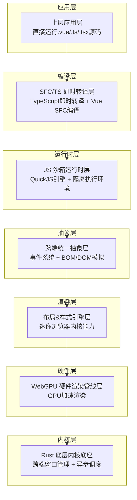

# 项目概述

<cite>
**本文档引用的文件**
- [doc.txt](file://doc.txt)
</cite>

## 目录
1. [项目简介](#项目简介)
2. [核心定位与愿景](#核心定位与愿景)
3. [技术架构概览](#技术架构概览)
4. [核心技术栈](#核心技术栈)
5. [双端运行能力](#双端运行能力)
6. [核心优势分析](#核心优势分析)
7. [应用场景与目标用户](#应用场景与目标用户)
8. [项目特色与创新](#项目特色与创新)
9. [总结](#总结)

## 项目简介

Leivue Runtime是一个革命性的前端运行时引擎，采用Rust+WebGPU技术实现零编译运行Vue3 + TypeScript的目标。该项目旨在彻底改变传统的前端开发模式，通过创新的技术架构突破浏览器沙箱限制，为Vue生态系统提供高性能的跨端运行底座。

项目的核心理念是"消灭前端工程化"，通过七层分层架构设计，实现了从应用层到硬件渲染层的完整技术栈重构。这种设计不仅消除了传统前端开发中对Node.js、Webpack等工具链的依赖，还为开发者提供了前所未有的开发体验。

## 核心定位与愿景

### 核心定位
Leivue Runtime致力于成为"一套完全脱离 Node / 浏览器 DOM / 编译打包、原生双端运行、零编译直接执行 Vue3 + TypeScript、全兼容 Element Plus/Ant Design Vue 等第三方 UI 库的硬件级渲染应用引擎"。

### 技术愿景
- **零编译运行**：直接执行Vue3 + TypeScript源码，无需任何构建步骤
- **双端统一**：浏览器WASM模式 + 独立桌面原生模式，同一套内核实现
- **硬件级渲染**：基于WebGPU的GPU加速渲染，突破传统DOM渲染限制
- **生态兼容**：完全兼容Vue3生态系统的各种UI库和插件

### 使命宣言
"消灭前端工程化、突破浏览器沙箱限制、给 Vue 生态提供高性能跨端底座"——这是Leivue Runtime的核心使命，旨在为开发者提供更加简洁、高效、可靠的前端开发解决方案。

## 技术架构概览

Leivue Runtime采用了先进的七层分层架构设计，每一层都有明确的职责分工和高度的解耦性：

**架构层次说明**：
- **应用层**：直接运行Vue3源码，支持script setup、TypeScript、JSX等
- **编译层**：基于Rust的swc实现即时转译，无需构建过程
- **运行时层**：使用QuickJS引擎，提供安全隔离的执行环境
- **抽象层**：统一双端差异，模拟浏览器API但不进行真实DOM绘制
- **渲染层**：复刻浏览器CSS体系，支持标准布局和样式
- **硬件层**：基于WebGPU的GPU渲染，实现硬件级性能
- **内核层**：Rust编写的底层内核，提供跨端基础设施

**图表来源**
- [doc.txt:7-22](file://doc.txt#L7-L22)

## 技术栈

### 底层内核底座（Rust核心）
- **编程语言**：纯Rust编写，具备内存安全、无GC、高性能特性
- **核心能力**：跨端窗口管理、异步调度、内存池、文件IO、原生网络栈、缓存系统
- **跨端适配**：
  - 桌面端：winit原生窗口 + Vulkan/Metal/DX12后端
  - 浏览器端：WASM编译 + WebGPU API绑定
- **核心依赖**：wgpu、winit、tokio、reqwest

### 渲染技术栈
- **WebGPU硬件渲染**：完全替代传统DOM渲染流水线
- **渲染能力**：批渲染、矢量绘制、圆角/阴影/渐变、纹理图集、字体渲染、图层合成
- **性能优势**：60fps稳定渲染、大列表/复杂组件无卡顿、CPU开销极低

### 布局与样式引擎
- **CSS体系复刻**：对标Chromium的基础能力
- **HTML解析**：使用html5ever工业级解析器
- **CSS引擎**：cssparser解析、选择器匹配、样式继承、权重计算
- **布局系统**：自研盒模型、Flex、流式布局，对标W3C标准

### JavaScript执行环境
- **JS引擎**：QuickJS（轻量高性能、WASM友好、Rust深度绑定）
- **沙箱隔离**：与宿主环境完全隔离，确保脚本安全
- **运行时支持**：预加载Vue3完整运行时（runtime-core/runtime-dom）

**章节来源**
- [doc.txt:23-64](file://doc.txt#L23-L64)

## 双端运行能力

### 浏览器WASM模式
- **编译方式**：将核心引擎编译为WASM格式
- **运行环境**：嵌入任意现代浏览器，基于WebGPU API运行
- **兼容性**：支持所有现代浏览器的WebGPU实现
- **部署方式**：可作为Web应用直接发布

### 桌面原生模式
- **编译产物**：生成独立的EXE/App/二进制文件
- **系统集成**：无需浏览器或Electron/Tauri框架
- **性能表现**：体积极小（MB级）、内存占用低、启动极速
- **系统权限**：支持本地文件访问、串口通信、离线运行等原生功能

### 双端统一内核
- **代码共享**：同一套核心代码同时支持浏览器和桌面端
- **行为一致**：双端运行时行为完全一致
- **开发体验**：开发者只需编写一次代码，即可在两个平台上运行

**章节来源**
- [doc.txt:76-82](file://doc.txt#L76-L82)

## 核心优势分析

### 对比传统开发模式的优势

#### 零编译运行
- **开发效率**：无需等待构建时间，修改源码后立即生效
- **学习成本**：消除复杂的构建配置，降低入门门槛
- **维护成本**：减少构建脚本的维护工作量

#### 性能优势
- **渲染性能**：WebGPU硬件加速相比DOM渲染提升显著
- **启动速度**：无需构建过程，应用启动更快
- **内存占用**：优化的内存管理和渲染架构

#### 生态兼容性
- **UI库支持**：完全兼容Element Plus、Ant Design Vue等主流UI库
- **Vue生态**：支持Vue3组合式API、生命周期、响应式系统
- **插件生态**：可无缝接入第三方Vue插件和组件

### 技术创新点

#### 自研浏览器级渲染
- **CSS标准支持**：盒模型、Flex布局、选择器、伪类、媒体查询
- **视觉效果**：圆角、阴影、边框、渐变、图层叠加、文本排版
- **性能优化**：针对长列表和海量组件实例的渲染优化

#### 安全隔离机制
- **JS沙箱**：独立的JavaScript执行环境，防止恶意代码
- **网络隔离**：支持跨域突破和内网请求的安全处理
- **离线运行**：核心UI库和运行时可内置缓存，支持离线环境

**章节来源**
- [doc.txt:66-97](file://doc.txt#L66-L97)

## 应用场景与目标用户

### 适用应用场景

#### 企业级应用开发
- **内网管理系统**：支持私有化部署，无需外网依赖
- **桌面工具软件**：提供更好的用户体验和系统集成能力
- **数据可视化应用**：利用GPU渲染优势处理大量数据展示

#### 低代码平台建设
- **快速原型开发**：零编译运行特性适合快速验证想法
- **拖拽式界面**：结合Vue组件系统构建可视化编辑器
- **业务流程管理**：支持复杂业务逻辑的可视化呈现

#### 教育培训领域
- **在线教学平台**：提供流畅的交互式学习体验
- **编程教学工具**：简化开发环境配置，专注编程教学
- **演示应用**：支持高质量的演示和展示需求

### 目标用户群体

#### 开发者群体
- **Vue3开发者**：希望获得更好开发体验的Vue生态系统使用者
- **前端工程师**：厌倦传统工程化流程，寻求更简单开发方式的开发者
- **桌面应用开发者**：寻找跨平台桌面应用解决方案的开发者

#### 企业用户
- **IT部门**：寻求简化开发流程、降低维护成本的企业技术团队
- **产品经理**：关注开发效率和产品迭代速度的产品管理团队
- **技术负责人**：重视技术架构先进性和长期维护性的技术决策者

**章节来源**
- [doc.txt:94-97](file://doc.txt#L94-L97)

## 项目特色与创新

### 技术创新特色

#### 架构创新
- **七层分层设计**：每层职责明确，高度解耦，便于维护和扩展
- **跨端统一**：同一套代码同时支持浏览器和桌面端运行
- **硬件级渲染**：基于WebGPU的GPU渲染，突破传统DOM限制

#### 开发体验创新
- **零配置开发**：无需Node、npm、构建工具，直接运行源码
- **实时热更新**：修改源码后立即生效，无需重新构建
- **生态兼容**：完全兼容现有Vue3生态，降低迁移成本

#### 性能优化创新
- **内存管理**：Rust的内存安全保证，避免内存泄漏问题
- **渲染优化**：GPU硬件加速，支持大规模组件渲染
- **启动优化**：极简的启动流程，提供快速的用户体验

### 商业价值创新

#### 成本控制
- **开发成本**：减少构建工具和配置的投入
- **运维成本**：简化部署流程，降低维护复杂度
- **学习成本**：降低开发者的学习曲线

#### 效率提升
- **开发效率**：零编译运行大幅提升开发速度
- **部署效率**：简化部署流程，支持快速迭代
- **维护效率**：统一的架构设计便于长期维护

**章节来源**
- [doc.txt:1-97](file://doc.txt#L1-L97)

## 总结

Leivue Runtime代表了前端技术发展的新方向，通过Rust+WebGPU的创新组合，成功解决了传统前端开发中的诸多痛点。该项目不仅在技术架构上具有前瞻性，在实际应用中也展现了巨大的价值潜力。

### 核心价值体现

#### 技术价值
- **架构先进性**：七层分层架构设计体现了深厚的技术功底
- **性能卓越性**：WebGPU硬件渲染带来显著的性能提升
- **生态兼容性**：完全兼容Vue3生态系统，降低迁移成本

#### 实用价值
- **开发效率**：零编译运行大幅提升了开发体验
- **部署便利性**：双端统一内核简化了部署流程
- **维护经济性**：极简的架构设计降低了长期维护成本

#### 商业价值
- **市场适应性**：满足企业对高效开发的需求
- **技术前瞻性**：为前端技术发展指明了新方向
- **生态贡献**：为Vue生态系统注入新的活力

Leivue Runtime项目不仅是技术创新的成果，更是对传统前端开发模式的一次深刻变革。它为开发者提供了更加简洁、高效、可靠的开发体验，为企业用户带来了更高的开发效率和更低的维护成本，为整个前端生态的发展奠定了坚实的基础。